babel 编译的第一步是把源码 parse 成抽象语法树 `AST` （Abstract Syntax Tree），后续对这个 AST 进行转换。

整个编译流程都是围绕 AST 来的，所以这一节我们先来熟悉一下 AST：


## 常见的 AST 节点

AST 是对源码的抽象，**字面量、标识符、表达式、语句、模块语法、class 语法**都有各自的 AST。

我们分别来了解一下：


## Literal

📚 `Literal` 是**字面量**的意思，比如 `let name = 'guang'`中，`'guang'`就是一个字符串字面量 `StringLiteral`，相应的还有:

- 数字字面量 NumericLiteral
- 布尔字面量 BooleanLiteral
- 字符串字面量 StringLiteral
- 正则表达式字面量 RegExpLiteral 等。

下面这些字面量都有对应的 Literal 节点：

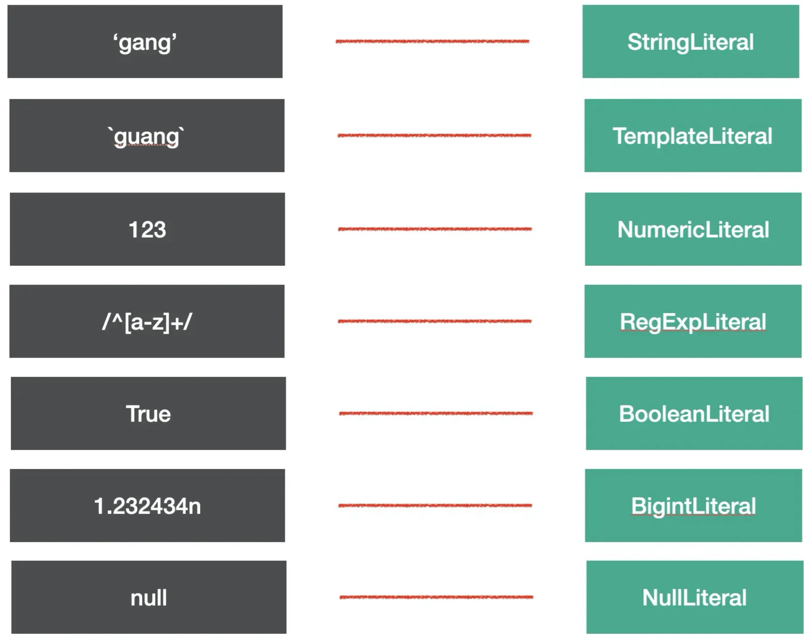

代码中的字面量很多，babel 就是通过 `xxLiteral` 来抽象这部分内容的。


## Identifier

📚 `Identifer` 是**标识符**的意思，**变量名、属性名、参数**名等各种声明和引用的名字，都是Identifer。

我们知道，JS 中的标识符只能包含字母或数字或下划线（`_`）或美元符号（`$`），且不能以数字开头。这是 Identifier 的词法特点。

尝试分析一下，下面这一段代码里面有多少 Identifier 呢？

```js
const name = 'guang';

function say(name) {
  console.log(name);
}

const obj = {
  name: 'guang'
}
```

答案是这些

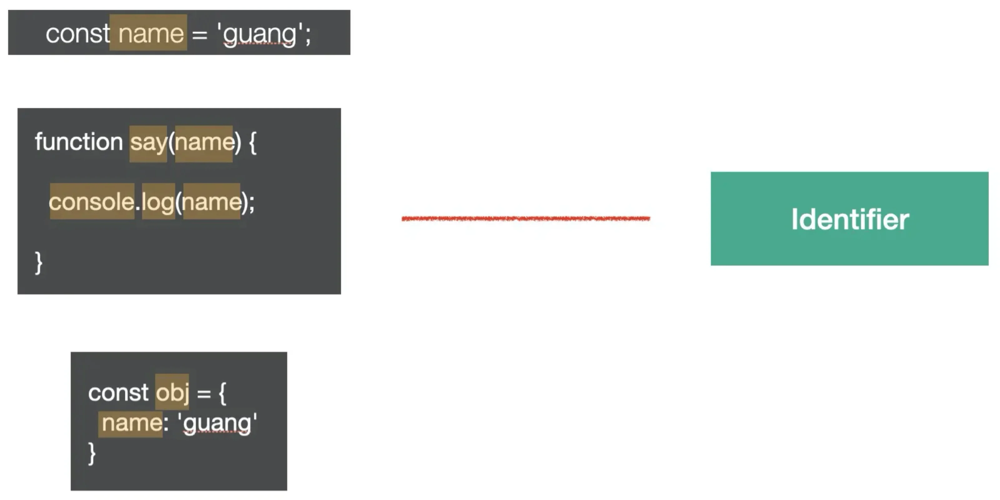


## Statement

📚 `statement` 是语句，它是**可以独立执行的单位**，比如 `break`、`continue`、`debugger`、`return` 或者 `if` 语句、`while` 语句、`for` 语句，还有`声明语句，表达式语句`等。我们写的每一条可以独立执行的代码都是语句。

语句末尾一般会加一个分号分隔，或者用换行分隔。

下面这些我们经常写的代码，每一行都是一个 Statement：

```js
break;
continue;
return;
debugger;
throw Error();
{}
try {} catch(e) {} finally{}
for (let key in obj) {}
for (let i = 0;i < 10;i ++) {}
while (true) {}
do {} while (true)
switch (v){case 1: break;default:;}
label: console.log();
with (a){}
```

它们对应的 AST 节点如下图所示：

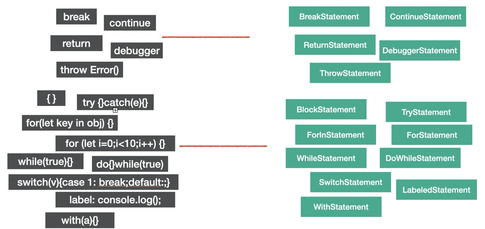

😎语句是代码执行的最小单位，可以说，代码是由语句（Statement）构成的。


## Declaration

📚 声明语句是一种特殊的语句，它执行的逻辑是在作用域内`声明一个变量`、`函数`、`class`、`import`、`export` 等。

比如下面这些语句都是声明语句：

```js
const a = 1;          // 变量声明
function b() {}       // 函数声明
class C {}            // 类声明

import d from 'e';    // 导入声明

export default e = 1; // 默认导出声明
export { e };         // 有名导出声明
export * from 'e';    // 导出所有声明
```

它们对应的 AST 节点如下图：

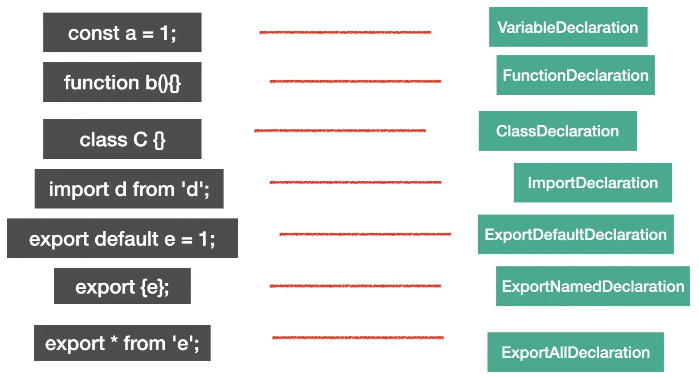

声明语句用于定义变量，这也是代码中一个基础组成部分。


## Expression

📚 `expression` 是**表达式**，特点是`执行完以后有返回值`，这是和语句 (`statement`) 的区别。

下面是一些常见的表达式

```js
[1, 2, 3]      // 数组表达式
a = 1          // 赋值表达式
1 + 2          // 二元表达式
-1;            // 一元表达式
function() {}; // 函数表达式
() => {};      // 箭头函数表达式
class{};       // class 表达式
a;             // 标识符
this;          // this表达式
super;         // super
a::b;          // 绑定表达式
```

它们对应的AST如图：

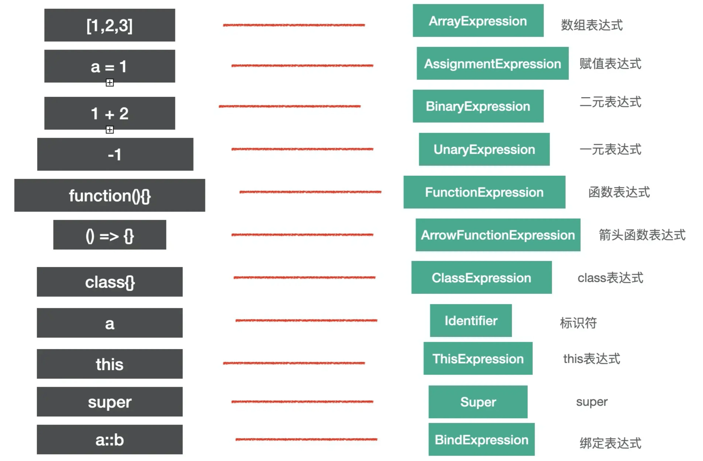

🤔细心的同学可能会问 `identifier` 和 `super` 怎么也是表达式呢？

**因为 identifier、super 有返回值，符合表达式的特点，所以也是 expression。**

📚我们判断 AST 节点是不是某种类型要看它是不是符合该种类型的特点，比如**语句的特点是能够单独执行，表达式的特点是有返回**值。

1️⃣ 有的表达式可以单独执行，符合语句的特点，所以也是语句，比如`赋值表达式、数组表达式`等。

```js
a = 1;
[1,2,3];
```

2️⃣ 但有的表达式不能单独执行，需要和其他类型的节点组合在一起构成语句。

比如匿名函数表达式和匿名 class 表达式单独执行会报错：

```js
function() {}
class {}
```

需要和其他部分一起构成一条语句，比如组成赋值语句：

```js
a = function() {}
b = class{}
```

这条赋值语句对应的 AST 是这样的：

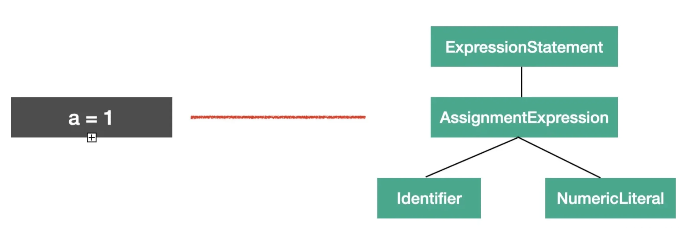

你会发现赋值语句的 AST 节点 `AssignmentExpression` 包裹了一层`ExpressionStatement` 的节点，代表这个表达式是被当成语句执行的。


## Class

`class` 的语法也有专门的 AST 节点来表示。

📚 整个 class 的内容是 `ClassBody`，属性是 `ClassProperty`，方法是`ClassMethod`（通过 `kind` 属性来区分是 `constructor` 还是 `method`）。

比如下面的代码

```js
class Guang extends Person {
  name = 'guang'
  constructor() {}
  eat() {}
}
```

对应的AST是这样的

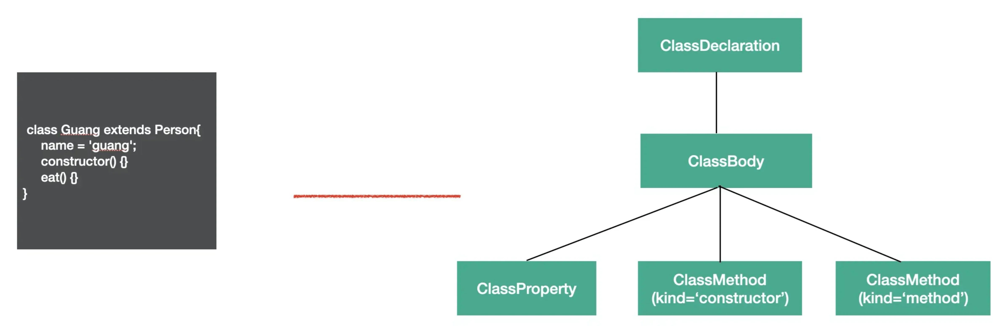

class 是 es next 的语法，babel 中有专门的 AST 来表示它的内容。


## Modules

`es module` 是语法级别的模块规范，所以也有专门的 AST 节点。


### import

import 有 3 种语法：

1. `named import`

   ```js
   import { c, d } from 'c';
   ```

2. `Default import`

   ```js
   import a from 'a'
   ```

3. `Namespace import`

   ```js
   import * as b from 'b';
   ```

这 3 种语法都对应 `ImportDeclaration` 节点，但是 `specifiers` 属性不同，分别对应 `ImportSpicifier`、`ImportDefaultSpecifier`、`ImportNamespaceSpcifier`。

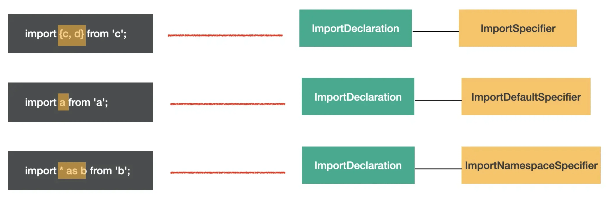

图中黄框标出的就是 `specifier` 部分。可以直观的看出整体结构相同，只是 specifier 部分不同，所以 import 语法的 AST 的结构是 ImportDeclaration 包含着各种 import specifier。


### export

export 也有3种语法：

1. `named export`

   ```js
   export { b, d };
   ```

2. `Default export`

   ```js
   export default a;
   ```

3. `all export`

   ```js
   export * from 'c';
   ```

分别对应 `ExportNamedDeclaration`、`ExportDefaultDeclaration`、`ExportAllDeclaration` 的 AST。

比如这三种 export

```js
export { b, d};
export default a;
export * from 'c';
```

对应的 AST 节点为

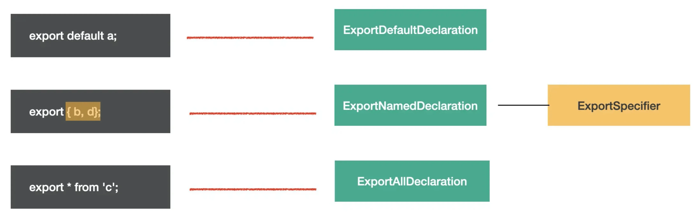


## Program & Directive

`program` 是代表整个程序的节点，它有 `body` 属性代表程序体，存放 statement 数组，就是具体执行的语句的集合。还有 `directives` 属性，存放 Directive 节点，比如`"use strict"` 这种指令会使用 Directive 节点表示。

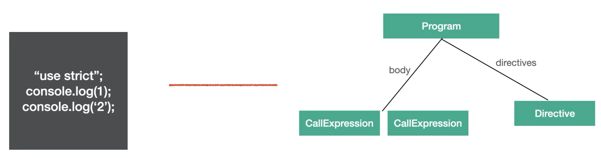

📚 Program 是包裹具体执行语句的节点，而 Directive 则是代码中的指令部分。


## File & Comment

babel 的 AST 最外层节点是 `File`，它有 `program`、`comments`、`tokens` 等属性，分别存放 Program 程序体、注释、token 等，是**最外层节点**。

注释分为`块注释`和`行内注释`，对应 `CommentBlock` 和 `CommentLine` 节点。

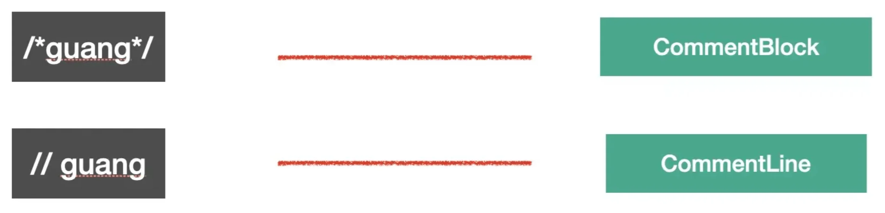

上面 `6` 种就是常见的一些 AST 节点类型，babel 就是通过这些节点来抽象源码中不同的部分。


## AST 可视化查看工具

这么多 AST 我们都要记住么？

不需要。可以通过 [astexplorer.net](https://astexplorer.net/) 这个网站来可视化的查看。

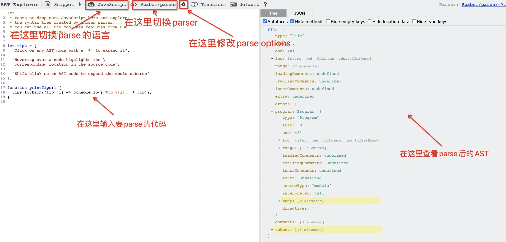

这个网站可以查看代码 parse 以后的 AST，可以切换 parse 的语言和用的 parser，也可以修改 parse options。

点击这里的 save 就可以保存下来，然后把 url 分享出去：

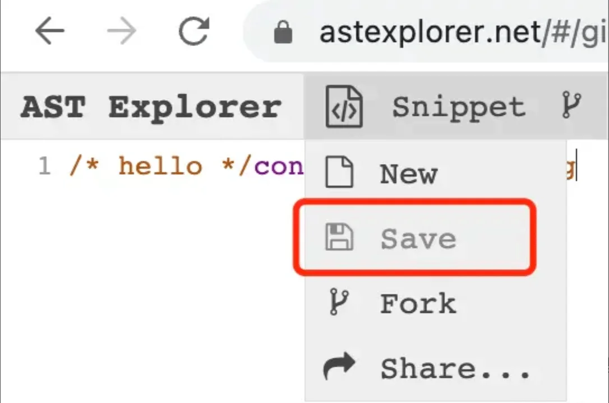

比如这个链接: [ast share](https://astexplorer.net/#/gist/7267e806bfec60b48b9d39d039f29313/c343ad5a76a8dd78c22d39ce89f4d0733c2b17e4)

- 如果想查看全部的 AST 可以在 [AST node types spec - @github](https://github.com/babel/babel/blob/main/packages/babel-parser/ast/spec.md)
- 或者直接去看 `@babel/types` 的 [typescript定义](https://github.com/babel/babel/blob/main/packages/babel-types/src/ast-types/generated/index.ts)

## AST 的公共属性

每种 AST 都有自己的属性，但是它们也有一些公共的属性：

- `type`: AST 节点的类型
- `start、end、loc`：start 和 end 代表该节点在源码中的开始和结束下标。而 loc 属性是一个对象，有 line 和 column 属性分别记录开始和结束的行列号。
- `leadingComments、innerComments、trailingComments`： 表示开始的注释、中间的注释、结尾的注释，每个 AST 节点中都可能存在注释，而且可能在开始、中间、结束这三种位置，想拿到某个 AST 的注释就通过这三个属性。

比如 [这段有注释的代码的AST](https://astexplorer.net/#/gist/7267e806bfec60b48b9d39d039f29313/c343ad5a76a8dd78c22d39ce89f4d0733c2b17e4)

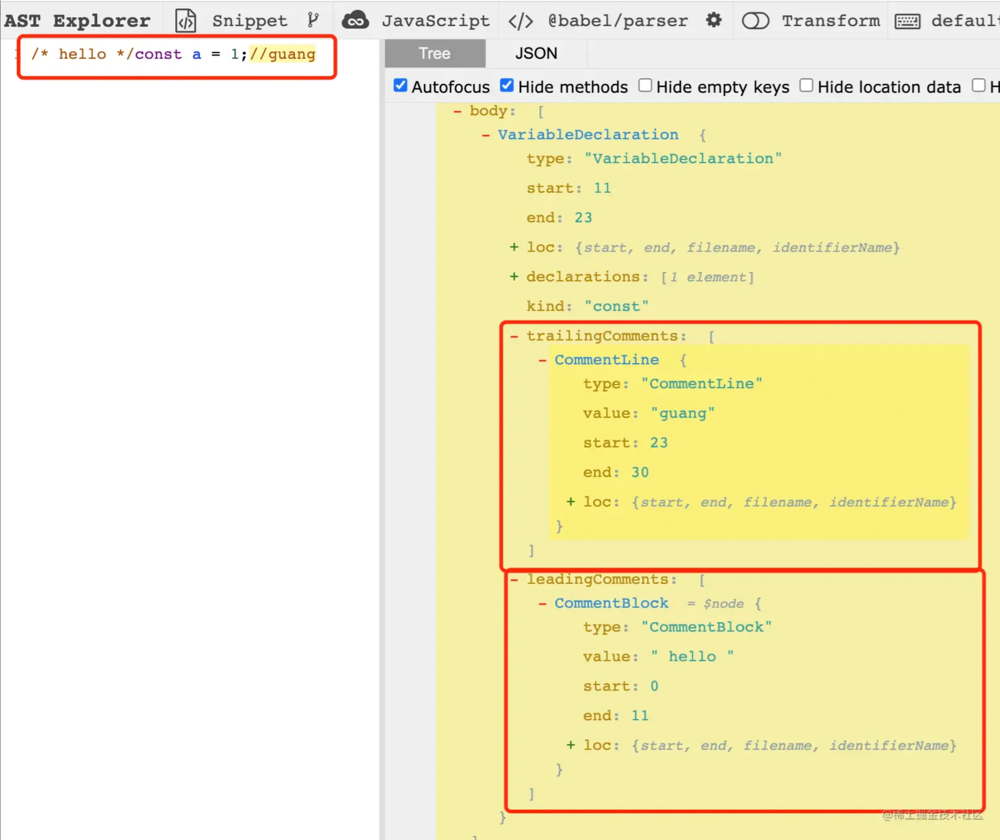


- `extra`：记录一些额外的信息，用于处理一些特殊情况。比如 StringLiteral 的 value 只是值的修改，而修改 `extra.raw` 则可以连同**单双引号**一起修改。

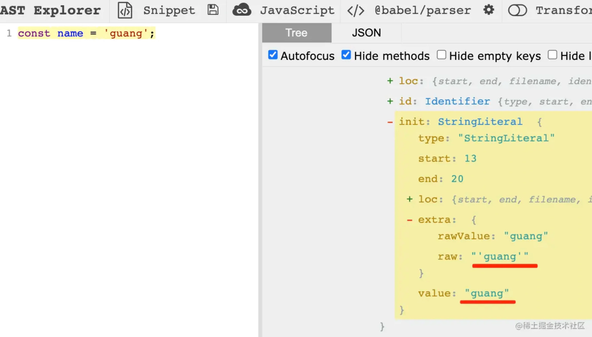

修改 value 只能修改值，修改 extra.raw 可以连引号一起修改。


## 总结

这一节我们学习了代码中常见的语法在 babel 的 AST 中对应的节点。

我们学习了： 标识符 Identifer、各种字面量 xxLiteral、各种语句 xxStatement，各种声明语句 xxDeclaration，各种表达式 xxExpression，以及 Class、Modules、File、Program、Directive、Comment 这些 AST 节点。

了解了这些节点，就能知道平时写的代码是怎么用 AST 表示的。

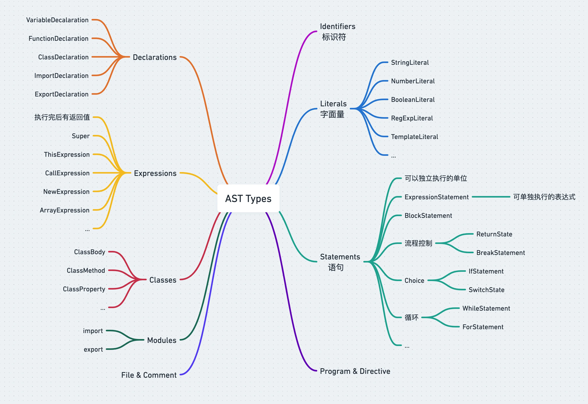

当然也不需要记，可以用 ([astexpoler.net](https://astexplorer.net)) 可视化的查看。

**AST 节点可能同时有多种类型，确定一种 AST 节点是什么类型主要看它的特点**，比如 Statement 的特点是可以单独执行，Expression 的特点是有返回值，所以一些可以单独执行的 Expression 会包一层 ExpressionStatement。

不同 AST 节点有不同的属性来存放对应的源码信息，但是都有一些公共属性如 type、xxComments、loc 等。

学会了 AST，就可以把对代码的操作转为对 AST 的操作了，这是编译、静态分析的第一步。


2023年03月20日16:43:47

