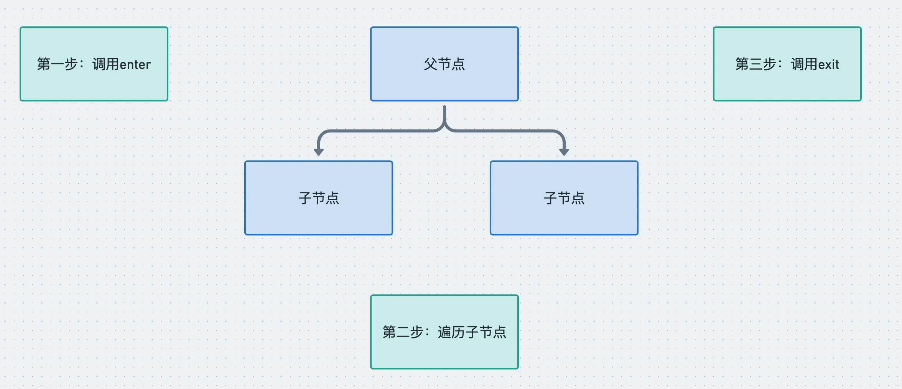

学习了 babel 的编译流程和 AST 之后，我们来学习下 babel 的 api，通过这些 api 来操作 AST，完成代码的转换。

::: warning

注意，我们学习的 api 是 babel 7.x 的，babel 6 的 api 还没有按照 scope 来划分，是 babel-parser 这种，而 babel 7 变成了@babel/parser 这种。但具体 api 差不多，我们学的是一些原理性的东西，这些东西在版本迭代中是不会变的。

:::


## babel 的 api 有哪些

我们知道 babel 的编译流程分为三步：parse、transform、generate，每一步都暴露了一些 api 出来。

- parse 阶段有`@babel/parser`，功能是把源码转成 AST
- transform 阶段有 `@babel/traverse`，可以遍历 AST，并调用 `visitor` 函数修改 AST，修改 AST 自然涉及到 AST 的判断、创建、修改等，这时候就需要 `@babel/types` 了，当需要批量创建 AST 的时候可以使用 `@babel/template` 来简化 AST 创建逻辑。
- generate 阶段会把 AST 打印为目标代码字符串，同时生成 sourcemap，需要 `@babel/generator` 包
- 中途遇到错误想打印代码位置的时候，使用 `@babel/code-frame` 包
- babel 的整体功能通过 `@babel/core` 提供，基于上面的包完成 babel 整体的编译流程，并实现插件功能。

我们主要学习的就是 `@babel/parser`，`@babel/traverse`，`@babel/generator`，`@babel/types`，`@babel/template` 这五个包的 api 的使用。


## @babel/parser

babel parser 叫 babylon，是基于 `acorn` 实现的，扩展了很多语法，可以支持 es next（现在支持到 es2020）、jsx、flow、typescript 等语法的解析，其中jsx、flow、typescript 这些非标准的语法的解析需要指定语法插件。

它提供了有两个 api：`parse` 和 `parseExpression`。两者都是把源码转成 AST，不过 parse 返回的 AST 根节点是 File（整个 AST），parseExpression 返回的 AST 根节点是是 Expression（表达式的 AST），**粒度不同**。

```typescript
function parse(
  input: string,
  options?: ParserOptions
): ParseResult<_babel_types.File>;

function parseExpression(
  input: string,
  options?: ParserOptions
): ParseResult<_babel_types.Expression>;
```

详细的 options 可以查看[文档](https://babeljs.io/docs/en/babel-parser#options)。其实主要分为两类:

1. 一是 parse 的内容是什么
2. 二是以什么方式去 parse


> 1️⃣ **parse 的内容是什么：**

- `plugins`： 指定jsx、typescript、flow 等插件来解析对应的语法 ⭐
- `allowXxx`： 指定一些语法是否允许，比如函数外的 await、没声明的 export等
- `sourceType`： 指定是否支持解析模块语法，有 module、script、unambiguous 3个取值，module 是解析 es module 语法，script 则不解析 es module 语法，当作脚本执行，unambiguous 则是根据内容是否有 import 和 export 来确定是否解析 es module 语法。⭐

> 2️⃣ **以什么方式 parse**

- `strictMode` 是否是严格模式
- `startLine` 从源码哪一行开始 parse
- `errorRecovery` 出错时是否记录错误并继续往下 parse
- `tokens` parse 的时候是否保留 token 信息
- `ranges` 是否在 ast 节点中添加 ranges 属性

其实最常用的 option 就是 `plugins`、`sourceType` 这两个，比如要 parse tsx 模块，那么就可以这样来写：

```js
require('@babel/parser').parse('code', {
  sourceType: 'module',
  plugins: [
    'jsx',
    'typescript'
  ]
})
```


## @babel/traverse

parse 出的 AST 由 `@babel/traverse` 来遍历和修改，babel traverse 包提供了 traverse 方法：

```typescript
function traverse(parent, opts)
```

::: details TS定义

```typescript
declare const traverse: {
    <S>(
        parent: Node | Node[] | null | undefined,
        opts: TraverseOptions<S>,
        scope: Scope | undefined,
        state: S,
        parentPath?: NodePath,
    ): void;
    (
        parent: Node | Node[] | null | undefined,
        opts?: TraverseOptions,
        scope?: Scope,
        state?: any,
        parentPath?: NodePath,
    ): void;

    visitors: typeof visitors;
    verify: typeof visitors.verify;
    explode: typeof visitors.explode;
};
```

:::

常用的就前面两个参数，parent 指定要遍历的 AST 节点，opts 指定 visitor 函数。babel 会在遍历 parent 对应的 AST 时调用相应的 visitor 函数。


### 遍历过程

`visitor` 对象的 value 是对象或者函数：

- 如果 value 为**函数**，那么就相当于是 `enter` 时调用的函数。
- 如果 value 为**对象**，则可以明确指定 `enter` 或者 `exit` 时的处理函数。

函数会接收两个参数 `path` 和 `state`。

```js
visitor: {
  Identifier(path, state) {},
  StringLiteral: {
    enter(path, state) {},
    exit(path, state) {}
  }
}
```

enter 时调用是在遍历当前节点的子节点前调用，exit 时调用是遍历完当前节点的子节点后调用。



可以为单个节点的类型，也可以是多个节点类型通过 `|` 连接，还可以通过别名指定一系列节点类型。

```js
// 1️⃣ 进入 FunctionDeclaration 节点时调用
traverse(ast, {
  FunctionDeclaration: {
    enter(path, state) {}
  }
})

// 2️⃣ 默认是进入节点时调用，和上面等价
traverse(ast, {
  FunctionDeclaration(path, state) {}
})

// 3️⃣ 进入 FunctionDeclaration 和 VariableDeclaration 节点时调用
traverse(ast, {
  'FunctionDeclaration|VariableDeclaration'(path, state) {}
})

// 4️⃣ 通过别名指定离开各种 Declaration 节点时调用
traverse(ast, {
  Declaration: {
    exit(path, state) {}
  }
})
```

具体的别名有哪些在[babel-types 的类型定义](https://github.com/babel/babel/blob/main/packages/babel-types/src/ast-types/generated/index.ts#L2489-L2535)可以查。


### path


path 是遍历过程中的路径，会保留上下文信息，有很多属性和方法，比如:

> 获取当前节点以及它的关联节点的属性和方法

- `path.node` 指向当前 AST 节点
- `path.get`、`path.set` 获取和设置当前节点属性的 path
- `path.parent` 指向父级 AST 节点
- `path.getSibling`、`path.getNextSibling`、`path.getPrevSibling` 获取兄弟节点
- `path.find` 从当前节点向上查找节点

> 获取作用域的信息

- `path.scope` 获取当前节点的作用域信息

> 用于判断 AST 类型:isXxx、assertXxx 系列方法

- `path.isXxx` 判断当前节点是不是 xx 类型
- `path.assertXxx` 判断当前节点是不是 xx 类型，不是则抛出异常

> 对 AST 进行增删改

- `path.insertBefore、path.insertAfter` 插入节点
- `path.replaceWith、path.replaceWithMultiple、replaceWithSourceString` 替换节点
- `path.remove` 删除节点

> 跳过一些遍历

- `path.skip` 跳过当前节点的子节点的遍历
- `path.stop` 结束后续遍历


上面罗列了几个常用的 api，可以通过这些 api 完成对 AST 的操作。当然，path 的 api 不是只有这些，后面实战案例用到了再介绍。


### state

第二个参数 state 则是遍历过程中在不同节点之间传递数据的机制，插件会通过 state 传递 options 和 file 信息，我们也可以通过 state 存储一些遍历过程中的共享数据。


## @babel/types

遍历 AST 的过程中需要创建一些 AST 和判断 AST 的类型，这时候就需要 `@babel/types` 包。

举例来说，如果要创建`IfStatement`就可以调用

```js
t.ifStatement(test, consequent, alternate);
```

而判断节点是否是 IfStatement 就可以调用 `isIfStatement` 或者 `assertIfStatement`

```js
t.isIfStatement(node, opts);
t.assertIfStatement(node, opts);
```

opts 可以指定一些属性是什么值，增加更多限制条件，做更精确的判断。

```js
t.isIdentifier(node, { name: "paths" })
```

`isXxx` 会返回 boolean 表示结果，而 `assertXxx` 则会在类型不一致时抛异常。

所有的 AST 的 build、assert 的 api 可以在 [babel types 文档](https://babeljs.io/docs/en/babel-types#api)中查。


## @babel/template

通过 `@babel/types` 创建 AST 还是比较麻烦的，要一个个的创建然后组装，如果 AST 节点比较多的话需要写很多代码，这时候就可以使用 `@babel/template` 包来批量创建。

这个包有这些 api：

```js
const ast = template(code, [opts])(args);
const ast = template.ast(code, [opts]);
const ast = template.program(code, [opts]);
```

- 如果是根据模版创建整个 AST，那么用 `template.ast` 或者 `template.program` 方法，这俩都是直接返回 ast 的，`template.program` 返回的 AST 的根节点是 Program。
- 如果知道具体创建的 AST 的类型，可以使用 template.expression、template.statement、template.statements 等方法创建具体的 AST。
- 默认 template.ast 创建的 Expression 会被包裹一层 ExpressionStatement 节点（会被当成表达式语句来 parse），但当 template.expression 方法创建的 AST 就不会。

如果模版中有**占位符**，那么就用 template 的 api，在模版中写一些占位的参数，调用时传入这些占位符参数对应的 AST 节点。

```js
const fn = template(`console.log(NAME)`); // NAME是占位符

const ast = fn({
  NAME: t.stringLiteral("guang"),
});
```

或者

```js
const fn = template(`console.log(%%NAME%%)`);

const ast = fn({
  NAME: t.stringLiteral("guang"),
});
```

这两种占位符的写法都可以，当占位符和其他变量名冲突时可以用第二种。


## @babel/generator

AST 转换完之后就要打印成目标代码字符串，通过 `@babel/generator` 包的 generate api

```typescript
function (ast: Object, opts: Object, code: string): {code, map} 
```

- 第一个参数是要打印的 AST
- 第二个参数是 options，指定打印的一些细节，比如通过 comments 指定是否包含注释，通过 minified 指定是否包含空白字符
- 第三个参数当多个文件合并打印的时候需要用到

options 中常用的是 `sourceMaps`，开启了这个选项才会生成 sourcemap

```js
const { code, map } = generate(ast, { sourceMaps: true })
```


## @babel/code-frame

当有错误信息要打印的时候，需要打印错误位置的代码，可以使用`@babel/code-frame`。

```js
const result = codeFrameColumns(rawLines, location, {
  /* options */
});
```

options 可以设置 highlighted （是否高亮）、message（展示啥错误信息）。

比如

```js
const { codeFrameColumns } = require('@babel/code-frame')

function main() {
  try {
    throw new Error('XXX 错误了')
  } catch (err) {
    console.log(codeFrameColumns(`const name = guang`, {
      start: { line: 1, column: 14 }
    }, {
      highlightCode: true,
      message: err.message
    }))
  }
}

main()
```

会有比较友好的打印信息:


## @babel/core

前面的包是完成某一部分的功能的，而 `@babel/core` 包则是基于它们完成整个编译流程，从源码到目标代码，生成 sourcemap。

```js
transformSync(code, options); // => { code, map, ast }
transformFileSync(filename, options); // => { code, map, ast }
transformFromAstSync(
  parsedAst,
  sourceCode,
  options
); // => { code, map, ast }
```

前三个 `transformXxx` 的 api 分别是从源代码、源代码文件、源代码 AST 开始处理，最终生成目标代码和 sourcemap。

options 主要配置 plugins 和 presets，指定具体要做什么转换。

这些 api 也同样提供了异步的版本，异步地进行编译，返回一个 promise

```js
transformAsync("code();", options).then(result => {})
transformFileAsync("filename.js", options).then(result => {})
transformFromAstAsync(parsedAst, sourceCode, options).then(result => {})
```

::: warning

注意：transformXxx 的 api，已经被标记为过时了，后续会删掉，不建议用，直接用 transformXxxSync 和 transformXxxAsync。

:::

@babel/core 包还有一个 createConfigItem 的 api，用于 plugin 和 preset 的封装，后面章节会涉及到。

```js
createConfigItem(value, options) // configItem
```


## 总结

这一节我们了解了编译过程中各阶段的 api：

- `@babel/parser` 对源码进行 parse，可以通过 plugins、sourceType 等来指定 parse 语法
- `@babel/traverse` 通过 visitor 函数对遍历到的 ast 进行处理，分为 enter 和 exit 两个阶段，具体操作 AST 使用 path 的 api，还可以通过 state 来在遍历过程中传递一些数据
- `@babel/types` 用于创建、判断 AST 节点，提供了 xxx、isXxx、assertXxx 的 api
- `@babel/template` 用于批量创建节点
- `@babel/code-frame` 可以创建友好的报错信息
- `@babel/generator` 打印 AST 成目标代码字符串，支持 comments、minified、sourceMaps 等选项。
- `@babel/core` 基于上面的包来完成 babel 的编译流程，可以从源码字符串、源码文件、AST 开始。

学完这一节，我们可以用 babel 的 api 来实现一些功能了，下一节开始第一个实战案例。


2023年03月21日16:04:59

