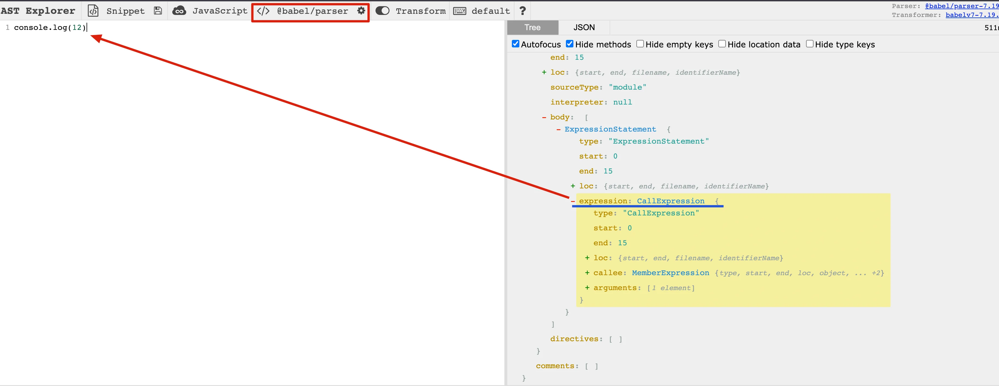
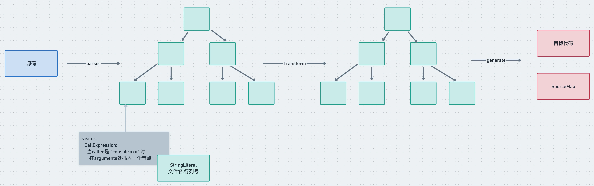

学习完了 babel 的编译流程、AST、api 之后，我们已经可以做一些有趣的事情了。


## 需求描述

我们先做一个简单的功能练练手：

> 我们经常会打印一些日志来辅助调试，但是有的时候会不知道日志是在哪个地方打印的。希望通过 babel 能够自动在 console.log 等 api 中插入文件名和行列号的参数，方便定位到代码。


### 实现思路分析

需要做的是在遍历 AST 的时候对 console.log、console.info 等 api 自动插入一些参数，也就是要通过 `visitor` 指定对函数调用表达式 `CallExpression`（这个可以通过 [astexplorer.net](https://astexplorer.net/) 来查看） 做一些处理。CallExpression 节点有两个属性，`callee` 和 `arguments`，分别对应调用的函数名和参数， 所以我们要判断当 callee 是 console.xx 时，在 arguments 的数组中中插入一个 AST 节点。



整体流程




### 代码实现

首先把 parse、transform、generate 的框架搭好：

```js
const parser = require('@babel/parser');
const traverse = require('@babel/traverse').default;
const generate = require('@babel/generator').default;
const types = require('@babel/types')

const sourceCode = `console.log(1);`;

const ast = parser.parse(sourceCode, {
  sourceType: 'unambiguous'
});

traverse(ast, {
  CallExpression(path, state) {

  }
});

const { code, map } = generate(ast);
console.log(code);
```

::: tip

因为 `@babel/parser` 等包都是通过 es module 导出的，所以通过 commonjs 的方式引入有的时候要取 default 属性。

:::

`parser` 需要指定代码是不是包含 import、export 等，需要设置 `moduleType` 为 module 或者 script，我们干脆设置为 unambiguous，让它根据内容是否包含 import、export 来自动设置 moduleType。

搭好框架之后，我们先设计一下要转换的代码：

```js
const sourceCode = `
  console.log(1);

  function func() {
    console.info(2);
  }

  export default class Clazz {
    say() {
      console.debug(3);
    }

    return() {
      return <div>{console.error(4)}</div>
    }
  }
`
```

代码没啥具体含义，主要是用于测试功能。

这里用到了 jsx 的语法，所以 parser 要开启 jsx 的 `plugin`。

我们按照前面分析的思路来写一下代码：

```js
const ast = parser.parse(sourceCode, {
  sourceType: 'unambiguous',
  plugins: ['jsx']
})

traverse(ast, {
  CallExpression(path, state) {
    if (type.isMemberExpression(path.node.callee)
        && path.node.callee.object.name === 'console'
        && ['log', 'error', 'info', 'debug'].includes(path.node.callee.property.name)
    ) {
      const { line, column } = path.node.loc.start
      path.node.arguments.unshift(types.stringLiteral(`filename: (${line}, ${column})`))
    }
  }
})
```

当是 `console.xxx` 的 AST 时，在参数中插入**文件名**和**行列号**，行列号从 AST 的公共属性 `loc` 上取。

输出的代码符合预期：

```js
console.log("filename: (2, 2)", 1);
function func() {
  console.info("filename: (5, 4)", 2);
}
export default class Clazz {
  say() {
    console.debug("filename: (10, 6)", 3);
  }
  return() {
    return <div>{console.error("filename: (14, 19)", 4)}</div>;
  }
}
```

::: details 使用TypeScript实现

先安装依赖：

```bash
pnpm i -D typescript tsx
pnpm i -D @babel/core @babel/parser @babel/template @babel/types @babel/generator

# 安装类型
pnpm i -D @types/node @types/babel__core @types/babel__generator @types/babel__template @types/babel__traverse
```

代码实现：`main.ts`

```typescript
import { parse } from '@babel/parser'
import traverse from '@babel/traverse'
import generate from '@babel/generator'
import { Identifier, isMemberExpression, stringLiteral } from '@babel/types'

const sourceCode = `
  console.log(1);

  function func() {
    console.info(2);
  }

  export default class Clazz {
    say() {
      console.debug(3);
    }

    return() {
      return <div>{console.error(4)}</div>
    }
  }
`

const ast = parse(sourceCode, {
  sourceType: 'unambiguous',
  plugins: ['jsx']
})

traverse(ast, {
  CallExpression(path, state) {
    if (
      isMemberExpression(path.node.callee)
      // 💡转换为 Identifer 类型
      && (path.node.callee.object as Identifier).name === 'console'
      && ['log', 'info', 'error', 'debug'].includes((path.node.callee.property as Identifier).name)
    ) {
      const { line, column } = path.node.loc!.start
      path.node.arguments.unshift(stringLiteral(`filename: (${line}, ${column})`))
    }
  }
})

const { code, map } = generate(ast)

console.log(code)
```


运行命令 `npx tsx main.ts` 打印结果

:::


💡现在判断条件比较复杂，要先判断 `path.node.callee` 的类型，然后一层层取属性来判断，其实我们可以用 `generator` 模块来简化

```js
const targetCallName = ['log', 'info', 'error', 'debug'].map(item => `console.${item}`)

traverse(ast, {
  CallExpression(path, state) {
    const calleeName = generate(path.node.callee).code
    if (targetCallName.includes(calleeName)) {
      const { line, column } = path.node.loc.start
      path.node.arguments.unshift(types.stringLiteral(`filename: (${line}, ${column})`))
    }
  }
})
```

代码瞬间精简了很多，还可以调用 `path.get('callee').toString()`，一样的效果。

::: details 使用TypeScript实现

```typescript
import { parse } from '@babel/parser'
import traverse from '@babel/traverse'
import generate from '@babel/generator'
import { stringLiteral } from '@babel/types'

const sourceCode = `
  console.log(1);

  function func() {
    console.info(2);
  }

  export default class Clazz {
    say() {
      console.debug(3);
    }

    return() {
      return <div>{console.error(4)}</div>
    }
  }
`

const ast = parse(sourceCode, {
  sourceType: 'unambiguous',
  plugins: ['jsx']
})


const targetCalleeName = ['log', 'info', 'error', 'debug'].map(item => `console.${item}`);
traverse(ast, {
  CallExpression(path, state) {
    const calleeName = generate(path.node.callee).code
    if (targetCalleeName.includes(calleeName)) {
      const { line, column } = path.node.loc!.start
      path.node.arguments.unshift(stringLiteral(`filename: (${line}, ${column})`))
    }
  }
})

const { code, map } = generate(ast)

console.log(code)
```

:::


## 需求变更

后来我们觉得在同一行打印会影响原本的参数的展示，所以想改为在 console.xx **节点之前打印**的方式


### 思路分析

这个需求的改动只是从参数中插入变成了在当前 console.xx 的AST之前插入一个 console.log 的 AST，整体流程还是一样。创建这种较复杂的 AST，我们可以使用 `@babel/template`包。

🚨这里有两个注意的点：

- JSX 中的 console 代码不能简单的在前面插入一个节点，而要把整体替换成一个数组表达式，因为 JSX 中只支持写单个表达式。

也就是

```jsx
<div>{console.log(111)}</div>
```

要替换成数组的形式

```jsx
<div>{[console.log('filename.js(11,22)'), console.log(111)]}</div>
```

- 用新的节点替换了旧的节点之后，**babel traverse 会继续遍历新节点，这是没必要的，所以要跳过新生成的节点的处理**。


### 代码实现

插入 AST 可以使用 `path.insertBefore` 的 api， 而替换整体节点用 `path.replaceWith`， 判断是 insertBefore 还是 replaceWith 要看当前节点是否在 JSXElement 之下，所以要用`path.findParent` 方法顺着 path 查找是否有 JSXElement 节点。replace 的新节点要调用 `path.skip` 跳过后续遍历。

```js
if (path.findParent(path => path.isJSXElement())) {
  path.replaceWith(types.arrayExpression([newNode, path.node]))
  path.skip();// 跳过子节点处理
} else {
  path.insertBefore(newNode);
}
```

要跳过新的节点的处理，就需要在节点上加一个标记，如果有这个标记的就跳过。

整体代码如下：

```js
const targetCalleeName = ['log', 'info', 'error', 'debug'].map(item => `console.${item}`);
traverse(ast, {
  CallExpression(path, state) {
    if (path.node.isNew) {
      return
    }

    const calleeName = generate(path.node.callee).code
    if (targetCalleeName.includes(calleeName)) {
      const { line, column } = path.node.loc!.start;
      const newNode = template.expression(`console.log("filename: (${line}, ${column})")`)();
      newNode.isNew = true

      if (path.findParent(path => path.isJSXElement())) {
        path.replaceWith(types.arrayExpression([newNode, path.node]))
        path.skip() // 跳过子节点处理
      } else {
        path.insertBefore(newNode)
      }
    }
  }
})
```

::: details 使用TypeScript实现

```typescript
import { parse } from '@babel/parser'
import traverse from '@babel/traverse'
import generate from '@babel/generator'
import { arrayExpression } from '@babel/types'
import { expression } from '@babel/template'

const sourceCode = `
  console.log(1);

  function func() {
    console.info(2);
  }

  export default class Clazz {
    say() {
      console.debug(3);
    }

    return() {
      return <div>{console.error(4)}</div>
    }
  }
`

const ast = parse(sourceCode, {
  sourceType: 'unambiguous',
  plugins: ['jsx']
})

// 给 CallExpression 接口扩展一个属性
interface CallExpression {
  isNew?: boolean
}

const targetCalleeName = ['log', 'info', 'error', 'debug'].map(item => `console.${item}`);
traverse(ast, {
  CallExpression(path, state) {
    // 转换成 CallExpression 类型
    if ((path.node as CallExpression).isNew) {
      return
    }

    const calleeName = generate(path.node.callee).code
    if (targetCalleeName.includes(calleeName)) {
      const { line, column } = path.node.loc!.start;
      const newNode = expression(`console.log("filename: (${line}, ${column})")`)();
      (newNode as CallExpression).isNew = true
      // path.node.arguments.unshift(stringLiteral(`filename: (${line}, ${column})`))

      if (path.findParent(path => path.isJSXElement())) {
        path.replaceWith(arrayExpression([newNode, path.node]))
        path.skip() // 跳过子节点处理
      } else {
        path.insertBefore(newNode)
      }
    }
  }
})

const { code, map } = generate(ast)

console.log(code)
```

:::


## 改造成babel插件

上面完成的功能想要复用就得封装成插件的形式，babel 支持 `transform` 插件，形式是函数返回一个对象，对象有 `visitor` 属性。

```js
module.exports = function(api, options) {
  return {
    visitor: {
      Identifier(path, state) {},
    }
  }
}
```

- 第一个参数可以拿到 `types`、`template` 等常用包的 `api`，不需要单独引入这些包。
- 📚 **作为插件用的时候，并不需要自己调用 parse、traverse、generate，只需要提供一个 visitor 函数，在这个函数内完成转换功能。**
- `state` 中可以拿到用户配置信息 options 和 file 信息，filename 就可以通过 `state.filename` 来取。

上面的代码很容易可以改造成插件：

```js
const targetCalleeName = ['log', 'info', 'error', 'debug'].map(item => `console.${item}`)

module.exports = function({ types, template }) {
  return {
    visitor: {
      CallExpression(path, state) {
        if (path.node.isNew) {
          return
        }
        
        const calleeName = generate(path.node.callee).code
        if (targetCalleeName.includes(calleeName)) {
          const { line, column } = path.node.loc.start
          const newNode = template.expression(`console.log("${state.filename || 'unknown filename'}: (${line}, ${column})"`)();
          newNode.isNew = true
          
          if (path.findParent(path => path.isJSXElement())) {
            path.replaceWith(types.arrayExpression([newNode, path.node]))
            path.skip()
          } else {
            path.insertBefore(newNode)
          }
        }
      }
    }
  }
}
```

然后通过 `@babel/core` 的 `transformSync` 方法来调用

```js
const { transformFileSync } = require('@babel/core')
const insertParametersPlugin = require('./pluin/parameters-insert-plugin')
const path = require('path')

const { code } = transformFileSync(path.join(__dirname, './sourceCode.js'), {
  plugins: [parametersInsertPlugin],
  parserOpts: {
    sourceType: 'unambiguous',
    plugins: ['jsx']
  }
})

console.log(code)
```

这样我们成功就把前面调用 parse、traverse、generate 的代码改造成了 babel 插件的形式，只需要提供一个转换函数，traverse 的过程中会自动调用。

::: details 使用TypeScript实现

`parameters-insert-plugin.ts`:

```typescript
import * as t from '@babel/types';
import { NodePath } from '@babel/traverse'
import generate from '@babel/generator'
import * as BabelTemplate from '@babel/template'

// 扩展 CallExpression 属性
interface CallExpression {
  isNew?: boolean
}

const targetCalleeName = ['log', 'info', 'error', 'debug'].map(item => `console.${item}`);

function parametersInsertPlugin({ types, template }: {types: typeof t; template: typeof BabelTemplate}) {
  return {
    visitor: {
      // 🚨 这里的state类型可能存在错误 需要进一步验证
      CallExpression(path: NodePath<t.CallExpression>, state: t.Node) {
        if ((path.node as CallExpression).isNew) {
          return
        }
        const calleeName = generate(path.node.callee).code
        if (targetCalleeName.includes(calleeName)) {
          const { line, column } = path.node.loc!.start;
          // 🚨 使用下面这行 会报错 需要进一步学习这一块
          // const newNode = template.expression(`console.log("${state.filename || 'unknown filename'}: (${line}, ${column})"`)();
          const newNode = template.expression(`console.log("filename: (${line}, ${column})")`)();
          (newNode as CallExpression).isNew = true
    
          if (path.findParent(path => path.isJSXElement())) {
            path.replaceWith(types.arrayExpression([newNode, path.node]))
            path.skip() // 跳过子节点处理
          } else {
            path.insertBefore(newNode)
          }
        }
      }
    }
  }
}

export default parametersInsertPlugin
```

`sourceCode.js`:

```js
console.log(1);

function func() {
  console.info(2);
}

export default class Clazz {
  say() {
    console.debug(3);
  }

  return() {
    return <div>{console.error(4)}</div>
  }
}
```

`main.ts`:

```typescript
import { transformFileSync } from '@babel/core'
import parametersInsertPlugin from './parameters-insert-plugin'
import path from 'node:path'

const { code } = transformFileSync(path.join(__dirname, './sourceCode.js'), {
  plugins: [parametersInsertPlugin],
  parserOpts: {
    sourceType: 'unambiguous',
    plugins: ['jsx']
  }
})!


console.log(code)
```

运行 `npx tsx main.ts`

:::


## 总结

这一节我们通过一个在 console.xxx 中插入参数的实战案例练习了下 babel 的 api。

首先通过 `@babel/parser`、`@babel/traverse`、`@babel/generator` 来组织编译流程，通过`@babel/types` 创建AST，通过 path 的各种 api 对 AST 进行操作。

后来需求改为在前面插入 console.xxx 的方式，我们引入了 `@babel/template` 包，通过 path.replaceWith 和 path.insertBefore 来操作 AST，需要通过 path.findParent 来判断 AST 的父元素是否包含 JSXElement 类型的 AST。子节点的 AST 要用 path.skip 跳过遍历，而且要对新的 AST 做标记，跳过对新生成的节点的处理。

之后我们把它改造成了 babel 插件，是一个函数返回一个对象的格式，函数的第一个参数可以拿到各种 babel 常用包的 api，比如 types、template。 插件不需要调用 parse、traverse、generate 等 api，只需要提供 visitor 函数。最后我们通过 @babel/core 的 api 使用了下这个插件。

学完这一节，我们对前 3 节学习的编译流程、AST、api 都做了一些实践，有了更具体的理解。


源码地址：

- [exercise-parameters-insert - @github](https://github.com/QuarkGluonPlasma/babel-plugin-exercize/tree/master/exercize-parameters-insert)


2023年03月24日16:51:51

