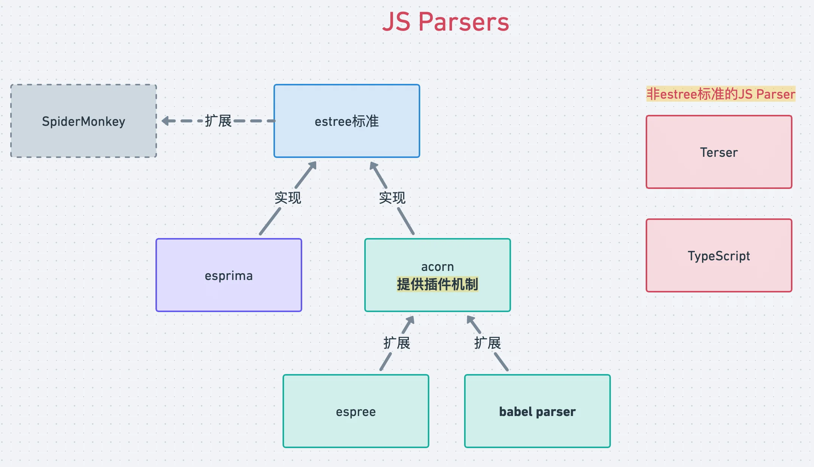

---
JS Parser历史
---

前面我们学习了 babel 的 parser 和 AST，babel 的 parser 是基于 `acorn` 扩展而来的，而 acorn 也不是最早的 js parser，js parser 的历史是怎样的？ 各种 parser 之间的关系是什么样的呢？这节我们来梳理一下。

## SpiderMonkey 和 estree 标准

在 nodejs 出现之后，前端可以用 nodejs 来做一些工程化的事情，也就有了对 js parser 的需求，当时 Mozilla 在 MDN 上公布了 SpiderMonkey（c++ 写的 js 引擎）的 parser api 和 AST 标准，所以当时最早的 JS parser ---- [esprima](https://github.com/jquery/esprima) 就是基于 SpiderMonkey 的 AST 标准来实现的，后来形成了 [estree 标准](https://github.com/estree/estree)。 当时很多的前端领域的工具都基于 esprima。

但是到了 2015 年之后，es 标准一年一个版本，而 esprima 的更新速度跟不上，它跟不上也就导致了依赖它的一系列工具都跟不上，所以 eslint 就 fork 了一份 esprima，做了一些扩展，来自己实现新语法的 parse，这就是 espree，它依然是 estree 标准的。

## acorn

后面出现了 acorn，也是 `estree` 标准的实现，但是他的速度比 esprima 快，而且支持插件，可以通过插件扩展语法支持。正是速度快加上支持插件让很多工具都转而使用 acorn。

eslint 的 parser ---- espree 本来是 fork 自 esprima，但后来 espree 2.0 基于 acorn 重新实现了，也使用 acorn 的插件机制来扩展语法。

`babel parser`(babylon) 也是基于 acorn，并且对 AST 节点和属性都做了扩展，也提供了一些支持 typescript、jsx、flow 的**插件**（就是我们可以在 @babel/parser 的 plugins 里面指定的那些）。


## JS Parser之间的关系



它们的关系如图所示，estree 标准是基于 SpiderMonkey 的 AST 标准扩展的，它的实现有 esprima、acorn 等，现在 espree、babel parser 都是基于acorn做的扩展，因为 acorn 提供了插件机制。

当然也不是所有的 js parser 都是 estree 标准的，比如 terser、typescript 等都有自己的 AST 标准。


## babel parser对estree AST的扩展

`babel` 基于 **acorn 插件**对 estree AST 做了如下扩展:

1. 把 `Literal` 替换成了 `StringLiteral、NumericLiteral、 BigIntLiteral、 BooleanLiteral、 NullLiteral、 RegExpLiteral`
2. 把 `Property` 替换成了 `ObjectProperty` 和 `ObjectMethod`
3. 把 `MethodDefinition` 替换成了 `ClassMethod`
4. Program 和 BlockStatement 支持了 `directives` 属性，也就是 'use strict' 等指令的解析，对应的 ast 是 Directive 和 DirectiveLiteral
5. ChainExpression 替换为了 ObjectMemberExpression 和 OptionalCallExpression
6. ImportExpression 替换为了 CallExpression 并且 callee 属性设置为 Import

这些可以在 [babel parser 的文档](https://babeljs.io/docs/en/babel-parser#output)里看到。


## acorn插件

babel parser 基于 acorn 扩展了一些语法，那它是怎么扩展的呢？ 我们写一个 acorn 插件来感受一下。

acorn 主要是一个 `Parser` 类，不同的方法实现了不同的逻辑，插件扩展就是**继承**这个 Parser，重写一些方法。

acorn 的 api 如下，其中 `acorn-jsx`、`acorn-bigint` 就是 acorn 插件

```js
/**
 * @type {import('acorn')}
 */
const { Parser } = require('acorn')

const MyParser = Parser.extend(
  require('acorn-jsx')(),
  require('acorn-bigint')
)

console.log(MyParser.parse('// Some bigint + JSX code'))
```

::: details 安装依赖

```bash
pnpm i -D acorn acorn-jsx acorn-bigint
```

:::

**插件是一个函数，接收之前的 Parser，返回扩展以后的 Parser**

```js
module.exports = function noisyReadToken(Parser) {
  return class extends Parser {
    readToken(code) {
      console.log("Reading a token!")
      super.readToken(code)
    }
  }
}
```

接下来我们写一个acorn插件：**给 javascript 一个关键字 `guang`，可以作为 `statement` 单独使用**

💡我们知道 parse 的过程其实就是`分词` + `组装 AST`这两步（一般叫词法分析和语法分析），我们只要实现这两步就可以了。


### 分词（词法分析）

我们是想增加一个`关键字`，acorn 有 `keywords` 属性，是一个**正则表达式**，用来做关键字拆分，所以我们重写 keywords 属性就可以。并且还要为新的关键字注册一个 `token` 类型。

acorn Parser 的入口方法是 parse，我们要在 parse 方法里面设置 keywords。

```js {3}
parse(program) {
    var newKeywords = "break case catch continue debugger default do else finally for function if return switch throw try var while with null true false instanceof typeof void delete new in this const class extends export import super";
    newKeywords += " guang";// 增加一个关键字
    this.keywords = new RegExp("^(?:" + newKeywords.replace(/ /g, "|") + ")$")

    return(super.parse(program));
}
```

然后注册一个新的 token 类型来标识它

```js
Parser.acorn.keywordTypes['guang'] = new TokenType('guang', { keyword: 'guang' })
```

这样 acorn 就会在 parse 的时候分出 `guang` 这个关键字


### 组装AST（语法分析）

光分出 token 是没意义的，要组装到 AST 中。

acorn 在 parse 到不同类型的节点会调用不同的 parseXxx 方法，因为我们是在 statement 里面用，那么就要重写 `parseStatement` 方法，在里面组装新的 statement 节点。

```js
parseStatement(context, topLevel, exports) {
  var tokenType = this.type;

  if (tokenType == Parser.acorn.keywordTypes["guang"]) {
    var node = this.startNode();
    this.next();
    return this.finishNode({value: 'guang'},'GuangStatement');
  }
  else {
    return(super.parseStatement(context, topLevel, exports));
  }
}
```

- `this.type` 是当前处理到的 token 的类型， `this.next` 是消费这个 token，我们识别出 token 的类型为 `guang` 的时候，就组装成一个 AST。
- 通过 `this.startNode()` 创建一个新的AST节点，然后 `this.next()` 消费掉这个 token，之后返回新的 AST 节点。
- 如果不是我们扩展的 token，则调用父类的 `parseStatement` 处理。
- 这样能成功分出token，但是最好把它独立成一个方法，这样子类可以覆盖这个方法来对 parse 逻辑做修改。

```js
parseStatement(context, topLevel, exports) {
  var tokenType = this.type;

  if (tokenType == Parser.acorn.keywordTypes["guang"]) {
    var node = this.startNode();
    return this.parseGuangStatement(node);
  }
  else {
    return(super.parseStatement(context, topLevel, exports));
  }
}

parseGuangStatement(node) {
  this.next();
  return this.finishNode({value: 'guang'}, 'GuangStatement');
}
```

完整代码如下：

```js
/**
 * @type {import('acorn')}
 */
const { Parser, TokenType } = require('acorn')


Parser.acorn.keywordTypes['guang'] = new TokenType('guang', {
  keyword: 'guang'
})

function wordsRegexp(words) {
  return new RegExp("^(?:" + words.replace(/ /g, "|") + ")$")
}

/**
 * 
 * @param {Parser} Parser 
 */
var guangKeywordPlugin = function(Parser) {
  return class extends Parser {
    parse(program) {
      let newKeywords = "break case catch continue debugger default do else finally for function if return switch throw try var while with null true false instanceof typeof void delete new in this const class extends export import super";
      newKeywords += " guang";
      this.keywords = new RegExp("^(?:" + newKeywords.replace(/ /g, "|") + ")$")
      // this.keywords = wordsRegexp(newKeywords)
      
      // 🚨注意这里的 `return` 是一个函数
      return(super.parse(program));
    }

    parseStatement(context, topLevel, exports) {
      var startType = this.type

      if (startType == Parser.acorn.keywordTypes['guang']) {
        var node = this.startNode()
        return this.parseGuangState(node)
      } else {
        return(super.parseStatement(context, topLevel, exports))
      }
    }

    parseGuangState(node) {
      this.next()
      return this.finishNode({ value: 'guang' }, 'GuangStatement')
    }
  }
}

const newParser = Parser.extend(guangKeywordPlugin)


var program = 
`
    guang
    const a = 1
`;

// 为了避免警告，添加 `{ ecmaVersion: 2020 }` options
// Since Acorn 8.0.0, options.ecmaVersion is required.
// Defaulting to 2020, but this will stop working in the future.
const ast = newParser.parse(program, { ecmaVersion: 2020 })
console.log(ast)
```

我们执行下试下效果，产生的AST如下：

```bash
Node {
  type: 'Program',
  start: 0,
  end: 27,
  body: [
    { value: 'guang', type: 'GuangStatement', end: 10 },
    Node {
      type: 'VariableDeclaration',
      start: 15,
      end: 26,
      declarations: [Array],
      kind: 'const'
    }
  ],
  sourceType: 'script'
}
```

就这样我们实现了新的 AST 节点🎉。

通过这个简单的例子，我们能大概理解 babel 是怎么基于 acorn 实现 typescript、jsx、flow 语法解析的了。

🌰比如 Literal 扩展了 StringLiteral、NumericLiteral 等这一点，我们就可以自己实现：

```js
parseLiteral(...args) {
  const node = super.parseLiteral(...args)
  switch (typeof node.value) {
    case 'number':
      node.type = 'NumericLiteral'
      break
    case 'string':
      node.type = 'StringLiteral'
      break
  }
  return node
}
```


## 总结

这一节我们了解了 js parser 的历史，从 SpiderMonkey 的 AST 标准开始，扩展到 espree 的标准，最早的 estree 标准的实现是 esprima，但是随着 es2015 开始一年一个版本，esprima 的迭代速度逐渐跟不上了，这时候 `acorn` 流行起来，因为速度更快，而且支持插件扩展，于是 espree、babel parser(babylon) 等都基于 acorn 来实现各自的 parser。虽然 estree 系列的 js parser 挺多的，但也不是全部，terser、typescript 等都是用自己的AST。

学完这一节，我们更全面的了解了 js parser 的历史，对各种工具所用的 parser 之间的关系有了一定的了解，并且还知道了 acorn 的语法插件该怎么写。

源码地址：

- [babel-plugin-exercise - @github](https://github.com/QuarkGluonPlasma/babel-plugin-exercize) 建议 git clone 下来通过 node 跑一下


2023年04月06日11:18:23

