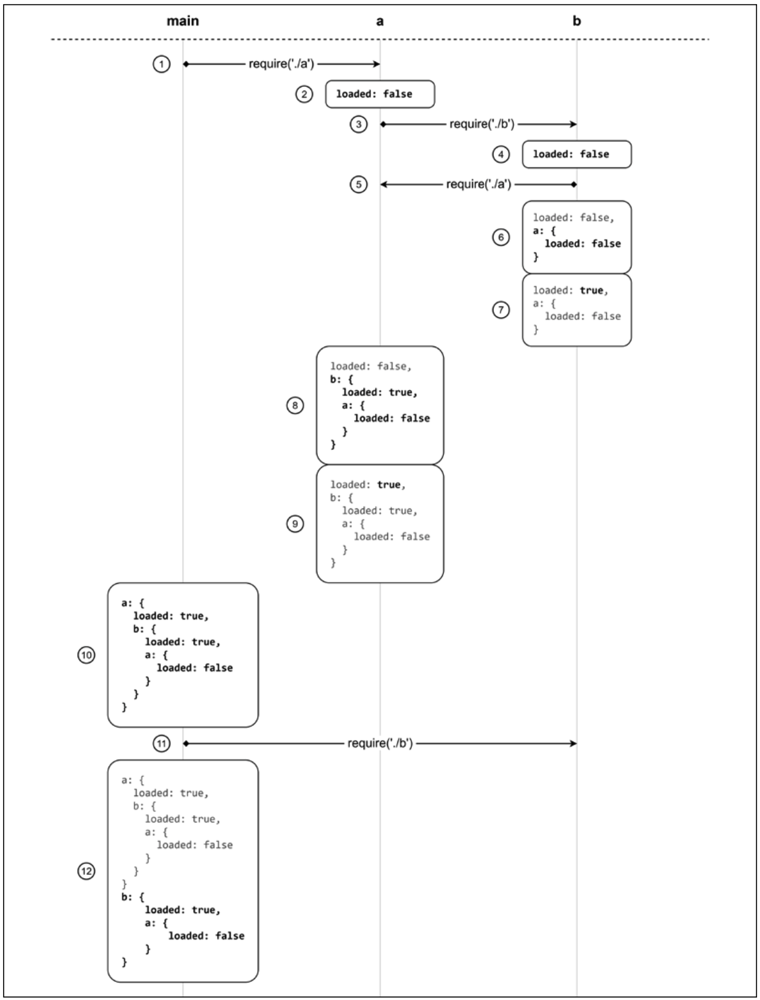

[[toc]]

CommonJS是第一个构建在Node.js中的模块系统。Node.js的 CommonJS实现了CommonJS规范，并添加了一些额外的扩展。

::: tip 📚

CommonJS规范 2个主要概念：

1. `require` 是一个允许你从本地文件系统导入模块的函数
2. `exports` & `module.exports` 是特殊的变量，用于从当前模块导出公开功能

:::

下面看看CommonJS规范的一些细节。


## ⭐自己实现一个模块加载器

为了更好理解CommonJS运行原理，我们自己从头开始构建一个类似的系统🚀。下面创建一个函数，模仿Node.js中原版 `require()` 函数的部分功能。

先创建一个函数，加载模块内容，将它包裹在一个私有作用域中，然后执行它。

```js
function loadModule(filename, module, require) {
  const wrappedSrc = `
    (function (module, exports, require) {
      ${fs.readFileSync(filename, 'utf8')}
    })(module, module.exports, require)
  `
  eval(wrappedSrc)
}
```

模块的源代码被包裹到一个函数中，就好像之前的揭露模块模式（`revealing module pattern`）。区别在于，我们给模块传入了一组变量，即 `module`, `exports` & `require`。特别注意 `exports` 参数，它其实是 `module.exports`，之后我们再说这个。

📚另一个重要细节就是，我们使用了 `readFileSync` 去读取模块内容。虽然通常不建议使用文件系统api的同步版本，但在这里这样做是有意义的。原因在于，`CommonJS中的模块加载是刻意的同步操作`。这种方式保证了，如果你导入多个模块，它们（和它们的依赖）能够按照正确的顺序被加载😎。

::: warning

这里仅仅是一个demo，在真实的应用中，很少会去执行源代码。像 `eval()` 或 [vm](https://nodeschool.io/zh-cn/) 模块很容易被错误使用，导致注入攻击，使用时应该极其小心，并且不要将它们同时一起使用。

:::

🚀我们现在实现 `require()` 函数：

```js
function require(moduleName) {
  console.log(`Require invoked for module: ${moduleName}`)
  const id = require.resolve(moduleName) // 📌 1
  if (require.cache[id]) {               // 📌 2
    return require.cache[id].exports
  }
  
  // 模块元数据
  const module = {                       // 📌 3
    exports: {},
    id
  }
  
  // 更新缓存
  require.cache[id] = module            // 📌 4
  
  // 加载模块
  loadModule(id, module, require)       // 📌 5
  
  // 返回导出的变量
  return module.exports                 // 📌 6
}

// 函数对象上添加额外的属性
require.cache = {}
require.resolve = (moduleName) => {
  // 依据 moduleName 解析完整模块id
}
```

上面函数模拟了Node.js原版 `require()` 函数的行为，用于加载模块。当然，这只是用作教学目的，并不能精确和完整的反应真实的 `require()` 函数的内部行为😁，但有助于帮助理解Node.js模块系统的内部，包括模块是如何定义和加载的。

上面标记📌注解：

1. 模块名作为输入，我们要做的第一件事是解析该模块的完整路径，我们称之为 `id`。这个任务委托给了 `require.resolve()`，它实现了一种特殊的解析算法（之后会细讲这个😇）
2. 如果模块已经被加载过了，则它可在缓存中找到。直接返回缓存中的内容
3. 如果模块之前没有被加载过，我们给模块的第一次加载设置环境。即，我们创建一个 `module` 对象，包含 `exports` 属性，它初始值是一个空对象字面量。`该对象将由模块的代码填充，以导出其公共API。`
4. 在第一次加载后， `module` 对象会被缓存起来
5. 模块源码从它的文件中被读取，并被执行，正如我们先前看到的一样。我们给模块提供了我们刚创建的 `module` 对象和 `require()` 函数的引用。模块通过操控或替代 `module.exports` 对象导出其公共API
6. 最后，表示该模块公开API的 `module.exports` 的内容返回给调用者（`caller`）

可以看出，Node.js模块系统也没有什么黑魔法，诀窍在于我们围绕模块源代码创建的包装器和运行模块的人工环境。😎


## 定义一个模块

通过查看我们自定义的 `require()` 工作原理，我们现在能理解如何定义一个模块了。

🌰：

```js
// 加载另一个依赖
const dependency = require('./anotherModule')

// 私有函数
function log() {
  console.log(`Well done ${dependency.username}`)
}

// 导出的公开API
module.exports.run = () => {
  log()
}
```

::: tip

记住一个基本法则：模块中的一切都是私有的，除非将其赋值给 `module.exports` 变量。当模块通过 `require()`加载时，这个变量的内容会被缓存起来，并被返回。

:::


## 🚀 module.exports vs. exports

对于很多不熟悉Node.js的小伙伴，通常存在一个这样的困惑：**是该使用 `module.exports` 还是 `exports` 导出公有API呢？** 我们上面自定义的 `require()` 函数应该能再次解答这个疑惑。

::: tip

`exports` 变量仅仅是 `module.exports` 初始值的一个引用。我们已经看到，这样的值本质上仅仅是模块加载前的一个简单对象字面量。

```js
(function (module, exports, require) { // exports 一般是我们模块中使用的
  ${fs.readFileSync(filename, 'utf8')}
})(module, module.exports, require) // 实际传入的是 module.exports 作为它的初始值

// 而 module对象为
module {
  id,
  exports: {}
}
```

可以看出 `exports` 参数一开始传入的就是 `module.exports`

:::

这意味着，我们可以通过 `exports` 变量向对象引用添加新的属性，比如：

```js
exports.hello = () => {
  console.log('Hello')
}

// 译者注：等价于
module.exports.hello = () => {
  console.log('Hello')
}
```

👩‍🏫 而给 `exports` 变量重新赋值没有任何效果，因为它不会改变 `module.exports` 的内容。它只会对变量自身进行重赋值。下面代码因此是错误的❌：

```js {1-2}
// ❌ 重赋值 导致 exports指向了别的对象地址
// 而最终向外暴露的API是以 module.exports 对象为准
exports = () => {
  console.log('hello')
}
```

如果你想导出一些除了对象字面量之外的东西，比如函数，实例或字符串什么的，我们必须对 `module.exports` 重新赋值，比如：

```js
// ✅
module.exports = () => {
  console.log('Hello')
}
```

::: tip

译者注：了解两者区别，可看下面一篇文章，简洁明了

-   [exports和module.exports的区别 - @csdn](https://blog.csdn.net/louxinuo/article/details/119058495)

:::

## `require` 函数是同步的

我们需要注意的一个非常重要细节就是，我们自定义的 `require()` 函数是 `同步的`。实际上，它使用简单直接的风格返回了模块内容，并且不需要回调。**这对Node.js原本的 `require()` 函数也是一样的🎉**。这导致的结果就是，`任何对 module.exports 的赋值都必须也是同步的。`

🌰，因此下面代码是不正确的：

```js
setTimeout(() => {
  module.exports = function() {}
}, 100)
```

::: tip

`require()` 这种同步的天性对定义模块的方式产生了重要的影响，因为它限制我们在定义模块时大多数使用同步代码。这是核心Node.js库提供同步api作为大多数异步api的替代方案的最重要原因之一。

:::

如果我们需要某个模块的一些异步初始化步骤，我们总是可以定义和导出一个未初始化的模块，它将在稍后进行异步初始化。但是，这种方法的问题是，使用`require()`加载这样的模块并不能保证它可以被使用😅。第11章我们会详细分析这个问题，并给出几种优雅解决这个问题的模式。

出于好奇，你可能想知道，在早期，Node.js曾经有一个异步版本的require()，但它很快就被删除了，因为它使一个实际上只在初始化时使用的功能过于复杂，而且异步I/O带来的复杂性大于优点😂。


## 🚀 resolve算法

术语`依赖地狱`描述了这样一种情况：一个程序的两个或多个依赖项轮流依赖于一个共享依赖项，但需要不同的不兼容版本。Node.js根据加载模块的位置加载不同版本的模块，从而很好地解决了这个问题。该特性的所有优点都在于Node.js包管理器(如npm或yarn)组织应用程序依赖关系的方式，以及`require()`函数中使用的解析算法。

我们先快速预览一下这个算法。正如先前所见，`resolve()` 函数接收一个模块名（`moduleName`）作为输入，然后返回完整的模块路径。该路径用于加载它的代码和作为模块唯一标识符。解析算法可以划分为下面3个主要分支：

1. **文件模块**： 如果 `moduleName` 以 `/` 开头，则它表示一个`绝对路径`，直接返回即可。如果以 `./` 开头，则 `moduleName` 表示一个`相对路径`，这是从所需模块的目录开始计算的。
2. **核心模块**： 如果模块没有 `/` 或 `./` 前缀，算法会先尝试从Node.js核心模块开始搜索
3. **包模块**：如果 `moduleName` 不是核心模块，搜索继续，先从请求模块所在的 `node_modules` 中搜索，如果还没找到，则再在其父 `node_modules` 中查找，直到到达项目根目录为止。

对于文件和包模块，文件和目录都可以匹配 `moduleName`。特别是，算法会匹配下面内容：

- `<moduleName>.js `直接匹配文件
- `<moduleName>/index.js` 目录下的 `index.js`
- `<moduleName/package.json>` 中 `main` 属性指定的 `directory/file` 包模块

::: tip

该算法完整和正式的文档可查看：[Node modules - resolve](https://nodejs.org/api/modules.html#modules_all_together)

:::

`node_modules` 目录是包管理器（`npm | yarn | pnpm`） 安装依赖生成的目录。正如先前所讲，每个包都有自己私有依赖。

🌰下面目录结构：

``` bash
myApp
 - foo.js
 - node_modules
   - depA
     - index.js
   - depB
     - bar.js
     - node_modules
       - depA
         - index.js
   - depC
     - foobar.js
     - node_modules
       _ depA
         - index,js
```

`myApp` & `depB` & `depC` 都依赖 `depA`。但是他们都有自己该依赖的私有版本。遵循下面解析算法规则，使用 `require('depA')` 会依据需要它的模块加载不同文件，比如：

- 在 `/myApp/foo.js` 中调用 `require('depA')`，将加载 `/myApp/node_modules/depA/index.js`
- 在 `/myApp/node_modules/depB/bar.js` 中调用 `require('depA')`，将加载 `/myApp/node_modules/depB/node_modules/depA/index.js`
- 在 `/myApp/node_modules/depC/foobar.js` 中调用 `require('depA')`，将加载 `/myApp/node_modules/depC/node_modules/depA/index.js`

这个解析算法是Node.js强大的依赖管理能力的核心部分，它使成千上百的依赖包不会出现冲突和版本兼容性问题。

::: tip

当调用`require()`时，解析算法对我们来讲是透明无感的，我们直接使用即可。但是，如果需要，任何模块仍然可以通过调用`require.resolve()`直接使用它。😎

:::


## 模块缓存

每个模块只有第一次被 `require` 时才会加载和执行，后续的 `require()` 都直接返回缓存版本。上面的自制版本 `require()` 应该很清晰看到这一点。缓存对性能很重要，但它也有一些重要的功能含义：

- 它使得在模块依赖中存在循环成为可能
- 它在某种程度上保证，当从给定包中需要相同的模块时，总是返回相同的实例

::: warning

模块缓存通过 `require.cache` 变量暴露，因此如果需要的话，我们可以直接访问它🤩。一个常见的用例是通过删除`require.cache`中的键来使任何缓存模块失效。这种做法在`测试期间`可能很有用，但如果在正常情况下使用，则非常危险。

:::


## ⭐ 循环依赖

很多人认为循环依赖是一种内在的设计问题，但是它在实际项目中是确确实实可能存在的，因此了解它在CommonJS中是如何运作的是很有用的。如果再看看我们自制的 `require()` 函数，我们便能管中窥豹，了解它是如何工作的，以及它的缺陷是什么。

我们先通过下面一个示例展示循环依赖在CommonJS中的行为。


模块 `main.js` 需要 `a.js` & `b.js`。而 `a.js` 又需要 `b.js`。同时 `b.js` 又依赖 `a.js`。很明显模块 `a & b` 存在循环依赖。先看一下这2个模块：

模块 `a.js` ：

```js
exports.loaded = false
const b = require('./b')
module.exports = {
  b,
  loaded: true // 覆盖先前的export
}
```

模块 `b.js` ：

```js
exports.loaded = false
const a = require('./a')
module.exports = {
  a,
  loaded: true
}
```

模块 `main.js`:

```js
const a = require('./a')
const b = require('./b')
console.log('a ->', JSON.stringify(a, null, 2))
console.log('b ->', JSON.stringify(b, null, 2))
```

如果我们运行 `main.js`，打印结果如下：

```bash
a -> {
  "b": {
    "a": {
      "loaded": false
    },
    "loaded": true
  },
  "loaded": true
}
b -> {
  "a": {
    "loaded": false
  },
  "loaded": true
}
```

👩‍🏫 这个结果揭露了CommonJS中循环依赖的缺陷，即，应用程序的不同部分对模块`a.js`和模块`b.js`导出的内容有不同的视野，`这取决于这些依赖项的加载顺序。`当这两个模块从`main.js`模块中被加载时，它们就会被完全初始化，而`a.js`模块在从`b.js`模块中加载时将是不完整的。特别是，它的状态将是在加载`b.js`时达到的状态。

为了更详细地了解幕后发生了什么，让我们一步一步地分析不同模块是如何被解释的，以及它们的局部作用域是如何变化的:


加载步骤如下：

1. 整个过程从 `main.js` 开始，它会立即加载 `a.js`
2. 模块 `a.js` 做的第一件事就是导出一个叫 `loaded` 的值，它的值为 `false`
3. 此时，模块 `a.js` 又去加载模块  `b.js`
4. 和 `a.js` 一样，模块 `b.js` 做的第一件事也是导出 `loaded = false`
5. 现在，模块 `b.js` 又去加载模块 `a.js` （`形成循环`）
6. 因为 `a.js` 已经被遍历，它当前导出的值立即被拷贝到模块 `b.js` 作用域中
7. 模块 `b.js` 最终将 `loaded` 值更改为 `true`
8. 现在 `b.js` 已经完全执行，控制权返回给 `a.js`，在它自己的作用域中保存模块`b.js`当前状态的副本
9. 模块 `a.js` 最后一步就是将 `loaded` 值设置为 `true`
10. 现在 `a.js` 已经完全执行，控制权返回给 `main.js`，在它自己内部作用域中保存模块`a.js`当前状态的副本
11. `main.js` 加载 `b.js`，会立即从 `缓存` 中进行加载
12. 模块 `b.js` 当前状态会立即拷贝到模块 `main.js` 的作用域中，得到模块最终的完整状态


正如之前所说，这里的问题是，`b.js` 只有模块 `a.js` 部分视野，并且这部分视野随着模块 `b.js` 被 `main.js` 加载而被传播。**这种行为应该会引发一种直觉，如果我们交换main.js中需要这两个模块的顺序，这种直觉可以得到证实。**如果你真这样做了，你会看到这一次`a.js`模块将接收到`b.js`的不完整版本。

::: tip

我们现在明白，如果我们失去对首先加载哪个模块的控制，这可能会变得相当模糊，如果项目足够大，这种情况很容易发生。

:::

之后我们会看到ESM如何更有效的处理循环依赖的问题😎。同时，如果你使用CommonJS，也应该注意这种行为，以及它对项目可能产生的影响。

下面一节，我们讨论Node.js中定义模块的几种模式。


2022年09月28日21:31:59


