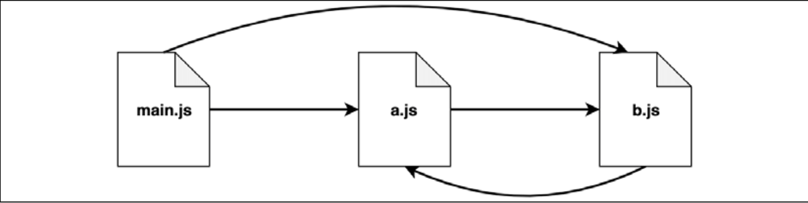
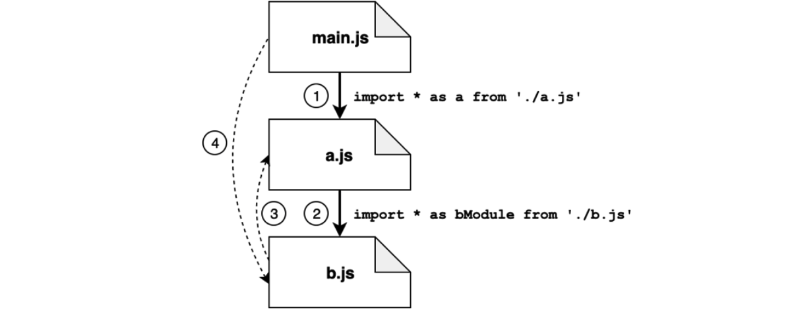
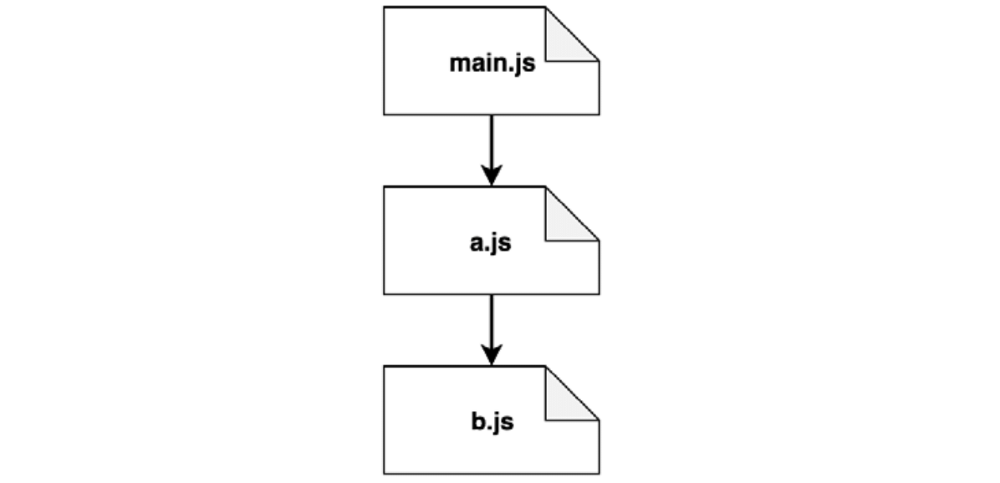
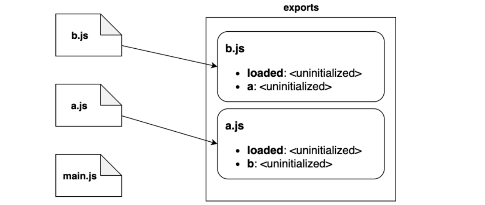
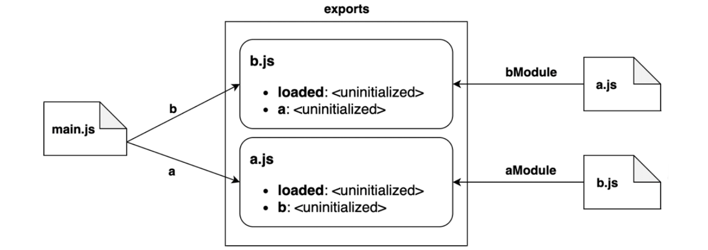
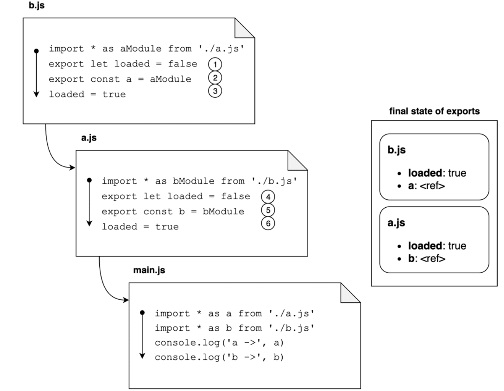

[[toc]]

ESM作为ES2015规范的一部分被引入，它旨在为JS提供一个适用于不同运行环境的官方模块系统。

- ESM规范尝试保留CommonJS，AMD这些已有模块系统的优点
- 其语法简洁紧凑
- 支持循环依赖😎
- 并可能`异步的`加载模块

::: tip

ESM和CommonJS之间最大的区别在于：

1. ESM是 **静态的（`static`）**，意味着，导入需要放在每个模块最顶层，不能放在控制流语句中（`if | while` 等）；
2. 导入模块的名字不能使用表达式在运行时动态生成，只能是常量字符串

```js
// ❌ 不能放在控制流语句中
if (isLoad) {
  import xx from 'esm'
}


// ❌ 不能使用表达式在运行时动态生成
const MODULE_NAME = 'XX'
import `${MODULE_NAME}_YY` from 'some-esm';
```

:::

例如，下面代码在使用ESM时是不合法的：

```js
if (condition) {
  import module1 from 'module1'
} else {
  import module2 from 'module2'
}
```

而在CommonJS中，这样写是完全没有问题的：

```js
let module = null
if (condition) {
  module = requiree('module1')
} else {
  module = require('module2')
}
```

初看之下，这看起来是ESM一种不必要的限制，但实际上，使用静态导入开启了很多有趣的场景，而这对于CommonJS动态的特性是不可能的。比如

- 静态导入允许依赖树的静态分析，这使得死代码消除（tree-shaking） 优化成为了可能
- 等等

## 在Node.js中使用ESM

Node.js默认 `.js` 文件使用CommonJS语法。因此，如果在 `.js` 文件中使用ESM语法，解释器会直接抛出错误。

有几种方式告诉Node.js翻译器，给定的模块是ESM，不是CommonJS:

1. 将模块文件后缀更改为 `.mjs`

2. 在最近的父 `package.json` 中添加一个 `type` 字段，值为 `"module"`

   ```json
   {
     "type": "module",
     "dependency": {}
   }
   ```

::: tip

本书后面会使用 `.js` 文件，在 `package.json` 中添加 `"type": "module"` 的方式。

:::


## 有名导出和导入

📚 ESM允许我们通过 `export` 关键词从模块中导出功能。

::: warning

注意，ESM使用 `export` 单数形式，而CommonJS使用 `exports | module.exports` 复数形式。

:::

在ESM中，所有功能`默认私有`，只有导出的部分才对其它模块可见😎。

🌰 `logger.js`

```js {1,6,9,19}
// 导出一个函数，名为 `log`
export function log(message) {
  console.log(message)
}

// 导出一个常量，名为 `DEFAULT_LEVEL`
export const DEFAULT_LEVEL = 'info'

// 导出一个对象，名为 `LEVELS`
export const LEVELS = {
  error: 0,
  debug: 1,
  warn: 2,
  data: 3,
  info: 4,
  verbose: 5
}

// 导出一个类，名为 `Logger`
export class Logger {
  constructor(name) {
    this.name = name
  }
  
  log(message) {
    console.log(`[${this.name}] ${message}`)
  }
}
```

📚 如果我们想从别的模块中导入实体，可以使用 `import` 关键词。这个语法相当灵活，它允许我们导入一个或多个实体，甚至重命名导入😎。

🌰 

```js {1}
import * as loggerModule from './logger.js'

console.log(loggerModule)
```

1️⃣ 这里使用 `*` 语法（也称之为 **`namespace import`**） 导入模块所有成员，然后将其赋值给本地变量 `loggerModule`。上面输出如下：

```bash
[Module] {
  DEFAULT_LEVEL: 'info',
  LEVELS: { error: 0, debug: 1, warn: 2, data: 3, info: 4, verbose: 5 },
  Logger: [class Logger],
  log: [Function: log]
}
```

如我们所见，模块中所有导出的实体都可通过 `loggerModule` 命名空间访问到。比如，可使用 `loggerModule.log` 引用 `log()` 函数。

::: warning 🚨

不同于CommonJS，ESM必须指定导入模块的`文件扩展`。使用CommonJS，我们可以使用 `./logger` 或者 `./logger.js`；而ESM，必须带上文件扩展，使用 `./logger.js`。

:::

2️⃣ 不想导入所有，导入部分实体方式：

```js {1}
import { log } from './logger'

log('Hello World')
```

导入多个：

```js {1}
import { log, Logger } from './logger.js'

log('Hello World')
const logger = new Logger('DEFAULT')
logger.log('Hello World')
```

3️⃣ 当使用这种类型的导入语句，实体被导入到当前作用域，有可能存在命名冲突。下面代码。会报错：

```js {3}
import { log } from './logger.js'

// ❌ SyntaxError: Identifier 'log' has already been declared
const log = console.log
```

解决办法是使用 `as` 关键词对导入实体进行重命名：

```js {1}
import { log as log2 } from './logger.js'

const log = console.log

log('message from log')
log2('message from log2')
```

这种方式对解决因导入同名实体而导致的冲突十分有用，在模块之外改变原有名字都掌握在用户手中。


## 默认导出和导入

CommonJS很常用的一个能力是，通过给 `module.exports` 赋值的方式导出`单一未命名`实体。这种方式很便利，因为它鼓励模块开发者遵循单一职责原则，一个模块只暴露一个清晰的接口。ESM可以使用 `default export` 的方式达到同样的目的。默认导出使用 `export default` 关键词：

🌰 `Logger.js`

```js
export default class Logger {
  constructor(name) {
    this.name = name
  }
  
  log(message) {
    console.log(`[${this.name}] ${message}`)
  }
}
```

📚 这种情况下，名字 `Logger` 会被忽略，导出的实体会被注册在 `default` 名字下。导出的名字通过特殊的方式被处理，可以通过下面方式导入：

`main.js`:

```js
import MyLogger from './Logger.js'

const logger = new MyLogger('info')
logger.log('Hello World')
```

和有名导出的差别在于，因为默认导出被认为是无名的（`unnamed`），因此我们在导入的同时给它赋值一个本地变量。本例中，我们可以使用任何名字替换 `MyLogger` 都可以。这和CommonJS模块很类似。

::: tip 📚

在内部，默认导出相当于使用 `default` 作为名字进行导出。

:::

我们可以通过下面方式，验证这个说法：

🌰 `showDefault.js`

```js
import * as loggerModule from './logger.js'

console.log(loggerModule)
```

当执行后，打印结果：

```bash
[Module] { default: [Function: Logger] }
```

🚨 注意，我们不能显式的导入default实体。实际上，下面方式会失败：

```js {1}
// ❌ SyntaxError: Unexpected reserved word error
import { default } from './logger.js'
```

这是因为 `default` 关键词不能用作是变量名。它作为对象特性是合法的。因此上面的例子中，我们使用 `loggerModule.default` 是合法的，但是直接使用 `default` 是不允许的。


## 混合导出

ESM中可以同时导出有名导出和默认导出。

🌰 `logger.js`

```js
// 默认导出
export default function log(msg) {
  console.log(msg)
}

// 有名导出
export function info(msg) {
  log(`info: ${msg}`)
}
```

上面的 `info` 函数内部调用了默认导出的 `log` 函数，这里不能使用 `default()` ，否则会抛出错误 `syntax error(Unexpected token default)`。

📚同时导入默认导出和有名导出：

```js
import mylog, { info } from './logger.js'
```

默认导出和有名导出的主要几个差异：

1. 有名导出是显式的。通过已确定的名字使IDEs支持自动导入，自动完成和重构😎。比如，如果我们输入 `writeFileSync`，编辑器可能会自动在当前文件的开头添加 `import { writeFileSync } from 'fs'`。相比之下，默认导出使事情变得复杂，因为不同文件中，默认导出被导入时，可能使用不同的名字；
2. 默认导出是一种方便的机制，用于交流模块中最重要的功能。同时，从用户的角度，使用默认导出更加的便利，不需要知道具体的名字；
3. 某些情况下，默认导出可能使tree shaking 更加困难😔。例如，一个模块可能只提供一个默认导出，其余功能则以对象属性的形式。当我们导入这个默认对象，大多数模块打包器会认为整个对象都在被使用，因此它们无法从导出的功能中删除任何未使用的代码。

::: tip 💡

基于上面的原因，坚持使用有名导出被认为是一种最佳实践🎉，特别是当模块需要暴露多个功能时，只有当模块只导出一个清晰且单一功能时，才考虑使用默认导出。

当然这并不是一个强制的规则，对上面建议存在很多例外。比如，所有Node.js核心模块同时存在默认导出和很多有名导出。同样，React也使用混合导出。

根据你的模块功能以及用户体验综合考虑，选择最适合的导出方式。

:::


## ⭐ 模块标识符

`Module identifiers`（也称之为 `module specifiers`） 是在 `import` 语句中用于确定加载模块位置的不同类型的值。

目前我们只看到过相对路径，但存在其它可能和一些细微的差别。下面列举出所有的可能性：

1. `相对限定符` 比如 `./logger.js` 或 `../logger.js`。表示相对于导入文件位置的路径。
2. `绝对限定符` 比如 `file:///opt/nodejs/config.js`。表示直接显式的完整路径。`注意，这是ESM引用模块绝对路径的唯一方法`，使用 `/` 或者 `//` 前缀是行不通的。这一点和CommonJS存在巨大的差别🤩。
3. `裸限定` 比如 `fastify`,`http`。它们表示 `node_modules` 文件夹中的模块，通过都过包管理工具（npm|pnpm|yarn），或者是Node.js核心模块。
4. `深度导入限定符` 比如 `fastify/lib/logger.js`，表示 `node_modules` 中的某个包的某个路径（这里是 `fastify`）

::: tip

🎉 在浏览器环境中，可以直接通过指定模块URL的方式导入模块，比如，`https://unpkg.com/lodash`。这个功能在Node.js中是不支持的。

:::

## 异步导入

正如上面介绍的，`import` 语句是静态的，因此存在2个重要的限制：

1. 模块标识符不能在运行时被构建
2. 模块导入要在每个稳定最顶部导入，并且不能嵌套在控制流语句（`if` 等）中

但有些场景下，这些限制会显得过于严格。比如，如果你想对当前模块导入特定的用户语言，或者根据用户操作系统导入某个模块的变种。

又或者，某个模块非常的大，只有当用户访问该部分功能时才去加载该模块？

📚为了克服这些限制，ESM提供了 `异步导入（也称之为动态导入）` 的能力

- 异步导入使用特殊的 `import()` 操作符在运行时执行
- `import()` 操作符语法上相当于一个函数，该函数接收模块标识符（module identifier）作为参数，返回一个Promise，解析为模块对象（module object）📚

模块标识符可以是上面讨论过的任何静态导入的模块标识符。下面看一个例子。

我们构建一个CLI工具，打印不同语言的 `Hello World` 。未来，我们可能支持更多语句和语言，因此，有一个文件包含每种支持语言的所有面向用户的字符串的翻译是有意义的。

下面创建我们支持的语言示例模块：

```js
// 英文翻译模块
// ./strings-en.js
export const HELLO = 'Hello, World!'

// 中文翻译模块
// ./strings-zh.js
export const HELLO = '你好，世界！'
```

动态导入：`main.js`

```js {10-11}
const SUPPORT_LANGS = ['en', 'zh']                         // 1
const selectedLang = process.argv[2]                       // 2

if (!SUPPORT_LANGS.includes(selectedLang)) {               // 3
  console.error('THE specifed lang is not supported yet')
  process.exit(1)
}

const transModule = `./strings/strings-${selectedLang}.js` // 4
// 💡 import() 操作符 返回一个Promise
import(transModule)                                        // 5
  .then(strings => {                                       // 6
    console.log(strings.HELLO)
  })
```

步骤：

1. 定义支持的语言列表
2. 从命令行中读取第一个参数作为选择的语种
3. 最后，处理是否支持该语种
4. 首先，基于选择的语种，动态构建模块名。模块名这里使用的是相对路径
5. 使用 `import()` 操作符触发对该模块的动态导入
6. `动态导入是异步的`，当模块完全加载后，`then()` 回调函数会执行，`strings` 将是动态导入模块的命名空间。之后，使用 `strings.HELLO` 访问该模块，并在console中打印其值

命令行：

```bash
node main.js en

node main.js zh
```


## ⭐ 深入模块加载

为了了解ESM实际工作原理以及它是如何有效的处理循环依赖的，我们必须深入了解使用ESM时，JS代码是如何被解析和执行的。

👩‍🏫本节将学习：

- ESM如何加载的
- 展示只读动态绑定（`read-only live bindings`）的思想
- 循环依赖示例

### 加载阶段（Loading phases）

解释器（`interpreter`）的目标就是构建所有必需模块的图解（一种 **依赖图（`dependency graph`）**）。

::: tip

通用术语，依赖图可以被定义为 `有向图`，用于表示一组对象之间的依赖关系。就本节上下文，当我们说依赖图时，我们像表示的是ESM模块之间的依赖关系。后面我们会看到，使用依赖图允许我们确定所有必须模块加载的顺序😎
:::

本质上，依赖图用于解释器理清模块之间是如何相互依赖的，以及代码执行的顺序📚。当Node解释器启动时，它会执行某些代码，通常是以JS文件的形式。该文件是依赖关系的起始点，一般称之为 **入口点（`entry point`）**。从该入口点开始，解释器会通过深度优先的方式递归的找到所有的 `import` 语句，直到所有必需代码都被探索到，并被执行。

📚 更具体的讲，该过程可分为3个独立的阶段：

1. **`阶段1 - 构建（或解析）`**： 找到所有的imports，并递归的从各自文件中加载每个模块的内容
2. **`阶段2 - 实例化`**：对每个导出的实体，在内存中保存一个有名引用，但是还没有赋予任何值。同时，也会对所有 `import` & `export` 语句创建引用，用于追踪它们之间的依赖关系（称之为 `Linking`）。这个阶段还没有执行JS代码
3. **`阶段3 - 计算`**：Node.js最终执行代码，因此之前所有实例化的实体能获取到它们实际的值。现在从入口点开始运行代码变得可能，因为所有的空白都已填补上了🤩

::: tip

简单来说就是，

- 阶段1找到所有的点
- 阶段2连接创建的路径
- 阶段3按正确的顺序遍历所有路径

:::

初看之下，这种方式和CommonJS视乎大同小异，但是却存在本质上的差异。**由于CommonJS动态的天性，CommonJS在依赖图被探索时就会立即执行所有的文件😅**。我们已经看到过了，每次发现一个新的 `require` 语句时，所有先前的代码都已经执行了。这也是为什么你可以在 `if | 循环` 语句中使用 `require()` 的原因，并且可以从变量中使用 `require` 构建模块标识符。

在ESM中，`这3个阶段是完全分离的`，在依赖图完全构建之前，是不会执行任何代码的，因此模块imports & exports必须都是静态的📚。


### 只读动态绑定

ESM另一个有助于解决循环依赖的特质就是，导入的模块实际上是对它们导出值的 `只读动态绑定`。

为了解释这个含义，下面看一个简单的例子：

```js
// counter.js
export let count = 0
export function increment() {
  count++
}
```

该模块导出2个值：一个 `count` 和 增加count的函数 `increment`。

使用该模块：`main.js`

```js {7}
import  { count, increment } from './counter.js'

console.log(count) // 打印 0
increment() // 可以改变count的值，动态绑定
console.log(count) // 打印 1

// ❌ TypeError: Assignment to constant variable! 
// 只读绑定导致外部模块无法直接对其它模块值进行改变
count++
```

可以看出，我们可以随时读取 `count` 的值，并使用 `increment()` 改变该值，但是一旦我们直接的对 `count` 进行改变，我们便会得到一个错误，就好像我们尝试去改变一个 `const` 绑定😅。

::: tip

这证明了，当一个实体被导入该作用域时，对原始值的绑定是不能改变的（`只读绑定`），除非绑定值通过原始模块自身的作用域进行改变（`动态绑定`），而原始作用域用户是无法直接控制的😎。

:::


### 循环依赖解析

下面使用ESM语法重新实现之前的 [CommonJS circle dependency](./commonjs-modules#⭐-循环依赖)：



先看看 `a.js` & `b.js`:

```js
// a.js
import * as bModule from './b.js'
export let loaded = false
export const b = bModule
loaded = true


// b.js
import * as aModule from './a.js'
export let loaded = false
export const a = aModule
loaded = true
```

入口点 `main.js`:

```js
import * as a from './a.js'
import * as b from './b.js'

console.log('a ->', a)
console.log('b ->', b)
```

注意这里我们没有再使用 `JSON.stringify`，因为它会抛出 `TypeError: Converting circular structure to JSON`，因为 `a.js` & `b.js` 之间实际上存在一个循环引用。

运行 `main.js`，可以看到如下打印：

```bash
a -> <ref *1> [Module: null prototype] {
  b: [Module: null prototype] { a: [Circular *1], loaded: true },
  loaded: true
}
b -> <ref *1> [Module: null prototype] {
  a: [Module: null prototype] { b: [Circular *1], loaded: true },
  loaded: true
}
```

**这里有趣的是，`a.js` 和 `b.js` 都能完全看清对方，这是不同于CommonJS的，CJS中都只能看到对方的部分内容😅**。

我们也可以看到所有的 `loaded` 值均为 `true`。另外，`a`中的`b`是对当前作用域中可访问到的同一个`b`实例的实际引用，对于b中的a也是如此。这也是为什么我们不能使用 `JSON.stringify` 序列化这些模块的原因，最后，如果我们交换导入 `a.js` & `b.js` 的顺序，最后的结果是不会变化的😎，这也是不同于CommonJS原理的重要一方面。

模块解析这3个阶段（parsing，instantiation & evaluation）具体发生了什么，是值得花费更多时间去了解的，下面继续使用这个例子进行详解：

#### 阶段1：解析

在解析期间，代码从入口点（`main.js`） 开始被探索。解释器只寻找 `import` 语句去找出所有必需模块，然后从模块文件中加载源代码。依赖图以深度优先的方式被探索，**`并且每个模块只会被访问一次`**。通过这种方式，解释器构建了一种类似树结构的依赖图，如下：



解析阶段的步骤:

1. 从 `main.js`，首先导入的是 `a.js`，进入 `a.js`
2. 在 `a.js` 中，我们发现一个指向 `b.js` 的导入
3. 在 `b.js` 中，我们又发现对 `a.js` 的导入（即循环），但是因为 `a.js` 已经被访问过了，该路径不会再次被探索😎
4. 此时，探索开始回退：`b.js` 没有其它的导入了，因此返回到 `a.js`；而 `a.js` 也没有其他的import语句了，因此我们返回到 `main.js`。这里我们又发现另一个指向 `b.js` 的导入，但是这个模块也已经访问过了，因此该路径也被忽略了。

此时，我们深度优先的依赖图已经完成，并且我们得到了一个模块的线性视野，如下：（`已经移除了循环的模块线性视野`）



该视野相当的简单。现实场景中，存在更多的模块，视野会更像树形结构。


#### 阶段2：实例化

在实例化阶段，解释器 **`自下而上`** 遍历上一阶段得到的树形视图。对于每个模块，解释器都首先查找所有导出的属性，然后在内存中构建导出名地图：`实例化阶段视觉表示图`



上图描述了每个模块实例化的顺序：

1. 解释器先从 `b.js` 开始，然后该模块导出了 `loaded` 和 `a`
2. 然后，解释器移到 `a.js`，它又导出了 `loaded` 和 `b`
3. 最后，解释器移到 `main.js`，该模块没有导出任何功能
4. 🚨注意，在这个阶段，导出地图只追踪导出名，与之关联的值还没有被初始化

👩‍🏫经过这些步骤后，解释器再过一遍树形视图，将导出名和导入它们的模块链接起来，如下图所示：`链接`



上图步骤描述如下：

1. 模块`b.js`将链接到 `a.js` 的导出，将它们称为`aModule`
2. 相反，模块 `a.js` 将链接到 `b.js` 的导出，将它们称之为 `bModule`
3. 最后，`main.js` 将导入 `b.js` 中所有导出，称之为 `b`;同理，也导入所有 `a.js` 中的导出，称之为 `a`
4. 🚨再次注意，此时所有值还是`未初始化状态`。在此阶段，我们仅将引用链接到下一阶段结束时才可访问到的值。


#### 阶段3：计算

最后一步就是计算阶段了。在这个阶段，每个文件中的所有代码都最终被执行。**`执行顺序仍旧是自下向上`**，考虑到对原始依赖图的顺序后深度优先访问。通过这种方式，`main.js` 将是最后一个被执行的文件。这样，我们可以确保所有导出值在执行我们主要业务逻辑前都已经被初始化了👩‍🏫：



上图的过程：

1. 执行从 `b.js` 开始，第一行将该模块导出的 `loaded` 计算为 `false`
2. 相似的，导出的 `a` 属性被计算。这个时候，这一次，它将被计算为对表示模块`a.js`的模块对象的引用
3. `loaded` 属性更改为 `true`。此时，我们已经完全计算了模块`b.js`的导出状态；
4. 现在执行来到了 `a.js`。再一次，我们先从将 `loaded` 设置为 `false` 开始
5. 此时，导出的 `b` 被计算为对模块 `b.js` 的引用
6. 最后，`loaded` 更改为 `true`。此时，我们已经完全计算了模块`a.js`的导出状态；

在这些步骤之后，`main.js` 中的代码才能被执行，并且此时，所有导出的属性都已经被完全计算。`因为导入的模块是通过引用的方式被追踪的`，我们可以确保每个模块都能看到其它模块最新的状态，即使是循环依赖的形式😎。


## 修改其它模块

我们已经知道了，通过ESM导入的实体是 `只读动态绑定的`，因此不能在模块外对其进行重新赋值。

但，这其实有一个陷阱。虽然我们不能在一个模块中改变另一个模块的默认导出或有名导出是千真万确的，但是，`如果绑定的是一个对象，我们仍可以通过给对象属性重新赋值的方式改变对象本身😂`。

这个陷阱给了我们足够多的自由去改变其它模块的行为。为了演示这个想法，我们写一个模块，它能改变Node.js核心的 `fs` 模块，阻止模块访问文件系统，而是返回mock的数据。这种模块在对依赖文件系统的组件，写测试时还是很有用的：

```js
// mock-read-file.js
import fs from 'fs'                        // 1

const originalReadFile = fs.readFile       // 2
let mockedResponse = null

function mockedReadFile(path, cb) {        // 3
  setImmeddiate(() => {
    cb(null, mockedResponse)
  })
}

export function mockEnable(responseWith) { // 4
  mockedResponse = responseWith
  fs.readFile = mockedReadFile
}

export function mockDisable() {             // 5
  fs.readFile = originalReadFile
}
```

让我们审阅一下上面的代码：

1. 我们做的第一件事就是导入 `fs` 模块的默认导出。我们稍后再看这个，你只需要记住，`fs` 模块的默认导出是 `一个包含各种和文件系统打交道功能的对象`
2. 我们想使用mock实现取代 `readFile()` 功能。在此之前，我们保存原始实现版本的引用。我们同时声明了一个 `mockedResponse` 值用于之后的使用
3. `mockedReadFile` 函数是用于取代原版的mocked版本实现。这个函数使用 `mockedResponse` 当前值调用回调。注意这是一个简化版本的实现，实际的函数会在callback之前接收一个可选的 `options` 参数，用于处理不同类型的编码。
4. 导出的 `mockEnable()` 函数用于激活mock功能。原版会被mock版本替代。mock版本会返回和传入的 `responsedWith` 参数相同的值
5. 最后，导出的 `mockDisable()` 函数可用于恢复原版的 `fs.readFile()` 函数

使用上面的模块：

```js
// main.js
import fs from 'fs'                       // 1
import { mockEnable, mockDisable } from './mock-read-file.js'

mockEnable(Buffer.from('Hello World'))    // 2

fs.readFile('fake-path', (err, data) => { // 3
  if (err) {
    console.error(err)
    process.exit(1)
  }
  console.log(data.toString()) // 'Hello World'
})

mockDisable()
```

来一步一步看看上面示例的过程：

1. 第一步，我们先导入 `fs` 模块默认的导出。再一次，导入 `mock-read-file.js` 中的导出
2. 这里，我们开启mock功能。对每个文件读取，我们想模拟包含了 `Hello World` 的文件
3. 最后，我们使用虚假的路径读取文件。这会打印 `Hello World` ，因为它使用了我们mock的版本。之后我们恢复原版的功能。

这种方式虽然能生效，但是很脆弱。事实上，有很多种方式这种办法是行不通的。

在 `mock-read-file.js` 端，我们可能尝试下面2种导入 `fs` 模块的方式：

```js
// 方式1
import * as fs from 'fs'

// 方式2
import { readFile } from 'fs'
```

上面2种导入方式都是有效的，因为 `fs` 模块所有文件系统功能都是作为有名导出（除了默认导出是一个功能集合的对象外😎）。

上面2种 `import` 语句存在2个问题：

1. 我们将得到一个 `readFile()` 函数的只读动态绑定，因此，我们不能在外部模块中改变它。如果我们使用这种方式，当我们尝试给 `readFile()` 重新赋值时，会得到一个错误
2. 另一个问题是在`main.js`中的消费者端，在那里我们也可以使用这两种可选的导入样式。在本例中，我们最终不会使用模拟功能，因此，当试图读取不存在的文件时，代码将触发一个错误。😅

上面提到的2种 `import` 方式不生效的原因是，我们的mocking工具改变的只是注册在默认导出的对象中的 `readFile()` 函数的副本📚，而不是模块最顶层导出的有名导出。

这个特别的实例给我们展示了，`monkey patching` 在ESM语境下是多么复杂和不可靠。正因如此，像Jest这样的测试框架提供了mock ESM更可靠的版本（`jest-mock`） 

::: tip

另一种可用于模拟模块的方法是依赖特殊Node.js核心模块[module](https://nodejs.org/dist/latest-v16.x/docs/api/module.html)中可用的钩子。一个利用了这个模块的库称之为 mocku，如果你好奇，可以查看其源代码。

:::

📚 我们也可以使用 `module` 包中的 `syncBuiltESMExports()` 函数。当这个函数被调用时，默认导出对象中的属性值被再次映射为相等的有名导出，实际上允许将外部变化传递到模块功能，即使是有名导出：

```js {2,5,7}
import fs, { readFileSync } from 'fs'
import { syncBuiltESMExports } from 'module'

fs.readFileSync = () => Buffer.from('Hello, ESM')
syncBuiltESMExports()

console.log(fs.readFileSync === readFileSync) // true
```

我们可以在启用模拟或恢复原始功能后调用`syncBuiltinESMExports()`函数，从而使我们的小型文件系统模拟实用程序更加灵活。

::: warning

`syncBuiltESMExports()` 只对Node.js模块（比如 `fs`）才有效。

:::

我们对ESM的探索到此结束。此时，我们应该能够理解ESM是如何工作的，它是如何加载模块的，以及它是如何处理循环依赖性的。

作为本章的结束，我们现在准备讨论CommonJS和ESM的一些关键区别和一些有趣的互操作性技术。

::: tip 译者注
深入理解ESM：
- [通过动画深入理解ES Module - @掘金](https://juejin.cn/post/7157970279498137614)
- [ES modules: A cartoon deep-dive - Lin Clark@Mozila](https://hacks.mozilla.org/2018/03/es-modules-a-cartoon-deep-dive/)
:::

2022年10月21日23:54:48
