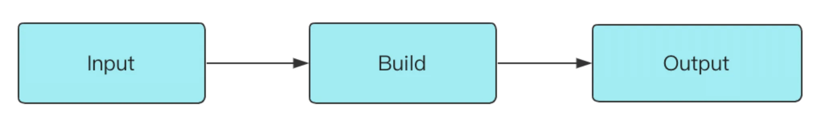
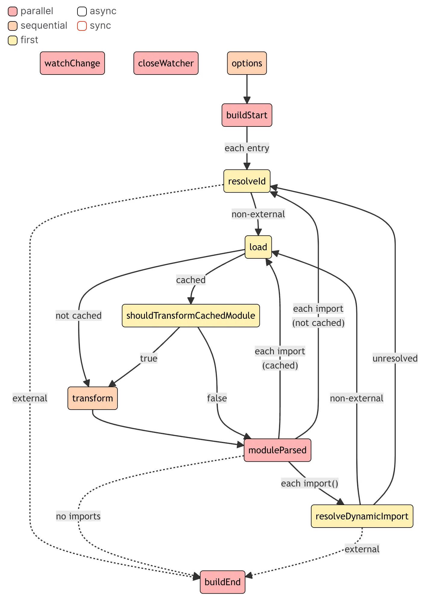
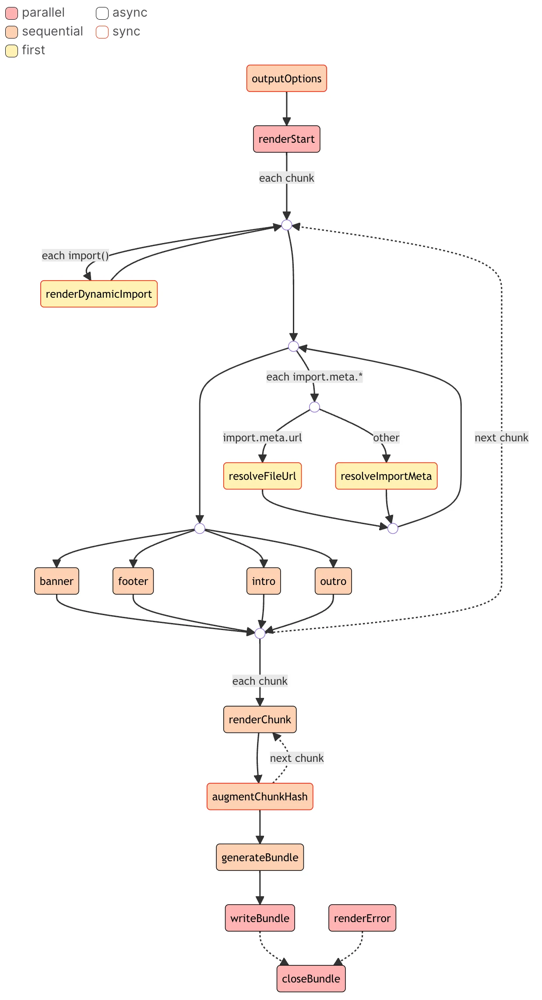
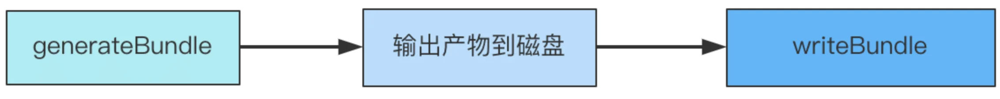
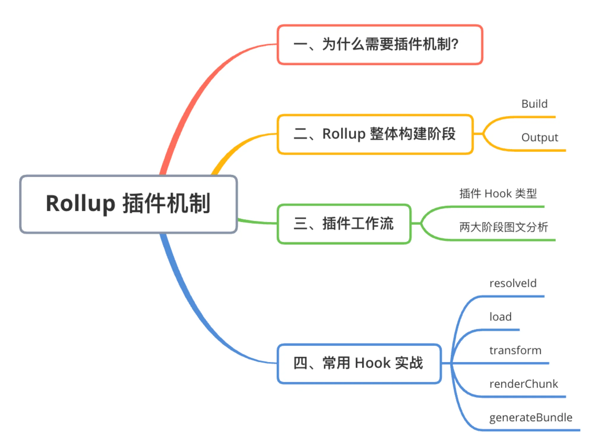

上一节我们学会了 Rollup 构建工具的使用，相信你已经对 Rollup 的基础概念和使用有了基本的掌握。同时我们也知道，仅仅使用 Rollup 内置的打包能力很难满足项目日益复杂的构建需求。对于一个真实的项目构建场景来说，我们还需要考虑到`模块打包`之外的问题，比如**路径别名(alias)** 、**全局变量注入**和**代码压缩**等等。

可要是把这些场景的处理逻辑与核心的打包逻辑都写到一起，一来打包器本身的代码会变得十分臃肿，二来也会对原有的核心代码产生一定的侵入性，混入很多与核心流程无关的代码，不易于后期的维护。因此 ，Rollup 设计出了一套完整的**插件机制**，将自身的核心逻辑与插件逻辑分离，让你能按需引入插件功能，提高了 Rollup 自身的可扩展性。

我个人也非常喜欢 Rollup 的插件机制，功能完备又简单易上手，体现了 Rollup 本身小而美的风格。那接下来，我会带你分析 Rollup 的插件机制，熟悉 Rollup 插件的完整构建阶段和工作流程，并且结合案例深入插件开发细节。

Rollup 的打包过程中，会定义一套完整的构建生命周期，从开始打包到产物输出，中途会经历一些**标志性的阶段**，并且在不同阶段会自动执行对应的插件钩子函数(Hook)。对 Rollup 插件来讲，最重要的部分是钩子函数，一方面它定义了插件的执行逻辑，也就是"做什么"；另一方面也声明了插件的作用阶段，即"什么时候做"，这与 Rollup 本身的构建生命周期息息相关。

因此，要真正理解插件的作用范围和阶段，首先需要了解 Rollup 整体的构建过程中到底做了些什么。


## Rollup 整体构建阶段

在执行 `rollup` 命令之后，在 cli 内部的主要逻辑简化如下:

```js {1,4,7}
// 1️⃣ Build 阶段
const bundle = await rollup.rollup(inputOptions)

// 2️⃣ Output 阶段
await Promise.all(outputOptions.map(bundle.write))

// 3️⃣ 构建结束
await bundle.close()
```

Rollup内部主要经历了 `Build` 和 `Output` 两大阶段：



首先，Build 阶段主要负责创建模块依赖图，初始化各个模块的 AST 以及模块之间的依赖关系。下面我们用一个简单的例子来感受一下:

```js
// src/index.js
import { a } from './module-a';
console.log(a);

// src/module-a.js
export const a = 1;
```

然后执行如下的构建脚本:

```js
import { rollup } from 'rollup'
import { inspect } from 'node:util'

async function build() {
  const bundle = await rollup({
    input: ['./src/index.js']
  })
  console.log(inspect(bundle))

}

build()

```

可以看到这样的 `bundle` 对象信息:

```js
{
  cache: {
     modules: [
      {
        ast: 'AST 节点信息，具体内容省略',
        code: 'export const a = 1;',
        dependencies: [],
        id: '/Users/code/rollup-demo/src/module-a.js',
        resolveIds: {},
        // 其它属性省略
      },
      {
        ast: 'AST 节点信息，具体内容省略',
        code: "import { a } from './module-a.js';\n\nconsole.log(a);",
        dependencies: [
          '/Users/code/rollup-demo/src/module-a.js'
        ],
        id: '/Users/code/rollup-demo/src/index.js',
        resolveIds: {
          './module-a.js': {
            assertions: {},
            external: false,
            id: '/Users/code/rollup-demo/src/module-a.js',
            meta: {},
            moduleSideEffects: true,
            resolvedBy: 'rollup',
            syntheticNamedExports: false
          },
        }
        // 其它属性省略
      }
    ],
    plugins: [Object: null prototype] {}
  },
  closed: false,
  // 挂载后续阶段会执行的方法
  close: [AsyncFunction: close],
  generate: [AsyncFunction: generate],
  write: [AsyncFunction: write]
  
  watchFiles: [
    '/Users/code/rollup-demo/src/index.js',
    '/Users/code/rollup-demo/src/module-a.js'
  ],
}
```

从上面的信息中可以看出，目前经过 Build 阶段的 `bundle` 对象其实并没有进行模块的打包，这个对象的作用在于存储各个模块的内容及依赖关系，同时暴露`generate`和`write`方法，以进入到后续的 `Output` 阶段（`write`和`generate`方法唯一的区别在于前者打包完产物会写入磁盘，而后者不会）。

所以，真正进行打包的过程会在 `Output` 阶段进行，即在`bundle`对象的 `generate`或者`write`方法中进行。还是以上面的 demo 为例，我们稍稍改动一下构建逻辑:

```js {7-9}
import { rollup } from 'rollup'

async function build() {
  const bundle = await rollup({
    input: ['./src/module-b.js']
  })
  const result = await bundle.generate({
    format: 'es'
  })
  console.log(result)
}

build()
```

执行后可以得到如下的输出:

```js
{
  output: [
    {
      exports: [],
      facadeModuleId: '/Users/code/rollup-demo/src/index.js',
      isDynamicEntry: false,
      isEntry: true,
      isImplicitEntry: false,
      moduleIds: [Array],
      name: 'index.js',
      type: 'chunk',
      dynamicImports: [],
      fileName: 'index.js',
      implicitlyLoadedBefore: [],
      importedBindings: {},
      imports: [],
      modules: [Object: null prototype],
      referencedFiles: [],
      code: 'const a = 1;\n\nconsole.log(a);\n',
      map: null
    }
  ]
```

这里可以看到所有的输出信息，生成的`output`数组即为打包完成的结果。当然，如果使用 `bundle.write` 会根据配置将最后的产物写入到指定的磁盘目录中。

因此，**对于一次完整的构建过程而言，** **Rollup** **会先进入到 Build 阶段，解析各模块的内容及依赖关系，然后进入**`Output`**阶段，完成打包及输出的过程**。对于不同的阶段，Rollup 插件会有不同的插件工作流程，接下来我们就来拆解一下 Rollup 插件在 `Build` 和 `Output` 两个阶段的详细工作流程。


## 拆解插件工作流


### 谈谈插件 Hook 类型

在具体讲述 Rollup 插件工作流之前，我想先给大家介绍一下不同插件 Hook 的类型，这些类型代表了不同插件的执行特点，是我们理解 Rollup 插件工作流的基础，因此有必要跟大家好好拆解一下。

通过上文的例子，相信你可以直观地理解 Rollup 两大构建阶段（`Build`和`Output`）各自的原理。可能你会有疑问，这两个阶段到底跟插件机制有什么关系呢？实际上，插件的各种 Hook 可以根据这两个构建阶段分为两类: `Build Hook` 与 `Output Hook`:

- `Build Hook`即在`Build`阶段执行的钩子函数，在这个阶段主要进行模块代码的转换、AST 解析以及模块依赖的解析，那么这个阶段的 Hook 对于代码的操作粒度一般为`模块`级别，也就是单文件级别
- `Ouput Hook`(官方称为`Output Generation Hook`)，则主要进行代码的打包，对于代码而言，操作粒度一般为 `chunk`级别(一个 chunk 通常指很多文件打包到一起的产物)

除了根据构建阶段可以将 Rollup 插件进行分类，根据不同的 Hook 执行方式也会有不同的分类，主要包括`Async`、`Sync`、`Parallel`、`Squential`、`First`这五种。在后文中我们将接触各种各样的插件 Hook，但无论哪个 Hook 都离不开这五种执行方式。


#### **1. Async & Sync**

首先是`Async`和`Sync`钩子函数，两者其实是相对的，分别代表`异步`和`同步`的钩子函数，两者最大的区别在于同步钩子里面不能有异步逻辑，而异步钩子可以有。


#### **2. Parallel**

这里指并行的钩子函数。如果有多个插件实现了这个钩子的逻辑，一旦有钩子函数是异步逻辑，则并发执行钩子函数，不会等待当前钩子完成(底层使用 `Promise.all`)。

比如对于`Build`阶段的`buildStart`钩子，它的执行时机其实是在构建刚开始的时候，各个插件可以在这个钩子当中做一些状态的初始化操作，但其实插件之间的操作并不是相互依赖的，也就是可以并发执行，从而提升构建性能。反之，对于需要**依赖其他插件处理结果**的情况就不适合用 `Parallel` 钩子了，比如 `transform`。


#### **3. Sequential**

**Sequential** 指串行的钩子函数。这种 Hook 往往适用于插件间处理结果相互依赖的情况，前一个插件 Hook 的返回值作为后续插件的入参，这种情况就需要等待前一个插件执行完 Hook，获得其执行结果，然后才能进行下一个插件相应 Hook 的调用，如`transform`。


#### **4. First**

如果有多个插件实现了这个 Hook，那么 Hook 将依次运行，直到返回一个非 `null` 或非 `undefined` 的值为止。比较典型的 Hook 是 `resolveId`，一旦有插件的 resolveId 返回了一个路径，将停止执行后续插件的 resolveId 逻辑。

刚刚我们介绍了 Rollup 当中不同插件 Hook 的类型，实际上不同的类型是可以叠加的，`Async`/`Sync` 可以搭配后面三种类型中的任意一种，比如一个 Hook既可以是 `Async` 也可以是 `First` 类型，接着我们将来具体分析 Rollup 当中的插件工作流程，里面会涉及到具体的一些 Hook，大家可以具体地感受一下。


### Build 阶段工作流

首先，我们来分析 Build 阶段的插件工作流程。对于 Build 阶段，插件 Hook 的调用流程如下图所示。流程图的最上面声明了不同 Hook 的类型，也就是我们在上面总结的 5 种 Hook 分类，每个方块代表了一个 Hook，边框的颜色可以表示`Async`和`Sync` 类型，方块的填充颜色可以表示`Parallel`、`Sequential` 和`First` 类型。



乍一看是不是感觉这张图非常复杂？没关系，接下来我会和你一步步分析 `Build Hooks` 的工作流程，你可以对照着图一起看:

1. 首先经历 `options` 钩子进行配置的转换，得到处理后的配置对象。
2. 随之 Rollup 会调用`buildStart`钩子，正式开始构建流程。
3. Rollup 先进入到 `resolveId` 钩子中解析文件路径。(从 `input` 配置指定的入口文件开始)。
4. Rollup 通过调用`load`钩子加载模块内容。
5. 紧接着 Rollup 执行所有的 `transform` 钩子来对模块内容进行进行自定义的转换，比如 babel 转译。
6. 现在 Rollup 拿到最后的模块内容，进行 AST 分析，得到所有的 import 内容，调用 `moduleParsed` 钩子:
   1. 如果是普通的 import，则执行 `resolveId` 钩子，继续回到步骤`3`。
   2. 如果是动态 import，则执行 `resolveDynamicImport` 钩子解析路径，如果解析成功，则回到步骤`4`加载模块，否则回到步骤`3`通过 `resolveId` 解析路径。
7. 直到所有的 import 都解析完毕，Rollup 执行`buildEnd`钩子，Build 阶段结束。

当然，在 Rollup 解析路径的时候，即执行`resolveId`或者`resolveDynamicImport`的时候，有些路径可能会被标记为`external`(翻译为`排除`)，也就是说不参加 Rollup 打包过程，这个时候就不会进行`load`、`transform`等等后续的处理了。

在流程图最上面，不知道大家有没有注意到`watchChange`和`closeWatcher`这两个 Hook，这里其实是对应了 rollup 的`watch`模式。当你使用 `rollup --watch` 指令或者在配置文件配有`watch: true`的属性时，代表开启了 Rollup 的`watch`打包模式，这个时候 Rollup 内部会初始化一个 `watcher` 对象，当文件内容发生变化时，watcher 对象会自动触发`watchChange`钩子执行并对项目进行重新构建。在当前**打包过程结束**时，Rollup 会自动清除 watcher 对象调用`closeWacher`钩子。


### Output 阶段工作流

好，接着我们来看看 Output 阶段的插件到底是如何来进行工作的。这个阶段的 Hook 相比于 Build 阶段稍微多一些，流程上也更加复杂。需要注意的是，其中会涉及的 Hook 函数比较多，可能会给你理解整个流程带来一些困扰，因此我会在 Hook 执行的阶段解释其大致的作用和意义，关于具体的使用大家可以去 Rollup 的官网自行查阅，毕竟这里的主线还是分析插件的执行流程，掺杂太多的使用细节反而不易于理解。下面我结合一张完整的插件流程图和你具体分析一下。



1. 执行所有插件的 `outputOptions` 钩子函数，对 `output` 配置进行转换。

2. 执行 `renderStart`，并发执行 renderStart 钩子，正式开始打包。

3. 并发执行所有插件的`banner`、`footer`、`intro`、`outro` 钩子(底层用 Promise.all 包裹所有的这四种钩子函数)，这四个钩子功能很简单，就是往打包产物的固定位置(比如头部和尾部)插入一些自定义的内容，比如协议声明内容、项目介绍等等。

4. 从入口模块开始扫描，针对动态 import 语句执行 `renderDynamicImport`钩子，来自定义动态 import 的内容。

5. 对每个即将生成的 `chunk`，执行 `augmentChunkHash`钩子，来决定是否更改 chunk 的哈希值，在 `watch` 模式下即可能会多次打包的场景下，这个钩子会比较适用。

6. 如果没有遇到 `import.meta` 语句，则进入下一步，否则:

   1. 对于 `import.meta.url` 语句调用 `resolveFileUrl` 来自定义 url 解析逻辑
   2. 对于其他`import.meta` 属性，则调用 `resolveImportMeta` 来进行自定义的解析。

7. 接着 Rollup 会生成所有 chunk 的内容，针对每个 chunk 会依次调用插件的`renderChunk`方法进行自定义操作，也就是说，在这里时候你可以直接操作打包产物了

8. 随后会调用 `generateBundle` 钩子，这个钩子的入参里面会包含所有的打包产物信息，包括 `chunk` (打包后的代码)、`asset`(最终的静态资源文件)。你可以在这里删除一些 chunk 或者 asset，最终这些内容将不会作为产物输出。

9. 前面提到了`rollup.rollup`方法会返回一个`bundle`对象，这个对象是包含`generate`和`write`两个方法，两个方法唯一的区别在于后者会将代码写入到磁盘中，同时会触发`writeBundle`钩子，传入所有的打包产物信息，包括 chunk 和 asset，和 `generateBundle`钩子非常相似。不过值得注意的是，这个钩子执行的时候，产物已经输出了，而 generateBundle 执行的时候产物还并没有输出。顺序如下图所示:

   

10. 当上述的`bundle`的`close`方法被调用时，会触发`closeBundle`钩子，到这里 Output 阶段正式结束。

::: warning

注意: 当打包过程中任何阶段出现错误，会触发 renderError 钩子，然后执行closeBundle钩子结束打包。

:::

到这里，我们终于梳理完了 Rollup 当中完整的插件工作流程，从一开始在**构建生命周期**中对两大构建阶段的感性认识，到现在**插件工作流**的具体分析，不禁感叹 Rollup 看似简单，实则内部细节繁杂。希望你能对照流程图好好复习几遍，彻底消化这部分的知识点，不仅仅能加深你对 Rollup 插件机制的理解，并且对 Rollup 本身打包原理的掌握也会更上一层楼。


## 常用 Hook 实战

读到这里你可能会说了：上面讲了那么多 Rollup 插件机制的内容，但真正要去写一个插件，感觉还是很困难啊。

这里我想要分享两个观点：首先是**二八定律**，也就是 20% 的 API 应对 80% 的场景，这放在 Rollup 当中仍然是适用的。经常使用到的 Hook 也并不多，况且 Rollup 插件的写法也非常简单，至少比 Webpack 插件要容易的多，因此掌握 Rollup 的插件开发难度并不大，这个大家放心。

其次，**学会模仿**也特别重要。尤其是刚开始什么经验都没有的时候，观察和模仿别人优秀的实现不失为一种高效的学习方法，慢慢地自己也会轻车熟路，成为一个经验丰富的老司机。

实际上开发 Rollup 插件就是在编写一个个 Hook 函数，你可以理解为一个 Rollup 插件基本就是各种 Hook 函数的组合。因此，接下来我会详细介绍一些常用的 Hook，并以一些官方的插件实现为例，从 Hook 的特性、应用场景、入参和返回值的意义及实现代码示例这几个角度带你掌握各种 Hook 实际的使用，如此一来，开发一个完整的插件对你来说想必也不在话下了。


### **路径解析: resolveId**

resolveId 钩子一般用来解析模块路径，为`Async + First`类型即`异步优先`的钩子。这里我们拿官方的 [alias 插件](https://github.com/rollup/plugins/blob/master/packages/alias/src/index.ts) 来说明，这个插件用法演示如下:

```js
// rollup.config.js
import alias from '@rollup/plugin-alias';

module.exports = {
  input: 'src/index.js',
  output: {
    dir: 'output',
    format: 'cjs'
  },
  plugins: [
    alias({
      entries: [
        // 将把 import xxx from 'module-a' 
        // 转换为 import xxx from './module-a'
        { find: 'module-a', replacement: './module-a.js' },
      ]
    })
  ]
};
```

插件的代码简化后如下:

```js
export default alias(options) {
  // 获取entries配置
  const entries = getEntries(options)
  return {
    // 传入三个参数，当前模块路径、引用当前模块的模块路径、其余参数
    resolveId(importee, importer, resolveOptions) {
      // 先检查能不能匹配别名规则
      const matchedEntry = entries.find(entry => matches(entry.find, importee))
      // 如果不能匹配替换规则，或者当前模块是入口模块，则不会继续后面的别名替换流程
      if (!matchedEntry || !importerId) {
        // 📚 return null 后，当前的模块路径会交给下一个插件处理
        return null
      }
      // 正式替换路径
      const updatedId = normalizeId(
        importee.replace(matchedEntry.find, matchedEntry.replacement)
      )
      // 📚 每个插件执行时都会绑定一个上下文对象作为 this
      // 这里的 this.resolve 会执行所有插件(除当前插件外)的 resolveId 钩子
      return this.resolve(
        updateId,
        importer,
        Object.assign({ skipSelf: true }, resolveOptions)
      ).then((resolved) => {
        // 替换后的路径即 updateId 会经过别的插件进行处理
        let finalResult: PartialResolvedId | null = resolved
        if (!finalResult) {
          // 如果其它插件没有处理这个路径，则直接返回 updateId
          finalResult = { id: updatedId }
        }
        return finalResult
      })
    }
  }
}
```

从这里你可以看到 resolveId 钩子函数的一些常用使用方式，它的入参分别是`当前模块路径`、`引用当前模块的模块路径`、`解析参数`，返回值可以是 null、string 或者一个对象，我们分情况讨论:

- 返回值为 null 时，会默认交给下一个插件的 resolveId 钩子处理
- 返回值为 string 时，则停止后续插件的处理。这里为了让替换后的路径能被其他插件处理，特意调用了 this.resolve 来交给其它插件处理，否则将不会进入到其它插件的处理
- 返回值为一个对象，也会停止后续插件的处理，不过这个对象就可以包含[更多的信息](https://rollupjs.org/plugin-development/#resolveid)了，包括解析后的路径、是否被 enternal、是否需要 tree-shaking 等等，不过大部分情况下返回一个 string 就够用了


### **load**

load 为`Async + First`类型，即**异步优先**的钩子，和`resolveId`类似。它的作用是通过 resolveId 解析后的路径来加载模块内容。这里，我们以官方的 [image 插件](https://github.com/rollup/plugins/blob/master/packages/image/src/index.js) 为例来介绍一下 load 钩子的使用。源码简化后如下所示:

```js
const mimeTypes = {
  '.jpg': 'image/jpeg',
  // 后面图片类型省略
};

export default function image(opts = {}) {
  const options = Object.assign({}, defaults, opts);
  return {
    name: 'image',
    load(id) {
      const mime = mimeTypes[extname(id)];
      if (!mime) {
        // 如果不是图片类型，返回 null，交给下一个插件处理
        return null;
      }
      // 加载图片具体内容
      const isSvg = mime === mimeTypes['.svg'];
      const format = isSvg ? 'utf-8' : 'base64';
      const source = readFileSync(id, format).replace(/[\r\n]+/gm, '');
      const dataUri = getDataUri({ format, isSvg, mime, source });
      const code = options.dom ? domTemplate({ dataUri }) : constTemplate({ dataUri });

      return code.trim();
    }
  };
}
```

从中可以看到，load 钩子的入参是模块 id，返回值一般是 null、string 或者一个对象：

- 如果返回值为 null，则交给下一个插件处理；
- 如果返回值为 string 或者对象，则终止后续插件的处理，如果是对象可以包含 SourceMap、AST 等[更详细的信息](https://rollupjs.org/plugin-development/#load)。


### **代码转换: transform**

`transform` 钩子也是非常常见的一个钩子函数，为`Async + Sequential`类型，也就是`异步串行`钩子，作用是对加载后的模块内容进行自定义的转换。我们以官方的 `replace` 插件为例，这个插件的使用方式如下:

```js
// rollup.config.js
import replace from '@rollup/plugin-replace';

module.exports = {
  input: 'src/index.js',
  output: {
    dir: 'output',
    format: 'cjs'
  },
  plugins: [
    // 将会把代码中所有的 __TEST__ 替换为 1
    replace({
      __TEST__: 1
    })
  ]
};
```

内部实现也并不复杂，主要通过字符串替换来实现，核心逻辑简化如下:

```js
import MagicString from 'magic-string';

export default function replace(options = {}) {
  return {
    name: 'replace',
    transform(code, id) {
      // 省略一些边界情况的处理
      // 执行代码替换的逻辑，并生成最后的代码和 SourceMap
      return executeReplacement(code, id);
    }
  }
}

function executeReplacement(code, id) {
  const magicString = new MagicString(code);
  // 通过 magicString.overwrite 方法实现字符串替换
  if (!codeHasReplacements(code, id, magicString)) {
    return null;
  }

  const result = { code: magicString.toString() };

  if (isSourceMapEnabled()) {
    result.map = magicString.generateMap({ hires: true });
  }

  // 返回一个带有 code 和 map 属性的对象
  return result;
}
```

[transform 钩子](https://rollupjs.org/plugin-development/#transform)的入参分别为`模块代码`、`模块 ID`，返回一个包含 `code`(代码内容) 和 `map`(SourceMap 内容) 属性的对象，当然也可以返回 null 来跳过当前插件的 transform 处理。需要注意的是，**当前插件返回的代码会作为下一个插件 transform 钩子的第一个入参**，实现类似于瀑布流的处理。


### **Chunk 级代码修改: renderChunk**

这里我们继续以`replace`插件举例，在这个插件中，也同样实现了 renderChunk 钩子函数:

```js {7}
export default function replace(options = {}) {
  return {
    name: 'replace',
    transform(code, id) {
      // transform 代码省略
    },
    renderChunk(code, chunk) {
      const id = chunk.fileName;
      // 省略一些边界情况的处理
      // 拿到 chunk 的代码及文件名，执行替换逻辑
      return executeReplacement(code, id);
    },
  }
}
```

可以看到这里 replace 插件为了替换结果更加准确，在 [renderChunk钩子](https://rollupjs.org/plugin-development/#renderchunk) 中又进行了一次替换，因为后续的插件仍然可能在 transform 中进行模块内容转换，进而可能出现符合替换规则的字符串。

这里我们把关注点放到 renderChunk 函数本身，可以看到有两个入参，分别为 `chunk 代码内容`、[chunk 元信息](https://rollupjs.org/plugin-development/#generatebundle)，返回值跟 `transform` 钩子类似，既可以返回包含 code 和 map 属性的对象，也可以通过返回 null 来跳过当前钩子的处理。


### **产物生成最后一步: generateBundle**

generateBundle 也是`异步串行`的钩子，你可以在这个钩子里面自定义删除一些无用的 chunk 或者静态资源，或者自己添加一些文件。这里我们以 Rollup 官方的`html`插件来具体说明，这个插件的作用是通过拿到 Rollup 打包后的资源来生成包含这些资源的 HTML 文件，源码简化后如下所示:

```typescript
export default function html(opts: RollupHtmlOptions = {}): Plugin {
  // 初始化配置
  return {
    name: 'html',
    async generateBundle(output: NormalizedOutputOptions, bundle: OutputBundle) {
      // 省略一些边界情况的处理
      // 1. 获取打包后的文件
      const files = getFiles(bundle);
      // 2. 组装 HTML，插入相应 meta、link 和 script 标签
      const source = await template({ attributes, bundle, files, meta, publicPath, title});
      // 3. 通过上下文对象的 emitFile 方法，输出 html 文件
      const htmlFile: EmittedAsset = {
        type: 'asset',
        source,
        name: 'Rollup HTML Asset',
        fileName
      };
      this.emitFile(htmlFile);
    }
  }
}
```

相信从插件的具体实现中，你也能感受到这个钩子的强大作用了。入参分别为`output 配置`、[所有打包产物的元信息对象](https://rollupjs.org/plugin-development/#generatebundle)，通过操作元信息对象你可以删除一些不需要的 chunk 或者静态资源，也可以通过插件上下文对象的`emitFile`方法输出自定义文件。

好，常用的 Rollup 钩子我们就先介绍到这里，相信这些知识点已经足够你应付大多数的构建场景了。顺便说一句，大家在后面的章节可以了解到，Vite 的插件机制也是基于 Rollup 来实现的，像上面介绍的这些常用钩子在 Vite 当中也随处可见，因此，掌握了这些常用钩子，也相当于给 Vite 插件的学习做下了很好的铺垫。


## 小结

好，到这里本篇的内容就结束了。在这篇文章中，我们首先认识到 Rollup 为了追求扩展性和可维护性，引入了插件机制，而后给你介绍了 Rollup 的 `Build` 和`Output` 两大构建阶段，接着给你详细地分析了两大构建阶段的插件工作流，最后通过几个实际的官方插件带你熟悉了一些常见的 Hook。



Rollup 的插件开发整体上是非常简洁和灵活的，总结为以下几个方面:

1. **插件逻辑集中管理**。各个阶段的 Hook 都可以放在一个插件中编写，比如上述两个 Webpack 的 Loader 和 Plugin 功能在 Rollup 只需要用一个插件，分别通过 transform 和 renderChunk 两个 Hook 来实现。
2. **插件 API 简洁，符合直觉**。Rollup 插件基本上只需要返回一个包含 name 和各种钩子函数的对象即可，也就是声明一个 name 属性，然后写几个钩子函数即可。
3. **插件间的互相调用**。比如刚刚介绍的`alias`插件，可以通过插件上下文对象的`resolve`方法，继续调用其它插件的 `resolveId`钩子，类似的还有`load`方法，这就大大增加了插件的灵活性。

现在，相信你已经从宏观到细节上，已经对 Rollup 插件有了全面的掌握，为接下来的 Vite 学习打下了坚实的基础。如果你还没有完全掌握，不用着急，这部分的内容本身有点难度，希望你能回头复习几遍，相信你一定能彻底拿下这些内容。大家加油吧！


参考链接：

- [Rollup官网 Plugin开发](https://rollupjs.org/plugin-development/#plugins-overview)


2023年02月16日11:30:38
