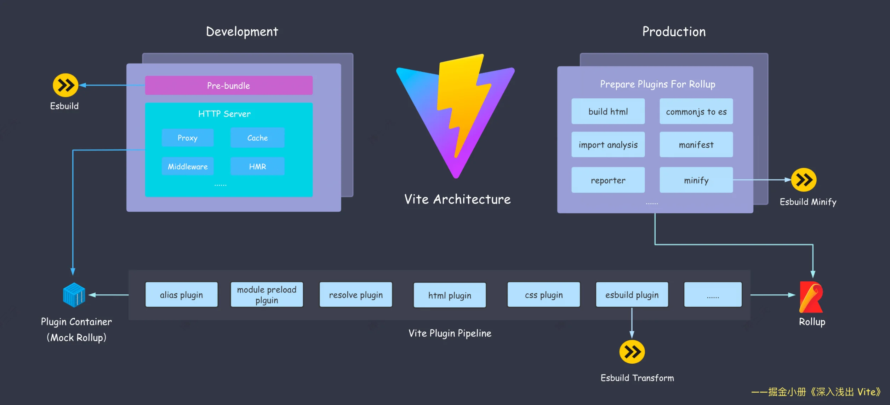
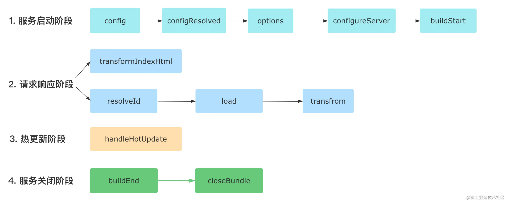
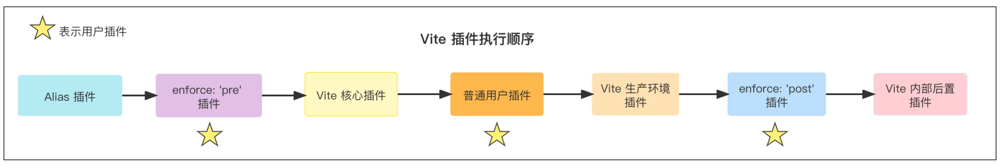
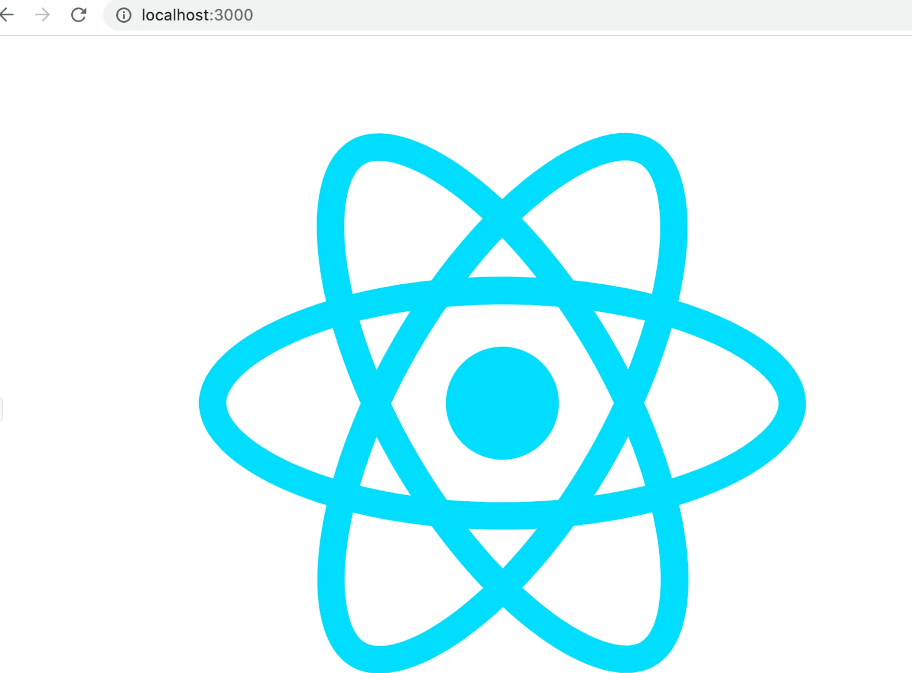
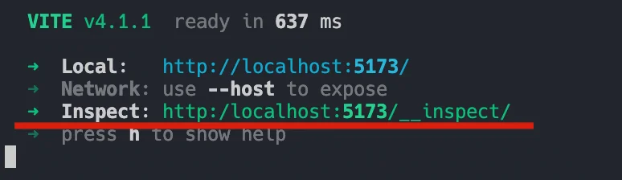
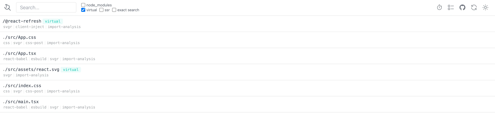
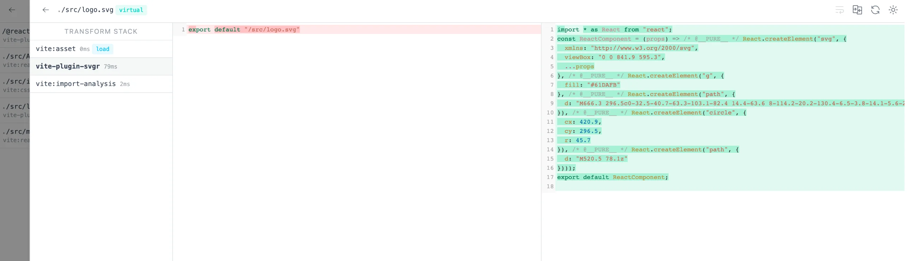

前面的几个小节，我们从 Vite 双引擎的角度了解了 Vite 的整体架构，也系统学了双引擎本身的基础知识。从本小节开始，我们正式学习 **Vite 高级应用**。

这一模块中，我们将深入应用 Vite 的各项高级能力，遇到更多有挑战的开发场景。你不仅能学会一系列有难度的**解决方案**，直接运用到实际项目中，还能系统提高自己的**知识深度**，体会复杂项目场景中构建工具如何提供高度自定义的能力，以及如何对项目进行性能优化。

说到自定义的能力，你肯定很容易想到`插件机制`，利用一个个插件来扩展构建工具自身的能力。没错，这一节中我们将系统学习 Vite 的插件机制，带你掌握 Vite 插件开发的基本知识以及实战开发技巧。

虽然 Vite 的插件机制是基于 Rollup 来设计的，并且上一小节我们也已经对 Rollup 的插件机制进行了详细的解读，但实际上 Vite 的插件机制也包含了自己独有的一部分，与 Rollup 的各个插件 Hook 并非完全兼容，因此本节我们将重点关注 Vite 独有的部分以及和 Rollup 所区别的部分，而对于 Vite 和 Rollup 中相同的 Hook (如`resolveId`、`load`、`transform`)只是稍微提及，就不再展开赘述了。

让我们先从一个简单的例子入手吧！


## 一个简单的插件示例

Vite 插件与 Rollup 插件结构类似，为一个`name`和各种插件 Hook 的对象:

```js
{
  // 插件名
  name: 'vite-plugin-xxx',
  load(code) {
    // 钩子逻辑
  },
}
```

::: tip

如果插件是一个 npm 包，在`package.json`中的包命名也推荐以`vite-plugin`开头

:::

一般情况下因为要考虑到外部传参，我们不会直接写一个对象，而是实现一个返回插件对象的`工厂函数`，如下代码所示:

```js
// myPlugin.js
export function myVitePlugin(options) {
  console.log(options)
  return {
    name: 'vite-plugin-xxx',
    load(id) {
      // 在钩子逻辑中可以通过闭包访问外部的 options 传参
    }
  }
}

// 使用方式
// vite.config.ts
import { myVitePlugin } from './myVitePlugin';
export default {
  plugins: [myVitePlugin({ /* 给插件传参 */ })]
}
```


# 插件 Hook 介绍


## 1. 通用 Hook

在[双引擎架构](./8)这一节中介绍过，Vite **开发阶段**会模拟 Rollup 的行为:



其中 Vite 会调用一系列与 Rollup 兼容的钩子，这个钩子主要分为三个阶段:

1. **服务器启动阶段**: `options`和`buildStart`钩子会在服务启动时被调用。
2. **请求响应阶段**: 当浏览器发起请求时，Vite 内部依次调用`resolveId`、`load`和`transform`钩子。
3. **服务器关闭阶段**: Vite 会依次执行`buildEnd`和`closeBundle`钩子。

除了以上钩子，其他 Rollup 插件钩子(如`moduleParsed`、`renderChunk`)均不会在 Vite **开发阶段**调用。而生产环境下，由于 Vite 直接使用 Rollup，Vite 插件中所有 Rollup 的插件钩子都会生效。


## 2. 独有 Hook

接下来给大家介绍 Vite 中特有的一些 Hook，这些 Hook 只会在 Vite 内部调用，而放到 Rollup 中会被直接忽略。


### 2.1 给配置再加点料: config

Vite 在读取完配置文件（即`vite.config.ts`）之后，会拿到用户导出的配置对象，然后执行 `config` 钩子。在这个钩子里面，你可以对配置文件导出的对象进行自定义的操作，如下代码所示:

```js
// 返回部分配置（推荐）
const editConfigPlugin = () => ({
  name: 'vite-plugin-modify-config',
  config: () => ({
    alias: {
      react: require.resolve('react')
    }
  })
})
```

官方推荐的姿势是在 config 钩子中返回一个配置对象，这个配置对象会和 Vite 已有的配置进行深度的合并。不过你也可以通过钩子的入参拿到 config 对象进行自定义的修改，如下代码所示:

```js {3}
const mutateConfigPlugin = () => ({
  name: 'mutate-config',
  // 💡command 为 `serve`(开发环境) 或者 `build`(生产环境)
  config(config, { command }) {
    // 生产环境中修改 root 参数
    if (command === 'build') {
      config.root = __dirname
    }
  }
})
```

在一些比较深层的对象配置中，这种直接修改配置的方式会显得比较麻烦，如 `optimizeDeps.esbuildOptions.plugins`，需要写很多的样板代码，类似下面这样:
```js
// 防止出现 undefined 的情况
config.optimizeDeps = config.optimizeDeps || {}
config.optimizeDeps.esbuildOptions = config.optimizeDeps.esbuildOptions || {}
config.optimizeDeps.esbuildOptions.plugins = config.optimizeDeps.esbuildOptions.plugins || []
```

因此这种情况下，建议直接返回一个配置对象，这样会方便很多:

```js
config() {
  return {
    optimizeDeps: {
      esbuildOptions: {
        plugins: []
      }
    }
  }
}
```

### 2.2 记录最终配置: configResolved

Vite 在解析完配置之后会调用`configResolved`钩子，这个钩子一般用来记录最终的配置信息，而不建议再修改配置，用法如下图所示:

```js {10}
const examplePlugin = () => {
  let config
  
  return {
    name: 'read-config',
    configResolved(resolvedConfig) {
      // 记录最终配置
      config = resolvedConfig
    },
    // 在其他钩子中可以访问到配置 😎
    transform(code, id) {
      console.log(config)
    }
  }
}
```


### 2.3 获取 Dev Server 实例: configureServer

这个钩子仅在 `开发阶段` 会被调用，用于扩展 Vite 的 Dev Server，一般用于增加自定义 server 中间件，如下代码所示:

```js {4,8}
const myPlugin = () => ({
  name: 'configure-server',
  configureServer(server) {
    // 姿势 1: 在 Vite 内置中间件之前执行
    server.middlewares.use((req, res, next) => {
      // 自定义请求处理逻辑
    })
    // 姿势 2: 在 Vite 内置中间件之后执行 
    return () => {
      server.middlewares.use((req, res, next) => {
        // 自定义请求处理逻辑
      })
    }
  }
})
```

### 2.4 转换 HTML 内容: transformIndexHtml

这个钩子用来灵活控制 HTML 的内容，你可以拿到原始的 html 内容后进行任意的转换:

```js {4,23}
const htmlPlugin = () => {
  return {
    name: 'html-transform',
    transformIndexHtml(html) {
      return html.replace(
        /<title>(.*?)<\/title>/,
        `<title>换了个标题</title>`
      )
    }
  }
}

// 也可以返回如下的对象结构，一般用于添加某些标签
const htmlPlugin = () => {
  return {
    name: 'html-transform',
    transformIndexHtml(html) {
      return {
        html,
        // 注入标签
        tags: [
          {
            // 放到 body 末尾，可取值还有`head`|`head-prepend`|`body-prepend`，顾名思义
            injectTo: 'body',
            // 标签属性定义
            attrs: { type: 'module', src: './index.ts' },
            // 标签名
            tag: 'script',
          }
        ]
      }
    }
  }
}
```


### 2.5 热更新处理: handleHotUpdate

::: info

关于热更新的概念和原理，我们会在下一节具体讲解。

:::

这个钩子会在 Vite 服务端处理热更新时被调用，你可以在这个钩子中拿到热更新相关的上下文信息，进行热更模块的过滤，或者进行自定义的热更处理。下面是一个简单的例子:

```js {14,25}
const handleHmrPlugin = () => {
  return {
    async handleHotUpdate(ctx) {
      // 需要热更的文件
      console.log(ctx.file)
      // 需要热更的模块，如一个 Vue 单文件会涉及多个模块
      console.log(ctx.modules)
      // 时间戳
      console.log(ctx.timestamp)
      // Vite Dev Server 实例
      console.log(ctx.server)
      // 读取最新的文件内容
      console.log(await read())
      // 自行处理 HMR 事件
      ctx.server.ws.send({
        type: 'custom',
        event: 'special-update',
        data: { a: 1 }
      })
      return []
    }
  }
}

// 前端代码中加入
if (import.meta.hot) {
  import.meta.hot.on('special-update', (data) => {
    // 执行自定义更新
    // { a: 1 }
    console.log(data)
    window.location.reload()
  })
}
```

::: tip 👩‍🏫

以上就是 Vite 独有的五个钩子，我们来重新梳理一下:

1. `config`: 用来进一步修改配置。
2. `configResolved`: 用来记录最终的配置信息。
3. `configureServer`: 用来获取 Vite Dev Server 实例，添加中间件。
4. `transformIndexHtml`: 用来转换 HTML 的内容。
5. `handleHotUpdate`: 用来进行热更新模块的过滤，或者进行自定义的热更新处理。

:::


## 3. 插件 Hook 执行顺序

好，现在我们学习到了 Vite 的通用钩子和独有钩子，估计你现在脑子里面一点乱: 这么多的钩子，到底谁先执行、谁后执行呢？

下面，我们就来复盘一下上述的两类钩子，并且通过一个具体的代码示例来汇总一下所有的钩子。我们可以在 Vite 的脚手架工程中新建 `test-hooks-plugin.ts`:

::: code-group

``` typescript [test-hooks-plugin.ts]
// 注: 请求响应阶段的钩子
// 如 resolveId, load, transform, transformIndexHtml在下文介绍
// 以下为服务启动和关闭的钩子
export default function testHookPlugin () {
  return {
    name: 'test-hooks-plugin', 
    // Vite 独有钩子
    config(config) {
      console.log('config');
    },
    // Vite 独有钩子
    configResolved(resolvedCofnig) {
      console.log('configResolved');
    },
    // 通用钩子
    options(opts) {
      console.log('options');
      return opts;
    },
    // Vite 独有钩子
    configureServer(server) {
      console.log('configureServer');
      setTimeout(() => {
        // 手动退出进程
        process.kill(process.pid, 'SIGTERM');
      }, 3000)
    },
    // 通用钩子
    buildStart() {
      console.log('buildStart');
    },
    // 通用钩子
    buildEnd() {
      console.log('buildEnd');
    },
    // 通用钩子
    closeBundle() {
      console.log('closeBundle');
    }
}
```

``` js [vite.config.js]
import { defineConfig } from 'vite'
import testHooksPlugin from './test-hooks-plugin.js'

export default defineConfig({
  plugins: [testHooksPlugin()]
})
```

:::

将插件加入到 Vite 配置文件中，然后启动，你可以观察到各个 Hook 的执行顺序:


由此我们可以梳理出 Vite 插件的执行顺序:



1. 服务启动阶段: `config`、`configResolved`、`options`、`configureServer`、`buildStart`
2. 请求响应阶段: 如果是 `html` 文件，仅执行`transformIndexHtml`钩子；对于非 HTML 文件，则依次执行`resolveId`、`load`和`transform`钩子。相信大家学过 Rollup 的插件机制，已经对这三个钩子比较熟悉了。
3. 热更新阶段: 执行`handleHotUpdate`钩子。
4. 服务关闭阶段: 依次执行`buildEnd`和`closeBundle`钩子。


## 插件应用位置

梳理完 Vite 的各个钩子函数之后，接下来让我们来了解一下 Vite 插件的**应用情景**和**应用顺序**。

默认情况下 Vite 插件同时被用于开发环境和生产环境，你可以通过 [apply](https://cn.vitejs.dev/guide/api-plugin.html#conditional-application) 属性来决定应用场景:

```js {2}
{
  // 📚 'serve' 表示仅用于开发环境，'build'表示仅用于生产环境
  apply: 'serve'
}
```

`apply`参数还可以配置成一个函数，进行更灵活的控制:

```js
apply(config, { command }) {
  // 只用于非 SSR 情况下的生产环境构建
  return command === 'build' && !config.build.ssr
}
```

同时，你也可以通过 [enforce](https://cn.vitejs.dev/guide/api-plugin.html#plugin-ordering) 属性来指定插件的执行顺序:

``` js
{
  // 默认为`normal`，可取值还有`pre`和`post`
  enforce: 'pre'
}
```

Vite 中插件的执行顺序如下图所示:



Vite 会依次执行如下的插件:

1. Alias (路径别名)相关的插件。
2. ⭐️ 带有 `enforce: 'pre'` 的用户插件。
3. Vite 核心插件。
4. ⭐️ 没有 enforce 值的用户插件，也叫`普通插件`。
5. Vite 生产环境构建用的插件。
6. ⭐️ 带有 `enforce: 'post'` 的用户插件。
7. Vite 后置构建插件(如压缩插件)。


## 插件开发实战

接下来我们进入插件开发的实战环节中，在这个部分我们将一起编写两个 Vite 插件，分别是`虚拟模块加载插件`和`Svgr 插件`，你将学会从插件开发的常见套路和各种开发技巧。话不多说，让我们现在开始实战吧。


### 实战案例 1: 虚拟模块加载

首先我们来实现一个虚拟模块的加载插件，可能你会有疑问: 什么是虚拟模块呢？

作为构建工具，一般需要处理两种形式的模块，一种存在于真实的磁盘文件系统中，另一种并不在磁盘而在内存当中，也就是`虚拟模块`。通过虚拟模块，我们既可以把自己手写的一些代码字符串作为单独的模块内容，又可以将内存中某些经过计算得出的**变量**作为模块内容进行加载，非常灵活和方便。接下来让我们通过一些具体的例子来实操一下，首先通过脚手架命令初始化一个`react + ts`项目:

::: code-group

```typescript [plugins/virtual-module.ts] {6}
import { Plugin, ResolvedConfig } from 'vite';

// 虚拟模块名称
const virtualFibModuleId = 'virtual:fib';
// Vite 中约定对于虚拟模块，解析后的路径需要加上`\0`前缀
const resolvedFibVirtualModuleId = '\0' + virtualFibModuleId;

export default function virtualFibModulePlugin(): Plugin {
  let config: ResolvedConfig | null = null;
  return {
    name: 'vite-plugin-virtual-module',
    resolveId(id) {
      if (id === virtualFibModuleId) { 
        return resolvedFibVirtualModuleId;
      }
    },
    load(id) {
      // 加载虚拟模块
      if (id === resolvedFibVirtualModuleId) {
        return 'export default function fib(n) { return n <= 1 ? n : fib(n - 1) + fib(n - 2); }';
      }
    }
  }
}
```

:::

接着我们在项目中来使用这个插件:

```typescript
// vite.config.ts
import virtual from './plugins/virtual-module.ts'

// 配置插件
{
  plugins: [react(), virtual()]
}
```

然后在`main.tsx`中加入如下的代码:

```js {1}
import fib from 'virtual:fib';

alert(`结果: ${fib(10)}`)
```

这里我们使用了 `virtual:fib` 这个虚拟模块，虽然这个模块不存在真实的文件系统中，但你打开浏览器后可以发现这个模块导出的函数是可以正常执行的:


接着我们来尝试一下如何通过虚拟模块来读取内存中的变量，在`virtual-module.ts`中增加如下代码:

::: code-group

``` typescript [plugins/virtual-module.ts]
import { Plugin, ResolvedConfig } from 'vite'

const virtualFibModuleId = 'virtual:fib'
const resolvedFibVirtualModuleId = '\0' + virtualFibModuleId

const virtualEnvModuleId = 'virtual:env' // [!code ++]
const resolvedEnvVirtualModuleId = '\0' + virtualEnvModuleId // [!code ++]

export default function virtualFibModulePlugin(): Plugin {
  let config: ResolvedConfig | null = null
  return {
    name: 'vite-plugin-virtual-module',
    configResolved(c: ResolvedConfig) { // [!code ++]
      config = c // [!code ++]
    }, // [!code ++]
    resolveId(id) {
      if (id === virtualFibModuleId) {
        return resolvedFibVirtualModuleId
      }
      if (id === virtualEnvModuleId) { // [!code ++]
        return resolvedEnvVirtualModuleId // [!code ++]
      } // [!code ++]
    },
    load(id) {
      if (id === resolvedFibVirtualModuleId) {
        return 'export default function fib(n) { return n <= 1 ? n : fib(n - 1) + fib(n - 2);}'
      }

      if (id === resolvedEnvVirtualModuleId) { // [!code ++]
        return `export default ${JSON.stringify(config!.env)}` // [!code ++]
      } // [!code ++]
    }
  }
}
```

:::

在新增的这些代码中，我们注册了一个新的虚拟模块`virtual:env`，紧接着我们去项目去使用:

``` tsx
// main.tsx
import env from 'virtual:env';
console.log(env)
```

`virtual:env`一般情况下会有类型问题，我们需要增加一个类型声明文件来声明这个模块:

``` typescript
// types/shim.d.ts
declare module 'virtual:*' {
  export default any;
}
```

并在 `tsconfig.json` 中添加 `types`:

```json
{
  "include": ["src", "types/*"],
}
```

这样就解决了类型报错的问题。接着你可以去浏览器观察一下输出的情况:


Vite 环境变量能正确地在浏览器中打印出来，说明在内存中计算出来的`virtual:env`模块的确被成功地加载了。从中你可以看到，虚拟模块的内容完全能够被动态计算出来，因此它的灵活性和可定制程度非常高，实用性也很强，在 Vite 内部的插件被深度地使用，社区当中也有不少知名的插件(如 `vite-plugin-windicss`、`vite-plugin-svg-icons`等)也使用了虚拟模块的技术。


### 实战案例 2: Svg 组件形式加载

在一般的项目开发过程中，我们有时候希望能将 svg 当做一个组件来引入，这样我们可以很方便地修改 svg 的各种属性，相比于`img`标签的引入方式也更加优雅。但 Vite 本身并不支持将 svg 转换为组件的代码，需要我们通过插件来实现。

接下来我们就来写一个 Vite 插件，实现在 React 项目能够通过组件方式来使用 svg 资源。首先安装一下需要的依赖:

```bash
pnpm i resolve @svgr/core -D
```

接着在`plugins`目录新建 `svgr.ts`:

::: code-group

```typescript [plugins/svgr.ts]
import { Plugin } from 'vite';
import * as fs from 'fs';
import * as resolve from 'resolve';

interface SvgrOptions {
  // svg 资源模块默认导出，url 或者组件
  defaultExport: 'url' | 'component';
}

export default function viteSvgrPlugin(options: SvgrOptions) {
  const { defaultExport='url' } = options;
  return {
    name: 'vite-plugin-svgr',
    async transform(code ,id) {
      // 转换逻辑: svg -> React 组件
    }
  }
}
```

:::

让我们先来梳理一下开发需求，用户通过传入`defaultExport`可以控制 svg 资源的默认导出:

1. 当 `defaultExport`为 `component`，默认当做组件来使用，即:

   ```tsx
   import Logo from './Logo.svg'
   
   // 在组件中直接使用
   <Logo />
   ```

2. 当`defaultExports`为`url`，默认当做 url 使用，如果需要用作组件，可以通过`具名导入`的方式来支持:

   ```tsx
   import logoUrl, { ReactComponent as Logo } from './logo.svg';
   
   // url 使用
   
   // 组件方式使用
   <Logo />
   ```

明确了需求之后，接下来让我们来整理一下插件开发的整体思路，主要逻辑在 `transform`钩子中完成，流程如下:

1. 根据 `id` 入参过滤出 svg 资源；
2. 读取 svg 文件内容；
3. 利用 `@svgr/core` 将 svg 转换为 React 组件代码;
4. 处理默认导出为 url 的情况；
5. 将组件的 jsx 代码转译为浏览器可运行的代码。

下面是插件的完整的代码，你可以参考学习:

::: code-group

``` typescript [plugins/svgr.ts]
import { Plugin } from 'vite'
import * as fs from 'node:fs'
import resolveSync from 'resolve/sync'
import { transform as svgrTransform } from '@svgr/core'

import { createRequire } from "node:module";
// 模拟commonjs require
const require = createRequire(import.meta.url);


interface SvgrOptions {
  defaultExport : 'url' | 'component'
}

export default function viteSvgrPlugin(options: SvgrOptions): Plugin {
  const { defaultExport = 'component' } = options

  return {
    name: 'vite-plugin-svgr',
    async transform(code, id) {
      // 1. 根据 id 入参过滤出 svg 资源；
      if (!id.endsWith('.svg')) {
        return code
      }
      // const svgrTransform = require('@svgr/core').transform
      // 解析 esbuild 的路径，后续转译 jsx 会用到，我们这里直接拿 vite 中的 esbuild 即可
      // requrie.resolve() 表示使用commonjs resolve算法
      const esbuildPackagePath = resolveSync('esbuild', { basedir: require.resolve('vite')})
      const esbuild = require(esbuildPackagePath)
      // 2. 读取 svg 文件内容；
      const svg = await fs.promises.readFile(id, 'utf8')
      // 3. 利用 `@svgr/core` 将 svg 转换为 React 组件代码
      const svgrResult = await svgrTransform(svg, {}, { componentName: 'ReactComponent' })
      // 4. 处理默认导出为 url 的情况
      let componentCode = svgrResult
      if (defaultExport === 'url') {
        // 加上 Vite 默认的 `export default 资源路径`
        componentCode += code
        componentCode = svgrResult.replace('export default ReactComponent', 'export { ReactComponent }');
      }

      // 5. 利用 esbuild，将组件中的 jsx 代码转译为浏览器可运行的代码;
      const result = await esbuild.transform(componentCode, {
        loader: 'jsx'
      })

      return {
        code: result.code,
        map: null // TODO
      }
    }
  }
}
```

:::


::: warning

上面代码和原小册代码有所不同，原代码在esm模块下无法运行

:::


接下来让我们在项目中使用这个插件:

```js
import svgr from './plugins/svgr';

// 返回的配置
{
  plugins: [
    // 省略其它插件
    svgr()
  ]
}
```

接着我们在项目中用组件的方式引入 svg:

```tsx
import Logo from './assets/react.svg'

function App() {
  return (
    <>
      <Logo />
    </>
  )
}

export default App;
```

打开浏览器，可以看到组件已经正常显示:




## 调试技巧

另外，在开发调试插件的过程，我推荐大家在本地装上 [vite-plugin-inspect](https://github.com/antfu/vite-plugin-inspect) 插件，并在 Vite 中使用它:

```typescript
// vite.config.ts
import inspect from 'vite-plugin-inspect';

// 返回的配置
{
  plugins: [
    // 省略其它插件
    inspect()
  ]
}
```

这样当你再次启动项目时，会发现多出一个调试地址:



你可以通过这个地址来查看项目中各个模块的编译结果：



点击特定的文件后，你可以看到这个模块经过各个插件处理后的中间结果，如下图所示:



通过这个面板，我们可以很清楚地看到相应模块经过插件处理后变成了什么样子，让插件的调试更加方便。


## 小结

好，本节的内容到这里就接近尾声了。本节你需要重点掌握 Vite **插件钩子的含义**、**作用顺序**以及**插件的实战开发**。

首先我通过一个最简单的示例让你对 Vite 插件的结构有了初步的印象，然后对 Vite 中的各种钩子函数进行了介绍，主要包括`通用钩子`和`独有钩子`，通用钩子与 Rollup 兼容，而独有钩子在 Rollup 中会被忽略。而由于上一节已经详细介绍了 Rollup 的插件机制，对于通用钩子我们没有继续展开，而是详细介绍了 5 个独有钩子，分别是: `config`、`configResolved`、`configureServer`、`transformIndexHtml`和`handleHotUpdate`。不仅如此，我还给你从宏观角度分析了 Vite 插件的作用场景和作用顺序，你可以分别通过`apply`和`enforce`两个参数来进行手动的控制。

接下来我们正式进入插件开发实战的环节，实现了`虚拟模块加载插件`和`Svg 组件加载插件`，相信你已经对虚拟模块的概念和使用有了直观的了解，也能通过后者的开发过程了解到如何在 Vite 中集成其它的前端编译工具。总体来说，Vite 插件的设计秉承了 Rollup 的插件设计理念，通过一个个语义化的 Hook 来组织，十分简洁和灵活，上手难度并不大，但真正难的地方在于如何利用 Vite 插件去解决实际开发过程的问题，由于篇幅所限，本文的示例并不能覆盖所有的开发场景，你也不必着急，我们会在后面的几个小节中接触到更加高级的开发场景，你也将接触过越来越多的插件，当然，你的插件开发技能也能越来越纯熟。大家继续加油💪🏻！


相关链接：

- [Vite官网插件API](https://cn.vitejs.dev/guide/api-plugin.html)
- [awesome-vite插件](https://github.com/vitejs/awesome-vite#plugins)


2023年02月17日12:43:17

