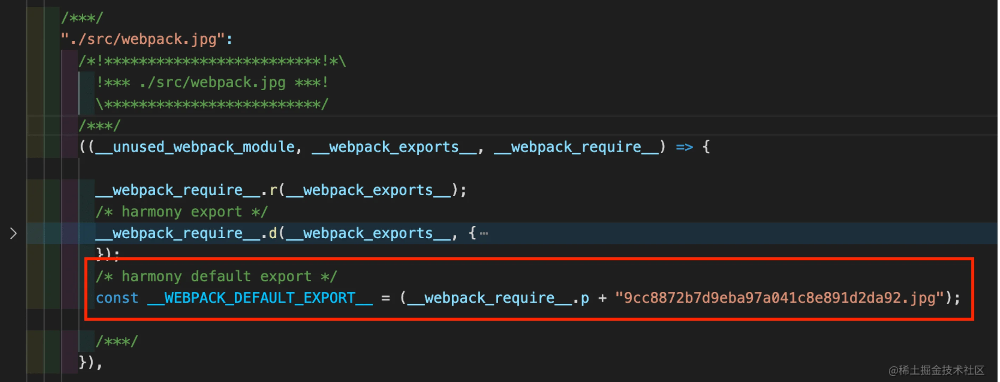
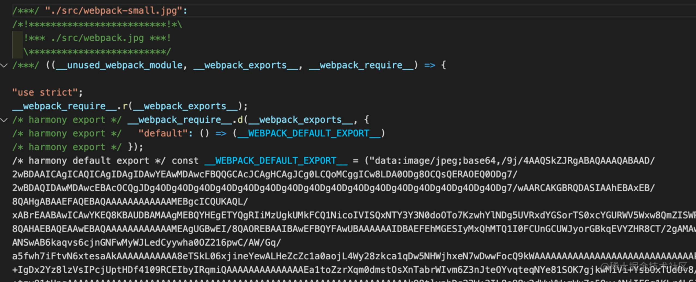
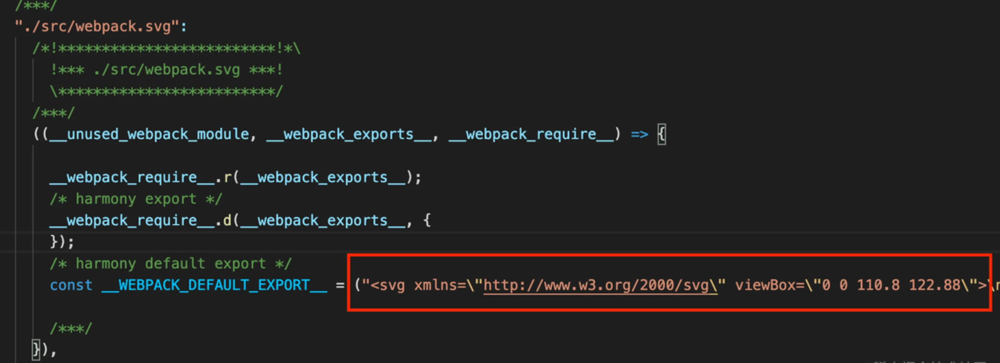
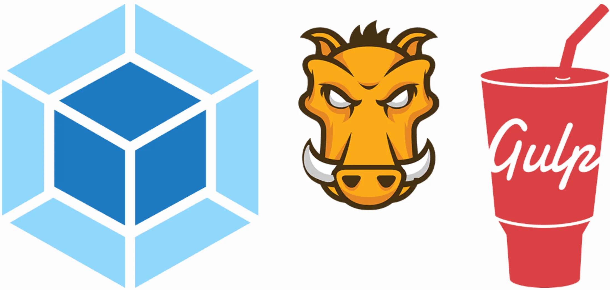
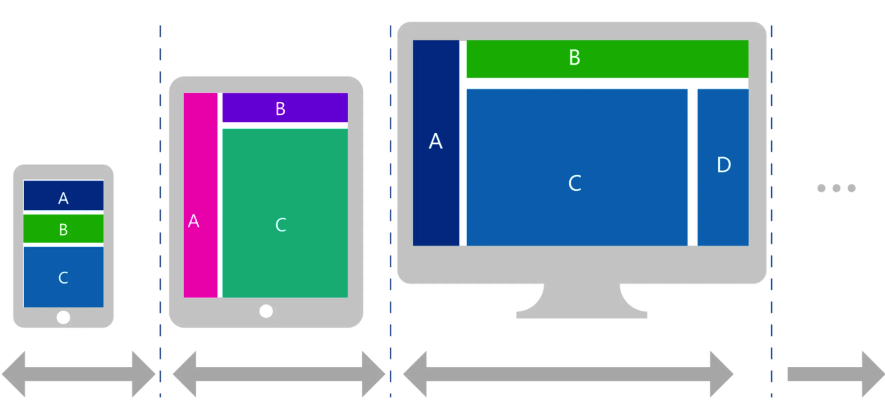

图形图åƒèµ„æºæ˜¯å½“代 Web 应用的最常用ã€å®æƒ çš„内容ã€è£…饰元素之一，但在 Webpack 出ç°ä¹‹å‰å¯¹å›¾åƒèµ„æºçš„处ç†å¤æ‚度特别高，需è¦å€ŸåŠ©ä¸€ç³»åˆ—工具(甚至 PhotoShop)完æˆå‹ç¼©ã€é›ªç¢§å›¾ã€hashã€éƒ¨ç½²ç­‰æ“作。

而在 Webpack 中，图åƒä»¥åŠå…¶å®ƒå¤šåª’体资æºéƒ½è¢«æå‡ä¸ºä¸€ç­‰å…¬æ°‘ —— 能够åƒå¼•ç”¨æ™®é€š JavaScript 模å—一样通过 `import/require` 语å¥å¯¼å…¥èµ„æºæ¨¡å—，这ç§å¼€å‘模å¼å…许我们将图åƒç›¸å…³çš„处ç†åˆå…¥ç»Ÿä¸€çš„心智模å‹ä¸­ï¼Œæå‡å¼€å‘效ç‡ã€‚

æœ¬æ–‡å°†é›†ä¸­ä»‹ç» Webpack 体系下处ç†å›¾åƒèµ„æºçš„常è§æ–¹æ³•ï¼ŒåŒ…括：

- 如何使用适当的 Loader 处ç†å›¾åƒèµ„æºï¼›
- 如何借助 Loader 或æ’件å®ç°å›¾åƒä¼˜åŒ–，包括å‹ç¼©ã€é›ªç¢§å›¾ã€å“应å¼å›¾ç‰‡ã€‚


## 在 Webpack 4 中导入图åƒ

åŸç”Ÿ Webpack 4 åªèƒ½å¤„ç†æ ‡å‡† JavaScript 模å—，因此需è¦å€ŸåŠ© Loader —— 例如 `file-loader`ã€`url-loader`ã€`raw-loader` 等完æˆå›¾åƒåŠ è½½æ“作，å®è·µä¸­æˆ‘们通常需è¦æŒ‰èµ„æºç±»å‹é€‰æ‹©é€‚当加载器，简å•ä»‹ç»


### file-loader

[file-loader](https://v4.webpack.js.org/loaders/file-loader/)：将图åƒå¼•ç”¨è½¬æ¢ä¸º url 语å¥å¹¶ç”Ÿæˆç›¸åº”图片文件，例如使用如下é…置：

::: code-group

``` js [webpack.config.js]
module.exports = {
  // ...
  module: {
    rules: [
      {
        test: /\.(png|jpe?g)$/,
        use: ['file-loader']
      }
    ]
  }
}
```

:::

ç»è¿‡ `file-loader` 处ç†å，åŸå§‹å›¾ç‰‡ä¼šè¢«é‡å‘½å并å¤åˆ¶åˆ°äº§ç‰©æ–‡ä»¶å¤¹ï¼ŒåŒæ—¶åœ¨ä»£ç ä¸­æ’入图片 URL 地å€ï¼Œå½¢å¦‚：




### url-loader

[url-loader](https://v4.webpack.js.org/loaders/url-loader/)：有两ç§è¡¨ç°ï¼Œå¯¹äºå°äºé˜ˆå€¼ `limit` 的图åƒç›´æ¥è½¬åŒ–为 base64 ç¼–ç ï¼›å¤§äºé˜ˆå€¼çš„图åƒåˆ™è°ƒç”¨ `file-loader` 进行加载，例如如下é…置：

::: code-group

``` js [webpack.config.js]
module.exports = {
  // ...
  module: {
    rules: [
      {
        test: /\.(png|jpe?g)$/,
        use: [
          {
            loader: 'url-loader',
            options: {
              limit: 1024
            }
          }
        ]
      }
    ]
  }
}
```

:::

ç»è¿‡ `url-loader` 处ç†å，å°äº `limit` å‚æ•°å³ 1024B 的图片会被转译为 Base64 ç¼–ç ï¼Œå¦‚：



对äºè¶…过 `limit` 值的图片则直æ¥è°ƒç”¨ `file-loader` 完æˆåŠ è½½ã€‚

`url-loader` åŒæ ·é€‚用äºå¤§å¤šæ•°å›¾ç‰‡æ ¼å¼ï¼Œä¸”能将许多细å°çš„图片直æ¥å†…嵌进产物中，å‡å°‘页é¢è¿è¡Œæ—¶éœ€è¦å‘出的网络请求数，在 `HTTP 1.1` åŠä¹‹å‰ç‰ˆæœ¬ä¸­èƒ½å¸¦æ¥æ­£å‘的性能收益。


### raw-loader

[raw-loader](https://v4.webpack.js.org/loaders/raw-loader)：ä¸åšä»»ä½•è½¬è¯‘，åªæ˜¯ç®€å•å°†æ–‡ä»¶å†…容å¤åˆ¶åˆ°äº§ç‰©ä¸­ï¼Œé€‚ç”¨äº SVG 场景，例如如下é…置：

::: code-group

``` js [webpack.config.js]
module.exports = {
  // ...
  module: {
    rules: [
      {
        test: /\.svg$/,
        use: ['raw-loader']
      }
    ]
  }
}
```

:::

ç»è¿‡ `raw-loader` 处ç†å，SVG 资æºä¼šè¢«ç›´æ¥å¤åˆ¶æˆå­—符串形å¼ï¼š



除 `raw-loader` 外，我们还å¯ä»¥ä½¿ç”¨å¦‚下 Loader 加载 SVG 资æºï¼š

- [svg-inline-loader](https://www.npmjs.com/package/svg-inline-loader)：能够自动删除 SVG 图片中ä¸æ˜¾å¼æ— å…³çš„å„ç§åŸä¿¡æ¯ï¼Œè¾¾åˆ°å‹ç¼©æ•ˆæœï¼›
- [svg-url-loader](https://www.npmjs.com/package/svg-url-loader)：以 [DataURL](https://developer.mozilla.org/zh-CN/docs/Web/HTTP/Basics_of_HTTP/Data_URIs) æ–¹å¼å¯¼å…¥ SVG å›¾ç‰‡ï¼Œç›¸æ¯”äº Base64 更节çœç©ºé—´ï¼›
- [react-svg-loader](https://www.npmjs.com/package/react-svg-loader)：导入 SVG 图片并自动转化为 React 组件形æ€ï¼Œæ•ˆæœç±»ä¼¼ [@svgr/webpack](https://www.npmjs.com/package/@svgr/webpack)ï¼›
- [vue-svg-loader](https://www.npmjs.com/package/vue-svg-loader)：导入 SVG 图片并自动转化为 Vue 组件形æ€ã€‚


## 在 Webpack 5 中导入图åƒ

上述 `file-loader`ã€`url-loader`ã€`raw-loader` 都并ä¸å±€é™äºå¤„ç†å›¾ç‰‡ï¼Œå®ƒä»¬è¿˜å¯ä»¥è¢«ç”¨äºåŠ è½½ä»»æ„ç±»å‹çš„多媒体或文本文件，使用频ç‡æ高，几ä¹å·²ç»æˆä¸ºæ ‡é…组件ï¼æ‰€ä»¥ Webpack5 ç›´æ¥å†…置了这些能力，开箱å³å¯ä½¿ç”¨ã€‚

用法上，åŸæœ¬éœ€è¦å®‰è£…ã€å¯¼å…¥ Loader，Webpack5 之ååªéœ€è¦é€šè¿‡ `module.rules.type` å±æ€§æŒ‡å®š[资æºç±»å‹](https://webpack.js.org/guides/asset-modules/)å³å¯ï¼Œå¯¹æ¯”æ¥çœ‹ï¼š


### type = "asset/resource"

file-loader 对标到 type = "asset/resource"

::: code-group

``` js [webpack.config.js]
module.exports = {
  // ...
  module: {
    rules: [
      {
        test: /\.(png|jpe?g)$/,
        use: ['file-loader'], // [!code --]
        type: 'asset/resource' // [!code ++]
      }
    ]
  }
}
```

:::


::: tip

默认情况下，`asset/resource` 生æˆçš„文件会以 `[hash][ext][query]` æ–¹å¼é‡å‘½å，å¯ä»¥é€šè¿‡ [output.assetModuleFilename](https://webpack.js.org/configuration/output/#outputassetmodulefilename) å±æ€§æ§åˆ¶ã€‚

:::


### type = "asset/inline" || type = "asset"

`url-loader` 对标到 `type = "asset"` 或 `type = "asset/inline"`：


::: code-group

``` js [webpack.config.js]
module.exports = {
  // ...
  module: {
    rules: [
      {
        test: /\.(png|jpe?g)$/,
        use: [  // [!code --]
          {  // [!code --]
            loader: 'url-loader',  // [!code --]
            options: {  // [!code --]
              limit: 1024  // [!code --]
            }  // [!code --]
          }  // [!code --]
        ],  // [!code --]
        type: 'asset', // [!code ++]
        parser: { // [!code ++]
          dataUrlCondition: { // [!code ++]
            // 1kb // [!code ++]
            maxSize: 1024 // [!code ++]
          } // [!code ++]
        } // [!code ++]
      }
    ]
  }
}
```

:::

其中，[module.rules.parser.dataUrlCondition](https://webpack.js.org/configuration/module/#ruleparserdataurlcondition) 用äºé™å®šæ–‡ä»¶å¤§å°é˜ˆå€¼ï¼Œå¯¹æ ‡ `url-loader` çš„ `limit` å±æ€§ã€‚


### type = "asset/source"

`raw-loader` 对标到 `type = "asset/source"`：

::: code-group

``` js [webpack.config.js]
module.exports = {
  // ...
  module: {
    rules: [
      {
        test: /\.svg$/,
        use: ['raw-loader'], // [!code --]
        type: 'asset/source', // [!code ++]
      }
    ]
  }
}
```

:::

补充一下，引入 `module.rules.type` 并ä¸åªæ˜¯ä¸ºäº†å–代 Loader 那么简å•ï¼Œæ›´é‡è¦çš„目的是在 JavaScript Module 之外å¢åŠ å¯¹å…¶å®ƒèµ„æº â€”â€” [Asset Module](https://webpack.js.org/guides/asset-modules/) çš„åŸç”Ÿæ”¯æŒï¼Œè®© Webpack 有机会介入这些多媒体资æºçš„解æã€ç”Ÿæˆè¿‡ç¨‹ï¼Œä»è€Œæœ‰æœºä¼šå®ç°æ›´æ ‡å‡†ã€é«˜æ•ˆçš„资æºå¤„ç†æ¨¡å‹ã€‚

ç›®å‰ [`module.rules.type`](https://webpack.js.org/configuration/module/#ruletype) å·²ç»æ”¯æŒ JSONã€WebAssemblyã€äºŒè¿›åˆ¶ã€æ–‡æœ¬ç­‰èµ„æºç±»å‹ï¼Œç›¸ä¿¡åœ¨ä¸‹ä¸€ä¸ª Webpack ç‰ˆæœ¬ä¸­ï¼Œå¿…ç„¶ä¼šåŸºäº Asset Module å®ç°æ›´ä¸°å¯Œçš„资æºå¤„ç†èƒ½åŠ›ğŸ˜ã€‚


## 图åƒä¼˜åŒ–

å‰é¢ä»‹ç»çš„ Loader ä¸ Asset Modules 都åªæ˜¯è§£å†³äº†å›¾åƒèµ„æºåŠ è½½ —— 也就是让 Webpack 能够ç†è§£ã€å¤„ç†å›¾åƒèµ„æºï¼Œç°å®ä¸­æˆ‘们还需è¦ä¸º Web 页é¢ä¸­çš„图片åšå„ç§ä¼˜åŒ–，æå‡é¡µé¢æ€§èƒ½ï¼Œå¸¸è§çš„优化方法包括：

- **图åƒå‹ç¼©**：å‡å°‘网络上需è¦ä¼ è¾“çš„æµé‡ï¼›
- **雪碧图**：å‡å°‘ HTTP 请求次数；
- **å“应å¼å›¾ç‰‡**：根æ®å®¢æˆ·ç«¯è®¾å¤‡æƒ…况下å‘适当分辨ç‡çš„图片，有助äºå‡å°‘网络æµé‡ï¼›
- **CDN**：å‡å°‘客户端到æœåŠ¡å™¨ä¹‹é—´çš„物ç†é“¾è·¯é•¿åº¦ï¼Œæå‡ä¼ è¾“效ç‡ï¼›
- 等等。

这其中有ä¸å°‘å¯ä»¥åœ¨å¼€å‘ã€æ„建阶段借助 Webpack æ­å»ºè‡ªåŠ¨ä¼˜åŒ–工作æµï¼Œä¾‹å¦‚：图åƒå‹ç¼©ã€‚


### 图åƒå‹ç¼©

在 Webpack 生æ€ä¸­æœ‰ä¸å°‘优秀的图åƒå‹ç¼©ç»„件，包括：[image-webpack-loader](https://github.com/tcoopman/image-webpack-loader)ã€[imagemin-webpack-plugin](https://www.npmjs.com/package/imagemin-webpack-plugin)ã€[image-minimizer-webpack-plugin](https://github.com/webpack-contrib/image-minimizer-webpack-plugin) 等，以我的使用ç»éªŒæ¥çœ‹ï¼Œ[image-webpack-loader](https://github.com/tcoopman/image-webpack-loader) 组件功能é½å…¨ä¸”用法简å•ï¼Œæ›´æ¨è使用。基本用法首先安装ä¾èµ–：

```bash
pnpm i -D image-webpack-loader
```

之åé…ç½® Loader：

::: code-group

``` js [webpack.config.js]
module.exports = {
  // ...
  module: {
    rules: [
      {
        test: /\.(gif|png|jpe?g|svg)$/i,
        // 🚀 type å±æ€§é€‚ç”¨äº Webpack5，旧版本å¯ä½¿ç”¨ file-loader
        type: 'asset/resource',
        use: [{
          loader: 'image-webpack-loader',
          options: {
            // jpegå‹ç¼©é…ç½®
            mozjpeg: {
              quality: 80
            }
          }
        }]
      }
    ]
  }
}
```

:::

[image-webpack-loader](https://github.com/tcoopman/image-webpack-loader) 底层ä¾èµ–äº [imagemin](https://github.com/imagemin/imagemin) åŠä¸€ç³»åˆ—的图åƒä¼˜åŒ–工具：

- [mozjpeg](https://github.com/imagemin/imagemin-mozjpeg)：用äºå‹ç¼© JPG(JPEG) 图片；
- [optipng](https://github.com/kevva/imagemin-optipng)：用äºå‹ç¼© PNG 图片；
- [pngquant](https://github.com/imagemin/imagemin-pngquant)：åŒæ ·ç”¨äºå‹ç¼© PNG 图片；
- [svgo](https://github.com/kevva/imagemin-svgo)：用äºå‹ç¼© SVG 图片；
- [gifsicle](https://github.com/kevva/imagemin-gifsicle)：用äºå‹ç¼© Gif 图；
- [webp](https://github.com/imagemin/imagemin-webp)：用äºå°† JPG/PNG 图å‹ç¼©å¹¶è½¬åŒ–为 WebP 图片格å¼ã€‚

基本上已ç»è¦†ç›– Web 页é¢å¸¸ç”¨çš„图片格å¼ï¼Œå…·ä½“用法å¯ç‚¹å‡»ä¸Šè¿°é“¾æ¥æŸ¥é˜…，此处ä¸å†èµ˜è¿°ã€‚最å补充一点，图åƒå‹ç¼©æ˜¯ä¸€ç§é常耗时的æ“作，建议åªåœ¨ç”Ÿäº§ç¯å¢ƒä¸‹å¼€å¯ï¼š


::: code-group

``` js [webpack.config.js]
module.exports = {
  // ...
  module: {
    rules: [
      {
        test: /\.(gif|png|jpe?g|svg)$/i,
        // 🚀 type å±æ€§é€‚ç”¨äº Webpack5，旧版本å¯ä½¿ç”¨ file-loader
        type: 'asset/resource',
        use: [{
          loader: 'image-webpack-loader',
          options: {
            disable: process.env.NODE_ENV === 'development', // [!code ++]
            // jpegå‹ç¼©é…ç½®
            mozjpeg: {
              quality: 80
            }
          }
        }]
      }
    ]
  }
}
```

:::


### 雪碧图

在 `HTTP 2` 之å‰ï¼ŒHTTP 请求-å“应是一ç§æ€§èƒ½ä½ä¸‹çš„通讯模å‹ï¼Œå³ä½¿æ˜¯ä¸ºäº†è¯·æ±‚一个é常少的数æ®ï¼Œä¹Ÿå¯èƒ½éœ€è¦å®Œæ•´ç»å†ï¼šå»ºç«‹ TCP è¿æ¥ => å‘é€ HTTP 请求 => æœåŠ¡ç«¯å¤„ç† => è¿”å›å“应数æ®æ•´ä¸ªè¿‡ç¨‹ï¼ŒåŠ ä¹‹ HTTP å议的**队首阻å¡ã€æµè§ˆå™¨å¹¶å‘请求数é™åˆ¶**ç­‰åŸå› ï¼Œè¿«ä½¿æˆ‘们必须尽é‡å‡å°‘ HTTP 请求数以æå‡ç½‘络通讯效ç‡ã€‚

例如，我们å¯ä»¥å°†è®¸å¤šç»†å°çš„图片åˆå¹¶æˆä¸€å¼ å¤§å›¾ —— ä»è€Œå°†å¤æ•°æ¬¡è¯·æ±‚åˆå¹¶ä¸ºä¸€æ¬¡è¯·æ±‚，之åé…åˆ CSS çš„ `background-position` æ§åˆ¶å›¾ç‰‡çš„å¯è§†åŒºåŸŸï¼Œè¿™ç§æŠ€æœ¯è¢«ç§°ä½œâ€œ**雪碧图**â€ã€‚在 Webpack 中，我们å¯ä»¥ä½¿ç”¨ [webpack-spritesmith](https://www.npmjs.com/package/webpack-spritesmith) æ’件自动å®ç°é›ªç¢§å›¾æ•ˆæœï¼Œé¦–先安装ä¾èµ–：

```bash
pnpm i -D webpack-spritesmith
```

之å添加é…置：

::: code-group

``` js [webpack.config.js]
module.exports = {
  // ...
  resolve: {
    modules: ['node_modules', 'assets']
  },
  plugins: [
    new SpritesmithPlugin({
      // 需è¦
      src: {
        cwd: path.resolve(__dirname, 'src/icon'),
        glob: '*.png'
      },
      target: {
        image: path.resolve(__dirname, 'src/assets/spite.png'),
        css: path.resolve(__dirname, 'src/assets/sprite.less')
      }
    })
  ]
}
```

:::

关键在äºï¼Œ[webpack-spritesmith](https://www.npmjs.com/package/webpack-spritesmith) æ’件会将 `src.cwd` ç›®å½•å†…æ‰€æœ‰åŒ¹é… `src.glob` 规则的图片åˆå¹¶æˆä¸€å¼ å¤§å›¾å¹¶ä¿å­˜åˆ° `target.image` 指定的文件路径，åŒæ—¶ç”Ÿæˆå…¼å®¹ SASS/LESS/Stylus 预处ç†å™¨çš„ mixins 代ç ï¼Œä¾‹å¦‚对äºä¸‹é¢æ–‡ä»¶ç»“æ„：

```bash
load-img
├─ src
│  ├─ icons
│  │  ├─ grunt.png
│  │  ├─ gulp-js.png
│  │  └─ webpack.png
│  └─ index.js
├─ webpack.config.js
└─ package.json
```

按照上述é…ç½®è¿è¡Œå会生æˆå¦‚下产物：

`src/assets/sprite.png`



`src/assets/sprite.less`

```less
/* ... */
.sprite(@sprite) {
  .sprite-image(@sprite);
  .sprite-position(@sprite);
  .sprite-width(@sprite);
  .sprite-height(@sprite);
}
/* ... */
```

之å，我们就å¯ä»¥ä½¿ç”¨ `sprite.less` æ供的 `.sprite` mixin 添加背景图：

```less
@import (less) "./assets/sprite.less";

#main {
  // å‚数为åŸå§‹å›¾ç‰‡æ–‡ä»¶å
  .sprite(@webpack);
}
```

::: warning

雪碧图曾ç»æ˜¯ä¸€ç§ä½¿ç”¨å¹¿æ³›çš„性能优化技术，但 HTTP2 å®ç° TCP 多路å¤ç”¨ä¹‹å，雪碧图的优化效æœå·²ç»å¾®ä¹å…¶å¾® —— 甚至是å优化，å¯ä»¥é¢„è§éš HTTP2 æ™®åŠç‡çš„æå‡ï¼Œæœªæ¥é›ªç¢§å›¾çš„å¿…è¦æ€§ä¼šè¶Šæ¥è¶Šä½ï¼Œå› æ­¤å»ºè®®è¯»è€…们了解作用ä¸åŸºæœ¬åŸç†å³å¯ï¼Œä¸å¿…深究。

:::


### å“应å¼å›¾ç‰‡

移动互è”网时代，我们需è¦é¢å¯¹çš„客户端设备越æ¥è¶Šå¤šæ ·å¤æ‚，分辨ç‡ä» PC 到平æ¿ç”µè„‘å†åˆ°ç§»åŠ¨ç»ˆç«¯è·¨åº¦æ大：



这会带æ¥ä¸€ä¸ªé—®é¢˜ï¼šåŒä¸€å¼ å›¾ç‰‡(主è¦æ˜¯ä½å›¾)在ä¸åŒè®¾å¤‡ä¸­ï¼Œå¦‚æœæ˜¾ç¤ºå°ºå¯¸å¤§äºåŸå§‹å°ºå¯¸ï¼Œæœ€ç»ˆæ•ˆæœä¼šæœ‰æ˜æ˜¾é¢—粒感；而如æœæ˜¾ç¤ºå°ºå¯¸å°äºåŸå§‹å°ºå¯¸ï¼Œåˆä¼šé€ æˆå¸¦å®½æµªè´¹ã€‚ç†æƒ³çš„解决方案是为ä¸åŒè®¾å¤‡æä¾›ä¸åŒçš„分辨ç‡ã€ä¸åŒå°ºå¯¸çš„图片 —— 也就是所谓的[å“应å¼å›¾ç‰‡](https://developer.mozilla.org/en-US/docs/Learn/HTML/Multimedia_and_embedding/Responsive_images)。

Webpack 中有ä¸å°‘能够自动生æˆå“应å¼å›¾ç‰‡çš„组件，例如： [resize-image-loader](https://www.npmjs.com/package/resize-image-loader)ã€[html-loader-srcset](https://www.npmjs.com/package/html-loader-srcset)ã€[responsive-loader](https://www.npmjs.com/package/responsive-loader) 等，以 [responsive-loader](https://www.npmjs.com/package/responsive-loader) 为例，首先安装ä¾èµ–：

```bash
pnpm i -D responsive-loader sharp
```

之å，修改é…置：

::: code-group

``` js [webpack.config.js]
module.exports = {
  // ...
  module: {
    rules: [
      {
        test: /\.(png|jpe?g)$/,
        oneOf: [
          {
            type: 'javascript/auto',
            resourceQuery: /sizes?/,
            use: [
              {
                loader: 'responsive-loader',
                options: {
                  adapter: require('responsive-loader/sharp')
                }
              },
              type: 'asset/resource',
            ]
          }
        ]
      }
    ]
  }
}
```

:::

🚨注æ„，å®è·µä¸­æˆ‘们通常没必è¦å¯¹é¡¹ç›®é‡Œæ‰€æœ‰å›¾ç‰‡éƒ½æ–½åŠ å“应å¼ç‰¹æ€§ï¼Œå› æ­¤è¿™é‡Œä½¿ç”¨ `resourceQuery` 过滤出带 `size/sizes` å‚数的图片引用，使用方法：

```jsx {2}
// 引用图片，并设置å“应å¼å‚æ•°
import responsiveImage from './webpack.jpg?sizes[]=300,sizes[]=600,sizes[]=1024';

const Picture = function () {
  return (
    
  );
};
```

上例的引用å‚æ•° `'./webpack.jpg?sizes[]=300,sizes[]=600,sizes[]=1024';` 最终将生æˆå®½åº¦åˆ†åˆ«ä¸º 300ã€600ã€1024 三张图片，之å设置 `img` 标签的 [srcset](https://www.w3schools.com/tags/att_source_srcset.asp) å±æ€§å³å¯å®ç°å›¾ç‰‡å“应å¼åŠŸèƒ½ã€‚

此外，我们还能简å•åœ°é€šè¿‡ `size` å‚数精确æ§åˆ¶ä¸åŒæ¡ä»¶ä¸‹çš„图åƒå°ºå¯¸ï¼š

```css
.foo {
  background: url('./webpack.jpg?size=1024');
}

@media (max-width: 480px) {
  .foo {
    background: url('./webpack.jpg?size=300');
  }
}
```

- 除本文æåŠçš„基本功能外，[responsive-loader](https://www.npmjs.com/package/responsive-loader) 还æ供了许多用äºæ§åˆ¶äº§ç‰©ã€å‹ç¼©æ¯”等特性的é…置项，有需è¦çš„åŒå­¦å¯åˆ° [官网](https://www.npmjs.com/package/responsive-loader) 展开阅读。


## 总结

在 Webpack 5 之å‰ï¼Œæˆ‘们需è¦ä½¿ç”¨ `file-loader`ã€`url-loader` ç­‰ Loader 加载图片或其它多媒体资æºæ–‡ä»¶ï¼Œè¿™äº›åŠ è½½å™¨å„有侧é‡ç‚¹ï¼Œéœ€è¦æ ¹æ®å®é™…场景择优选用；而 Webpack 5 之å引入了 [Asset Module](https://webpack.js.org/guides/asset-modules/) 模å‹ï¼Œè‡ªæ­¤æˆ‘们åªéœ€è¦è®¾ç½®é€‚当的 `module.rules.type` é…ç½®å³å¯ï¼Œä¸éœ€è¦ä¸ºå¤šåª’体资æºä¸“门引入 Loader。

在加载之外，我们还å¯ä»¥å€ŸåŠ© Webpack 生æ€ä¸€ç³»åˆ—组件ä½æˆæœ¬å®ç°å›¾åƒå‹ç¼©ã€é›ªç¢§å›¾ã€å“应å¼å›¾ç‰‡ç­‰ä¼˜åŒ–æªæ–½ï¼Œç›¸å…³æ ·ä¾‹å®ç°å·²æ±‡æ€»åˆ° [å°å†Œä»“库](https://github1s.com/Tecvan-fe/webpack-book-samples/blob/HEAD/load-img/webpack.config.js)，建议拉下æ¥ä½“验è¿è¡Œæ•ˆæœã€‚


## æ€è€ƒé¢˜

除了文章æåŠçš„å„项优化æªæ–½å¤–，我们还能借助 Webpack å®ç°å“ªäº›å›¾åƒä¼˜åŒ–？


::: details chatgpt答案

除了之å‰æ到的图片å‹ç¼©å’Œç”Ÿæˆ webp æ ¼å¼çš„图片之外，还å¯ä»¥é€šè¿‡ä»¥ä¸‹æ–¹å¼ä¼˜åŒ–图åƒï¼š

1. 使用 image-loader 加载图片时，对图片进行自动化的å‹ç¼©ã€ç¼©æ”¾ã€å‰ªè£ç­‰æ“作，以å‡å°‘网络传输é‡å’Œé¡µé¢åŠ è½½æ—¶é—´ã€‚

2. 采用懒加载技术，当页é¢æ»šåŠ¨åˆ°éœ€è¦æ˜¾ç¤ºå›¾ç‰‡æ—¶å†åŠ è½½ï¼Œå‡å°‘起始页é¢åŠ è½½æ—¶é—´å’Œ HTTP 请求次数。

3. 使用 CSS3 çš„ background-size å±æ€§å’Œ content å±æ€§è®¾ç½® base64 ç¼–ç çš„图片，å¯ä»¥å‡å°‘图片的 HTTP 请求次数，æ高页é¢åŠ è½½é€Ÿåº¦ã€‚

4. 使用 APP Shell 技术将常用的图片预先下载并缓存到本地，æ高用户体验和å‡å°‘æµé‡æ¶ˆè€—。

:::


2023年04月10日16:41:08
