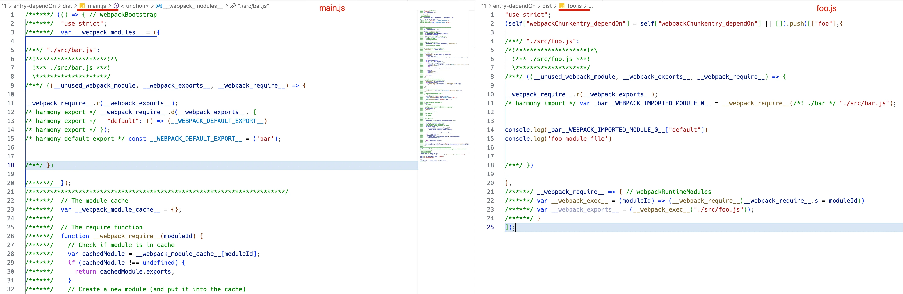
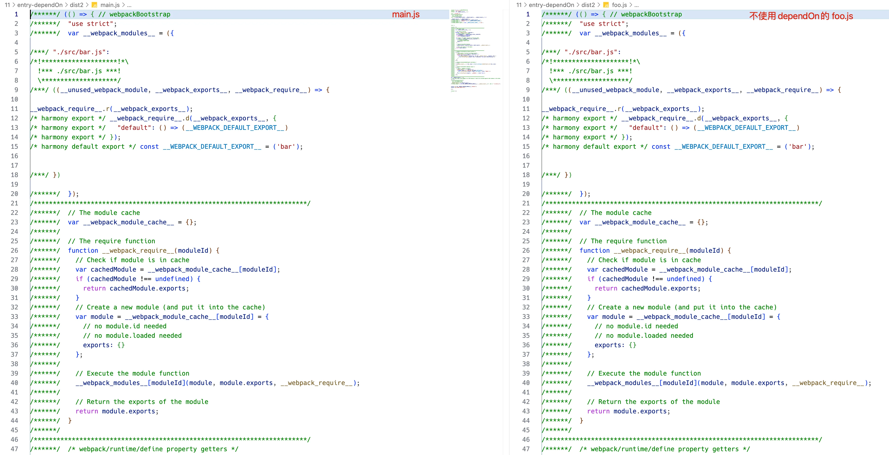
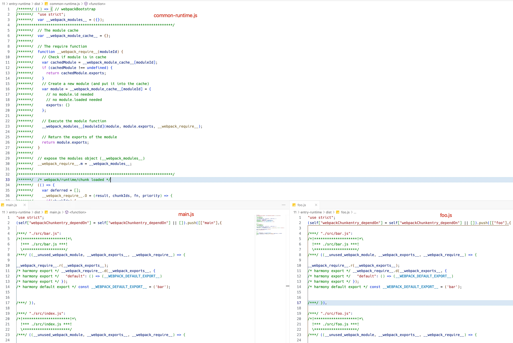
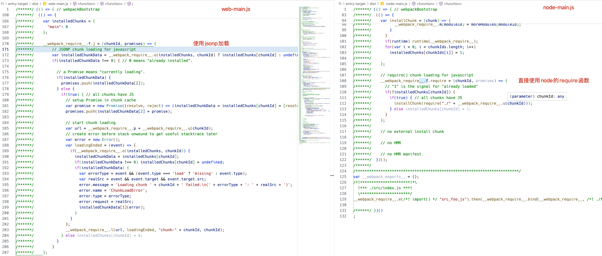

Webpack 是一种 **「配置」** 驱动的构建工具，所以站在应用的角度，必须深入学习 Webpack 的各项配置规则，才能灵活应对各种构建需求。本文将作为小册应用系列的一个总结，汇总与应用配置相关的各项知识点，包括：

- 剖析配置结构规则，解释`对象、数组、函数`三种形态的写法，以及各自应对的场景；
- 详细讲解环境治理的意义，以及如何借助`多文件`实现环境治理；
- 完整、清晰地介绍若干核心配置项：`entry/output/target/mode`，帮助你更深入理解配置规则。


## 配置结构详解

在前面章节中，我们已经编写了许多 Webpack 配置示例，其大多数都以单文件导出单个配置对象方式实现，类似：

```js
module.exports = {
  entry: './src/index.js',
  // 其他配置...
}
```

实际上，Webpack 还支持以数组、函数方式配置运行参数，以适配不同场景应用需求，它们之间大致上区别：

- **单个配置对象**：比较常用的一种方式，逻辑简单，适合大多数业务项目；
- **配置对象数组**：每个数组项都是一个完整的配置对象，每个对象都会触发一次单独的构建，通常用于需要为同一份代码构建多种产物的场景，如 `Library`；
- **函数**：Webpack 启动时会执行该函数获取配置，我们可以在函数中根据环境参数(如 `NODE_ENV`)动态调整配置对象。

下面我们着重介绍数组、函数两种方式。


### 使用配置数组

导出数组的方式很简单，如：

::: code-group

```js [webpack.config.js]
module.exports = [
  {
    entry: './src/index.js',
    // ...
  },
  {
    entry: './src/index.js',
    // ...
  },
]
```

:::

使用数组方式时，Webpack 会在启动后创建多个 `Compilation` 实例，并行执行构建工作，但需要注意，`Compilation` 实例间基本上不作通讯，这意味着这种并行构建对运行性能并没有任何正向收益，例如某个 Module 在 `Compilation` 实例 A 中完成解析、构建后，在其它 `Compilation` 中依然需要完整经历构建流程，无法直接复用结果😅。

数组方式主要用于应对“同一份代码打包出多种产物”的场景，例如在构建 `Library` 时，我们通常需要同时构建出 ESM/CMD/UMD 等模块方案的产物，如：

::: code-group

```js [webpack.config.js] {10,19}
/**
 * @type {import('webpack').Configuration}
 */
module.exports = [
  {
    output: {
      filename: './dist-amd.js',
      libraryTarget: 'amd',
    },
    name: 'amd',
    entry: './app.js',
    mode: 'production',
  },
  {
    output: {
      filename: './dist-commonjs.js',
      libraryTarget: 'commonjs',
    },
    name: 'commonjs',
    entry: './app.js',
    mode: 'production',
  },
]
```

:::


::: tip

使用配置数组时，还可以通过 `--config-name` 参数指定需要构建的配置对象，例如上例配置中若执行 `npx webpack --config-name='amd'`，则仅使用数组中 `name='amd'` 的项做构建。

:::

此时适合使用配置数组方式解决；若是“多份代码打包多份产物”的场景，则建议使用 `entry` 配置多个应用入口。

使用数组方式时，我们还可以借助 [webpack-merge](https://www.npmjs.com/package/webpack-merge) 工具简化配置逻辑，如：

::: code-group

```js [webpack.config.js] {16,22}
const { merge } = require('webpack-merge')

/**
 * @type {import('webpack').Configuration}
 */
const baseConfig = {
  output: {
    path: "./dist"
  },
  name: "amd",
  entry: "./app.js",
  mode: "production",
}

module.exports = [
  merge(baseConfig, {
    output: {
      filename: '[name]-amd.js',
      libraryTarget: 'amd'
    }
  }),
  merge(baseConfig, {
    output: {
      filename: '[name]-commonjs.js',
      libraryTarget: 'commonjs'
    }
  }),
]
```

:::

示例中将公共配置抽取为 `baseConfig` 对象，之后配合 `webpack-merge` 创建不同目标数组项，这种方式可有效减少重复的配置代码，非常推荐使用。

:::info

`webpack-merge` 是 Webpack 生态内专门用于合并配置对象的工具，后面我们还会展开讲解使用方法。

:::


### 使用配置函数

配置函数方式要求在配置文件中导出一个函数，并在函数中返回 Webpack 配置对象，或配置数组，或 `Promise` 对象，如：

```js
module.exports = function(env, argv) {
  // ...
  return {
    entry: './src/index.js',
    // 其它配置...
  }
}
```

运行时，Webpack 会传入两个环境参数对象：

- `env`：通过 `--env` 传递的命令行参数，适用于自定义参数，例如：

  | 命令：                                                       | `env`参数值：                                    |
  | ------------------------------------------------------------ | ------------------------------------------------ |
  | npx webpack --env prod                                       | `{ prod: true }`                                 |
  | npx webpack --env prod --env min                             | `{ prod: true, min: true }`                      |
  | npx webpack --env foo=bar=app                                | `{ foo: 'bar=app' }`                             |
  | npx webpack --env platform=app --env production              | `{ platform: 'app', production: true }`          |
  | npx webpack --env app.platform="staging" --env app.name="test" | `{ app: { platform: 'staging', name: 'test' } }` |

- `argv`: 命令行 [Flags](https://webpack.js.org/api/cli/#flags) 参数，支持 `entry`/`output-path`/`mode`/`merge` 等

“**配置函数**”这种方式的意义在于，允许用户根据命令行参数动态创建配置对象，可用于实现简单的多环境治理策略，例如：

::: code-group

```js [webpack.config.js]
module.exports = function(env, argv) {
  return {
    mode: argv.mode ? 'production' : 'development',
    devtool: argv.mode ? 'source-map' : 'eval',
    output: {
       path: path.join(__dirname, `./dist/${env.app.type}`,
      filename: '[name].js'
    },
    plugins: [
      new TerserPlugin({
        terserOptions: {
          compress: argv.mode === "production", 
        },
      }),
    ],
  }
}
```

:::

示例支持通过命令行传入 `env.app.type` 与 `argv.mode` 值，决定最终配置结构，我们可以为不同场景传入不同命令行参数，从而实现环境隔离效果。

不过这种方式并不常用，一是因为需要在配置函数内做许多逻辑判断，复杂场景下可能可读性会很低，维护成本高；二是强依赖于命令行参数，可能最终需要写出一串很长的运行命令，应用体验较差。目前社区比较流行通过不同配置文件区分不同环境的运行配置，配合 `--config` 参数实现环境治理，下面我们会展开讲解这种方案。

最后简单总结下，Webpack 支持三种配置方式：对象、数组、函数，其中对象方式最简单，且能够应对大多数业务开发场景，所以使用率最高；数组方式主要用于构建 Library 场景；函数方式灵活性较高，可用于实现一些简单的环境治理策略。同学们可根据实际场景，择优选用。


## 环境治理策略

在现代前端工程化实践中，通常需要将同一个应用项目部署在不同环境(如生产环境、开发环境、测试环境)中，以满足项目参与各方的不同需求。这就要求我们能根据部署环境需求，对同一份代码执行各有侧重的打包策略，例如：

- 开发环境需要使用 `webpack-dev-server` 实现 Hot Module Replacement；
- 测试环境需要带上完整的 Soucemap 内容，以帮助更好地定位问题；
- 生产环境需要尽可能打包出更快、更小、更好的应用代码，确保用户体验。

Webpack 中有许多实现环境治理的方案，比如上面介绍过的，使用“配置函数”配合命令行参数动态计算配置对象。除此之外，业界比较流行将不同环境配置分别维护在单独的配置文件中，如：

```bash
.
└── config
  ├── webpack.common.js
  ├── webpack.development.js
  ├── webpack.testing.js
  └── webpack.production.js
```

之后配合 `--config` 选项指定配置目标，如：

```bash
npx webpack --config webpack.development.js
```

这种模式下通常会将部分通用配置放在基础文件中，如上例的 `webpack.common.js`，之后在其它文件中引入该模块并使用 [webpack-merge](https://www.npmjs.org/package/webpack-merge) 合并配置对象。

`webpack-merge` 是一个专为 Webpack 设计的数据合并(`merge`)的工具，功能逻辑与 Lodash 的 [merge](https://devdocs.io/lodash~4/index#merge) 函数、 [Object.assign](https://devdocs.io/javascript/global_objects/object/assign) 等相似，但支持更多特性，如：

- 支持数组属性合并，例如：

  ```js
  merge({ arr: [1] }, { arr: [2] })
  // { arr: [1, 2] }
  ```

- 支持函数属性合并，例如：

  ```js
  const res = merge(
    { func: () => console.log(1) },
    { func: () => console.log(2) }
  );
  res.func();
  // => 1,2 
  ```

- 支持设定对象合并策略，支持 `match/append/prepend/replace/merge` 规则；

- 支持传入自定义对象合并函数；

- 等等。

这些特性能更好地支持 Webpack 这种高度复杂的数据合并场景，例如对于 `module.rules` 数组，若只是使用 `Object.assign` 做合并，则只会导致后面对象属性替换了前面对象属性；而使用 `webpack-merge` 能够实现两个数组项合并，更符合预期。

接下来，我们用一个 [示例](https://github.com/Tecvan-fe/webpack-book-samples/blob/main/env-manage/webpack.common.js) 简单串一下与 `webpack-merge` 实现环境管理的过程。首先我们需要将通用配置放在公共文件中，如：

::: code-group

```js [webpack.common.js]
const path = require('node:path');
const HTMLWebpackPlugin = require('html-webpack-plugin');

module.exports = {
  entry: { main: './src/index.js' },
  output: {
    filename: '[name].js',
    path: path.resolve(__dirname, 'dist'),
  },
  module: {
    rules: [
      {
        test: /\.js$/,
        use: ['babel-loader'],
      },
    ],
  },
  plugins: [new HTMLWebpackPlugin()],
};
```

:::

其次，需要安装 `webpack-merge` 做配置合并操作：

```bash
pnpm i -D webpack-merge
```

之后，创建对应环境配置文件，如 `webpack.development.js`，并输入开发环境专用配置代码，如：

::: code-group

```js [webpack.development.js]
const { merge } = require('webpack-merge');
const baseConfig = require('./webpack.common');

// 使用 webpack-merge 合并配置对象
module.exports = merge(baseConfig, {
  mode: 'development',
  devtool: 'source-map',
  devServer: { hot: true },
})
```

:::

最后，执行构建命令并通过 `--config` 参数传入配置文件路径，如：

```bash
npx webpack --config=webpack.development.js
```

至此，样例大致搭建完毕，接下来我们还可以继续为更多构建环境配备特定的配置文件，流程同上，此处不再赘述。


## 核心配置项汇总

在前面章节中，我们已经基于各种应用场景综合讲解了 Webpack 方方面面的应用方法，其中涉及多达上百种配置项，不太可能一一详细讲解，但大致上可以划分下图中展示的几种分类：


包括：流程配置、性能优化类配置、日志类配置、开发效率类配置等，这里面较常用，需要着重学习的配置有：

- `entry`：声明项目入口文件，Webpack 会从这个文件开始递归找出所有文件依赖；
- `output`：声明构建结果的存放位置；
- `target`：用于配置编译产物的目标运行环境，支持 `web`、`node`、`electron` 等值，不同值最终产物会有所差异；
- `mode`：编译模式短语，支持 `development`、`production` 等值，Webpack 会根据该属性推断默认配置；
- `optimization`：用于控制如何优化产物包体积，内置 Dead Code Elimination、Scope Hoisting、代码混淆、代码压缩等功能；
- `module`：用于声明模块加载规则，例如针对什么类型的资源需要使用哪些 Loader 进行处理；
- `plugin`：Webpack 插件列表。

其中，`optimization/module/plugin` 属性将在后续章节做专门介绍，此处先不展开。接下来我们将集中讲解 `entry/output/target/mode` 属性，帮你更全面、立体、透彻地理解 Webpack 配置项逻辑。


### entry配置详解

Webpack 的基本运行逻辑是从 **「入口文件」** 开始，递归加载、构建所有项目资源，所以几乎所有项目都必须使用 [entry](https://webpack.js.org/configuration/entry-context/) 配置项明确声明项目入口。`entry` 配置规则比较复杂，支持如下形态：

- 字符串：指定入口文件路径；
- 对象：对象形态功能比较完备，除了可以指定入口文件列表外，还可以指定入口依赖、Runtime 打包方式等；
- 函数：动态生成 Entry 配置信息，函数中可返回字符串、对象或数组；
- 数组：指明多个入口文件，数组项可以为上述介绍的文件路径字符串、对象、函数形式，Webpack 会将数组指明的入口全部打包成一个 Bundle。

例如：

::: code-group

```js [webpack.config.js]
module.exports = {
  //...
  entry: {
    // 1️⃣ 字符串形态
    home: './home.js',
    // 2️⃣ 数组形态
    shared: ['react', 'react-dom', 'redux', 'react-redux'],
    // 3️⃣ 对象形态
    personal: {
      import: './personal.js',
      filename: 'pages/personal.js',
      dependOn: 'shared',
      chunkLoading: 'jsonp',
      asyncChunks: true
    },
    // 4️⃣ 函数形态
    admin: function() {
      return './admin.js';
    }
  },
};
```

:::

这其中，**「对象」** 形态的配置逻辑最为复杂，支持如下配置属性：

- `import`：声明入口文件，支持路径字符串或路径数组(多入口)；
- `dependOn`：声明该入口的前置依赖 Bundle；
- `runtime`：设置该入口的 Runtime Chunk，若该属性不为空，Webpack 会将该入口的运行时代码抽离成单独的 Bundle；
- `filename`：效果与 [output.filename](https://webpack.js.org/configuration/output/#outputfilename) 类同，用于声明该模块构建产物路径；
- `library`：声明该入口的 [output.library](https://webpack.js.org/configuration/output/#outputlibrary) 配置，一般在构建 NPM Library 时使用；
- `publicPath`：效果与 [output.publicPath](https://webpack.js.org/configuration/output/#outputpublicpath) 相同，用于声明该入口文件的发布 URL；
- `chunkLoading`：效果与 [output.chunkLoading](https://webpack.js.org/configuration/output/#outputchunkloading) 相同，用于声明异步模块加载的技术方案，支持 `false/jsonp/require/import` 等值；
- `asyncChunks`：效果与 [output.asyncChunks](https://webpack.js.org/configuration/output/#outputasyncchunks) 相同，用于声明是否支持异步模块加载，默认值为 `true`。

而这些属性中，`dependOn` 与 `runtime` 最为晦涩难懂，有必要构造实例，展开讲解。


> 1️⃣ 使用 `entry.dependOn` 声明入口依赖：

`dependOn` 属性用于声明前置 Bundle 依赖，从效果上看能够减少重复代码，优化构建产物质量。例如：

::: code-group

```js [webpack.config.js] {7}
module.exports = {
  //...
  entry: {
    main: './src/index.js',
    foo: {
      import: './src/foo.js',
      dependOn: 'main'
    }
};
```

:::

🌰代码：

::: code-group

```js [./src/index.js]
import bar from './bar'

console.log(bar)
console.log('index module file')
```

```js [./src/foo.js]
import bar from './bar'

console.log(bar)
console.log('foo module file')
```

```js [./src/bar.js]
export default 'bar'
```

:::


示例中，`foo` 入口的 `dependOn` 属性指向 `main` 入口，此时 Webpack 认为：客户端在加载 `foo` 产物之前必然会加载 `main`，因此可以将重复的模块代码、运行时代码等都放到 `main` 产物，减少不必要的重复，最终打包结果：



左边为 `main` 产物，包含所有模块、运行时代码，与普通 Bundle 无异；右边为 `foo` 产物，代码结构非常清爽。作为对比，若不指定 `dependOn` 属性，则构建结果：



可以看出两边内容并无差异。

`dependOn` 适用于哪些有明确入口依赖的场景，例如我们构建了一个主框架 Bundle，其中包含了项目基本框架(如 React)，之后还需要为每个页面单独构建 Bundle，这些页面代码也都依赖于主框架代码，此时可用 `dependOn` 属性优化产物内容，减少代码重复。

- [entry-dependOn github online](https://github1s.com/Tecvan-fe/webpack-book-samples/blob/main/entry-obj/webpack.config.js)


> 2️⃣ 使用 `entry.runtime` 管理运行时代码：

为支持产物代码在各种环境中正常运行，Webpack 会在产物文件中注入一系列运行时代码，用以支撑起整个应用框架。运行时代码的多寡取决于我们用到多少特性，例如：

- 需要导入导出文件时，将注入 `__webpack_require__.r` 等；
- 使用异步加载时，将注入 `__webpack_require__.l` 等；
- 等等。

不要小看运行时代码量，极端情况下甚至有可能超过业务代码总量！为此，必要时我们可以尝试使用 [runtime](https://webpack.js.org/concepts/entry-points/#entrydescription-object) 配置将运行时抽离为独立 Bundle，例如：

::: code-group

```js [webpack.config.js] {13,17}
const path = require('node:path')

/**
 * @type {import('webpack').Configuration}
 */

module.exports = {
  mode: 'development',
  devtool: false,
  entry: {
    main: {
      import: './src/index.js',
      runtime: 'common-runtime'
    },
    foo: {
      import: './src/foo.js',
      runtime: 'common-runtime'
    }
  },
  output: {
    clean: true,
    filename: '[name].js',
    path: path.join(__dirname, 'dist')
  },
}
```

:::

🌰代码：

::: code-group

```js [./src/index.js]
import bar from './bar'

console.log(bar)
console.log('index module file')
```

```js [./src/foo.js]
import bar from './bar'

console.log(bar)
console.log('foo module file')
```

```js [./src/bar.js]
export default 'bar'
```

:::

示例中，`main` 与 `foo` 入口均将 `runtime` 声明为 `common-runtime`，此时 Webpack 会将这两个入口的运行时代码都抽取出来，放在 `common-runtime` Bundle 中，效果：



`entry.runtime` 是一种常用的应用性能优化手段，建议大家多做尝试、使用🚀。

- [entry-runtime github online](https://github1s.com/Tecvan-fe/webpack-book-samples/blob/main/entry-runtime/webpack.config.js)

### 使用 `output` 声明输出方式

Webpack 的 [output](https://webpack.js.org/configuration/output/) 配置项用于声明：如何输出构建结果，比如产物放在什么地方、文件名是什么、文件编码等。`output` 支持许多子配置项，包括：

- [output.path](https://webpack.js.org/configuration/output/#outputpath)：声明产物放在什么文件目录下；✅
- [output.filename](https://webpack.js.org/configuration/output/#outputfilename)：声明产物文件名规则，支持 `[name]/[hash]` 等占位符；✅
- [output.publicPath](https://webpack.js.org/configuration/output/#outputpublicpath)：文件发布路径，在 Web 应用中使用率较高；✅
- [output.clean](https://webpack.js.org/configuration/output/#outputclean)：是否自动清除 `path` 目录下的内容，调试时特别好用；
- [output.library](https://webpack.js.org/configuration/output/#outputlibrary)：NPM Library 形态下的一些产物特性，例如：Library 名称、模块化(UMD/CMD 等)规范；
- [output.chunkLoading](https://webpack.js.org/configuration/output/#outputchunkloading)：声明加载异步模块的技术方案，支持 `false/jsonp/require` 等方式。
- 等等。

对于 Web 应用场景，多数情况下我们只需要使用 `path/filename/publicPath` 即可满足需求，其它属性使用率不高，篇幅关系，此处不再赘述。


### 使用 `target` 设置构建目标

虽然多数时候 Webpack 都被用于打包 Web 应用，但实际上 Webpack 还支持构建 Node、Electron、NW.js、WebWorker 等应用形态，这一特性主要通过 [target](https://webpack.js.org/configuration/target/) 配置控制，支持如下数值：

- `node[[X].Y]`：编译为 Node 应用，此时将使用 Node 的 `require` 方法加载其它 Chunk，支持指定 Node 版本，如：`node12.13`；
- `async-node[[X].Y]`：编译为 Node 应用，与 `node` 相比主要差异在于：`async-node` 方式将以异步(Promise)方式加载异步模块(`node` 时直接使用 `require`)。支持指定 Node 版本，如：`async-node12.13`；
- `nwjs[[X].Y]`：编译为 NW.js 应用；
- `node-webkit[[X].Y]`：同 `nwjs`；
- `electron[[X].Y]-main`：构建为 Electron [主进程](https://www.electronjs.org/zh/docs/latest/tutorial/process-model#主进程)；
- `electron[[X].Y]-renderer`：构建为 Electron [渲染进程](https://www.electronjs.org/zh/docs/latest/tutorial/process-model#渲染器进程)；
- `electron[[X].Y]-preload`：构建为 Electron Preload [脚本](https://www.electronjs.org/zh/docs/latest/tutorial/process-model#preload-脚本)；
- `web`：构建为 Web 应用；
- `esX`：构建为特定版本 ECMAScript 兼容的代码，支持 `es5`、`es2020` 等；
- `browserslist`：根据浏览器平台与版本，推断需要兼容的 ES 特性，数据来源于 [Browserslist](https://github.com/browserslist/browserslist#queries) 项目，用法如：`browserslist: 'last 2 major versions'`。

不同构建目标会根据平台特性打包出略有差异的结果(主要体现在运行时与 NPM Library)，例如对于下面这种使用了异步导入的代码：

::: code-group

```js [./src/index.js]
import('./foo').then(console.log)
```

```js [./src/foo.js]
export default 'foo'
```

:::

使用如下配置，同时构建 `node` 与 `web` 版本：

::: code-group

```js [webpack.config.js] {22,28}
const path = require('node:path')
const { merge } = require('webpack-merge')

/**
 * @type {import('webpack').Configuration}
 */
const baseConfig = {
  mode: 'development',
  target: 'web',
  devtool: false,
  entry: {
    main: { import: './src/index.js' }
  },
  output: {
    clean: true,
    path: path.join(__dirname, 'dist')
  },
}

module.exports = [
  merge(baseConfig, {
    target: 'web',
    output: {
      filename: 'web-[name].js'
    }
  }),
  merge(baseConfig, {
    target: 'node',
    output: {
      filename: 'node-[name].js'
    }
  }),
]
```

:::

🌰代码

::: code-group

```js [./src/index.js]
import('./foo').then(console.log)
```

```js [./src/foo.js]
export default 'foo'
```

:::

之后，执行构建命令，结果：



可以看到左边 `web` 版本中需要注入使用 JSONP 异步加载 JS 文件的运行时代码；而右边 `node` 版本则可以直接使用 Node 环境下的 `require` 实现异步加载，因此不需要注入相关运行时。

- [entry target github online](https://github1s.com/Tecvan-fe/webpack-book-samples/blob/main/target-node-web/webpack.config.js)


### 使用 `mode` 短语

Webpack [内置](https://github.com/webpack/webpack/blob/main/lib/config/defaults.js) 了许多构建优化策略，我们可以通过 [mode](https://webpack.js.org/configuration/mode/) 配置项切换默认优化规则，支持如下值：

- `production`：默认值，生产模式，使用该值时 Webpack 会自动帮我们开启一系列优化措施：Three-Shaking、Terser 压缩代码、SplitChunk 提起公共代码，通常用于生产环境构建；
- `development`：开发模式，使用该值时 Webpack 会保留更语义化的 Module 与 Chunk 名称，更有助于调试，通常用于开发环境构建；
- `none`：关闭所有内置优化规则。

`mode` 规则比较简单，一般在开发模式使用 `mode = 'development'`，生产模式使用 `mode = 'production'` 即可。


## 总结

至此，关于 Webpack 配置规则的重要知识点就补充完毕了，我们主要需要理解：

- Webpack 配置文件支持导出对象、数组、函数三种形态，其中对象形式最为常用，足够应对多数业务项目场景；数组形式适用于需要为同一份代码同时构建多种产物的场景，如 NPM Library；函数形态适用于需要动态生成配置规则的场景；
- 为方便管理配置逻辑，我们通常需要引入一些环境治理策略，目前业界比较常用单独配置文件管理单个构建环境；
- `entry` 配置项支持字符串、对象、函数、数组等方式，其中对象形式下的 `dependOn/runtime` 规则比较复杂，建议深入学习；
- `output` 用于声明构建产物的输出规则；
- `target` 用于设置构建目标，不同目标会导致产物内容有轻微差异，支持 Node、Web、Electron、WebWorker 等场景；
- `mode` 构建模式，支持 `development/production/none` 三种值。

结合前面若干应用介绍的章节，相信已经帮你搭建起一套体系化的应用方法论，已经足以应付大多数业务场景。后续章节我们将转入更高阶的内容，包括：如何开发 Loader、Plugin；如何优化构建与应用性能；Webpack 构建原理等。


## 思考题

假设在配置文件中需要通过远程接口动态获取配置片段，如何实现比较优雅？请试试。


::: details chatgpt回答

可以通过使用 `webpack-merge` 和 `axios` 库来实现优雅地动态获取配置片段。

首先，安装 `webpack-merge` 和 `axios` 库：

```js
pnpm i webpack-merge axios -D
```

然后，在 webpack 配置文件中引入这两个库：

```js
const merge = require('webpack-merge');
const axios = require('axios');
```

接下来，在需要动态获取配置片段的地方，使用 `axios` 发送请求，并在请求成功后将返回的数据与原有的配置合并，最终返回新的配置。例如：

```js
module.exports = async () => {
  // 先获取原有的配置
  const baseConfig = {
    entry: 'index.js',
    output: {
      filename: 'bundle.js'
    },
    // ...
  };

  // 发送请求获取配置片段
  const { data } = await axios.get('http://example.com/config-fragment.js');

  // 合并原有的配置和新的配置片段
  const mergedConfig = merge(baseConfig, data);

  return mergedConfig;
};
```

最后，记得在配置文件中导出一个异步函数，以便能够动态获取配置片段。

:::


2023年04月11日17:58:45

