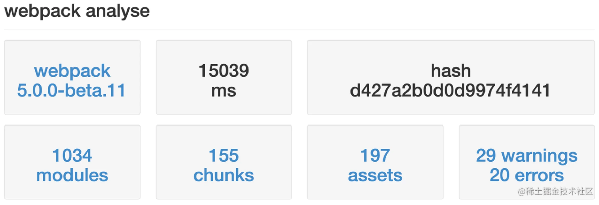
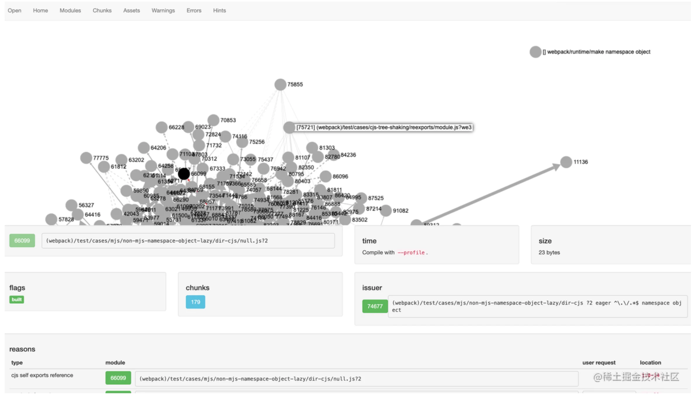
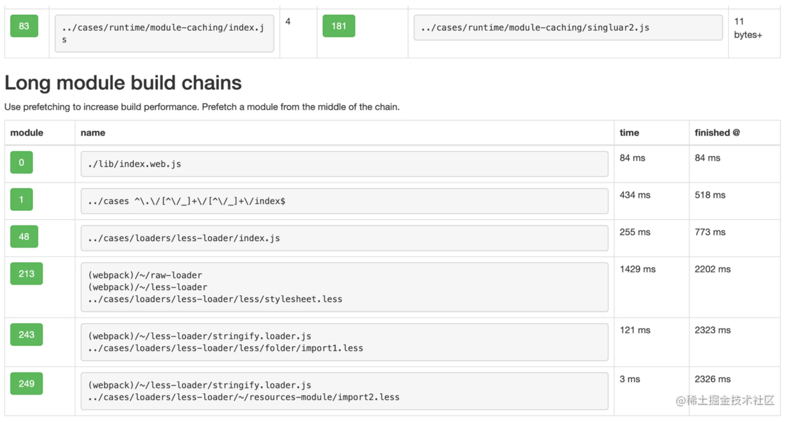
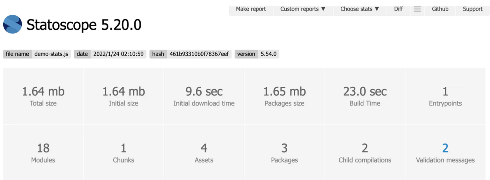
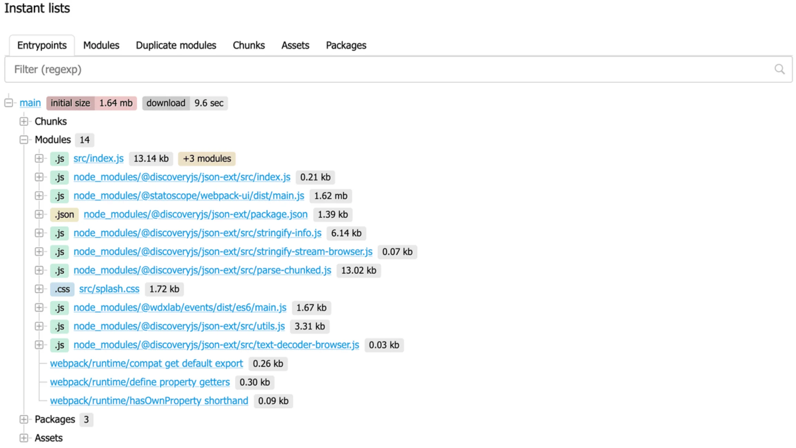
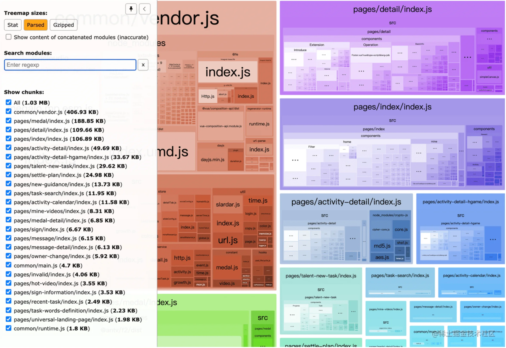
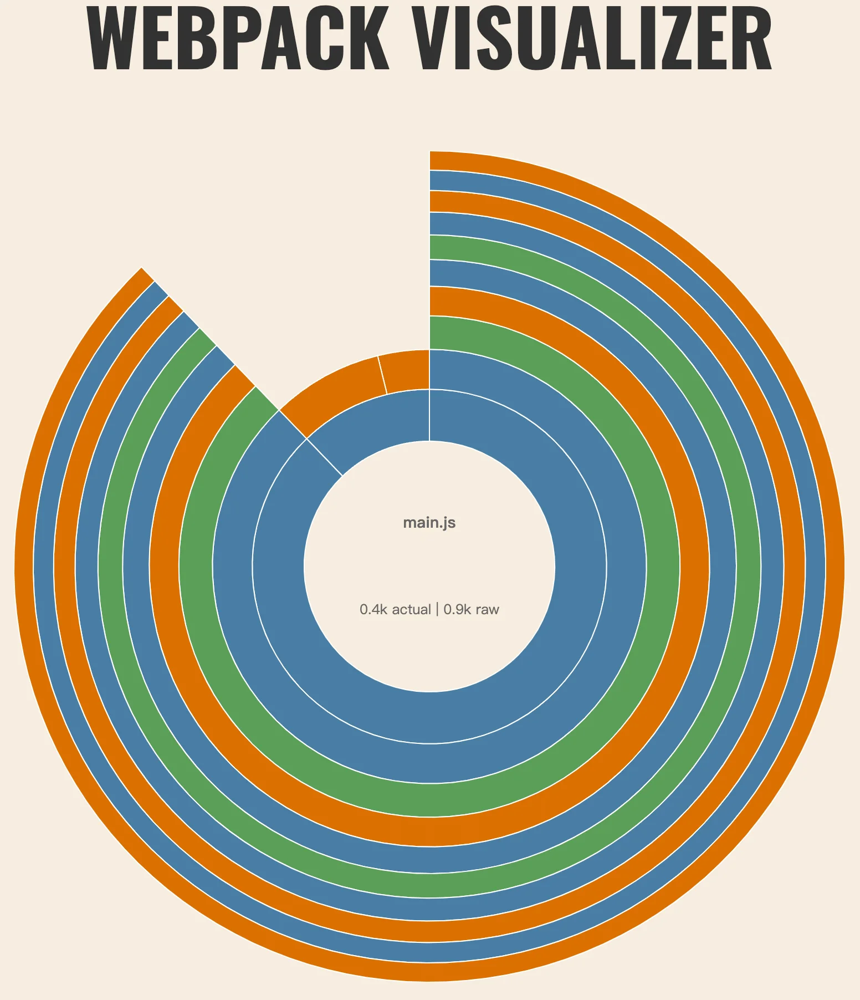
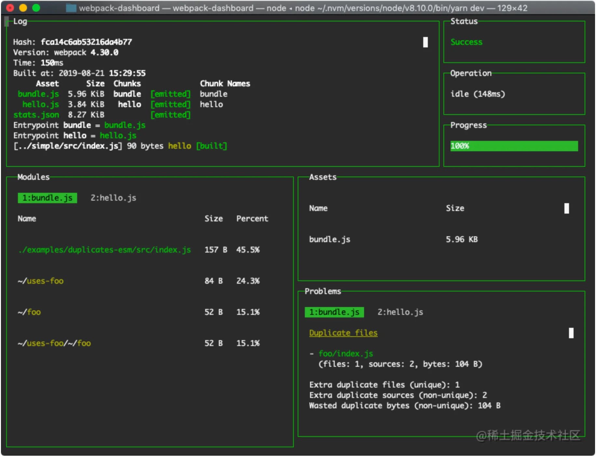
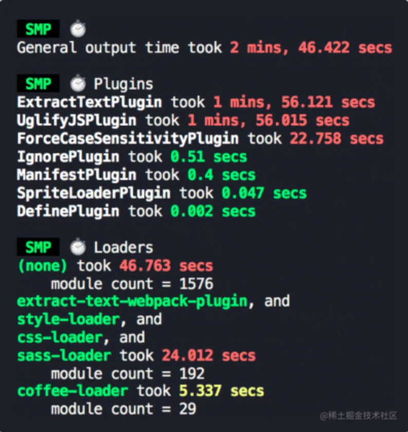
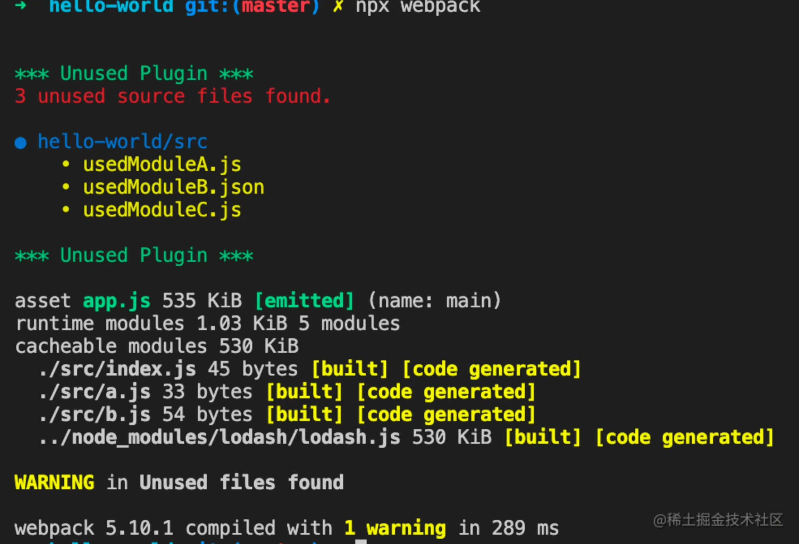

Webpack 最大的优势在于它的功能非常强大、全面，加之繁荣活跃的组件生态，已经足够应对几乎所有 Web 构建需求，包括：SPA、MPA、SSR、桌面应用、Node 程序、WebAssembly、PWA、微前端等等，所以即使在近几年工程化领域异军突起、百花齐放的背景下，Webpack 也依然能保持老大哥的位置。

但软件世界没有银弹！Webpack 在大型项目中通常性能表现不佳，这一方面是因为 JavaScript 语言的单线程架构决定了 Webpack 的运算效率就不可能很高；另一方面则是因为在大型项目中，Webpack 通常需要借助许多组件（插件、Loader）完成大量的文件读写、代码编译操作。

幸运的是，站在开发者视角，我们有许多行之有效的性能优化方法，包括缓存、并发、优化文件处理步骤等，但在着手优化之前，有必要先简单了解一下 Webpack 打包的核心流程；了解哪些步骤比较耗时，可能会造成性能卡点；以及，如何借助一些可视化工具分析 Webpack 的编译性能。


## 核心流程

📚Webpack 最最核心的功能，一是使用适当 Loader 将任意类型文件转译为 JavaScript 代码，例如将 CSS 代码转译为 JS 字符串，将多媒体文件转译为 Base64 代码等；二是将这些经过 Loader 处理的文件资源合并、打包成向下兼容的产物文件。

为了实现这些功能，Webpack 底层的工作流程大致可以总结为这么几个阶段：

1. 初始化阶段：
   - **初始化参数**：从配置文件、 配置对象、Shell 参数中读取，与默认配置结合得出最终的参数；
   - **创建编译器对象**：用上一步得到的参数创建 `Compiler` 对象；
   - **初始化编译环境**：包括注入内置插件、注册各种模块工厂、初始化 RuleSet 集合、加载配置的插件等；
   - **开始编译**：执行 `compiler` 对象的 `run` 方法，创建 `Compilation` 对象；
   - **确定入口**：根据配置中的 `entry` 找出所有的入口文件，调用 `compilation.addEntry` 将入口文件转换为 `dependence` 对象。
2. 构建阶段：
   - **编译模块(`make`)**：从 `entry` 文件开始，调用 `loader` 将模块转译为标准 JS 内容，调用 JS 解析器将内容转换为 AST 对象，从中找出该模块依赖的模块，再 **递归** 处理这些依赖模块，直到所有入口依赖的文件都经过了本步骤的处理；
   - **完成模块编译**：上一步递归处理所有能触达到的模块后，得到了每个模块被翻译后的内容以及它们之间的`依赖关系图`。
3. 封装阶段：
   - **合并(`seal`)**：根据入口和模块之间的依赖关系，组装成一个个包含多个模块的 `Chunk`；
   - **优化(optimization)**：对上述 `Chunk` 施加一系列优化操作，包括：tree-shaking、terser、scope-hoisting、压缩、Code Split 等；
   - **写入文件系统(emitAssets)**：在确定好输出内容后，根据配置确定输出的路径和文件名，把文件内容写入到文件系统。

在这个过程中有不少可能造成性能问题的地方：

1. 构建阶段：
   - 首先需要将文件的相对引用路径转换为绝对路径，这个过程可能涉及多次 IO 操作，执行效率取决于 **文件层次深度**；
   - 找到具体文件后，需要读入文件内容并调用 [loader-runner](https://github1s.com/webpack/loader-runner/blob/HEAD/lib/LoaderRunner.js) 遍历 Loader 数组完成内容转译，这个过程需要执行较密集的 CPU 操作，执行效率取决于 **Loader 的数量与复杂度**；
   - 需要将模块内容解析为 AST 结构，并遍历 AST 找出模块的依赖资源，这个过程同样需要较密集的 CPU 操作，执行效率取决于 **代码复杂度**；
   - 递归处理依赖资源，执行效率取决于 **模块数量**。
2. 封装阶段：
   - 根据 `splitChunks` 配置、`entry` 配置、动态模块引用语句等，确定模块与 Chunk 的映射关系，其中 `splitChunks` 相关的分包算法非常复杂，涉及大量 CPU 计算；
   - 根据 `optimization` 配置执行一系列产物优化操作，特别是 [Terser](https://github.com/webpack-contrib/terser-webpack-plugin) 插件需要执行大量 AST 相关的运算，执行效率取决于 **产物代码量**；

可以看出，Webpack 需要执行非常密集的 IO 与 CPU 操作，计算成本高，再加上 Webpack 以及大多数组件都使用 JavaScript 编写，无法充分利用多核 CPU 能力，所以在中大型项性能通常表现较差。

不过，这些性能问题是可以被优化的！


## 性能分析

有许多被反复实践、行之有效的构建性能优化手段，包括并行编译、缓存、缩小资源搜索范围等等，但在介绍这些具体的优化方法之前，有必要先聊聊：如何收集、分析 Webpack 打包过程的性能数据。

收集数据的方法很简单 —— Webpack 内置了 [stats](https://webpack.docschina.org/api/stats/) 接口，专门用于统计模块构建耗时、模块依赖关系等信息，推荐用法：

1. 添加 `profile = true` 配置：

   ```js
   // webpack.config.js
   module.exports = {
     // ...
     profile: true
   }
   ```

2. 运行编译命令，并添加 `--json` 参数，参数值为最终生成的统计文件名，如：

   ```bash
   npx webpack --json=stats.json
   ```

上述命令执行完毕后，会在文件夹下生成 `stats.json` 文件，内容大致如下：

::: tip

或者直接使用如下命令

```bash
npx webpack profile --json=stats.json
```

:::

```json
{
  "version": "5.9.0", // 用来编译的 webpack 版本
  "hash": "11593e3b3ac85436984a", // 编译的特定哈希值
  "time": 2469, // 编译时间（毫秒）
  "publicPath": "auto",
  "outputPath": "/", // webpack 的输出目录路径
  "assetsByChunkName": {
    // 输出资源对应的 Chunk 名称
    "main": [
      "web.js?h=11593e3b3ac85436984a"
    ],
    "named-chunk": [
      "named-chunk.web.js"
    ],
    "other-chunk": [
      "other-chunk.js",
      "other-chunk.css"
    ]
  },
  "assets": [
    // asset objects 列表
  ],
  "chunks": [
    // chunk objects 列表
  ],
  "modules": [
    // module objects 列表
  ],
  "entryPoints": {
    // entry objects 列表
  },
  "errors": [
    // error objects 列表
  ],
  "errorsCount": 0, // 错误个数
  "warnings": [
    // warning objects 列表
  ],
  "warningsCount": 0, // 告警个数
}
```

`stats` 对象收集了 Webpack 运行过程中许多值得关注的信息，包括：

- `modules`：本次打包处理的所有模块列表，内容包含模块的大小、所属 `chunk`、构建原因、依赖模块等，特别是 `modules.profile` 属性，包含了构建该模块时，解析路径、编译、打包、子模块打包等各个环节所花费的时间，非常有用；
- `chunks`：构建过程生成的 `chunks` 列表，数组内容包含 `chunk` 名称、大小、包含了哪些模块等；
- `assets`：编译后最终输出的产物列表、文件路径、文件大小等；
- `entrypoints`：entry 列表，包括动态引入所生产的 entry 项也会包含在这里面；
- `children`：子 Compiler 对象的性能数据，例如 `extract-css-chunk-plugin` 插件内部就会调用 [compilation.createChildCompiler](https://github1s.com/faceyspacey/extract-css-chunks-webpack-plugin/blob/HEAD/src/loader.js#L82) 函数创建出子 Compiler 来做 CSS 抽取的工作。

::: tip

生成的JSON文件可以使用 [jsoncrack](https://jsoncrack.com/editor) 查看

:::

篇幅有限，这里不展开介绍每个节点的具体内容，有需要的同学可以查阅 Webpack 官网的 [stats](https://webpack.docschina.org/api/stats/) 介绍文档，或到小册代码仓库查看[示例](https://github1s.com/Tecvan-fe/webpack-book-samples/blob/HEAD/stats-with-profile/stats.json)。

我们可以从这些数据中分析出模块之间的依赖关系、体积占比、编译构建耗时等，Webpack 社区还提供了许多优秀的分析工具，能够将这些数据转换各种风格的可视化图表，帮助我们更高效地找出性能卡点，包括：

- [Webpack Analysis](https://webpack.github.io/analyse/) ：Webpack 官方提供的，功能比较全面的 `stats` 可视化工具；
- [Statoscope](https://github.com/statoscope/statoscope)：主要侧重于模块与模块、模块与 chunk、chunk 与 chunk 等，实体之间的关系分析；
- [Webpack Visualizer](https://chrisbateman.github.io/webpack-visualizer/)：一个简单的模块体积分析工具，真的很简单！
- [Webpack Bundle Analyzer](https://www.npmjs.com/package/webpack-bundle-analyzer)：应该是使用率最高的性能分析工具之一，主要实现以 Tree Map 方式展示各个模块的体积占比；✅
- [Webpack Dashboard](https://www.npmjs.com/package/webpack-dashboard)：能够在编译过程实时展示编译进度、模块分布、产物信息等；
- [Unused Webpack Plugin](https://www.npmjs.com/package/unused-webpack-plugin)：能够根据 `stats` 数据反向查找项目中未被使用的文件。


## 1️⃣ Webpack Analysis

[Webpack Analysis](https://webpack.github.io/analyse/) 是 webpack 官方提供的可视化分析工具，相比于其它工具，它提供的视图更全，功能更强大，能够通过创建依赖关系图对你的包进行更彻底的检查。

使用上只需要将上一节 `webpack --json=stats.json` 命令生成的 `stats.json` 文件导入页面，就可以看到一些关键统计信息：



点击页面中的 `modules/chunks/assets` 按钮，页面会渲染出对应实体的依赖关系图，例如：



除 `modules/chunks/assets` 外，右上方菜单栏 **Hints** 还可以查看构建过程各阶段、各模块的处理耗时，可以用于对比分析各个阶段的性能情况：



::: warning

不过，实测发现 **Hints** 还不支持 webpack 5 版本的 `stats` 数据，等待官方更新吧。

:::

[Webpack Analysis](https://webpack.github.io/analyse/) 提供了非常齐全的分析视角，信息几乎没有失真，但上手难度稍高，信息噪音比较多，所以社区还提供了一个简化版 [webpack-deps-tree](https://mshustov.github.io/webpack-deps-tree/static/)，功能相似但用法更简单、信息更简洁，大家可以根据实际需要交叉使用。


## 2️⃣ Statoscope

[Statoscope](https://github.com/statoscope/statoscope) 也是一个非常强大的可视化分析工具，主要提供如下功能：

- 完整的依赖关系视图，涵盖 modules/chunks/assets/entrypoints/packages 维度；
- entrypoints/chunks/packages/module 体积分析；
- 重复包检测；
- 多份 `stats` 数据对比；
- 等等。

有两种用法，一是将 `stats` 数据导入到 [Statoscope](https://github.com/statoscope/statoscope) 在线页面；二是使用 `@statoscope/webpack-plugin` 插件，用法：

1. 安装依赖

   ```bash
   pnpm i -D @statoscope/webpack-plugin
   ```

2. 注册插件：

   ```js
   const StatoscopeWebpackPlugin = require('@statoscope/webpack-plugin').default
   
   module.exports = {
     // ...
     plugins: [new StatoscopeWebpackPlugin()]
   }
   ```

之后，运行 `npx webpack` 命令，编译结束后默认打开分析视图：



可以看到，Statoscope 提供了多种维度的统计信息，包括：Chunk 数量、模块总数、重复模块树、编译耗时、Initial Chunk 体积等；更重要的是，Statoscope 还展示了模块与模块、Chunk、Entry 等维度的依赖关系：



我们可以据此推断出模块体积、为何需要打包该模块、有哪些模块被重复引用等信息。


## 3️⃣ Webpack Bundle Analyzer

[Webpack-bundle-analyzer](https://www.npmjs.com/package/webpack-bundle-analyzer) 是一个非常有名的性能分析插件，只需要一些简单配置就可以在 Webpack 构建结束后生成 Tree Map 形态的模块分布统计图，用户可以通过对比 Tree Map 内容推断各模块的体积占比，是否包含重复模块、不必要的模块等，用法：

1. 安装依赖

   ```bash
   pnpm i -D webpack-bundle-analyzer
   ```

2. 注册插件：

   ```js
   const BundleAnalyzerPlugin = require('webpack-bundle-analyzer').BundleAnalyzerPlugin
   
   module.exports = {
     // ...
     plugins: [new BundleAnalyzerPlugin()]
   }
   ```

编译结束后，默认自动打开本地视图页面：



也可以直接用 Webpack-bundle-analyzer 命令直接打开 `stats` 文件：

```bash
npx webpack-bundle-analyzer ./stats.json
```

基于 Webpack Bundle Analyzer 提供的视图，我们可以分析出：

- Bundle 包所包含的模块内容 —— 从而推断出产物中是否包含预期之外的模块；
- 确定模块体积大小与占比 —— 从而确定是否存在优化空间；
- 了解 Bundle 产物体积，以及经过压缩后的体积。

::: tip

 [webpack-bundle-size-analyzer](https://www.npmjs.com/package/webpack-bundle-size-analyzer)、[source-map-explorer](https://github.com/danvk/source-map-explorer ) 等工具也实现了类似功能，但分别适用于不同场景，建议你也了解一下相关用法，择优选用。

:::


## 4️⃣ Webpack Visualizer

[Webpack Visualizer](https://chrisbateman.github.io/webpack-visualizer/) 是一个在线分析工具，可用于检测、可视化 Webpack 产物的构成模块。有两种用法，一是将 `stats.json` 文件上传到在线 [页面](https://chrisbateman.github.io/webpack-visualizer/)；二是使用 `webpack-visualizer-plugin` 生成统计页面，用法：

1. 安装依赖

   ```bash
   # webpack-visualizer-plugin  不支持 webpack5
   # webpack-visualizer-plugin2 支持 webpack5
   pnpm i -D webpack-visualizer-plugin2
   ```

2. 注册插件：

   ```js
   const VisualizerPlugin = require('webpack-visualizer-plugin2')
   
   module.exports = {
     // ...
     plugins: [
       new VisualizerPlugin({
         filename: './stats.html'
       })
     ]
   }
   ```

两种方式最终都可以生成如下视图：



::: warning

很遗憾，实测发现 [webpack-visualizer-plugin](https://github.com/chrisbateman/webpack-visualizer#plugin-usage) 插件年久失修，只兼容 webpack 1.x ，所以现在几乎没有使用价值了。

:::

此外，在线工具 [Webpack Chart](https://alexkuz.github.io/webpack-chart/) 也提供了类似的功能，功能重合度很高，这里就不展开讲了（更推荐使用这个库，更加的直观）。


## 5️⃣ Webpack Dashboard

[webpack-dashboard](https://www.npmjs.com/package/webpack-dashboard) 是一个命令行可视化工具，能够在编译过程中实时展示编译进度、模块分布、产物信息等，用法：

1. 安装依赖

   ```bash
   pnpm i -D webpack-dashboard
   ```

2. 注册插件：

   ```js
   const VisualizerPlugin = require('webpack-visualizer-plugin2')
   
   module.exports = {
     // ...
     plugins: [
       new VisualizerPlugin({
         filename: './stats.html'
       })
     ]
   }
   ```

3. 🚨注意了，需要用 `webpack-dashboard` 命令启动编译：

   ```js
   # 打包
   npx webpack-dashboard -- webpack
   
   # Dev Server
   npx webpack-dashboard -- webpack-dev-server
   
   # 运行 Node 程序
   npx webpack-dashboard -- node index.js
   ```

之后，就可以在命令行看到一个漂亮的可视化界面：




## 6️⃣ Speed Measure Plugin <Badge type="warning" text="废弃" />

[SpeedMeasureWebpackPlugin](https://www.npmjs.com/package/speed-measure-webpack-plugin) 插件能够统计出各个 Loader、插件的处理耗时，开发者可以根据这些数据分析出哪些类型的文件处理更耗时间，用法：

1. 安装依赖

   ```bash
   pnpm i -D speed-measure-webpack-plugin
   ```

2. 修改配置：

   ```js
   const SpeedMeasurePlugin = require('speed-measure-webpack-plugin');
   
   const smp = new SpeedMeasurePlugin();
   
   const config = {
     entry: "./src/index.ts",
     // ...
   };
   
   // 🚀注意，这里是用 `smp.wrap` 函数包裹住 Webpack 配置
   module.exports = smp.wrap(config);
   ```

之后运行打包命令如 `npx webpack` 即可，运行效果：




::: warning

实测webpack5已经不能再使用该插件

:::


## 7️⃣ UnusedWebpackPlugin

最后分享 [UnusedWebpackPlugin](https://www.npmjs.com/package/unused-webpack-plugin) 插件，它能够根据 webpack 统计信息，反向查找出工程项目里哪些文件没有被用到，我日常在各种项目重构工作中都会用到，非常实用。用法也比较简单：

1. 安装依赖

   ```bash
   pnpm i -D unused-webpack-plugin
   ```

2. 修改配置：

   ```js
   const UnusedWebpackPlugin = require('unused-webpack-plugin');
   
   module.exports = {
     // ...
     plugins: [
       new UnusedWebpackPlugin({
         directories: [path.join(__dirname, 'src')],
         root: path.join(__dirname, '../')
       })
     ]
   }
   ```

示例中，`directories` 用于指定需要分析的文件目录；`root` 用于指定根路径，与输出有关。配置插件后，webpack 每次运行完毕都会输出 `directories` 目录中，有哪些文件没有被用到：




## 总结

这是一篇介绍 Webpack 性能分析的实践方法类文章，我们首先需要理解 Webpack 编译的基本过程，以及过程中各个步骤的耗时，理解哪些节点可能会消耗更多时间等，在此基础上我们才能更精确、有的放矢地排查出项目中的性能问题。

理解基本原理后，我们可以借助一系列可视化工具分析构建、产物性能，你可以沿着上面的介绍，逐一试用、学习这些分析工具。


## 思考题⭐

请仔细观察 `stats` [示例文件](https://github1s.com/Tecvan-fe/webpack-book-samples/blob/HEAD/stats-with-profile/stats.json)，思考几个问题：

1. 如何推断一个 Chunk 中包含了哪些模块？
2. 如何判断 Chunk 类型(Initial/Async/Runtime Chunk)？
3. 如何分析 Module 与 Module 之间的依赖关系？


::: details chatgpt回答

1️⃣ **如何根据webpack的生成的stats文件判断一个Chunk包含哪些模块？**

使用stats文件的"**modules**"属性可以得到所有的模块信息，包括它们属于哪个chunk。

每个chunk都有一个"**id**"属性，可根据此属性匹配上对应的chunk。然后，可以通过chunk的"modules"属性来获取此chunk中包含的所有模块。

示例代码：

```js
const stats = require('./stats.json');

// 查找id为0的chunk
const chunk = stats.chunks.find(chunk => chunk.id === 0);

// 获取此chunk包含的所有模块
const moduleIds = chunk.modules.map(module => module.id);
const modules = stats.modules.filter(module => moduleIds.includes(module.id));

console.log(modules);
```

2️⃣ **如何根据webpack的生成的stats文件判断 Chunk 类型(Initial/Async/Runtime Chunk)？**

使用stats文件的"chunks"属性可以获取到所有chunk的信息，每个chunk都有一个"**initial**"属性（布尔类型），用来表示是否是Initial Chunk。根据这个属性可以很容易地判断一个chunk是否是Initial Chunk。

对于异步Chunk和运行时Chunk，则需要判断它们的来源。异步Chunk的来源可以通过"**chunk.origins**"属性得到，如果这个数组为空，则说明是异步Chunk（因为异步Chunk没有任何被依赖项引用到的模块，所以没有来源）。

而运行时Chunk只有一个，在stats文件的"**entrypoints.runtime**"属性中记录了其ID。根据这个ID，可以在"chunks"数组中找到对应的chunk，然后判断其类型。

下面的代码演示了如何判断一个Chunk是Initial Chunk、Async Chunk还是Runtime Chunk：

```javascript
const stats = require('./stats.json');

// 判断chunk是否是Initial Chunk
function isInitialChunk(chunk) {
  return chunk.initial === true;
}

// 判断chunk是否是Async Chunk
function isAsyncChunk(chunk) {
  return chunk.origins.length === 0;
}

// 🚨这种方式可能已经过时了
// 判断chunk是否是Runtime Chunk
function isRuntimeChunk(chunk) {
  const runtimeChunkId = stats.entrypoints.runtime.chunks[0];
  return chunk.id === runtimeChunkId;
}
```

有了这些判断函数，你可以通过遍历"chunks"数组并使用这些函数来确定每个chunk的类型。


3️⃣ **如何根据webpack的生成的stats文件分析 Module 与 Module 之间的依赖关系？**

使用stats文件中的"modules"和"chunks"属性可以分析出模块和模块之间的依赖关系。

首先需要遍历所有的chunk，获取每个chunk包含的模块。统计每个模块出现的次数，可以得到每个模块被哪些chunk引用了。

接着遍历所有的模块，获取每个模块引用的其他模块列表。使用一张图来记录模块之间的依赖关系，将每个模块作为一个节点，它们之间的引用关系作为边。

下面是一个统计模块之间依赖关系的示例代码：

```javascript
const stats = require('./stats.json');

const modules = stats.modules;
const chunks = stats.chunks;

// 统计每个模块被哪些chunk引用了
const moduleUsages = {};
chunks.forEach(chunk => {
  chunk.modules.forEach(module => {
    const moduleId = module.id;
    if (!moduleUsages[moduleId]) {
      moduleUsages[moduleId] = new Set();
    }
    moduleUsages[moduleId].add(chunk.id);
  });
});

// 构建模块依赖图
const moduleGraph = {};
modules.forEach(module => {
  const moduleId = module.id;
  moduleGraph[moduleId] = moduleGraph[moduleId] || { id: moduleId, deps: [] };

  // 找出模块引用的其他模块
  const depIds = module.dependencies
    .map(dep => dep.moduleId)
    .filter(id => id !== undefined);

  // 将其他模块添加到当前模块的依赖列表中
  depIds.forEach(depId => {
    moduleGraph[moduleId].deps.push(moduleGraph[depId]);
  });

  // 标记模块是否是入口模块
  moduleGraph[moduleId].isEntry = chunkEntryModuleIds.has(moduleId);

  // 标记模块被哪些chunk引用
  moduleGraph[moduleId].usages = moduleUsages[moduleId];
});

console.log(moduleGraph);
```

运行上述代码后，"moduleGraph"对象中保存了所有模块之间的依赖关系：

```javascript
{
  "0": {
    "id": 0,
    "deps": [{ "id": 1, "deps": [], "isEntry": true, "usages": [1, 2] }],
    "isEntry": true,
    "usages": [0, 1, 2]
  },
  "1": { "id": 1, "deps": [], "isEntry": true, "usages": [0, 3] },
  "2": { "id": 2, "deps": [], "isEntry": false, "usages": [0] }
  // ...
}
```

这个示例代码中使用了"module.dependencies"来获取模块之间的依赖关系，这需要对webpack进行配置，以便在构建时将这些信息记录到stats文件中。需要设置"module.dependencies"为true：

```javascript
module: {
  rules: [
    {
      test: /\.jsx?$/,
      use: 'babel-loader',
      resolve: { fullySpecified: false },
      // 将模块之间的依赖信息记录到stats文件中
      parser: {
        // 开启模块之间的依赖关系分析
        dependencies: true
      }
    }
  ]
},
```

:::


2023年04月20日13:45:54
