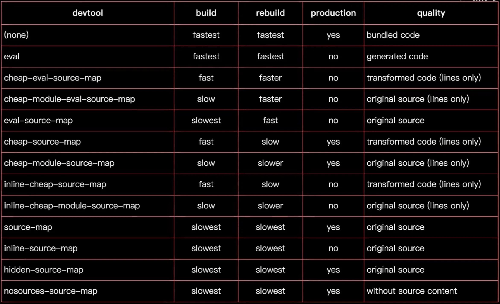
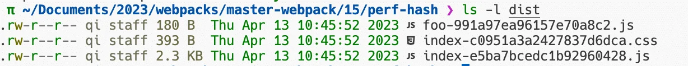
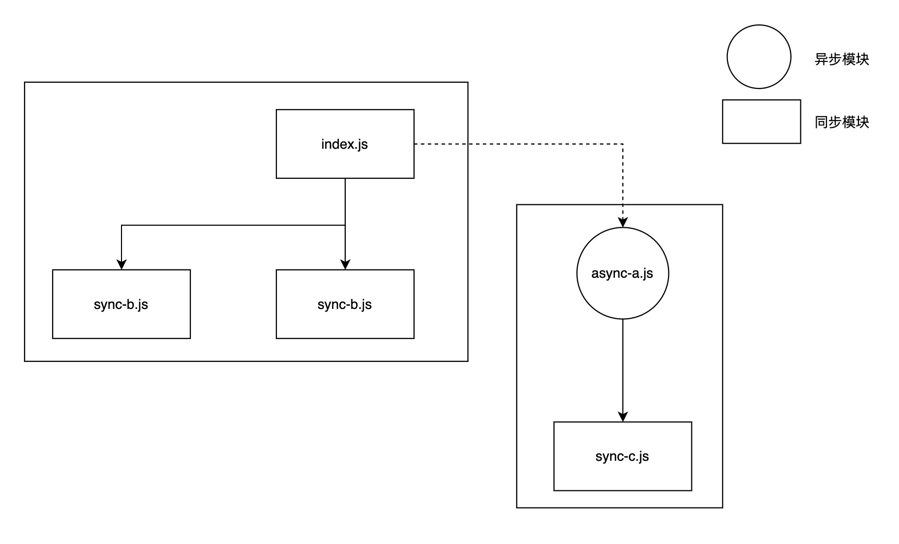
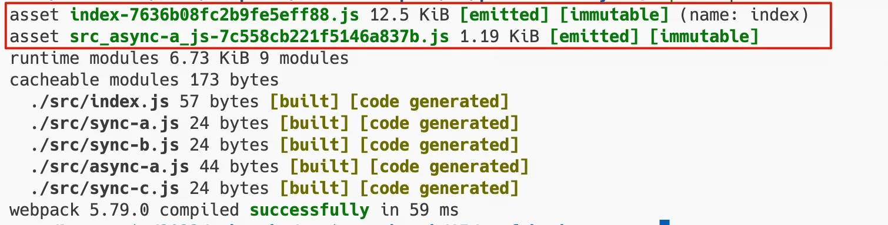
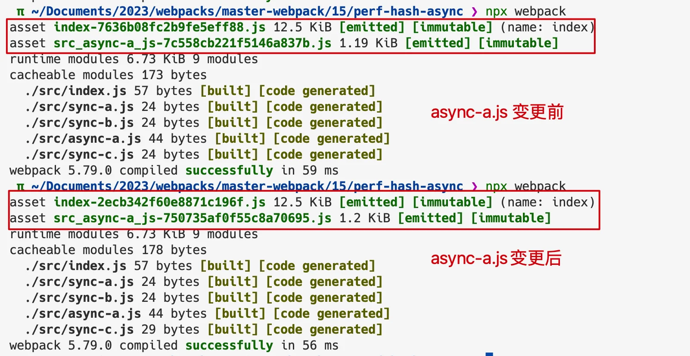
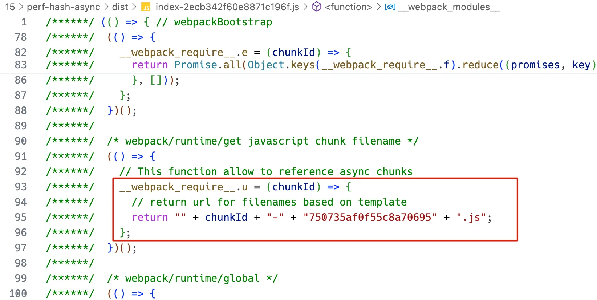
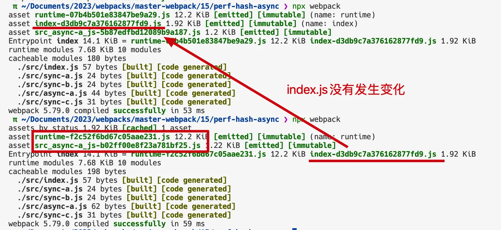
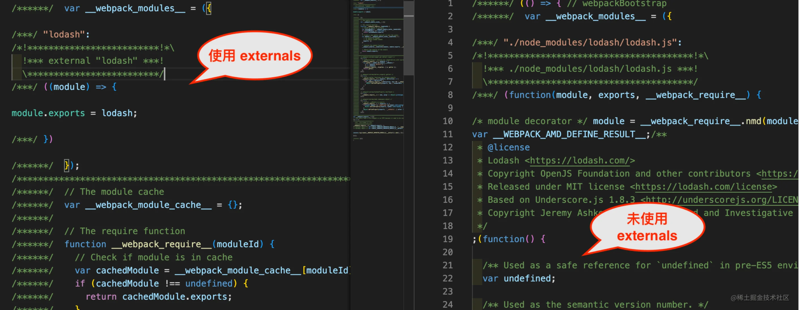
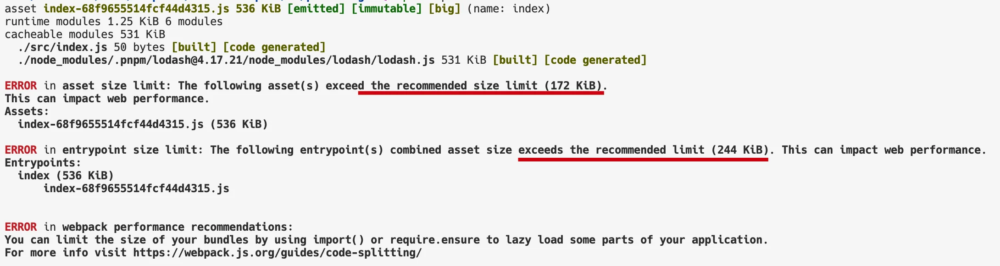

前面章节我们已经详细探讨 Webpack 中如何使用分包、代码压缩提升应用执行性能。除此之外，还有不少普适、细碎的方法，能够有效降低应用体积，提升网络分发性能，包括：

1. 使用动态加载，减少首屏资源加载量；
2. 使用 `externals`、Tree-Shaking、Scope Hoisting 特性，减少应用体积；
3. 正确使用 `[hash]` 占位符，优化 HTTP 资源缓存效率；
4. 等等。

下面我们一一展开，解释每条最佳实践以及背后的逻辑。


## 动态加载

Webpack 默认会将同一个 Entry 下的所有模块全部打包成一个产物文件 —— 包括那些与页面 [关键渲染路径](https://web.dev/critical-rendering-path/) 无关的代码，这会导致页面初始化时需要花费多余时间去下载这部分暂时用不上的代码，影响首屏渲染性能，例如：

```js
import someBigMethod from './someBigMethod'

document.getElementById('someButton').addEventListener('click', () => {
  someBigMethod()
})
```

逻辑上，直到点击页面的 `someButton` 按钮时才会调用 `someBigMethod` 方法，因此这部分代码没必要出现在首屏资源列表中，此时我们可以使用 Webpack 的动态加载功能将该模块更改为异步导入，修改上述代码：

```js
document.getElementById('someButton').addEventListener('click', () => {
  const someBitMehtod = await import('./someBigMethod')
  someBigMethod()
})
```

此时，重新构建将产生额外的产物文件 `src_someBigMethod_js.js`，这个文件直到执行 `import` 语句时 —— 也就是上例 `someButton` 被点击时才被加载到浏览器，也就不会影响到关键渲染路径了。

动态加载是 Webpack 内置能力之一，我们不需要做任何额外配置就可以通过动态导入语句(`import`、`require.ensure`)轻易实现。

🚨但请注意，这一特性有时候反而会带来一些新的性能问题：

- **一是过度使用会使产物变得过度细碎，产物文件过多，运行时 HTTP 通讯次数也会变多**，在 HTTP 1.x 环境下这可能反而会降低网络性能，得不偿失；
- **二是使用时 Webpack 需要在客户端注入一大段用于支持动态加载特性的 Runtime**：



这段代码即使经过压缩也高达 2.5KB 左右，如果动态导入的代码量少于这段 Runtime 代码的体积，那就完全是一笔赔本买卖了。

- 🌰  [perf-lazy-load - @github](https://github.com/Tecvan-fe/webpack-book-samples/tree/main/perf-lazy-load)


因此，请务必慎重，多数情况下我们没必要为小模块使用动态加载能力！`目前社区比较常见的用法是配合 SPA 的前端路由能力实现页面级别的动态加载`，例如在 Vue 中：

```js
import { createRouter, createWebHashHistory } from "vue-router";

const Home = () => import("./Home.vue");
const Foo = () => import(/* webpackChunkName: "sub-pages" */ "./Foo.vue");
const Bar = () => import(/* webpackChunkName: "sub-pages" */ "./Bar.vue");

// 基础页面
const routes = [
  { path: "/bar", name: "Bar", component: Bar },
  { path: "/foo", name: "Foo", component: Foo },
  { path: "/", name: "Home", component: Home },
];

const router = createRouter({
  history: createWebHashHistory(),
  routes,
});

export default router;
```

示例中，`Home/Foo/Bar` 三个组件均通过 `import()` 语句动态导入，这使得仅当页面切换到相应路由时才会加载对应组件代码。另外，`Foo` 与 `Bar` 组件的导入语句比较特殊：

```js
import(/* webpackChunkName: "sub-pages" */ "./Bar.vue");
```

`webpackChunkName` 用于指定该异步模块的 Chunk 名称，相同 Chunk 名称的模块最终会打包在一起，这一特性能帮助开发者将一些关联度较高，或比较细碎的模块合并到同一个产物文件，能够用于管理最终产物数量。

- 🌰  [perf-vue-lazy-load - @github](https://github.com/Tecvan-fe/webpack-book-samples/tree/main/perf-vue-lazy-load)


## HTTP缓存优化

注意，Webpack 只是一个工程化构建工具，没有能力决定应用最终在网络分发时的缓存规则，但我们可以调整产物文件的名称(通过 Hash)与内容(通过 [Code Splitting](https://webpack.js.org/guides/code-splitting/))，使其更适配 HTTP 持久化缓存策略。Code Splitting 相关知识已经在 [前面章节](https://juejin.cn/book/7115598540721618944/section/7119035452643868672) 做了详尽介绍，本文接着聊聊文件名 Hash 规则。

::: info

Hash 是一种将任意长度的消息压缩到某一固定长度的消息摘要的函数，不同明文计算出的摘要值不同，所以常常被用作内容唯一标识。

:::

📚Webpack 提供了一种模板字符串([Template String](https://webpack.js.org/configuration/output/#template-strings))能力，用于根据构建情况动态拼接产物文件名称([output.filename](https://webpack.js.org/configuration/output/#outputfilename))，规则稍微有点复杂，但从性能角度看，比较值得关注的是其中的几个 Hash 占位符，包括：

1. `[fullhash]`：整个项目的内容 Hash 值，项目中任意模块变化都会产生新的 `fullhash`；
2. `[chunkhash]`：产物对应 Chunk 的 Hash，Chunk 中任意模块变化都会产生新的 `chunkhash`；
3. `[contenthash]`：产物内容 Hash 值，仅当产物内容发生变化时才会产生新的 `contenthash`，因此实用性较高。✅

用法很简单，只需要在 `output.filename` 值中插入相应占位符即可，如 `"[name]-[contenthash].js"`。我们来看个完整例子，假设对于下述源码结构：

::: code-group

``` js [src/index.js]
import './index.css'

console.log('a')
```

``` js [src/foo.js]
console.log('foo')
```

```js [src/index.css]
body {
  font-size: 14px;
}
```

:::


webpack配置

::: code-group

``` js [webpack.config.js] {15,29}
const path = require('node:path')
const MiniCssExtractPlugin = require('mini-css-extract-plugin')

/**
 * @type {import('webpack').Configuration}
 */
module.exports = {
  mode: 'development',
  devtool: false,
  entry: {
    index: './src/index.js',
    foo: './src/foo.js'
  },
  output: {
    filename: '[name]-[contenthash].js',
    path: path.resolve(__dirname, 'dist'),
    clean: true,
  },
  module: {
    rules: [
      {
        test: /\.css$/,
        use: [MiniCssExtractPlugin.loader, 'css-loader']
      }
    ]
  },
  plugins: [
    new MiniCssExtractPlugin({
      filename: '[name]-[contenthash].css',
    })
  ]
}
```

:::

示例包含 `index.js` 与 `foo.js` 两个入口，且分别在 `ouput.filename` 与 `MiniCssExtractPlugin.filename` 中使用 `[contenthash]` 占位符，最终构建结果：



::: tip

也可以通过占位符传入 Hash 位数，如 `[contenthash:7]` ，即可限定生成的 Hash 长度。

:::

可以看到每个产物文件名都会带上一段由产物内容计算出的唯一 Hash 值，文件内容不变，Hash 也不会变化，这就很适合用作 HTTP [持久缓存](https://developer.mozilla.org/en-US/docs/Web/HTTP/Caching#expires_or_max-age) 资源：

```bash
# HTTP Response header

Cache-Control: max-age=31536000
```

此时，产物文件不会被重复下载，一直到文件内容发生变化，引起 Hash 变化生成不同 URL 路径之后，才需要请求新的资源文件，能有效提升网络性能，因此，生产环境下应尽量使用 `[contenthash]` 生成有版本意义的文件名。

- 🌰 [perf-hash - @github](https://github.com/Tecvan-fe/webpack-book-samples/tree/main/perf-hash)


🚨Hash 规则很好用，不过有一个边际 Case 需要注意：**异步模块变化会引起主 Chunk Hash 同步发生变化**，例如对于下面这种模块关系：



 `src` 目录代码：

::: code-group

``` js [index.js]
import './sync-a' // 同步
import './sync-b'

import('./async-a') // 异步
```

``` js [sync-a.js]
export default 'sync-a'
```

```js [sync-b.js]
export default 'sync-b'
```

```js [sync-c.js]
export default 'sync-c'
```

```js [async-a.js]
import './sync-c'

export default 'async-a'
```

:::

构建后将生成入口 `index.js` 与异步模块 `async-a.js` 两个 Chunk 对应的产物：



此时，若异步模块 `async-a` 或其子模块 `sync-c` 发生变化

```js
export default 'sync-c' // [!code --]
export default 'sync-c-diff' // [!code ++]
```

理论上应该只会影响 `src_async-a` 的 Hash 值，但实际效果却是：



父级 Chunk(`index`)也受到了影响，生成新的 Hash 值，这是因为在 `index` 中需要记录异步 Chunk 的真实路径：



🚀异步 Chunk 的路径变化自然也就导致了父级 Chunk 内容变化，此时可以用 `optimization.runtimeChunk` 将这部分代码抽取为单独的 Runtime Chunk，例如：

::: code-group

``` js [webpack.config.js]
module.exports = {
  entry: { index: "./src/index.js" },
  mode: "development",
  devtool: false,
  output: {
    filename: "[name]-[contenthash].js",
    path: path.resolve(__dirname, "dist")
  },
  // 将运行时代码抽取到 `runtime` 文件中
  optimization: { runtimeChunk: { name: "runtime" } }, // [!code ++]
};
```

:::

::: info

后续章节中我们会专门讲解 Initial Chunk、Async Chunk、Runtime Chunk 三种概念。

:::

之后，`async-a.js` 模块的变更只会影响 Runtime Chunk 内容，不再影响主 Chunk。



::: tip

综上，建议至少为生成环境启动 `[contenthash]` 功能，并搭配 `optimization.runtimeChunk` 将运行时代码抽离为单独产物文件。

:::


## 使用外置依赖

设想一个场景，假如我们手头上有 10 个用 React 构建的 SPA 应用，这 10 个应用都需要各自安装、打包、部署、分发同一套相似的 React 基础依赖，最终用户在访问这些应用时也需要重复加载相同基础包代码，那有没有办法节省这部分流量呢？有 —— 使用 Webpack 的 `externals` 特性。

`externals` 的主要作用是将部分模块排除在 Webpack 打包系统之外，例如：

```js
module.exports = {
  // ...
  externals: {
    lodash: "_",
  },
};
```

使用上述配置后，Webpack 会 **预设** 运行环境中已经内置 Lodash 库 —— 无论是通过 CDN 还是其它方式注入，所以不需要再将这些模块打包到产物中：



::: tip

`externals` 不仅适用于优化产物性能，在特定环境下还能用于跳过若干运行时模块，例如 Node 中的 `fs/net` 等，避免将这部分源码错误打包进 Bundle，详情可参考 [webpack-node-externals](https://www.npmjs.com/package/webpack-node-externals) 工具。

:::

🚀注意，使用 `externals` 时必须确保这些外置依赖代码已经被正确注入到上下文环境中，这在 Web 应用中通常可以通过 CDN 方式实现，例如：

::: code-group

```js [webpack.config.js] {18,32,33}
const path = require('node:path')
const HtmlWebpackPlugin = require('html-webpack-plugin')

/**
 * @type {import('webpack').Configuration}
 */
module.exports = {
  mode: 'development',
  devtool: false,
  entry: {
    index: './src/index.js',
  },
  output: {
    filename: '[name]-[contenthash].js',
    path: path.resolve(__dirname, 'dist2'),
    clean: true,
  },
  externals: {
    react: 'React',
    lodash: '_'
  },
  plugins: [
    new HtmlWebpackPlugin({
      templateContent: `
      <!DOCTYPE html>
      <html lang="en">
      <head>
        <meta charset="UTF-8">
        <meta http-equiv="X-UA-Compatible" content="IE=edge">
        <meta name="viewport" content="width=device-width, initial-scale=1.0">
        <title>External demo</title>
        <script defer crossorigin src="https://www.unpkg.com/react@18.2.0/umd/react.production.min.js"></script>
        <script defer crossorigin src="https://unpkg.com/browse/lodash@4.17.21/lodash.min.js"></script>
      </head>
      <body>
        <div id="app"></div>
      </body>
      </html>
      `
    })
  ]
}
```

:::

示例中，`externals` 声明了 `react` 与 `lodash` 两个外置依赖，并在后续的 `html-webpack-plugin` 模板中注入这两个模块的 CDN 引用，以此构成完整 Web 应用。

虽然结果上看浏览器还是得消耗这部分流量，但结合 CDN 系统特性:

1. 一是能够就近获取资源，缩短网络通讯链路；
2. 二是能够将资源分发任务前置到节点服务器，减轻原服务器 QPS 负担；
3. 三是用户访问不同站点能共享同一份 CDN 资源副本。所以网络性能效果往往会比重复打包好很多。


## 使用Tree-Shaking删除多余模块导出

Tree-Shaking 较早前由 [Rich Harris](https://github.com/Rich-Harris) 在 Rollup 中率先实现，Webpack 自 2.0 版本开始接入，是一种基于 ES Module 规范的 Dead Code Elimination 技术，它会在运行过程中静态分析模块之间的导入导出，判断哪些模块导出值没有被其它模块使用 —— 相当于模块层面的 Dead Code，并将其删除。

在 Webpack 中，启动 Tree Shaking 功能必须同时满足两个条件：

1. 配置 `optimization.usedExports` 为 `true`，标记模块导入导出列表；
2. 启动代码优化功能，可以通过如下方式实现：
   1. 配置 `mode = production`
   2. 配置 `optimization.minimize = true`
   3. 提供 `optimization.minimizer` 数组

例如：

::: code-group

```js [webpack.config.js]
module.exports = {
  mode: "production",
  optimization: {
    usedExports: true,
  },
}
```

:::

之后，Webpack 会对所有使用 ESM 方案的模块启动 Tree-Shaking，例如对于下面的代码：

::: code-group

```js [index.js]
import { bar } from './bar'

console.log(bar)
```

``` js [bar.js]
export const bar = 'bar';
export const foo = 'foo';
```

:::

`bar.js` 模块导出了 `bar` 、`foo` ，但只有 `bar` 值被 `index` 模块使用，经过 Tree Shaking 处理后，`foo` 变量会被视作无用代码删除，最终有效的代码结构：

::: code-group

```js [bar.js]
export const bar = 'bar';
export const foo = 'foo'; // [!code --]
```

```js [index.js]
import { bar } from './bar'

console.log(bar)
```

:::

在后面章节中我们会展开讲解 Tree-Shaking 的实现细节及注意事项，此处先略过。


## 使用Scope Hoisting合并模块

默认情况下 Webpack 会将模块打包成一个个单独的函数，例如：

```js
// common.js
export default "common";

// index.js
import common from './common';
console.log(common);
```

经过 Webpack 打包后会生成：

```js
"./src/common.js":
  ((__unused_webpack_module, __webpack_exports__, __webpack_require__) => {
     const __WEBPACK_DEFAULT_EXPORT__ = ("common");
     __webpack_require__.d(__webpack_exports__, {
      /* harmony export */
      "default": () => (__WEBPACK_DEFAULT_EXPORT__)
      /* harmony export */
    });
  }),
"./src/index.js":
  ((__unused_webpack_module, __webpack_exports__, __webpack_require__) => {
      var _common__WEBPACK_IMPORTED_MODULE_0__ = __webpack_require__( /*! ./common */ "./src/common.js");
      console.log(_common__WEBPACK_IMPORTED_MODULE_0__)
  })
```

这种处理方式需要将每一个模块都包裹进一段相似的函数模板代码中，好看是好看，但浪费网络流量啊。为此，Webpack 提供了 `Scope Hoisting` 功能，用于 **将符合条件的多个模块合并到同一个函数空间** 中，从而减少产物体积，优化性能。例如上述示例经过 Scope Hoisting 优化后，生成代码：

```js
((__unused_webpack_module, __webpack_exports__, __webpack_require__) => {
    ;// CONCATENATED MODULE: ./src/common.js
    /* harmony default export */ const common = ("common");
    
    ;// CONCATENATED MODULE: ./src/index.js
    console.log(common);
})
```

Webpack 提供了三种开启 Scope Hoisting 的方法：

1. 使用 `mode = 'production'` 开启生产模式；
2. 使用 `optimization.concatenateModules` 配置项；
3. 直接使用 `ModuleConcatenationPlugin` 插件。

```js
const ModuleConcatenationPlugin = require('webpack/lib/optimize/ModuleConcatenationPlugin');

module.exports = {
    // 1️⃣ 方法1： 将 `mode` 设置为 production，即可开启
    mode: "production",
    // 2️⃣ 方法2： 将 `optimization.concatenateModules` 设置为 true
    optimization: {
        concatenateModules: true,
        usedExports: true,
        providedExports: true,
    },
    // 3️⃣ 方法3： 直接使用 `ModuleConcatenationPlugin` 插件
    plugins: [new ModuleConcatenationPlugin()]
};
```

三种方法最终都会调用 `ModuleConcatenationPlugin` 完成模块分析与合并操作。

与 Tree-Shaking 类似，Scope Hoisting 底层基于 ES Module 方案的 [静态特性](https://stackoverflow.com/questions/52965907/what-is-the-meaning-of-static-import-in-es6)，推断模块之间的依赖关系，并进一步判断模块与模块能否合并，因此在以下场景下会失效：


> 1️⃣ **非 ESM 模块**

遇到 AMD、CMD 一类模块时，由于导入导出内容的动态性，Webpack 无法确保模块合并后不会产生意料之外的副作用，因此会关闭 Scope Hoisting 功能。这一问题在导入 NPM 包尤其常见，许多框架都会自行打包后再上传到 NPM，并且默认导出的是兼容性更佳的 CommonJS 包，因而无法使用 Scope Hoisting 功能，此时可通过 `mainFileds` 属性尝试引入框架的 ESM 版本：

```js
module.exports = {
  resolve: {
    // 优先使用 jsnext:main 中指向的 ES6 模块化语法的文件
    mainFields: ['jsnext:main', 'browser', 'main']
  },
};
```

> 2️⃣ **模块被多个 Chunk 引用**

如果一个模块被多个 Chunk 同时引用，为避免重复打包，Scope Hoisting 同样会失效，例如：

```js
// common.js
export default "common"

// async.js
import common from './common';

// index.js 
import common from './common';
import("./async");
```

示例中，入口 `index.js` 与异步模块 `async.js` 同时依赖 `common.js` 文件，`common.js` 无法被合并入任一 Chunk，而是作为生成为单独的作用域，最终打包结果：

```js
"./src/common.js":
  (() => {
    var __WEBPACK_DEFAULT_EXPORT__ = ("common");
  }),
 "./src/index.js":
  (() => {
    var _common__WEBPACK_IMPORTED_MODULE_0__ = __webpack_require__( /*! ./common */ "./src/common.js");
    __webpack_require__.e( /*! import() */ "src_async_js").then(__webpack_require__.bind(__webpack_require__, /*! ./async */ "./src/async.js"));
  }), 
```


## 监控产物体积

综合最近几章讨论的 Code Splitting、压缩、缓存优化、Tree-Shaking 等技术，不难看出所谓的应用性能优化几乎都与网络有关，这是因为现代计算机网络环境非常复杂、不稳定，虽然有堪比本地磁盘吞吐速度的 5G 网络，但也还存在大量低速 2G、3G 网络用户，整体而言通过网络实现异地数据交换依然是一种相对低效的 IO 手段，有可能成为 Web 应用执行链条中最大的性能瓶颈。

因此，站在生产者角度我们有必要尽可能优化代码在网络上分发的效率，用尽可能少的网络流量交付应用功能。所幸 Webpack 专门为此提供了一套 [性能监控方案](https://github.com/webpack/webpack/issues/3216)，当构建生成的产物体积超过阈值时抛出异常警告，以此帮助我们时刻关注资源体积，避免因项目迭代增长带来过大的网络传输，用法：

::: code-group

```js [webpack.config.js]
module.exports = {
  // ...
  performance: {
    // 设置所有产物体积阈值
    maxAssetSize: 172 * 1024,
    // 设置 entry 产物体积阈值
    maxEntrypointSize: 244 * 1024,
    // 报错方式，支持 `error` | `warning` | false
    hints: 'error',
    // 过滤需要监控的文件类型
    assetFilter: function(assetFilename) {
      return assetFilename.endsWith('.js')
    }
  }
}
```

:::

🌰 [perf-budget - @github](https://github1s.com/Tecvan-fe/webpack-book-samples/blob/main/perf-budget/webpack.config.js)

```js
const path = require('node:path')
const HtmlWebpackPlugin = require('html-webpack-plugin')

/**
 * @type {import('webpack').Configuration}
 */
module.exports = {
  mode: 'development',
  devtool: false,
  entry: {
    index: './src/index.js',
  },
  output: {
    filename: '[name]-[contenthash].js',
    path: path.resolve(__dirname, 'dist'),
    clean: true,
  },
  performance: { // [!code focus]
    maxAssetSize: 172 * 1024, // [!code focus]
    hints: 'error' // [!code focus]
  } // [!code focus]
}
```

代码：

```js
// ./src/index.js
import _ from 'lodash'

console.log(_.add(1, 2));
```


若此时产物体积超过 `172KB`，则报错：



::: warning

这里的报错不会阻断构建功能， 依然能正常打包出应用产物。

:::

那么我们应该设置多大的阈值呢？这取决于项目具体场景，不过，一个比较好的 [经验法则](https://web.dev/your-first-performance-budget/#budget-for-quantity-based-metrics) 是确保 [关键路径](https://web.dev/critical-rendering-path/) 资源体积始终小于 `170KB`，超过这个体积就应该使用上面介绍的若干方法做好裁剪优化。


## 总结

压缩、Tree-Shaking、Scope Hoisting 都在减少产物体积；Code Splitting、外置依赖、`[hash]` 则有助于提升 HTTP 缓存效率；动态加载则能够确保关键路径最小资源依赖。种种措施各自从不同角度努力优化应用代码在网络上的分发效率，毕竟网络通讯有时候真的很贵！

不过软件世界没有银弹，过度的优化有时候可能带来反效果，建议大家参考 [Web Vitals](https://web.dev/vitals/) 模型，始终关注、对比应用的线上表现，确保最佳用户体验。


## 思考题

为何 Tree-Shaking 强依赖于 ESM 模块方案？ESM 与其它方案如 AMD、CMD 等，有何区别？


::: details chatgpt回答

> 1️⃣ 为何 Tree-Shaking 强依赖于 ESM 模块方案？

JavaScript Tree-Shaking 是指通过**静态分析**，去除未被使用的代码（通常是函数或变量），以减少生成的JavaScript代码量。

ESM (ES Modules) 是一种ECMAScript规范，用于组织和加载JavaScript模块。ESM中定义了“静态解析”规则，即在编译时就能确定每个模块所依赖的其他模块，而且这些依赖关系不会在运行时改变。这使得ESM可以在编译时对模块进行静态分析，找出未被使用的代码，并将其剔除掉。

因此，JavaScript Tree-Shaking强依赖于ESM模块方案，是因为只有 ESM 才能提供静态解析的特性，才能让 Tree-Shaking 能够正确地找出未被使用的代码并消除它们。而 CommonJS 和 AMD 等模块方案则无法提供这样的特性，因为它们允许在运行时动态加载模块，导致无法在编译时确定模块的依赖关系，也就难以进行静态分析和 Tree-Shaking。

需要注意的是，并非所有的 ESM 实现都能支持 Tree-Shaking。例如，在 TypeScript 中使用 ESM 时，就需要开启 "module": "esnext" 选项，以确保编译器能够正确地进行静态分析和 Tree-Shaking💡。


> 2️⃣ESM 与其它方案如 AMD、CMD 等，有何区别？

ESM (ES Modules)、AMD（Asynchronous Module Definition）和 CMD （Common Module Definition）都是用于组织和加载JavaScript模块的方案。它们之间的区别主要在以下几个方面：

1. 语法

ESM 的语法使用 `import` 和 `export` 关键字来定义模块，而 AMD 和 CMD 则分别使用 `define` 和 `require` 函数来定义模块和加载模块。

2. 依赖关系

ESM 定义的依赖关系是静态的，在编译时就能确定每个模块所依赖的其他模块，而且这些依赖关系不会在运行时改变。而 AMD 和 CMD 则允许在运行时动态加载模块，导致无法在编译时确定模块的依赖关系。

3. 加载方式

ESM 的加载方式是同步的，即遇到 `import` 语句时会立即加载依赖的模块，而 AMD 和 CMD 则是异步加载模块。

4. 兼容性

ESM 是 ECMAScript 规范的一部分，在现代浏览器中得到了广泛支持。而 AMD 和 CMD 则需要通过库或框架的支持才能运行在浏览器中。

总的来说，ESM 相比于 AMD 和 CMD，具有更为简洁的语法、更为明确的依赖关系和更为高效的加载方式。同时，ESM 还可以进行静态分析和 Tree-Shaking 优化，这使得 ESM 成为了目前最为流行的 JavaScript 模块方案之一。

:::


2023年04月13日14:34:20

