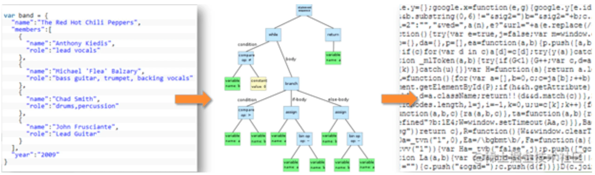
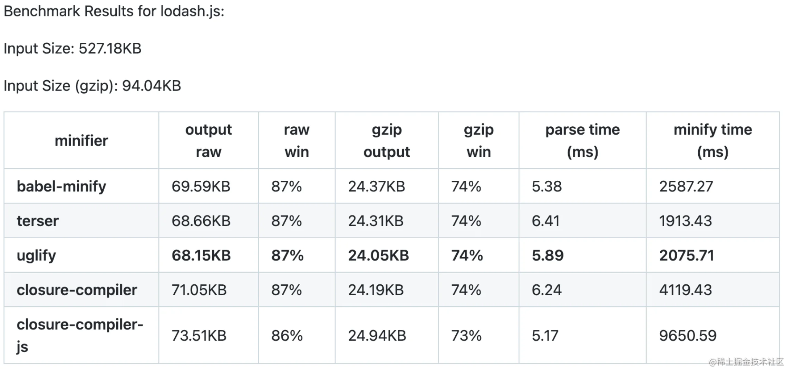
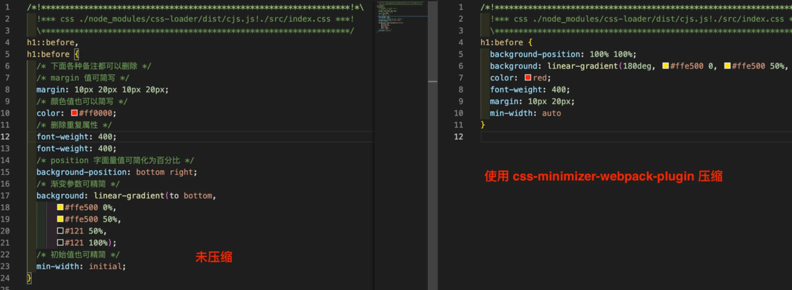
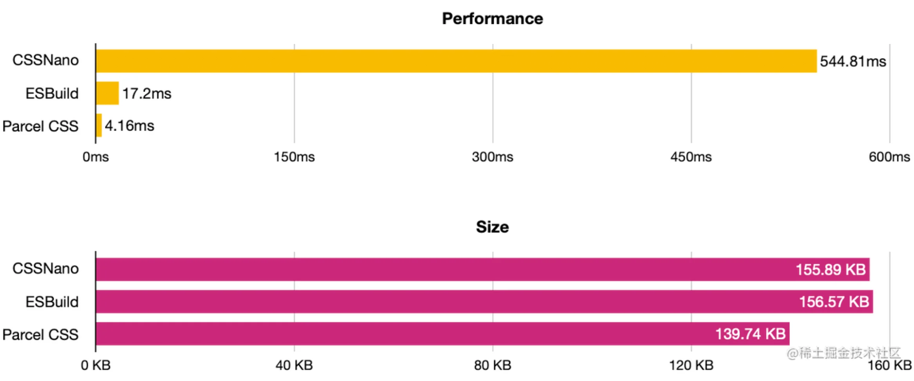
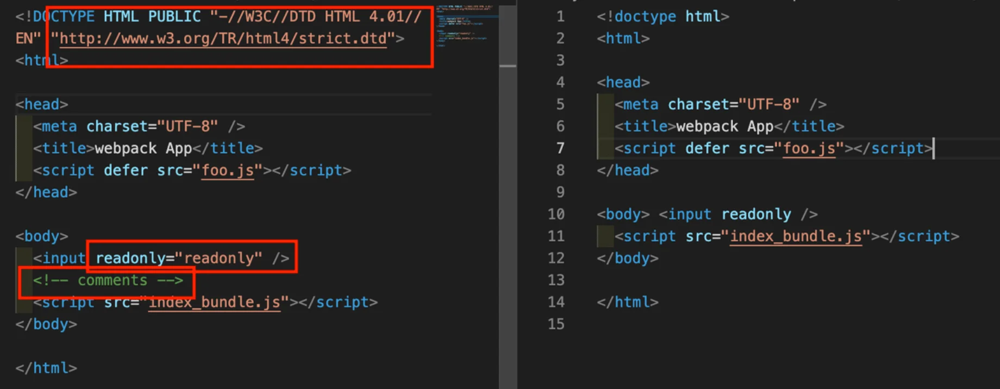

**代码压缩** 是指在不改变代码功能的前提下，从声明式（HTML、CSS）或命令式（JavaScript）语言中删除所有不必要的字符（备注、变量名压缩、逻辑语句合并等），减少代码体积的过程，这在 Web 场景中能够有效减少浏览器从服务器获取代码资源所需要消耗的传输量，降低网络通讯耗时，提升页面启动速度，是一种非常基础且性价比特别高的应用性能优化方案。

在 Webpack 生态下，我们可以借助各种插件轻松实现应用代码压缩，本文将从代码压缩的基本原理开始讲起，之后介绍若干适用于 JavaScript、CSS、HTML 的代码压缩工具。


## 代码压缩原理

“代码压缩”最关键的问题是：如何用“**更精简**”的代码表达“**同一套**”程序逻辑？这并不是什么黑魔法，底层逻辑简单的甚至有点粗暴，拆开来看：

“**更精简**”意味着可以适当 —— 甚至完全牺牲可读性、语义、优雅度而力求用最少字符数的方式书写代码。比如说 `const name = 'tecvan';`，这个看起来非常简单的赋值语句就有不少可以精简的字符：

- 变量名 `name` 语义很明确，大多数“人”看到就基本明白是干什么用的，但这对计算机并没有什么意义，我们完全可以将 `name` 修改为 `a` —— 从 4 个字符精简为 1 个字符，但仍保持改动前后逻辑、功能效果完全一致；
- 赋值操作符 `=` 前后都有空格，这种格式对阅读代码的“人”很友好，视觉效果非常舒适、整齐，但对计算机而言同样毫无意义，我们可以将这前后两个空格删掉 —— 精简了两个字符；
- 虽然 `const` 与 `let` 关键词的功能不同，但特定情况下我们同样能牺牲一部分功能性，用 `let` 替换 `const`，从 5 个字符精简为 1 个字符。

经过上面三个步骤之后，代码从 `const name = 'tecvan';` —— 22 个字符，精简为 `let a='tecvan';` —— 18 个字符，往大了说是节省了 **18%** 的代码体积。其它语言的代码压缩规则也基本都是按照上面这种套路实现的。

其次，“**同一套**”意味着修改前后必须保持一致的代码逻辑、执行流程、功能效果等，例如：

```js
const a = 1;
const b = 2;
const c = a + b;
```

代码中，`a/b` 都是字面量常量，那么整段代码完全可以精简为 `const c = 3` ，省略掉 `a/b` 变量的声明语句，前后还能保持功能完全一致。

为了应对这两个挑战，很自然的我们可以先将字符串形态的代码转换为结构化、容易分析处理的 `AST`（抽象语法树）形态，之后在 AST 上应用上面的规则做各种语法、语义、逻辑推理与简化替换，最后按精简过的 AST 生成结果代码。



社区曾经出现过非常非常多 JavaScript、HTML、CSS 代码压缩工具，基本上都是按照上面这种套路实现的，包括：[Terser](https://github.com/terser/terser)、[ESBuild](https://esbuild.github.io/)、[CSS-Nano](https://cssnano.co/)、[babel-minify](https://github.com/babel/minify)、[htmlMinifierTerser](https://github.com/terser/html-minifier-terser) 等，幸运的是，我们可以在 Webpack 中轻松接入这些工具，实现代码压缩。


## 压缩JS - TerserWebpackPlugin

[Terser](https://github.com/terser/terser) 是当下 [最为流行](https://npmtrends.com/babel-minify-vs-terser-vs-uglify-js) 的 ES6 代码压缩工具之一，支持 [Dead-Code Eliminate](https://en.wikipedia.org/wiki/Dead-code_elimination)、删除注释、删除空格、代码合并、变量名简化等等[一系列](https://github.com/terser/terser#compress-options)代码压缩功能。Terser 的前身是大名鼎鼎的 [UglifyJS](https://github.com/mishoo/UglifyJS)，它在 UglifyJS 基础上增加了 ES6 语法支持，并重构代码解析、压缩算法，使得执行效率与压缩率都有较大提升：(数据来源：https://github.com/babel/minify)



Webpack5.0 后默认使用 Terser 作为 JavaScript 代码压缩器，简单用法只需通过 `optimization.minimize` 配置项开启压缩功能即可：

```js
module.exports = {
  //...
  optimization: {
    minimize: true
  }
};
```

::: tip

使用 `mode = 'production'` 启动生产模式构建时，默认也会开启 Terser 压缩。

:::

Terser 支持许多压缩[配置](https://github.com/terser/terser#compress-options)：

- `dead_code`：是否删除不可触达的代码 —— 也就是所谓的死代码；
- `booleans_as_integers`：是否将 Boolean 值字面量转换为 0、1；
- `join_vars`：是否合并连续的变量声明，如 `var a = 1; var b = 2;` 合并为 `var a=1,b=2;`；
- 等等。

多数情况下使用默认 Terser 配置即可，必要时也可以手动创建 [terser-webpack-plugin](https://github.com/webpack-contrib/terser-webpack-plugin) 实例并传入压缩配置实现更精细的压缩功能，例如：

::: code-group

```js [webpack.config.js]
const TerserPlguin = require('terser-webpack-plugin')

module.exports = {
  // ...
  optimization: {
    minimize: true,
    minimizer: [
      new TerserPlugin({
        terserOptions: {
          compress: {
            reduce_vars: true,
            pure_funcs: ['console.log']
          }
        }
      })
    ]
  }
}
```

:::


::: tip

示例中的 `minimize` 用于控制是否开启压缩，只有 `minimize = true'` 时才会调用 `minimizer` 声明的压缩器数组（没错，这是数组形式）执行压缩操作。

另外，Webpack4 默认使用 [uglifyjs-webpack-plugin](https://www.npmjs.com/package/uglifyjs-webpack-plugin) 压缩代码，也可以通过 `minimizer` 数组替换为 Terser 插件。

:::

terser-webpack-plugin是一个颇为复杂的 Webpack 插件，提供下述 [配置项](https://www.npmjs.com/package/terser-webpack-plugin#options)：

- `test`：只有命中该配置的产物路径才会执行压缩，功能与 [module.rules.test](https://webpack.js.org/configuration/module/#ruletest) 相似；
- `include`：在该范围内的产物才会执行压缩，功能与 [module.rules.include](https://webpack.js.org/configuration/module/#ruleinclude) 相似；
- `exclude`：与 `include` 相反，不在该范围内的产物才会执行压缩，功能与 [module.rules.exclude](https://webpack.js.org/configuration/module/#ruleexclude) 相似；
- `parallel`：是否启动并行压缩，默认值为 `true`，此时会按 `os.cpus().length - 1` 启动若干进程并发执行；
- `minify`：用于配置压缩器，支持传入自定义压缩函数，也支持 `swc/esbuild/uglifyjs` 等值，下面我们再展开讲解；
- `terserOptions`：传入 `minify` —— “压缩器”函数的配置参数；
- `extractComments`：是否将代码中的备注抽取为单独文件，可配合特殊备注如 `@license` 使用。

🌰这些配置项总结下来有两个值得关注的逻辑：

1. 可以通过 `test/include/exclude` 过滤插件的执行范围，这个功能配合 `minimizer` 的数组特性，可以实现针对不同产物执行不同的压缩策略，例如：

   ```js
   const TerserPlugin = require("terser-webpack-plugin");
   
   module.exports = {
     entry: { foo: "./src/foo.js", bar: "./src/bar.js" },
     output: {
       filename: "[name].js",
       // ...
     },
     optimization: {
       minimize: true,
       minimizer: [
         new TerserPlugin({
           test: /foo\.js$/i,
           extractComments: "all",
         }),
         new TerserPlugin({
           test: /bar\.js/,
           extractComments: false,
         }),
       ],
     },
   };
   ```

   [示例](https://github.com/Tecvan-fe/webpack-book-samples/blob/main/minify-terser/webpack.config.js)中，针对 `foo.js` 产物文件会执行 `exctractComments` 逻辑，将备注信息抽取为单独文件；而针对 `bar.js`，由于 `extractComments = false`，不单独抽取备注内容。

2. 🚀terser-webpack-plugin插件并不只是 Terser 的简单包装，它更像是一个代码压缩功能骨架，底层还支持使用 SWC、UglifyJS、ESBuild 作为压缩器，使用时只需要通过 `minify` 参数切换即可，例如：

   ```js {6}
   module.exports = {
     optimization: {
       minimize: true,
       minimizer: [
         new TerserPlugin({
           minify: TerserPlugin.swcMinify,
           // `terserOptions` 将被传递到 `swc` (`@swc/core`) 工具
           // 具体配置参数可参考：https://swc.rs/docs/config-js-minify
           terserOptions: {},
         }),
       ],
     },
   };
   ```

- [🌰 minify-terser - @github](https://github.com/Tecvan-fe/webpack-book-samples/blob/main/minify-terser/webpack.config.js)

TerserPlugin 内置如下压缩器：

- `TerserPlugin.terserMinify`：依赖于 `terser` 库；
- `TerserPlugin.uglifyJsMinify`：依赖于 `uglify-js`，需要手动安装 `yarn add -D uglify-js`；
- `TerserPlugin.swcMinify`：依赖于 `@swc/core`，需要手动安装 `yarn add -D` `@swc/core`；✅
- `TerserPlugin.esbuildMinify`：依赖于 `esbuild`，需要手动安装 `yarn add -D esbuild`。

另外，`terserOptions` 配置也不仅仅专供 `terser` 使用，而是会透传给具体的 `minifier`，因此使用不同压缩器时支持的配置选项也会不同。


不同压缩器功能、性能差异较大，据我了解，ESBuild 与 SWC 这两个基于 Go 与 Rust 编写的压缩器性能更佳，且效果已经基本趋于稳定，虽然功能还比不上 Terser，但某些构建性能敏感场景下不失为一种不错的选择。


## 压缩CSS - CssMinimizerWebpackPlugin

CSS 是一种灵活多变得略显复杂的声明式语言，同样的样式效果可以被表达成非常多样的代码语句，例如一个非常典型的案例：`margin: 10px`，可以被写成：

```css
margin: 10px 10px;

# 或者
margin-left: 10px; margin-right: 10px;...
```

这些不同的表述方式最终实现的样式效果相同，那理所当然的可以用最精简的方式压缩代码。扩展开来：

```css
h1::before,
h1:before {
  /* 下面各种备注都可以删除 */
  /* margin 值可简写 */
  margin: 10px 20px 10px 20px; 
  /* 颜色值也可以简写 */
  color: #ff0000; 
  /* 删除重复属性 */
  font-weight: 400;
  font-weight: 400; 
  /* position 字面量值可简化为百分比 */
  background-position: bottom right;
  /* 渐变参数可精简 */
  background: linear-gradient(
    to bottom,
    #ffe500 0%,
    #ffe500 50%,
    #121 50%,
    #121 100%
  ); 
  /* 初始值也可精简 */
  min-width: initial;
}
```

上述代码就有不少地方可以精简优化，使用 [cssnano](https://cssnano.co/) 压缩后大致上可简化为：

```css
h1:before {
  margin: 10px 20px;
  color: red;
  font-weight: 400;
  background-position: 100% 100%;
  quotes: "«" "»";
  background: linear-gradient(180deg, #ffe500, #ffe500 50%, #121 0, #121);
  min-width: 0;
}
```

从原来的 422 个字符精简为 212 个字符，接近 50%，我们日常编写的 CSS 语句也跟上述示例类似，通常都会有不少可以优化压缩的地方。

🌰Webpack 社区中有不少实现 CSS 代码压缩的插件，例如：[css-minimizer-webpack-plugin](https://webpack.js.org/plugins/css-minimizer-webpack-plugin/)，用法：

1. 安装依赖：

   ```bash
   pnpm i -D css-minimizer-webpack-plugin
   ```

2. 修改 Webpack 配置：

   ```js {11,18,25}
   const CssMinimizerPlugin = require('css-minimizer-webpack-plugin')
   const MiniCssExtractPlugin = require('mini-css-extract-plugin')
   
   module.exports = {
     //...
     module: {
       rules: [
         {
           test: /.css$/,
           // 注意，这里用的是 `MiniCssExtractPlugin.loader` 而不是 `style-loader`
           use: [MiniCssExtractPlugin.loader, "css-loader"],
         },
       ],
     },
     optimization: {
       minimize: true,
       minimizer: [
         // Webpack5 之后，约定使用 `'...'` 字面量保留默认 `minimizer` 配置
         "...",
         new CssMinimizerPlugin(),
       ],
     },
     // 需要使用 `mini-css-extract-plugin` 将 CSS 代码抽取为单独文件
     // 才能命中 `css-minimizer-webpack-plugin` 默认的 `test` 规则
     plugins: [new MiniCssExtractPlugin()],
   }
   ```

这里的配置逻辑，一是使用 `mini-css-extract-plugin` 将 CSS 代码抽取为单独的 CSS 产物文件，这样才能命中 `css-minimizer-webpack-plugin` 默认的 `test` 逻辑；二是使用 `css-minimizer-webpack-plugin` 压缩 CSS 代码。效果：



- [🌰 minify-css - @github](https://github.com/Tecvan-fe/webpack-book-samples/blob/main/minify-css/webpack.config.js)

与 `terser-webpack-plugin` 类似，`css-minimizer-webpack-plugin` 也支持 `test、include、exclude、minify、minimizerOptions` 配置，其中 `minify` 支持：

- CssMinimizerPlugin.cssnanoMinify：默认值，使用 [cssnano](https://cssnano.co/) 压缩代码，不需要额外安装依赖；
- CssMinimizerPlugin.cssoMinify：使用 [csso](https://github.com/css/csso) 压缩代码，需要手动安装依赖 `yarn add -D csso`；
- CssMinimizerPlugin.cleanCssMinify：使用 [clean-css](https://github.com/clean-css/clean-css) 压缩代码，需要手动安装依赖 `yarn add -D clean-css`；
- CssMinimizerPlugin.esbuildMinify：使用 [ESBuild](https://esbuild.github.io/) 压缩代码，需要手动安装依赖 `yarn add -D esbuild`；
- CssMinimizerPlugin.parcelCssMinify：使用 [parcel-css](https://github.com/parcel-bundler/parcel-css) 压缩代码，需要手动安装依赖 `yarn add -D` `@parcel/css`。

::: tip

同样的，`minimizerOptions` 也是直接透传给具体 `minify`，具体配置选项可参考 [官方文档](https://webpack.js.org/plugins/css-minimizer-webpack-plugin/#minimizeroptions)。

:::

其中 `parcel-css` 与 ESBuild 压缩性能相对较佳：



但两者功能与兼容性稍弱，多数情况下推荐使用 `cssnano`。


## 压缩HTML - HtmlMinifierTerser

现代 Web 应用大多会选择使用 React、Vue 等 MVVM 框架，这衍生出来的一个副作用是原生 HTML 的开发需求越来越少，HTML 代码占比越来越低，所以大多数现代 Web 项目中其实并不需要考虑为 HTML 配置代码压缩工作流。不过凡事都有例外，某些场景如 SSG 或官网一类偏静态的应用中就存在大量可被优化的 HTML 代码，为此社区也提供了一些相关的工程化工具，例如 `html-minifier-terser`。

[html-minifier-terser](https://github.com/terser/html-minifier-terser) 是一个基于 JavaScript 实现的、高度可配置的 HTML 压缩器，支持一系列 [压缩特性](https://github.com/terser/html-minifier-terser#options-quick-reference) 如：

1. `collapseWhitespace`：删除节点间的空字符串，如：

   ```jsx
   <!-- 原始代码： -->
   <div> <p>    foo </p>    </div>
   
   <!-- 经过压缩的代码： -->
   <div><p>foo</p></div>
   ```

2. `removeComments`：删除备注，如：

   ```jsx
   <!-- 原始代码： -->
   <!-- some comment --><p>blah</p>
   
   <!-- 经过压缩的代码： -->
   <p>blah</p>
   ```

3. `collapseBooleanAttributes`：删除 HTML 的 [Boolean 属性值](https://www.w3.org/TR/html4/intro/sgmltut.html#h-3.3.4.2)，如：

   ```jsx
   <!-- 原始代码： -->
   <input value="foo" readonly="readonly">
   
   <!-- 经过压缩的代码： -->
   <input value="foo" readonly>
   ```

4. 等等

🌰我们可以借助 [html-minimizer-webpack-plugin](https://webpack.js.org/plugins/html-minimizer-webpack-plugin/) 插件接入 `html-minifier-terser` 压缩器，步骤：

1. 安装依赖：

   ```bash
   pnpm i -D html-minimizer-webpack-plugin
   ```

2. 修改 Webpack 配置，如：

   ```js
   const HtmlWebpackPlugin = require("html-webpack-plugin");
   const HtmlMinimizerPlugin = require("html-minimizer-webpack-plugin");
   
   module.exports = {
     // ...
     optimization: {
       minimize: true,
       minimizer: [
         // Webpack5 之后，约定使用 `'...'` 字面量保留默认 `minimizer` 配置
         "...",
         new HtmlMinimizerPlugin({
           minimizerOptions: {
             // 折叠 Boolean 型属性
             collapseBooleanAttributes: true,
             // 使用精简 `doctype` 定义
             useShortDoctype: true,
             // ...
           },
         }),
       ],
     },
     plugins: [
       // 简单起见，这里我们使用 `html-webpack-plugin` 自动生成 HTML 演示文件
       new HtmlWebpackPlugin({
         templateContent: `<!DOCTYPE HTML PUBLIC "-//W3C//DTD HTML 4.01//EN" "http://www.w3.org/TR/html4/strict.dtd">
       <html>
         <head>
           <meta charset="UTF-8" />
           <title>webpack App</title>
         </head>
         <body>
           <input readonly="readonly"/>
           <!-- comments -->
           <script src="http://www.lilnong.top/urlTrans?group=juejin&url=index_bundle.js"></script>
         </body>
       </html>`,
       }),
     ],
   };
   ```

- [🌰 minify-html - @github](https://github.com/Tecvan-fe/webpack-book-samples/blob/main/minify-html/webpack.config.js)

这段配置的关键逻辑，一是通过 `html-webpack-plugin` 生成 HTML 文件，这里为了演示方便特意在 HTML 模板 `templateContent` 中插入一些可以被压缩的代码；二是通过 `html-minimizer-plugin` 压缩 HTML 代码，效果：



上图中左边是正常构建结果，右图是经过 `html-minimizer-plugin` 压缩后的构建结果，可以看到如 `doctype` 标签被删掉若干不重要的声明，文档中的备注也被删除，等等。

与 `terser-webpack-plugin` 类似，[html-minimizer-webpack-plugin](https://webpack.js.org/plugins/html-minimizer-webpack-plugin/) 也支持 `include、test、minimizerOptions` 等等一系列配置，此处不再赘述。

注意，[html-minifier-terser](https://github.com/terser/html-minifier-terser) 提供的默认配置有点过于保守，例如 `removeComments` —— 用于移除代码备注的配置，或者 `useShortDoctype` 用于简化 `<doctype>` 标签的配置，默认竟然都是 false，这放在当下浏览器功能已经非常强劲，兼容性问题已经被大大抹平的背景下，有点大可不必了。因此，建议你使用时先到 [官网](https://github.com/terser/html-minifier-terser#options-quick-reference) 仔细了解各项配置，尽可能开启更多压缩功能。


## 总结

综上，代码压缩的重点就在于“保持功能性”的前提下尽可能“删除”不必要的字符，原理虽不复杂但必须对语言特性有比较深的理解才能实现，所幸社区已经提供了各种各样的压缩工具，我们只需要简单配置就能轻松接入。

在 Webpack 中需要使用 `optimization.minimizer` 数组接入代码压缩插件，比较常用的插件有：

- `terser-webpack-plugin`：用于压缩 ES6 代码的插件；
- `css-minimizer-webpack-plugin`：用于压缩 CSS 代码的插件；
- `html-minifier-terser`：用于压缩 HTML 代码的插件

这些插件用法非常相似，都支持 `include/test/exclude` 配置项，用于控制压缩功能的应用范围；也都支持 `minify` 配置项，用于切换压缩器，借助这个配置我们可以使用性能更佳的工具，如 ESBuild 执行压缩。


## 思考题

代码压缩与代码混淆是什么关系，分别用于解决什么问题？压缩能代码混淆效果吗？


::: details chatgpt回答

1️⃣ **代码压缩与代码混淆是什么关系，分别用于解决什么问题？**

代码压缩和代码混淆有些关联，但它们是两个不同的概念。代码压缩通常是指使用工具将源代码文件压缩成最小的文件大小，以便于网络传输和加快页面加载速度。同时，压缩代码还可以减少带宽使用和存储成本。

代码混淆则是指使用工具将源代码进行加密和转换，使其难以阅读和理解，从而增加了反编译和盗取代码的难度。混淆代码还可以增加代码的安全性和保护知识产权。因此，代码混淆更侧重于代码的安全性和保密性，而代码压缩则更侧重于减少文件大小和提高页面性能。


2️⃣ **压缩能代码混淆效果吗？**

代码压缩可以减小文件大小，但它并不能起到混淆代码的作用。虽然压缩后的代码可能难以阅读，但是它的逻辑和结构并未被改变，代码压缩也不会在代码中添加额外的混淆内容。

相反，代码混淆是一种特定的优化方法，它通过改变和隐藏代码的结构和逻辑，使代码难以被破解和盗用，从而增强代码的安全性。虽然代码混淆有时也会降低代码的可读性，但它具有前所未有的程度的安全性，可以在保障代码运行效率的同时提高代码的安全性。

因此，虽然代码压缩和代码混淆都是优化代码的方法，但它们的目的和实现方式有所不同，任何一种方法单独使用都不能取代另一种方法的作用。

:::


2023年04月19日14:54:14
