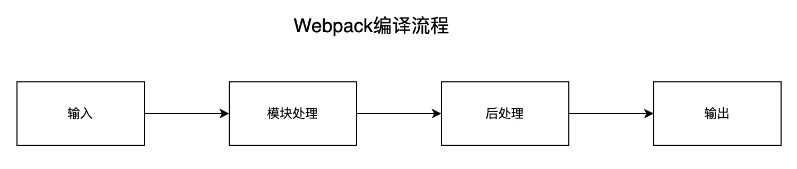
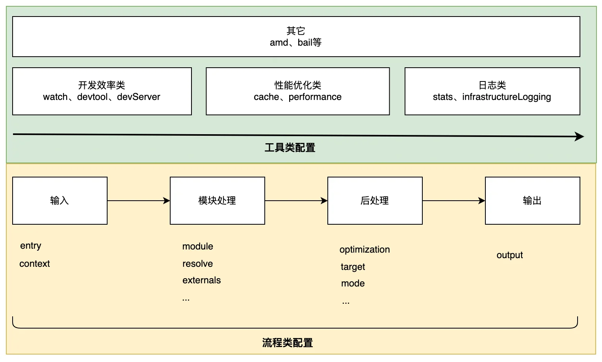
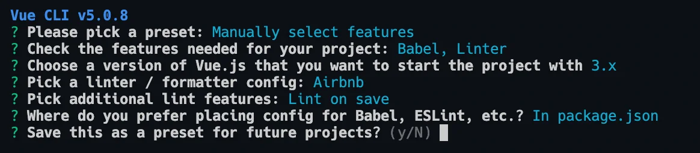
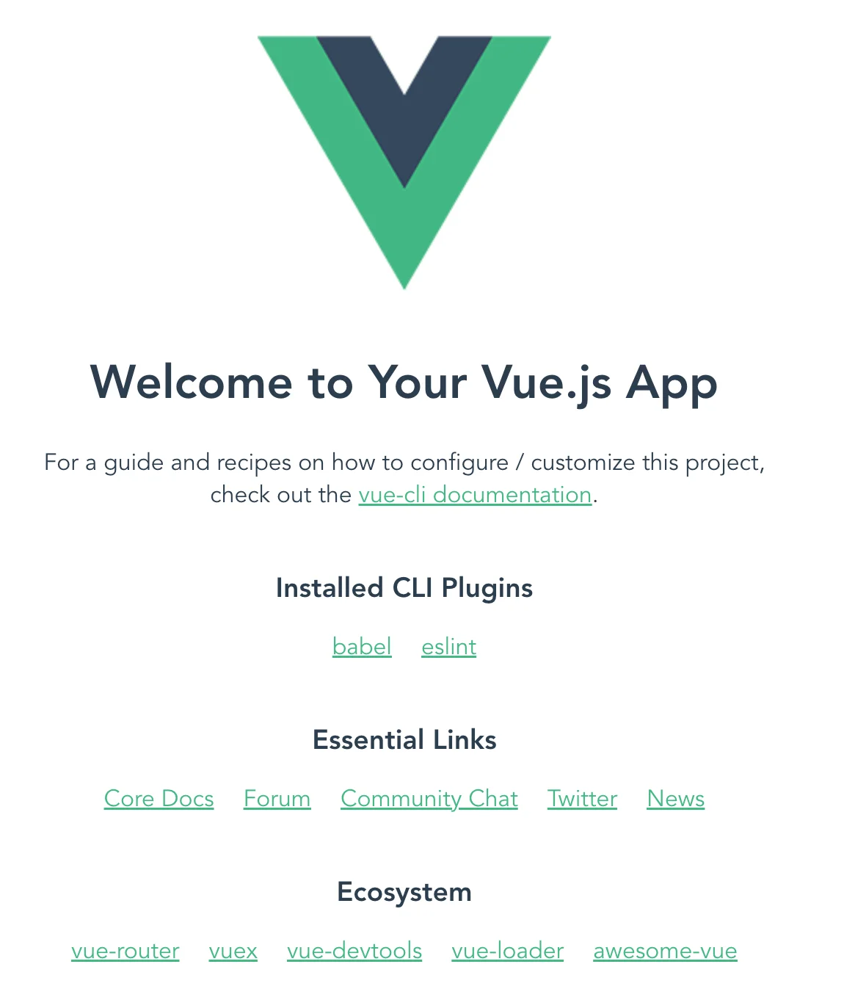
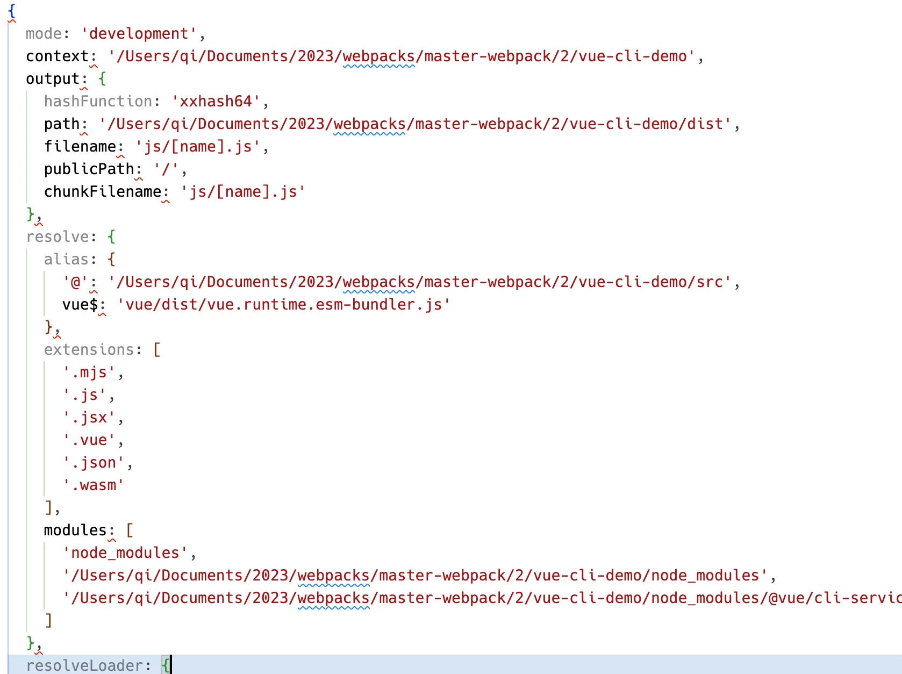

Webpack 5 提供了非常强大、灵活的模块打包功能，配合其成熟生态下数量庞大的插件、Loader 资源，已经能够满足大多数前端项目的工程化需求，**但代价则是日益复杂、晦涩的使用方法**，开发者通常需要根据项目环境、资源类型、编译目标编写一份复杂的配置文件，用以定制资源打包行为。

问题是，仅 Webpack 原生配置项就多达上百种，且各项之间缺乏一致性与关联度，对初学者而言单是掌握每一个配置的作用与变种就已经很难，更不用说理解配置与配置之间的协作关系。

对此，本章将尝试通过一种结构化视角分类讨论 Webpack 各个核心配置项的功能与作用；再用一个简单的例子介绍配置项结构的逻辑；最后介绍一些业界比较知名，能迅速生成项目脚手架的工具。


## 结构化理解 Webpack 配置项

Webpack 原生提供了上百种配置项，这些配置最终都会作用于 Webpack 打包过程的不同阶段，因此我们可以从流程角度更框架性、结构化地了解各项配置的作用。

Webpack 的打包过程非常复杂，但大致上可简化为：



- **输入**：从文件系统读入代码文件；
- **模块递归处理**：调用 `Loader` 转译 `Module` 内容，并将结果转换为 `AST`，从中分析出**模块依赖关系**，进一步递归调用模块处理过程，直到所有依赖文件都处理完毕；
- **后处理**：所有模块递归处理完毕后开始执行后处理，包括模块合并、注入运行时、产物优化等，最终输出 Chunk 集合；
- **输出**：将 Chunk 写出到外部文件系统；

从上述打包流程角度，Webpack 配置项大体上可分为两类：

- **流程类**：作用于打包流程某个或若干个环节，直接影响编译打包效果的配置项
- **工具类**：打包主流程之外，提供更多工程化工具的配置项

### ⚡流程类配置项综述

与打包流程强相关的配置项有：

- 输入输出：
  - `entry`：用于定义项目入口文件，Webpack 会从这些入口文件开始按图索骥找出所有项目文件；
  - `context`：项目执行上下文路径；
  - `output`：配置产物输出路径、名称等；
- 模块处理：
  - `resolve`：用于配置模块路径解析规则，可用于帮助 Webpack 更精确、高效地找到指定模块
  - `module`：用于配置模块加载规则，例如针对什么类型的资源需要使用哪些 Loader 进行处理⭐
  - `externals`：用于声明外部资源，Webpack 会直接忽略这部分资源，跳过这些资源的解析、打包操作
- 后处理：
  - `optimization`：用于控制如何优化产物包体积，内置 Dead Code Elimination、Scope Hoisting、代码混淆、代码压缩等功能
  - `target`：用于配置编译产物的目标运行环境，支持 web、node、electron 等值，不同值最终产物会有所差异
  - `mode`：编译模式短语，支持 `development`、`production` 等值，可以理解为一种声明环境的短语

这里的重点是，Webpack **首先**需要根据输入配置(`entry/context`) 找到项目入口文件；**之后**根据按模块处理(`module/resolve/externals` 等) 所配置的规则逐一处理模块文件，处理过程包括转译、依赖分析等；模块处理完毕后，最后**再根据**后处理相关配置项(`optimization/target` 等)合并模块资源、注入运行时依赖、优化产物结构等。

这些配置项与打包流程强相关，建议学习时多关注它们对主流程的影响，例如 `entry` 决定了项目入口，而 `output` 则决定产物最终往哪里输出；`resolve` 决定了怎么找到模块，而 `module` 决定了如何解读模块内容，等等。


### 工具类配置项综述

除了核心的打包功能之外，Webpack 还提供了一系列用于提升研发效率的工具，大体上可划分为：

- 开发效率类：
  - `watch`：用于配置持续监听文件变化，持续构建
  - `devtool`：用于配置产物 Sourcemap 生成规则
  - `devServer`：用于配置与 HMR 强相关的开发服务器功能
- 性能优化类：
  - `cache`：Webpack 5 之后，该项用于控制如何缓存编译过程信息与编译结果
  - `performance`：用于配置当产物大小超过阈值时，如何通知开发者
- 日志类：
  - `stats`：用于精确地控制编译过程的日志内容，在做比较细致的性能调试时非常有用
  - `infrastructureLogging`：用于控制日志输出方式，例如可以通过该配置将日志输出到磁盘文件
  - 等等

逻辑上，每一个工具类配置都在主流程之外提供额外的工程化能力，例如 `devtool` 用于配置产物 Sourcemap 生成规则，与 Sourcemap 强相关；`devServer` 用于配置与 HMR 相关的开发服务器功能；`watch` 用于实现持续监听、构建。

工具类配置内聚性较强，通常一个配置项专注于解决一类工程问题，学习时建议先对配置项按其功能做个简单分类，例如上述开发效率类、性能优化类等，之后再展开研究其可选值与效果。




综上，虽然 Webpack 提供了上百项复杂配置，但大体上都可以归类为流程类配置或工具类配置，对于流程类配置应该多关注它们对编译主流程的影响；而工具类则更加内聚，基本上一种配置项解决一种工程化问题。

除了上面提到的属性外，Webpack 还提供了诸如 `amd`、`bail`、`dependencies` 等配置项，但使用频率较低，此处先不展开讨论。


## 配置逻辑综合解析

接下来，我们构造一个简单示例，了解设计一个 Webpack 配置的过程，示例文件结构：

```bash
.
├── src
|   └── index.js
└── webpack.config.js
```

其中，`src/index.js` 为项目入口文件，`webpack.config.js` 为 Webpack 配置文件。在配置文件中，首先我们需要声明项目入口：

::: code-group

``` js [webpack.config.js]
module.exports = {
  entry: './src/index.js'
}
```

:::

之后，还需要声明产物输出路径：

::: code-group

``` js [webpack.config.js]
const path = require('path')

module.exports = {
  entry: './src/index.js',
  output: {
    filename: '[name].js',
    path: path.join(__dirname, './dist')
  }
}
```

:::

至此，已经足够驱动一个最简单项目的编译工作。但是，在前端项目中经常需要处理 JS 之外的其它资源，包括 css、ts、图片等，此时需要为这些资源配置适当的加载器：

::: code-group

``` js [webpack.config.js]
const path = require('path')

module.exports = {
  entry: './src/index.js',
  output: {
    filename: '[name].js',
    path: path.join(__dirname, './dist')
  },
  module: {
    rules: [{
      test: /\.less$/i,
      include: {
        and: [path.join(__dirname, './src/')]
      },
      use: [
        'style-loader',
        'css-loader',
        // '.loader',
        {
          loader: 'less-loader',
        }
      ],
    }]
  },
}
```

:::

到这里已经是一个简单但足够完备的配置结构了，接下来还可以根据需要使用其它工程化工具，例如使用 `devtool` 生成 Sourcemap 文件；使用 `watch` 持续监听文件变化并随之重新构建。后面章节会展开细节，此处不赘述。


## 脚手架工具

上述概览只是对从流程角度对 Webpack 配置项做了一个简单的分类总结，实际应用中往往需要牵涉更多 Loader、Plugin，加之性能、效率方面的考虑，配置复杂度往往会随项目推进而极速膨胀，届时配置管理会变得比较困难。为此，社区提供了许多用于快捷管理配置的工具，包括：

- [Vue CLI](https://cli.vuejs.org/guide/)：用于帮助用户快速创建、运行 Vue.js 项目脚手架的命令行工具；
- [create-react-app](https://create-react-app.dev/)：用于创建 React 项目脚手架的命令行工具；
- [@angular/cli](https://angular.io/cli)：用于创建 angular 项目的命令行工具；
- [webpack-cli](https://www.npmjs.com/package/webpack-cli)：Webpack 官方提供的命令行工具，提供了一套交互式生成配置文件的指令集，以及项目编译、开发、迁移等功能；
- [Neutrino](https://neutrinojs.org/installation/create-new-project/)：用于快速创建、运行现代 JavaScript 应用的工具，同时支持 React、Preact、Vue、Web、Node.js、Library 等场景；
- [react-starter-kit](https://github.com/kriasoft/react-starter-kit)：用于创建 [React](https://reactjs.dev) + [Relay](https://relay.dev/) + [GraphQL](https://graphql.org/) 应用的脚手架工具，内置 SSR 支持。

这些工具都内置了许多开箱即用的工程化能力，开发者无需从 0 开始学习 Webpack 与各种工程化组件，就可以直接使用工具一键生成足够应对中小型项目需求的工程化环境。下面我们逐一展开介绍 [Vue CLI](https://cli.vuejs.org/guide/)、[create-react-app](https://create-react-app.dev/)，你可根据技术栈需要侧重学习。


### vue-cli搭建项目脚手架

[Vue CLI](https://cli.vuejs.org/guide/) 全称 Vue.js Command-Line Interface，是由 Vue 核心团队开发，用于帮助用户快速创建、运行 Vue.js 项目脚手架的命令行工具。实现上，Vue CLI底层调用 Webpack 实现针对 `.vue` 等资源的编译打包功能；调用 webpack-dev-server 实现包含 HMR 功能的开发服务器功能；还能通过插件方式整合 ESLint、Babal、Less 等工具。

总之， Vue CLI提供了全套开箱即用的 Vue 项目开发、调试环境，开发者可以跳过繁琐复杂的环境配置过程，而专注于业务代码开发上。

与其它工具类似，使用 Vue CLI 时首先需要安装依赖：

```bash
npm i -g @vue/cli

# 或者使用 yarn
yarn global add @vue/cli
```

安装完毕后，可以使用 `vue -V` 测试是否安装成功：

```bash
vue -V

# @vue/cli 5.0.8
```

接下来，使用 `vue create` 命令创建项目：

```bash
vue create [项目名]
```

::: tip

可使用 `vue create --help` 命令查看 `create` 的参数列表

:::

执行 `create` 命令后，CLI 会进一步询问使用何种脚手架方案：

```bash
vue create vue-cli-demo


Vue CLI v5.0.8
? Please pick a preset: (Use arrow keys)
❯ Default ([Vue 3] babel, eslint)
  Default ([Vue 2] babel, eslint)
  Manually select features
```

这里 Vue CLI 内置了为 Vue 2、Vue 3 分别定制的脚手架方案，对应上述第一、二项，不过这两种方案默认只会包含 Babel、Eslint 工具，实用性不强。所以结合项目的实际需求，通常会选择第三个选项 "Manually select features" 定制各项特性：



经过上述步骤后，Vue CLI 最终都会生成对应的文件并自动安装依赖，之后就可以使用 `serve` 命令启动项目：

```bash
npm run serve
```

顺利的话，最终会运行起页面如：



Vue CLI 底层依赖于 Webpack 实现编译打包等工程化能力，开发者可通过 `configureWebpack` 与 `chainWebpack` 配置项修改 Webpack 配置信息。

以 `configureWebpack` 为例，使用时需要在 `vue.config.js` 文件中写入配置：

::: code-group

``` js [vue.config.js]
module.exports = {
  configureWebpack: {
    plugins: [
      new MyAwesomeWebpackPlugin()
    ]
  }
}
```

:::

`configureWebpack` 的配置规则与 Webpack 一致，同样支持 `plugins/module/resolve` 等配置项。实际上，Vue CLI 内部最终会调用 [webpack-merge](https://github.com/survivejs/webpack-merge) 将 `configureWebpack` 值与其它上下文配置合并，生成最终的 Webpack 配置信息。

`chainWebpack` 的用法与 `configureWebpack` 一致，区别仅在于此处支持 [webpack-chain](https://github.com/neutrinojs/webpack-chain) 语法 —— 即以函数方式链式修改 Webpack 配置：

::: code-group

``` js [vue.config.js]
module.exports = {
  chainWebpack: config => {
    config.module
      .rule('vue')
      .use('vue-loader')
        .tap(options => {
          // 修改某些配置项
          return options
        })
  }
}
```

:::

- [vue-cli working with webpack](https://cli.vuejs.org/guide/webpack.html#simple-configuration) 查看详细信息

Vue CLI 在 Webpack 基础上包装多一层更易用的功能结构，这确实能极速提升研发效率与体验，但代价则是我们完全不清楚其内部运作细节，这会导致开发者比较难做一些深度定制或者性能优化，此时可使用 `inspect` 命令生成完整的 Webpack 配置信息：

```bash
vue inspect > output.js
```

`inspect` 命令执行完毕后，会生成内容如：



此外，`inspect` 还提供许多根据不同条件生成配置的参数，例如针对编译环境生成配置：

```bash
vue inspect --mode production > output.prod.js
```

更多用法，可查阅帮助文档：`vue inspect --help`。


### CRA搭建项目脚手架

[CRA](https://create-react-app.dev/) 全称 Create React Application，同样是用于帮助用户快速创建、运行 React 项目脚手架的命令行工具，功能、底层实现、用法都与 Vue CLI 相似，都提供了全套开箱即用的 React 项目开发、调试环境。

CRA 用法同样简单：

```bash
npx create-react-app cra-demo
```

执行完毕后，生成项目文件：

```bash
.
├── README.md
├── node_modules
├── package-lock.json
├── package.json
├── public
│   ├── favicon.ico
│   ├── index.html
│   ├── logo192.png
│   ├── logo512.png
│   ├── manifest.json
│   └── robots.txt
└── src
    ├── App.css
    ├── App.js
    ├── App.test.js
    ├── index.css
    ├── index.js
    ├── logo.svg
    ├── reportWebVitals.js
    └── setupTests.js
```

之后，进入 `cra-demo` 目录执行 `npm start` 命令即可运行项目。

默认规则创建的脚手架包含如下工程能力：

- JSX、ES6、TypeScript、Flow 语法支持
- CSS 自动添加 `--webkit--` 前缀
- 基于 [Jest](https://jestjs.io/) 的自动化测试能力
- 支持 HMR 的开发服务器
- 等等，具体可参考 [cra github](https://github.com/nitishdayal/cra_closer_look)

必要时，读者也可以通过 `npm run eject` 命令导出完整的项目配置结构：

```bash
├── README.md
├── node_modules
├── config
│   ├── env.js
│   ├── getHttpsConfig.js
│   ├── jest
│   │   ├── babelTransform.js
│   │   ├── cssTransform.js
│   │   └── fileTransform.js
│   ├── modules.js
│   ├── paths.js
│   ├── webpack
│   │   └── persistentCache
│   ├── webpack.config.js
│   └── webpackDevServer.config.js
├── package-lock.json
├── package.json
├── public
│   ├── favicon.ico
│   ├── index.html
│   ├── logo192.png
│   ├── logo512.png
│   ├── manifest.json
│   └── robots.txt
├── scripts
│   ├── build.js
│   ├── start.js
│   └── test.js
└── src
    ├── App.css
    ├── App.js
    ├── App.test.js
    ├── index.css
    ├── index.js
    ├── logo.svg
    ├── reportWebVitals.js
    └── setupTests.js
```

导出配置后，直接修改 `webpack.config.js` 等相关配置文件即可控制各项功能行为。

::: tip

为了扩展可以使用 [craco](https://www.npmjs.com/package/@craco/craco) 脚手架

:::

## 总结

Webpack 配置项的用法虽然比较复杂难懂，但通常可以分为流程类或工具类，流程类配置项通常会直接影响 Webpack 打包编译的规则；而工具类相对比较独立，通常用于在编译主流程之外提供额外的工程化能力。

此外，为了降低 Webpack 的应用成本，社区已经出现了不少优秀的脚手架工具，包括[Vue CLI](https://cli.vuejs.org/guide/)、[create-react-app](https://create-react-app.dev/)、[@angular/cli](https://angular.io/cli)等，读者可在具体技术栈上下文下使用适当工具，简化工程化管理。


## 思考题

工具类与流程类配置有什么区别？分别有什么特点？


::: details 评论区答案

> 答案1

流程类为主流程，也就是webpack最直接的目的，将不同的文件通过一定的流程转化为浏览器可以直接访问的三剑客，可以让我们前端在开发的过程中自由组合想要的内容。

工具类为衍生的需求，他是我们在完成饱腹之欲后产生的新的需求，如何让我在开发的过程中修改代码直接能看到效果，如何在项目打包代码压缩后报错我依然能直接找到对应的错误出在哪里，随着项目的变大，怎么能减少我们构建的时间。怎么能了解打包时到底发生了什么。


> 答案2

1. 流程类主要控制 webpack 打包编译过程的各个流程
2. 工具类独立于 webpack 编译过程，提供一些额外的功能使得工程更易于使用，比方说 devtool 的 sourcemap，让索引位置更方便，比方 devServer 启动一个本地服务，这是 webpack 编译流程不具备但是对于整个工程而已很重要的功能
3. 类比微波炉做菜，我们调配温度，时间，属于流程类配置，菜好了“叮”一下，还是“叮咚”一下，是只响一声还是持续不断，是声音还是发个信息给手机，这个配置和做菜本质无关，但是它提醒你快点取出防止菜凉了，是相辅相成的（虽然普通微波炉不具备工具类的配置）

:::


2023年04月07日13:56:43

