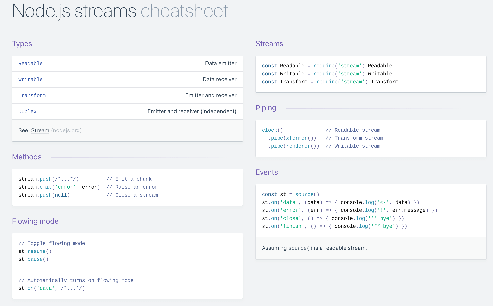
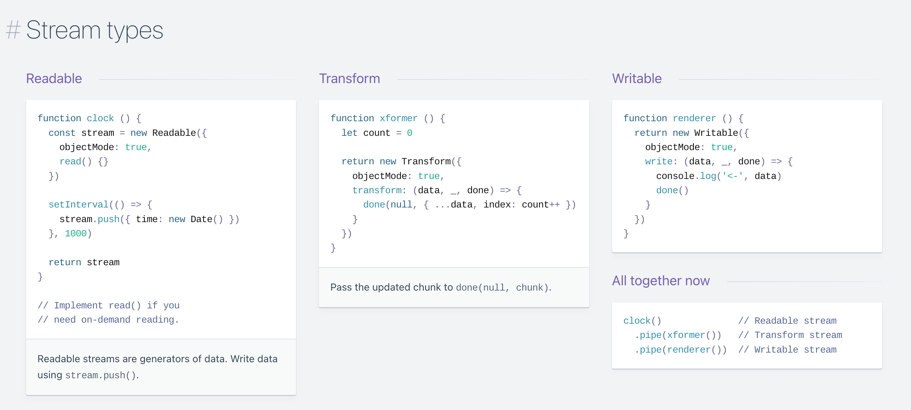

可以说Streams是Node.js的灵魂。下面介绍一些关于好的学习资源。

## cheatsheet
关于流的cheatsheet: [Nodejs Streams cheatsheet @devhints.io](https://devhints.io/nodejs-stream)

## 文章
1. [A Visual Guide to NodeJS Streams — Advanced NodeJS Part 4](./stream-visulization)
   - 通过可视化的方式了解Node中 `Readable` & `Writable` & `Duplex` & `Transform` 4种流
   - 如何使用 `Readable` 流的 `pipe()` 方法将其它流管道连接起来
   - `Readable` & `Writable` 流内部 `highWaterMark` 的含义以及作用，什么是 `背压`
   - `fs.createWritableStream` 会创建一个可读流，但是它是处于 `暂停` 状态的，当通过 `pipe()` 连接到其它的流时，可读流将变为 `流动` 模式
   - 如果使用管道对一份可读流进行多次拷贝
   - 使用流进行图片压缩的具体实例，将一个可读流连接到转换流，再连接到可写流
2. [NodeJS Streams in Practice — Advanced NodeJS Part 5](./stream-in-practice) 流在实际应用中使用示例
   - `Readable` 各种事件的触发时机，以及事件之间的关联关系
   - `Readable` 的2种模式 - 流动模式（`flowing mode`） & 暂停模式（`paused mode`）；以及2种模式之间如何进行相互的转换
   - `Readable` 的 `pipe()` 方法，将多个流进行连接
   - http模块中的 `IncomingMessage` & `OutgoingMessage` 以及 `Socket` 本质上都是流
   - `pipeline()` 方法对于错误处理的优势，而 `pipe()` 方法则对于错误处理不是很方便，因此尽可能的使用 `pipeline()` 将多个流进行连接
   - 通过将http请求进行Hash运算后返回的例子，展示使用 `pipeline()` 将 `可读流 - 转换流 - 可写流` 进行连接
   - `crypto` 模块的 `createHash` 本质上是一种转换流
