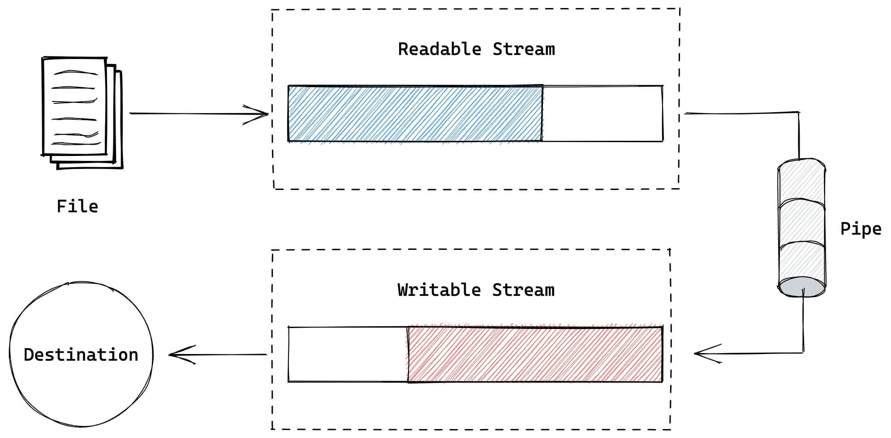
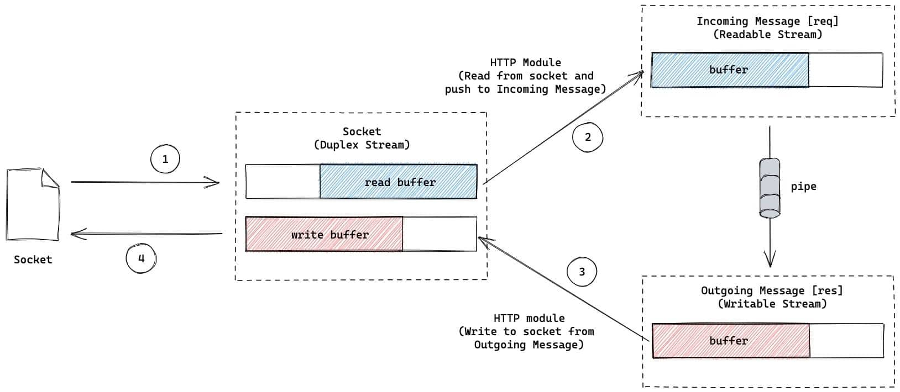
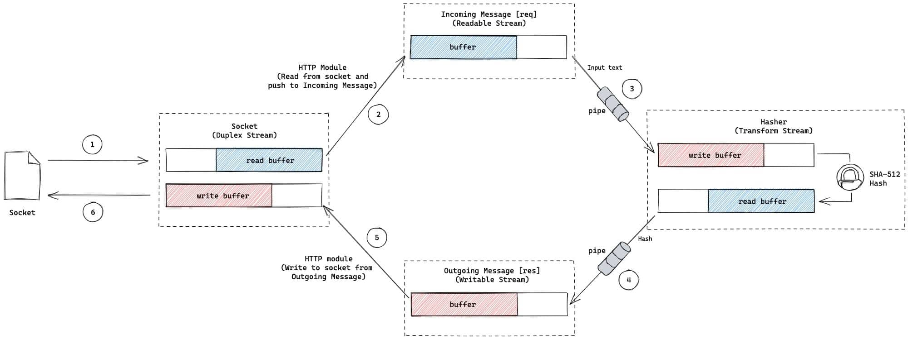

在 [A Visual Guide to NodeJS Streams - Deepal Jayasekara @medium](https://blog.insiderattack.net/a-visual-guide-to-nodejs-streams-9d2d594a9bf5) 这篇文章中，我描述了什么是流，以及使用可视化的方式表示了如何在NodeJS中使用流。可视化对于粗略理解概念很好，但是如果能在实际应用中使用它，则可以加深理解。这篇文章中，我们将展示在实际的应用中，如何使用流。


## 1️⃣ ⭐理解可读流（Understanding a Readable Stream）

在进一步阅读前，我们使用下面例子来理解可读流是如何工作的。下面代码中，我使用 `fs.createReadStream` 方法创建一个可读流，读取 `foo.txt` 文件，文件类容是 **`This is foo!!!`**:

```js {5,14,18,22,26,30}
const fs = require('fs')

const reader = fs.createReadStream('./foo.txt')

reader.on('open', () => {
  console.log('file opened!')
  reader.pause()
  
  setTimeout(() => {
    reader.resume()
  }, 3000) // wait for 3s before
})

reader.on('data', (chunk) => {
  console.log('got some data: ', chunk.toString())
})

reader.on('pause', () => {
  console.log('stream paused!')
})

reader.on('resume', () => {
  console.log('stream in flowing mode!')
})

reader.on('end', () => {
  console.log('stream ended!')
})

reader.on('close', () => {
  console.log('stream closed!')
})
```

如果我们运行上面代码，会输出：

```bash
stream in flowing mode!
file opened!
stream paused!
waiting for 3 seconds...
stream in flowing mode!
got some data:  This is foo!!!
stream ended!
stream closed!
```

让我理解这些输出：

1. 当我们调用 `fs.createReadStream()` 方法时，会创建一个可读流，但是其默认不是 `flowing` （流动）模式，这意味着流不能从 `foo.txt` 文件中生成数据
2. 一旦我们添加了 `data` 事件，流切换为 `flowing` 模式，并触发 `resume` 事件，从而调用监听 `resume` 事件的handler
3. 操作系统打开 `foo.txt` 会导致可读文件流触发 `open` 事件，这会调用监听了 `open` 事件的handler
4. 在 `open` 事件handler中，我们调用了 `reader.pause()` 方法。这将导致流从 `flowing` （流动）模式切换为 `paused` （暂停）模式。在暂停模式中，流不会从底层文件中产生任何数据。因此，直到流显式的回到 `flowing` 模式之前都不会触发 `data` 事件
5. 3秒等待后，我们调用 `reader.resume()`，将流切换回 `flowing` 模式，然后流就会开始产生数据，并触发 `data` 事件
6. 依据文件尺寸，会触发一次或多次的 `data` 事件。在我们这个示例中，文本数据流很小，足以被缓存到内存中，因此只会触发一次 `data` 事件。
7. 一旦数据从流中完全读取，流会触发 **`end`** 事件，用于表示流中没有需要被读取的数据了
8. 最后，操作系统关闭底层文件，`close` 事件被触发

依据可读流的目的，也可能触发一些实现相关的自定义事件。这个例子中，虽然我们只看到了可读流不同阶段，但是 `flowing & paused` 模式在所有可读流中都是通用的😎。


::: tip 译者注

理解这个例子，对于 `Readable` 流的各个事件含义，有很大的帮助🚀

:::


## 2️⃣ 一个简单的管道（A trivial pipe）

正如管道将水源和目的地连接在一起一样，流中的 **管道** 用于将可读流和可写流进行连接。我们先从 [流可视化](./stream-visulization) 这篇文章回想一下 `管道` 是什么：




下面代码片段中，我们使用 `fs.createReadStream` 创建一个可读流，并将其与 `process.stdout` 可写流连接到一起，将文本打印到控制台，比如：

```js
fs.createReadStream('./foo.txt')
	.pipe(process.stdout)
```

::: tip

最常用的 `console.log` 是对 `process.stdout` 的包装😎

:::


## 3️⃣ 一个回响服务器（An echo server）

下面我们看看，如何在一个稍微不同的情形下使用管道。下面是一个回响服务器，它接受客户端的请求，然后将客服端请求的body再返回给客户端

```js {4}
const app = require('express')()

app.post('/', (req, res) => {
  req.pipe(res)
})

app.listen(3000)
```

下面我们试着理解 `req & res` 的含义。

当客服端和服务端进行通信时，它们其实是通过操作系统在各端创建的 **`sockets`** 来进行的。在NodeJS应用中，我们可以使用 [TCP Socket 流](https://nodejs.org/api/net.html#net_class_net_socket)  进行通信。正如 [Stream图解](./stream-visulization) 这篇文章中提到的，**NodeJS中的TCP socket 是一个双工流**，因此既可以从Socket中读取数据，也可以向Socket中写入数据。

然而，NodeJS的 `http` 模块基于TCP sockets的基础上提供了更多的功能，暴露了2个分开的用于从socket中读取和写入socket的流：

1. [IncomingMessage](https://nodejs.org/api/http.html#class-httpincomingmessage): 来自socket的可读流。在上面例子中，可以在request handler中通过 `req` 对象访问到该流。NodeJS的 `http` 模块从socket中读取进来的请求内容，然后将其推入到 `IncomingMessage` 可读流中。
2. [OutgoingMessage](https://nodejs.org/api/http.html#class-httpoutgoingmessage): 写入到socket的可写流。在上面例子中，可以在request handler中通过 `res` 对象访问到该流。NodeJS的 `http` 模块将写入 `OutgoingMessage`  可写流的数据传递给socket流。这个数据然后被写入到由操作系统创建的实际的TCP socket中，然后发送给客户端

掌握了这些信息后，我们的回响服务器可以用下图表示：



在这个回响服务中，我们简单的将 `req` 可读流通过管道连接到 `res` 可写流中，因此请求体内容再次返回到客户端中。

我们可以开启服务，使用 `curl` 命令来演示：

```bash
curl -d"hello" http://localhost:3000
```

你将看到从服务端返回的 `hello` 。


## 4️⃣ 多次管道（Pipe multiple times）

目前，我们看到了如何使用 `pipe` 将一个可读流和一个可写流进行连接。`pipe` 还可用于将一个可读流连接到多个可写流中😎。下面例子中，来自可写流的内容被拷贝到2个可写流中。

将 `foo.txt` 使用 `pipe` 创建2个 `copy1.txt & copy2.txt` 拷贝：


```js
const fs = require('fs')

const reader = fs.createReadStream('./foo.txt')
const writer1 = fs.createWriteStream('./copy1.txt')
const writer2 = fs.createWriteStream('./copy2.txt')

reader.pipe(writer1)
reader.pipe(writer2)
```


::: tip

尽管这是一个很简单的例子，但是多管道在实际应用中是十分有用的。比如，在http服务中，你想将进来的请求代理到上游的服务器的同时，将请求的内容用于日志和监控。

:::


> 管道的问题

管道虽然很有用和便利，但是对流使用多管道处理错误会变得很棘手。这是因为可读流或可写流如果发生错误，管道不会自动的销毁和清理，这可能导致内存泄漏。因此，在生产中使用 `require('stream').pipeline` 函数去将流管道化就很明智。它能够帮助你追踪错误以及进行清理：[pipeline - nodejs docs](https://nodejs.org/api/stream.html#streampipelinestreams-callback)


::: warning 译者注

能使用 `pipeline` 就尽量使用它，Readable的 `pipe()` 方法对于错误处理并不是很友好，这一点可以参考一下 Node.js Patterns 关于Streams的章节。

:::


## 5️⃣ hash服务器（A hash server）

上面的例子中，我们讨论了可读流和可写流，下面我们看看如何将可写流，转换流和可写流结合起来。

下面的服务，对请求的body内容生成 `SHA-512`：

```js {1,8}
const { pipeline } = require('stream')
const { createHash } = require('crypto')
const app = require('express')()

app.post('/hash', (req, res) => {
  const hasher = createHash('sha512')
  hasher.setEncoding('base64')
  pipeline(req, hasher, res, (err) => {
    if (err) {
      console.log(err)
      return !res.headersSent && res.sendStatus(500)
    }
  })
})

app.listen(3000)
```

上面的例子中，使用到了 `pipeline` 方法，而不是之前的 `pipe()`,下图为hash服务的功能图：




下面试着理解上图的流程的含义：

1. 正如之前了解的， `req` 是一个可读流，我们可用它读取请求的内容
2. `crypto` 模块中的 `createHash` 函数可以创建一个 **hash 流**， 它是一个转换流，因此我们可以将内容写入到它里面，然后经过hash函数，得到hash后的内容。通过将 `req` 可读流连接到 `hasher` 转换流，我们将请求体进行hash处理
3. `res` 是一个可写流， 当 `hasher` 通过管道连接到 `res`, `hasher` 产生的hash数据流流向 `res` 流，最终写入到socket中

下面我们启动服务，使用 `curl` 命令：

```bash
curl -d"test" http://localhost:3000/hash
```

你将得到下面输出响应内容，它是对 `test` 进行 `SHA-512`后，然后base64编码后的字符：

```bash
7iaw3Ur350mqGo7jwQrpkj9hiYB3Lkc/iBml1JQODbJ6wYX4oOHV+E+IvIh/1nsUNzLDBMxfqa2Ob1f1ACio/w==
```

流因其高效性和低内存使用，在NodeJS应用中被广泛使用，如果你想进一步深入学习，推荐阅读NodeJS中[流的官方文档](https://nodejs.org/api/stream.html)。


原文链接：

- [Node.js Streams In Practice](https://blog.insiderattack.net/nodejs-streams-in-practice-980b3cdf4511)


2022年12月05日15:49:37


