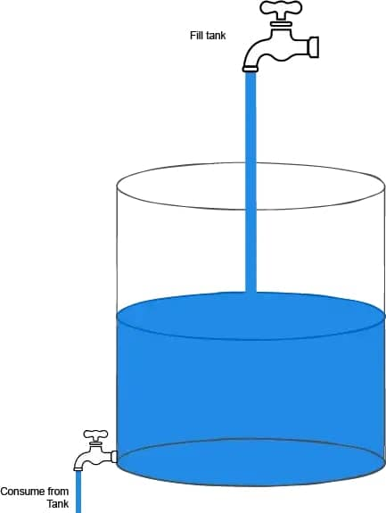
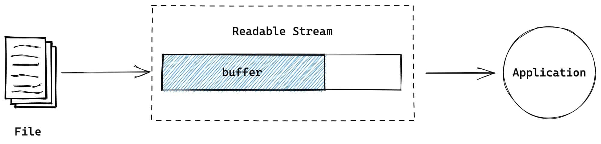
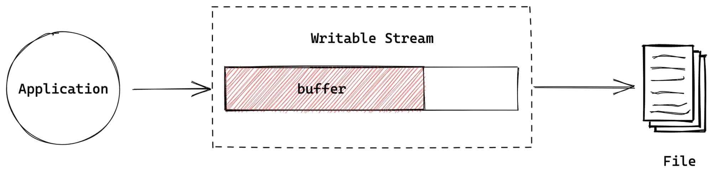
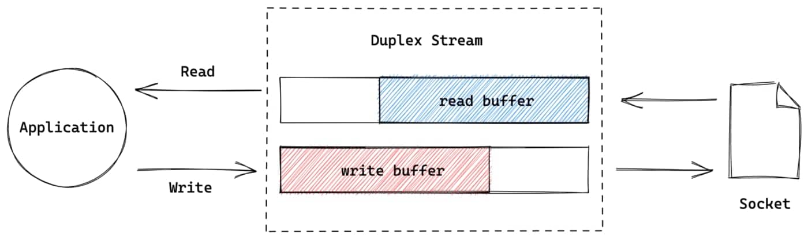
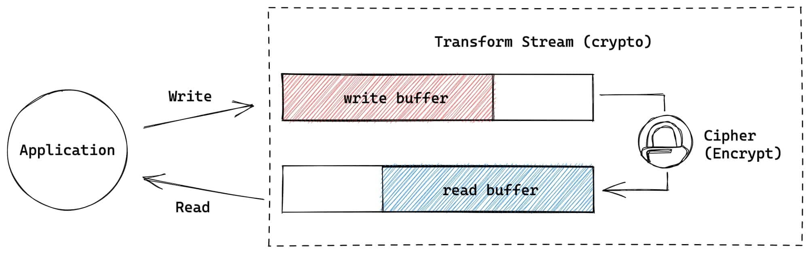
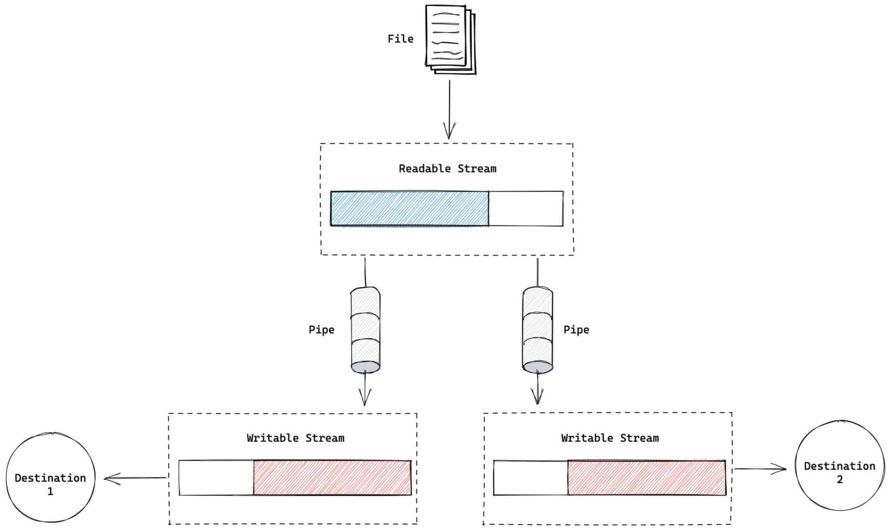
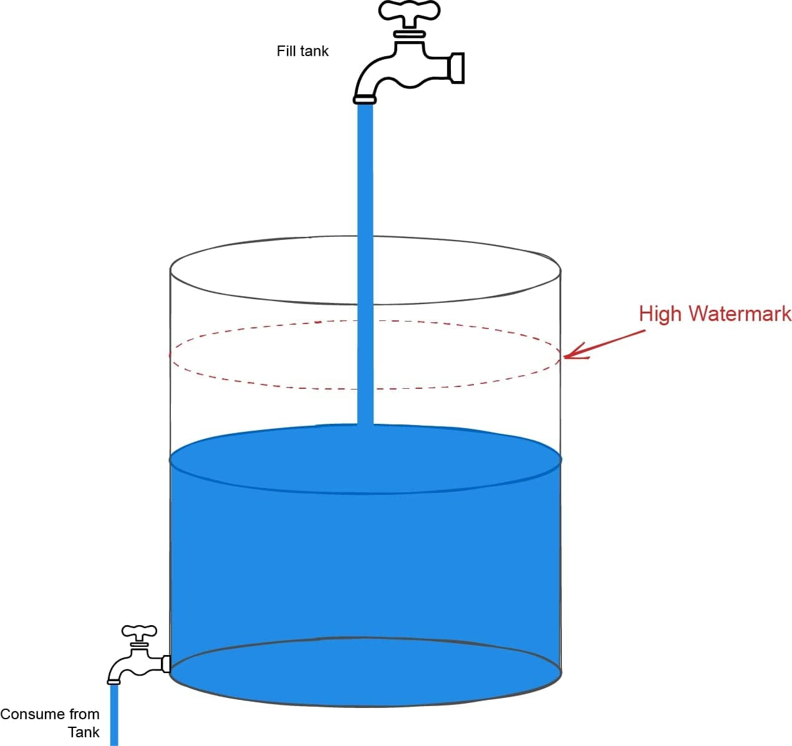
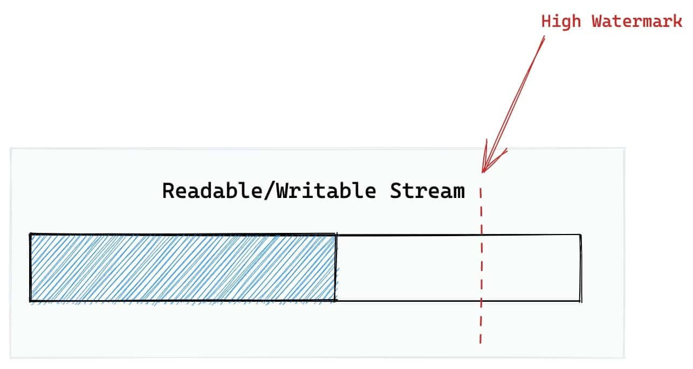
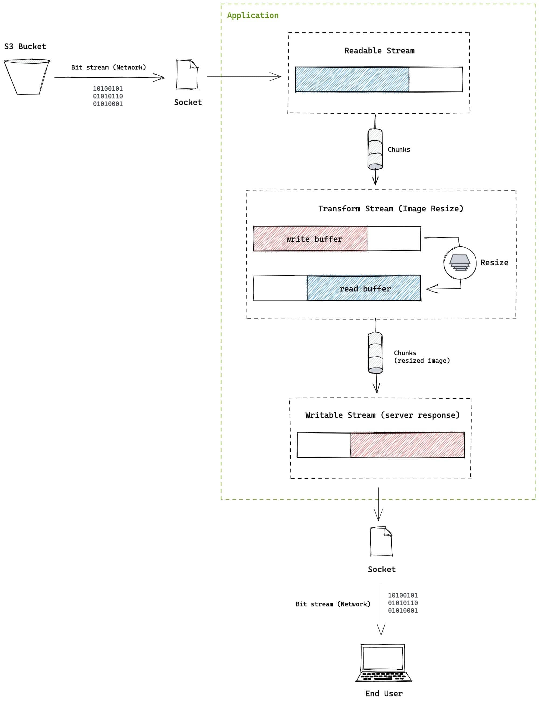

想象你有一堆砖，你想用这些砖砌一面墙。假设你有一个朋友帮助你移动这些砖块。为了砌这面墙，你现在有2个选择：

1. 等你朋友将这堆砖全部搬给你之后，你再开始砌墙
2. 只要你朋友给你砖，你就开始砌墙

哪一种更高效呢？显然第2种方式更加的高效，**这其实是 `stream` （这里实例是砖块流）提升效率的一个很形象的比喻**。另一个常见的场景就是，看电影时，边看边缓存，而不是将整部电影下载好之后再去看。

::: info

维基百科对 **流** 的定义是： *在计算机科学中，流是随时间推移可用的数据元素序列。流就像传送带上的物件，一次只处理部分，而不是一次性大批量的被处理*。

:::

在Node.js中，[stream模块](https://nodejs.org/api/stream.html) 提供了很多处理流的工具。即使你没有显式的使用过流模块，但是Node.js应用很多底层功能都会用到流。流是一个简单的概念，但是如果你之前没接触过流的概念，会觉得它很复杂。因此，这里我用可视化的形式来描述Node.js中流的一些关键概念，希望能帮助你理解。


## 1️⃣ 水流和信息流（Water flows, Information flows）

信息就像液体，它以 `bits` 流的形式从一个地方流向另一个地方。例如，当2个人通过网络聊天时，流从一个地方流向另一个地方，即使你的应用可能通过磁盘或者外设通信。但这种形式的 **I/O** 出现时，信息从一个设备读取，然后流向应用，反之亦然。

然而，有可能出现，在上述的事务中一个终端由于种种原因比另一个设备更慢。因此，一些数据可能需要在中间地段被“缓冲”起来，直到接收端准备好接受更多数据。

如下图所示，2个尺寸不一样大的水龙头通过一个罐子连接，上面注入水的速度比下面排水的速度更快。因此，罐子必须临时存储（**缓冲**）多余的水。



📚 这便是Node.js中流的基本思想。**`stream` 模块模块在处理流数据时提供了实现此行为的功能。** Node.js中提供了2种基本的流类型：

1. **可读流（`Readable Stream`s）**
2. **可写流（`Writable Streams`）**

然后还有2种混合了上面2种基本流的混合类型流，用于特殊的目的：

1. **双工流（`Duplex Streams`）**
2. 转换流（`Transform Streams`）

下面我们了解更多的细节，尝试可视化这些概念🤩。


## 2️⃣ Readable Stream

📚可读流可用于从底层源（比如 `file descriptor`） 读取数据。如果应用消耗数据的速度比操作系统从源读取的数据要更慢，可以使用`Readable内部`的 [Buffer](https://nodejs.org/api/stream.html#stream_buffering) 对数据进行缓存:



NodeJS中几个最常见的可读流是：

1. [process.stdin](https://nodejs.org/api/process.html#process_process_stdin)
2. [fs.createReadStream](https://nodejs.org/api/fs.html#fs_fs_createreadstream_path_options)
3. HTTP服务中的 [IncomingMessage](http://nodejs.cn/api/http.html#http_class_http_incomingmessage) 对象


## 3️⃣ Writable Stream

可写流用于将应用中的数据写入到特定的目的地。如果目的地消耗数据的速度比写入应用程序要更慢，为了防止数据丢失或目的地过载，数据可以存储在`Writable内部`的 [Buffer](https://nodejs.org/api/stream.html#stream_buffering)  中:



你平时最常用的可写流，可能就是 [process.stdout](https://nodejs.org/api/process.html#process_process_stdout), `console.log` 底层就是用到的它，除了它以外，另外2个很常见的写入流是：

1. [process.stderr](https://nodejs.org/api/process.html#process_process_stderr)
2. [fs.createWriteStream](http://nodejs.cn/api/fs.html#fs_fs_createwritestream_path_options)


## 4️⃣ Duplex Stream

::: tip

正如上面提到的，`双工流`是可读流和可写流的混合体。连接双工流的应用，能同时从双工流中读取数据和向双工流中写入数据📚。

:::

最常见的双工流就是 [net.Socket](http://nodejs.cn/api/net.html#net_class_net_socket)。在双工流中，读和写是`相互独立`的部分，它们都各自拥有自己的buffers📚:




## 5️⃣ Transform Stream

::: tip

转换流是一个更特别的混合体，它的可读部分以某种方式连接到它的可写部分。

:::

最常见的形式，可能是 [Cipher](https://nodejs.org/api/stream.html#stream_buffering) 类创建的加密流（crypto stream）。这种形式中，应用将普通数据写入流中，然后从相同的流中读取加密后的数据:




可能最简单的转换流就是 [stream.PassThrough](http://nodejs.cn/api/stream.html#stream_class_stream_passthrough), 其输入的数据不经过任何转换就传递给输出。虽然听起来没什么用，但是可用它实现对流的自定义行为。

::: tip 💡

可把 `PassThrough` 理解为RxJS中的 [Tap](https://www.learnrxjs.io/learn-rxjs/operators/utility/do) 操作符

:::


## 6️⃣ Piping Streams

📚在很多情形下，将多个流连接起来会更加有用。我们称之为 **管道 （`piping`）**。你可以使用`可读流`提供的 **`pipe()`** 方法将可读流连接到另一个可写流或者双工流或者转换流上：


比较常见的一个例子就是，将 `fs.createReadStream()` 和 `fs.createWriteStream()` 通过管道连接起来，实现将文件从一个地方拷贝到另一个地方的功能。


## 7️⃣ Copying Data with Streams🌰

管道的另一个有趣的地方就是，可以将同一个流使用管道多次连接起来😎。这对需要多次读取相同流的情况很有用，因为在另一个消费者完全读取后，你无法再次从可读流中读取。然而，通过多次管道可读流，多个消费者可以通过从原始可读流复制数据来读取相同的流。

下面的简单示例中，我们对`original.txt` 文件进行2次拷贝：

```js
const fs = require('fs')

const original = fs.createReadStream('./original.txt')
const copy1 = fs.createWriteStream('./copy1.txt')
const copy2 = fs.createWriteStream('./copy2.txt')

original.pipe(copy1)
original.pipe(copy2)
```

上面示例，用图形表示如下：




## 8️⃣ 背压（Backpressure）

现在我们回顾一下我们之前水箱的比喻，在上面的比喻中，上流以更快的速度注水，下流消费速度比较慢。这种情形下，水箱高度会持续上涨，直到某时刻可能溢出水箱，造成水流的浪费。

如果我们能 **检测** 正在发生什么，从而让上流停止注入呢？我们可以标记水箱的最高平面，当水面高度超过水箱的标记时，要求上流停止继续注水💡。




这和流的工作原理很类似。可读流和可写流能内部缓冲数据，缓冲数据量的大小是依据系统可获得内存大小而定的。因此，流有个阈值称之为 **`highWaterMark`**, 它可用于检测数据传入流的速率是否远高于数据从流中清除的速率。

举个例子，当可读流连接可写流时，当可写流的缓存超过 `highWaterMark` 时， 可写流能够要求可读流停止流动（`flowing`）。



然而 `highWaterMark` 不是一个硬性的限制，而只是一个阈值，但是在构建自定义流时遵守该阈值很重要，以避免数据丢失或不期望的内存使用。


## 9️⃣ 图片压缩实例🌰

目前我们讨论了不同类型的流，以及如何使用它们，下面我们拿一个现实中的例子对其进行可视化小结。

下面是一个简单图片服务的设计。在这个服务中，图片从Amazon S3 bucket取回，然后作为一个可变尺寸的图片提供给终端用户：


::: warning

如果我们不使用流，我们将整个文件从S3 bucket中获取，然后将其保留到内存中，一次性的调整整个图片尺寸，然后将调整好的尺寸发送给用户。

:::

然而，如果我们使用流，可以将上面的过程高效的连接起来，提升应用速度和优化内存的使用😎。

因为来自S3 bucket的数据流是一种`可读流`，我们可以以某种方式通过`管道`将其与一个用于转换图片尺寸的`转换`的流连接起来。因为转换流也是可读的，我们可以直接将其通过管道传输到响应流，以便调整来自 S3 bucket的数据块的大小并将其发送给用户，而无需等待来自 S3 bucket的整个文件




按照这个思路，你可以自己对上面的过程进行实现。图片尺寸转换可以使用 [sharp](https://sharp.pixelplumbing.com/) 这个库，它是一个双工流，而不是转换流（原因参考 [sharp github issue@1704](https://github.com/lovell/sharp/issues/1704)）。


原文链接：

- [A Visual Guide to NodeJS Streams - Deepal Jayasekara @medium](https://blog.insiderattack.net/a-visual-guide-to-nodejs-streams-9d2d594a9bf5)


2022年12月05日14:31:13