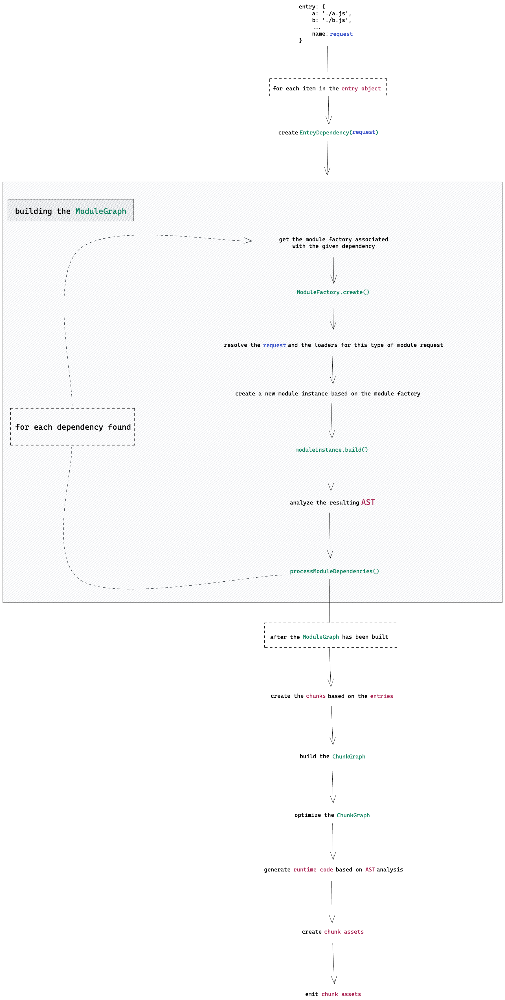
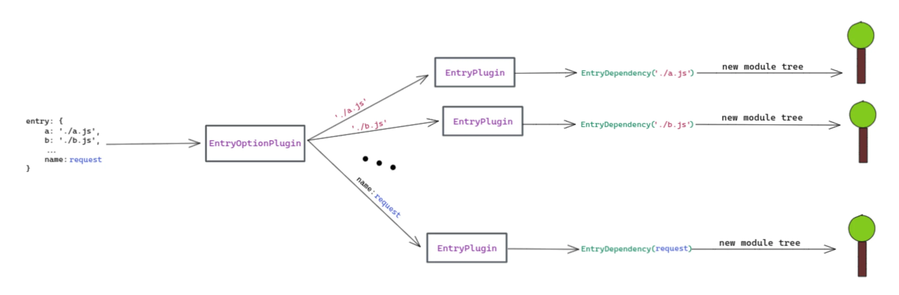
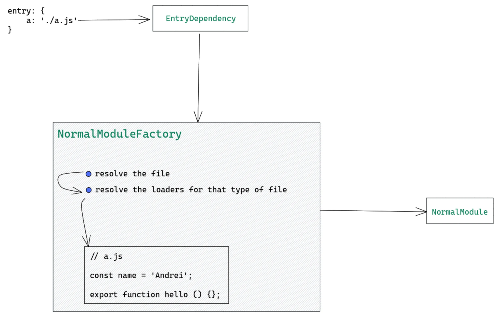
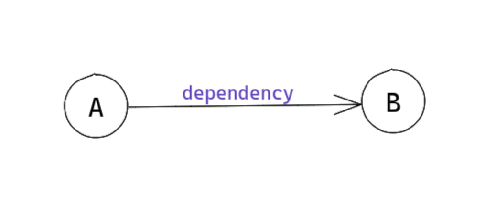
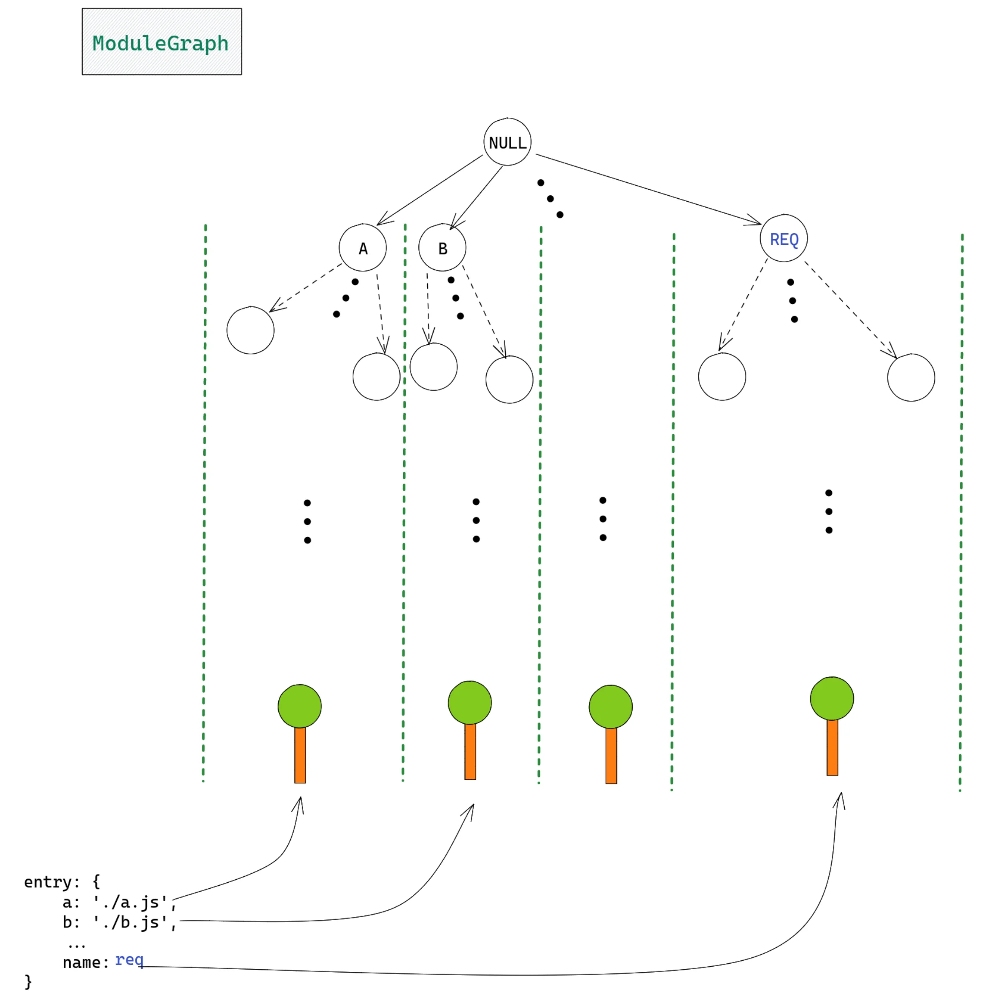
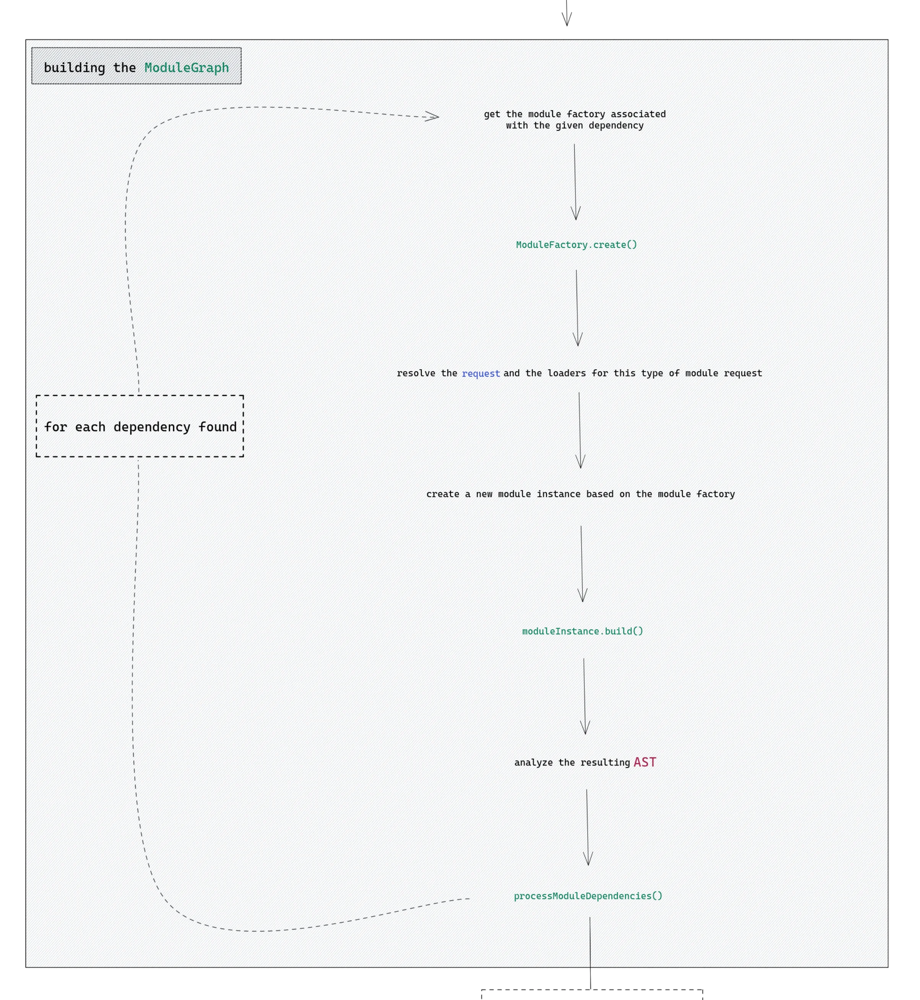
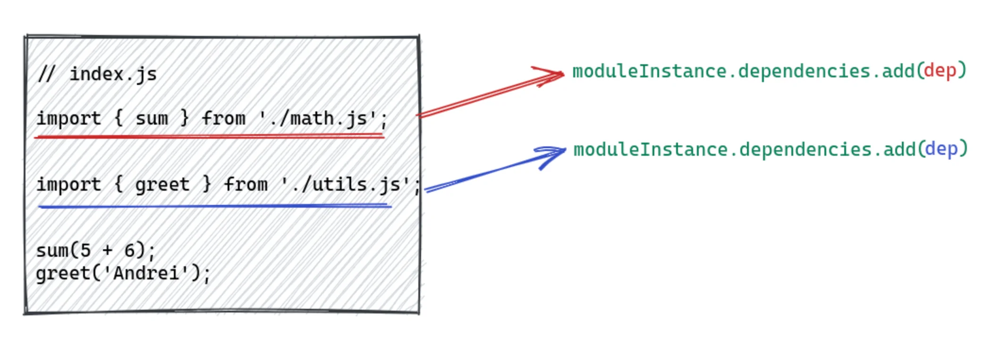
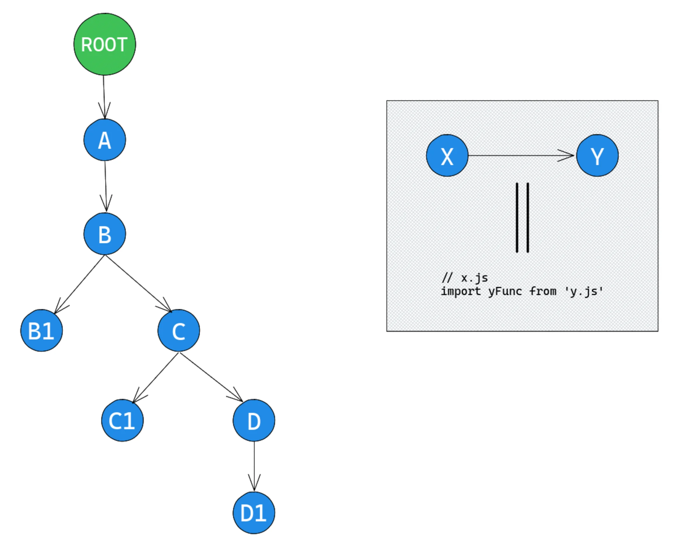
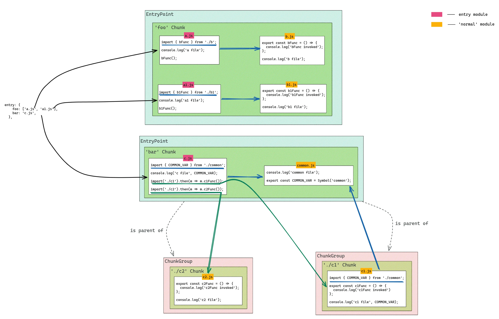

原文链接🔗：

- [An in-depth perspective on Webpack's bundling process - @indpeth.dev](https://indepth.dev/posts/1482/an-in-depth-perspective-on-webpacks-bundling-process)

Webpack 是一个非常强大和有趣的工具，可以被认为是当今许多Web开发人员用来构建应用程序的技术的基本组件。然而，许多人会认为使用它是一个相当大的挑战，主要是因为它的复杂性。

在本系列文章中，我想分享许多关于webpack内部工作的细节，希望它能让使用webpack看起来更平易近人。本文将作为未来发表的文章的基础，在这些文章中，我将更深入地探讨其他webpack的功能。**你将了解延迟加载（`lazy loading`）的工作原理、摇树（`tree-shaking`）的工作原理、某些加载器（`loaders`）的工作原理等。** 我在这个系列中的目标是让你在解决与webpack相关的问题时变得更加自在。本文的目的是为你提供有关**整个过程**的足够见解，以便你能够在任何时候进行干预，以便自己了解 webpack 的某些方面或调试问题。 因此，在最后一部分中，我们将看到如何通过测试和一些自定义示例来调试webpack的源代码。

我们将从一个图表开始，该图表描述了整个打包过程，它看起来很长。不过，一些细节被省略了，因为它们是未来文章的主题。然后，我们将展开讲解图中的一些步骤。随着我们的进行，我们还将解释模块（`modules`）、块（`chunks`）等概念。此外，为了简化理解，我将用图表和简化的代码片段替换源代码中的片段。但是，我将提供一些指向源代码的链接，也许它们会很有用。

作为规范，我们将 `NormalModule` 简单地称为模块（`modules`）。还有其他类型的模块，例如 `ExternalModule` （使用模块联邦时）和 `ConcatenatedModule` （使用 `require.context()` 时），它们是单独文章的主题。在本文中，我们将只关注 `NormalModule`。

如果你想在阅读本文时继续浏览源代码，你应该先查看调试webpack的源代码部分。


## 使用图表可视化流程




原图在 [webpack Bundle process - Excalidraw](https://excalidraw.com/#json=4517412917477376,mF3yLd-gYuRzCzWZ11fo7Q)

我强烈建议打开图表的Excalidraw链接，因为它将用作对即将进行的深入解释的支持，这些解释分为几部分，每个部分都描述了图表中的一个步骤或多个步骤。

让我们开始吧！


## entry对象

值得一提的是，一切都以 `entry` 对象开头。如你所料，它支持许多配置，因此本主题值得单独撰写一篇文章。这就是为什么我们要考虑一个更简单的例子，其中 `entry` 对象只是键值对的集合：

::: code-group

``` js [webpack.config.js]
module.exports = {
  entry: {
    a: './a.js',
    b: './b.js'
  },
  // ...
}
```

:::

从概念上讲，webpack中的从概念上讲，webpack中的 **模块(`module`)** 与*文件*相关联。因此，在图中 `'a.js'` 将产生一个新模块， `'b.js'` 也是如此。

目前，**保持模块是文件的升级版本这个粗略印象就足够了。模块一旦被创建和构建，除了原始源代码之外，还包含许多有意义的信息，例如：使用的加载器（`loaders`），依赖项（`dependencies`），导出（`exports`）（如果有的话），哈希（`hashes`）等等。** 可以将 `entry` 对象中的每个项视为模块树（`a tree of modules`）中的根模块（`root module`）。模块树，因为根模块可能需要一些其他模块（即依赖项），这些模块可能需要其他模块等等，因此你可以看到如何在更高层次上构建这样的树。所有这些模块树都一起存储在 `ModuleGraph` ，我们将在下一节中介绍。

我们现在需要提到的下一件事是webpack是建立在很多**插件**之上的。尽管打包过程已经很好地建立起来，但是有很多方法可以添加自定义逻辑。📚webpack 中的可扩展性是通过 `hooks` 实现的。例如，你可以在构建 `ModuleGraph` 之后、为chunk生成新资源（`assets`）时、即将构建模块之前（运行加载程序并解析源代码）等添加自定义逻辑。我们还将在以后的文章中探讨它们，因为它们非常有趣，并且可以为许多与 webpack 定制相关的问题提供解决方案😎。大多数时候，钩子是按照它们的目的分组的，对于任何定义良好的目的，都有一个插件（`Plugin`）。 例如，有一个插件负责处理 `import()` 函数（负责解析注释和参数） - 它被称为 [ImportParserPlugin](https://github.com/webpack/webpack/blob/main/lib/dependencies/ImportParserPlugin.js#L27) ，它所做的就是在AST解析过程中遇到`import()`调用时添加一个钩子。。

📚有几个插件负责处理 `entry` 对象也就不足为奇了。有 `EntryOptionPlugin` ，它实际上接收 `entry` 对象并为对象中的**每个项**创建一个 `EntryPlugin` 。这部分很重要，也与本节开头提到的内容有关： `entry` 对象的每一项都会生成一个模块树（所有这些树都彼此分开）。基本上， `EntryPlugin` 开始创建模块树，每个模块树都会将信息添加到同一个地方， `ModuleGraph` 。非正式地说，我们会说是 `EntryPlugin` 开启了这个复杂的过程🎉。




为了与初始图表相提并论，值得一提的是， `EntryPlugin` 也是创建 `EntryDependency` 的地方。

基于上图，让我们通过自己粗略地实现 `EntryOptionsPlugin` 来了解它的重要性：

```js
class CustomEntryOptionPlugin {
  // 这是创建插件的一种标准方式🚀
  // 要么是如下这种方式或者一个简单的函数
  // 但我们为了演示大多数插件普遍的结构，采用如下方式
  apply(compiler) {
    // 回想一下，钩子（hooks）给我们提供了干预构建过程的可能性
    // 1️⃣ 通过 `entryOption` 钩子，我们添加的逻辑基本上意味着打包过程的开始😎
    // `entryObject` 参数将保存来自配置文件中的 `entry` 对象
    // 我们将用它来设置模块树🌲的创建
    compiler.hooks.entryOption.tap('CustomEntryOptionPlugin', entryObject => {
      // `EntryOption` 类将处理模块树🌲的创建
      const EntryOption = class {
        constructor(options) {
          this.options = options
        }
        
        // 因为这仍旧是一个插件（Plugin）,我们遵守标准
        apply(compiler) {
          // 2️⃣ `start` hook标志着bundling过程的开始
          // 它将在 `hooks.entryOption` 调用之后被调用
          compiler.hooks.start('EntryOption', ({ createModuleTree })) => {
            // 3️⃣ 基于这个插件的配置，创建一个新的模块树
            // `options` 包含entry和文件的名字（也将是该chunk的名字）
            // `EntryDependency` 封装了这些配置项，同时提供了创建模块的方式
            //（因为它将映射到 `NormalModuleFactory`, NormalModuleFactory将生成 `NormalModule`）
            // 在调用 `createModuleTree` 之后，该文件的源代码将被找到
            // 然后一个模块实例将被创建，然后Webpack将得到它的AST，该AST将进一步用作在bundling过程中
            createModuleTree(new EntryDependency(this.options))
          }
        }
      }
      
      // 对于 `entryObject` 中的每一项，我们都准备创建一个模块树。
      // 🎉 记住，每一个模块树都是彼此相互独立的
      // `entryObject` 可能类似于 `{ a: './a.js' }`
      for (const name in entryObject) {
        const fileName = entryObject[name]
        // 这相当于在说：
        // `ok webpack, 当bundling过程开始时，请准备好给这个entry创建一个模块树`
        new EntryOption({ name, fileName }).apply(compiler)
      }
    })
  }
}
```

### Dependency

在本节的最后一部分中，我们将稍微展开讲一下 `Dependency` 是什么，因为我们将在本文中进一步使用它，并将在其他文章中提及它。你现在可能想知道 `EntryDependency` 是什么以及为什么需要它🤔。📚从我的角度来看，当涉及到创建新模块时，一切都归结于智能抽象(`smart abstraction`)。简单地说，依赖(`dependency`)只是实际模块(`module`)实例的前提条件。例如，即使是 `entry` 对象的项也是webpack眼中的依赖，它们指示要创建的 `module` 实例的最低要求：它的**路径**（例如 `./a.js` 、 `./b.js` ）。

- 如果没有依赖项，模块的创建就无法启动，因为依赖项包含模块的 **请求（`request`）** 等重要信息，比如：可以找到模块源代码的文件的路径（例如 `'./a.js'` ）
- 依赖项还指示如何构造该模块，它使用模块工厂(`module factory`)执行此操作。**模块工厂**知道如何从原始状态（例如，源代码是一个简单的字符串）开始，然后到达具体的实体，然后被webpack利用。
- [EntryDependency](https://github.com/webpack/webpack/blob/main/lib/dependencies/EntryDependency.js#L11) 实际上是 [ModuleDependency](https://github.com/webpack/webpack/blob/main/lib/dependencies/ModuleDependency.js#L19) 的一种子类型，这意味着它肯定会保存模块的请求（`request`），并且它指向的模块工厂是 `NormalModuleFactory`。然后， `NormalModuleFactory` 确切地知道该怎么做才能从路径创建对 webpack 有意义的东西。

另一种思考方式是，模块最初只是一个简单的路径（在 `entry` 对象或 `import` 语句的一部分中），然后它变成了依赖项，最后变成了一个模块。

以下是可视化的一种方法：[EntryDependency to NormalModule 原图](https://excalidraw.com/#json=4907940771266560,zqDQZYTbwHupJqyFprykWA)



📚因此，在创建模块树的根模块（`root module`）时，在开头使用 `EntryDependency` 。

对于其余模块，还有其他类型的依赖项。例如，如果你使用 `import` 语句，例如 `import defaultFn from './a.js'` ，那么将有一个 `HarmonyImportSideEffectDependency` 保存模块的请求（在本例中为 `'./a.js'` ），并且还映射到 `NormalModuleFactory` 。因此，文件 `'a.js'` 将有一个新模块，希望现在你可以看到**依赖项**所扮演的重要作用。它们本质上指导 webpack 如何创建 `modules` 。我们将在本文后面介绍有关依赖项的更多信息。


### 小结

对于 `entry` 对象中的每个项，都将有一个`EntryPlugin`实例，在其中创建一个`EntryDependency`。这个 `EntryDependency` 保存模块的请求(`request`)（即**文件的路径**），并且还提供了一种通过映射到模块工厂（即 `NormalModuleFactory` ）来使该请求有用的方法。模块工厂知道如何仅从文件路径创建对 webpack 有用的实体。

同样，**依赖项**对于创建模块至关重要，因为它包含重要信息，例如模块的请求以及如何处理该请求。有几种类型的依赖项，并非所有依赖项都对创建新模块有用。从每个 `EntryPlugin` 实例中，在新创建的 `EntryDependency` 的帮助下，将创建一个模块树。 **模块树构建在模块及其依赖项之上，这些依赖项以及模块也可以具有依赖项。**

现在，让我们通过了解有关 `ModuleGraph` 的更多信息来继续我们的学习之旅。


## 理解ModuleGraph

📚 `ModuleGraph` 是一种跟踪已构建模块（`built modules`）的方法。它严重依赖依赖关系，因为它们提供了连接 2 个不同模块的方法。例如：

```js
// a.js
import defaultBFn from './b.js'

// b.js
export default function() { console.log('Hello from B!') }
```

这里我们有2个文件，所以存在2个模块。文件 `a` 需要文件 `b` 中的某些内容，因此在 `a` 中有一个由 `import` 语句建立的依赖项。

就 `ModuleGraph` 而言，依赖项定义了连接 2 个模块的方法。甚至上一节中的 `EntryDependency` 也连接了2个模块：图（`graph`）的根模块（我们将其称为 `null 模块`）和与入口文件关联的模块。上面的代码片段可以可视化如下：



区分简单模块（即 `NormalModule` 实例）和属于 `ModuleGraph` 的模块之间的区别很重要。`ModuleGraph` 的节点称为 [ModuleGraphModule](https://github.com/webpack/webpack/blob/main/lib/ModuleGraph.js#L122)，它只是一个修饰过的 `NormalModule` 实例。`ModuleGraph` 通过 [map](https://github.com/webpack/webpack/blob/main/lib/ModuleGraph.js#L120) 这种数据结构（它的签名为 `Map<Module, ModuleGraphModule>`）追踪装饰后的模块。这些方面是必要的，因为如果只有 `NormalModule` 实例，那么你对它们能做的事情就太少了，它们不知道如何相互通信。`ModuleGraph` 通过借助上述映射将它们互连来赋予这些裸模块（bare modules）的含义，该映射为每个 `NormalModule` 分配了一个 `ModuleGraphModule` 。这句话的含义在 `Building the ModuleGraph` 章节的末尾显得更有意义，我们将在其中使用 `ModuleGraph` 及其内部映射来遍历图。我们将属于 `ModuleGraph` 的模块简单地称为 `module` ，因为差异仅由一些其他属性组成。

对于属于ModuleGraph的节点，有几件事情是明确定义的：入站连接(`incoming connections`)和出站连接(`outgoing connections`)。连接是 `ModuleGraph` 的另一个小实体，它包含有意义的信息，例如：*源模块，目标模块和连接前面提到的2个模块的依赖项*。具体来说，基于上图，创建了一个新连接：

```js
// 基于上图和上面的代码片段
Connection: {
  originModule: A,
  destinationModule: B,
  dependency: ImportDependency
}
```

并且上面的连接将被添加到 `A.outgoingConnections` 集合和 `B.incomingConnections` 集合中。

这些是 `ModuleGraph` 的基本概念。如上一节所述，从入口（`entryObject`）创建的所有模块树都将向同一个位置 `ModuleGraph` 输出有意义的信息。这是因为所有这些模块树最终都将与**null模块**（ `ModuleGraph` 的根模块）连接。与**null模块**的连接是通过 `EntryDependency` 和从入口文件创建的模块建立的。以下是我对 `ModuleGraph` 的看法：[ModuleGraph原图](https://excalidraw.com/#json=6723625398829056,kgoBBvUYMyhqGk6dOvY2Sg)



如您所见，null 模块与从 `entry` 对象中的项生成的每个模块树的根模块有连接。图形中的每个边代表 2 个模块之间的连接，每个连接包含有关源节点、目标节点和依赖项的信息（这非正式地回答了***为什么这两个模块连接的问题？***)

现在我们对 `ModuleGraph` 有了更熟悉一点，让我们看看它是如何构建的。


## 构建ModuleGraph

正如我们在上一节中看到的， `ModuleGraph` 从一个`null模块`开始，该模块的直接后代是从 `entry` 对象的项构建的模块树的根模块。出于这个原因，为了理解 `ModuleGraph` 是如何构建的，我们将检查单个模块树的构建过程。


### 要创建的第一个模块

我们将从一个非常简单的 `entry` 对象开始：

::: code-group

``` js [webpack.config.js]
module.exports = {
  entry: {
    a: './a.js',
  },
  // ...
}
```

:::

根据 [第一节](#entry对象) 中所说的内容，在某些时候，我们最终会得到一个 `EntryDependency` ，其请求是 `'./a.js'`。此 `EntryDependency` 提供了一种从该请求创建有意义的内容的方法，因为它映射到模块工厂，即 `NormalModuleFactory` 。这是我们在第一部分中断的地方。

该过程的下一步是 `NormalModuleFactory` 发挥作用的时候了。如果 `NormalModuleFactory` 成功完成其任务，将创建一个 `NormalModule` 。

**为了确保没有不确定性， `NormalModule` 只是文件源代码的反序列化版本，只不过是一个原始字符串。** 原始字符串不会带来太多价值，因此 webpack 不能用它做太多事情。 `NormalModule` 还将源代码存储为字符串，但同时，它还将包含其他有用的信息和功能，例如：应用于它的加载器、构建模块的逻辑、生成运行时代码的逻辑、其哈希值等等😎。**换句话说，从 webpack 的角度来看， `NormalModule` 是简单原始文件的有用版本。**

为了使 `NormalModuleFactory` 输出 `NormalModule` ，它必须经过一些步骤。创建模块后，还需要执行一些操作，例如构建模块并处理其依赖项（如果有依赖项的话）。

这是我们一直关注的图表，现在专注于构建 `ModuleGraph` 部分：



`NormalModuleFactory` 通过调用其 [create](https://github.com/webpack/webpack/blob/main/lib/NormalModuleFactory.js#L759) 方法开始它的魔力。然后，解析过程(`resolving process`)开始。这个方法是请求（`request`）（文件的路径）被解析，以及确认作用于该类型文件的加载器（`loaders`）的位置。

::: warning

请注意，这里将仅确定loaders的文件路径，此步骤中尚未调用loaders。

:::


### 模块的构建过程

解析所有必要的文件路径后， `NormalModule` 被创建。但是，此时，该模块不是很有价值😅。许多相关信息将在模块**构建完成后**提供。 `NormalModule` 的构建过程包括其他几个步骤：

1. 首先，加载器将对原始源代码进行调用;如果有多个加载器，则一个加载器的输出可能是另一个加载器的输入（配置文件中提供加载器的顺序很重要）;
2. 其次，运行所有加载器后的结果字符串将使用 [acorn](https://github.com/acornjs/acorn)（JavaScript 解析器）进行解析，从而生成给定文件的 AST;
3. 最后，将分析AST；分析是必要的，因为在此阶段将**确定当前模块的依赖关系**（例如其他模块），Webpack可以检测其**魔术函数**（例如 `require.context` ， `module.hot` ）等；AST 分析发生在 [JavascriptParser](https://github.com/webpack/webpack/blob/main/lib/javascript/JavascriptParser.js#L195) 中，如果你点击链接，你应该会看到那里处理了很多情形；流程的这一部分是最重要的部分之一，因为bundling过程中接下来的很多事情都取决于这一部分;🚀


### 通过生成的AST发现依赖

在不赘述太多细节的情况下，思考发现过程（`discovery process`）的一种方法是：



其中 `moduleInstance` 是指从 `index.js` 文件创建的 `NormalModule` 。红色的 `dep` 表示从第一个 `import` 语句创建的依赖项，蓝色的 `dep` 表示第二个 `import` 语句。这只是一种简化的思考方式。实际上，如前所述，依赖项是在**获取AST之后**添加的。

现在AST已经被检查过了，是时候继续构建我们在本节开头谈到的模块树的过程了。下一步是**处理**在上一步中找到的**依赖项**。 `index` 模块有 2 个依赖项，它们也是模块，即 `math.js` 和 `utils.js`。但是在依赖项成为实际模块之前，我们只有 `index` 模块，其 `module.dependencies` 有 2 个值，其中包含模块请求（文件的路径）、导入说明符（例如 `sum` 、 `greet` ）等信息。 为了将它们转换为模块，我们需要使用这些依赖项映射到的 `ModuleFactory` 并**重复**上述相同的步骤（重复由本节开头所示图中的虚线箭头表示）😎。

**📚处理当前模块的依赖项后，这些依赖项可能也具有依赖项，此过程将继续，直到不再有依赖项。这就是构建模块树的方式，当然要确保正确设置父模块和子模块之间的连接。**

根据我们目前掌握的知识，自己实际尝试 `ModuleGraph` 将是一个很好的练习。为此，让我们看看一种实现自定义插件的方法，该插件将允许我们遍历 `ModuleGraph` 。下图描述了模块如何相互依赖：



为了确保图表中的所有内容都是可理解的， `a.js` 文件导入 `b.js` 文件，该文件同时导入 `b1.js` 和 `c.js` ，然后 `c.js` 导入 `c1.j` 和 `d.js` ，最后， `d.js` 导入 `d1.js` 。最后， `ROOT` 指的是空模块，它是 `ModuleGraph` 的根。 `entry` 选项仅包含一个值 `a.js` ：

::: code-group

``` js [webpack.config.js]
module.exports = {
  entry: path.resolve(__dirname, './src/a.js'),
  // ...
}
```

:::

现在让我们看看我们的自定义插件会是什么样子：

```js
// 通过 `tap` 方法给已有的webpack hooks添加逻辑
// 其函数签名为： `tap(string, callback)`
//  - `string` 仅用作debug目的，用于显示自定义逻辑是在源码的什么位置添加的
//  - `callback`的参数取决于我们添加自定义功能的钩子

class UnderstandingModuleGraphPlugin {
  apply(compiler) {
    const className = this.constructor.name
    // 📚 关于 `compilation` 对象：它是保存大部分打包过程状态的地方。
    // 它包含了如下一些信息
    //  - module graph
    //  - chunk graph
    //  - 已创建的chunks
    //  - 已创建的modules
    //  - 已生成的assets
    //  - 等等
    compiler.hooks.compilation.tap(className, (compilation) => {
      // `finishModules` 会在所有模块（包括其依赖，以及依赖的依赖，依此类推）构建完成之后调用
      compilation.hooks.finishModules.tap(className, (modules) => {
        // `modules` 是包含所有已构建模块的集合
        // 它们都是简单的 `NormalModule` 实例
        // 再次说明一下，而 `NormalModule` 则是由 `NormalModuleFactory` 创建的
        // console.log(modules)
        
        // 取出所有的 `module map` (Map<Module, ModuleGraphModule>)
        // 它包含我们遍历graph所需的所有信息
        const {
          moduleGraph: { _moduleMap: moduleMap }
        } = compilation
        
        // 通过DFS（深度优先）的方式遍历module graph
        const dfs = () => {
          // 回想一下，`ModuleGraph` 的根模块是 `null module`
          const root = null
          
          const visited = new Map()
          
          const traverse = (crtNode) => {
            if (visited.get(crtNode)) {
              return
            }
            visited.set(crtNode, true)
            
            console.log(
              crtNode?.resource ? path.basename(crtNode?.resource) : 'ROOT'
            )
            
            // 获取关联的 `ModuleGraphModule`, 它在 `NormalModule` 之上包含一些
            // 可用于进一步遍历graph的属性
            const correspondingGraphModule = moduleMap.get(crtNode)
            
            // `Connection` 的 `originModule` 属性是箭头的开始位置
            // 而 `Connection` 的 `module` 属性则是箭头的结束位置
            // 因此 `Connection` 的 `module` 是一个子节点
            // https://github.com/webpack/webpack/blob/main/lib/ModuleGraphConnection.js#L53 可以了解更多graph的connetion
            // `correspondingGraphModule.outgoingConnections` 要么是一个Set，要么是undefined（node没有子节点的情形）
            // 我们使用 `new Set` 是因为一个模块可以通过多个连接引用同一模块
            // 🌰 比如：`import foo from 'file.js'` 将产生2个connections:(这是一个你不应该担心的实现细节😊)
            //    - 一个简单的import
            //    - 一个 `foo` 默认指示符
            const children = new Set(
              Array.from(
                correspondingGraphModule.outgoingConnections || [],
                c => c.module
              )
            )
            for (const c of children) {
              traverse(c)
            }
            
          }
          
          // 开始遍历
          traverse(root)
        }
        
        dfs()
      })
    })
  }
}
```

这个实例可以在 [StackBlitz](https://stackblitz.com/edit/node-rxfljv?file=webpack.config.js) 查看， 确保运行 `npm run build` 以查看插件的运行情况。根据模块层次结构，运行 `build` 命令后，这是我们应该得到的输出：

```bash
a.js
b.js
b1.js
c.js
c1.js
d.js
d1.js
```

现在 `ModuleGraph` 已经构建完毕，希望你已经掌握了它，是时候了解接下来会发生什么了。根据主图，下一步将是**创建块（`chunks`）**，所以让我们进入它。但在此之前，值得理清一些重要的概念，例如 `Chunk` ， `ChunkGroup` 和 `EntryPoint` 。


## 理清Chunk,ChunkGroup,EntryPoint

现在我们已经对模块有了更多的熟悉，我们将在此基础上解释本节标题中提到的概念。

📚为了再次快速解释模块是什么，**知道模块是文件的升级版本就足够了。模块一旦创建和构建，除了原始源代码之外，还包含许多有意义的信息，例如：使用的加载器，依赖项，导出（如果有），哈希等等。**

1️⃣ **`Chunk` 封装一个或多个模块。** 乍一看，人们可能会认为入口文件的数量（入口文件 = `entry` 对象的items）与生成的块的数量成正比。这语句部分正确，因为 `entry` 对象可能只有一个item，并且生成的块数可能大于1。确实，对于每个 `entry` 项，dist 目录中都会有一个相应的块，但可以隐式创建其他块，例如在使用 `import()` 函数时。但无论如何创建，每个块都将在 dist 目录中有一个相应的文件。我们将在构建 `ChunkGraph` 部分中对此进行扩展，我们将阐明哪些模块属于 `chunk` ，哪些不属于。

2️⃣ **`ChunkGroup` 包含一个或多个区块。** `ChunkGroup` 可以是另一个 `ChunkGroup` 的父项或子项。例如，当使用动态导入时，对于使用的每个 `import()` 函数，将创建一个 `ChunkGroup` ，其父级将是现有的 `ChunkGroup` ，该函数包含使用 `import()` 函数的文件（即模块）。可以在构建 `ChunkGraph` 部分中看到这一事实的可视化效果。

3️⃣ **`EntryPoint` 是为 `entry` 对象中的每个项创建的 `ChunkGroup` 类型。** 一个块属于 `EntryPoint` 的事实对渲染过程有影响，我们将在未来的文章中更清楚地阐述。

鉴于我们更熟悉这些概念，让我们继续了解 `ChunkGraph` 。


### 构建ChunkGraph

回想一下，到目前为止，我们所拥有的只是一个 `ModuleGraph` ，我们在上一节中谈到了这一点。但是， `ModuleGraph` 只是Bundling过程的必要部分。必须利用它才能实现代码拆分等功能。

在Bundling过程的此时，对于 `entry` 对象中的每一项，将有一个 `EntryPoint` 。由于它是 `ChunkGroup` 的一种类型，因此它将至少包含一个块（`chunk`）。因此，如果 `entry` 对象有 3 个items，则将有 3 个 `EntryPoint` 实例，每个实例都有一个块，也称为**入口点块**，其名称是 `entry` 项键的值。与入口文件关联的模块称为**入口模块**，每个模块都属于其入口点块。它们很重要，因为它们是 `ChunkGraph` 构建过程的起点😎。

::: warning

请注意，一个块可以有多个**入口模块**

:::

::: code-group

``` js [webpack.config.js]
module.exports = {
  entry: {
    foo: ['./a.js', './b.js']
  },
  // ...
}
```

:::

在上面的示例中，将有一个名为 `foo` 的块（item的键）将具有 2 个入口模块：一个与 `a.js` 文件关联，另一个与 `b.js` 文件关联。当然，该块将属于基于 `entry` 项创建的 `EntryPoint` 实例。

🌰在详细介绍之前，让我们举一个示例，在此基础上我们将讨论构建过程：

```js
const js  = {
  entry: {
    foo: [path.join(__dirname, 'src/a.js'), path.join(__dirname, 'src/a1.js')],
    bar: path.join(__dirname, 'src/c.js')
  }
}
```

此示例将包含前面提到的内容： `ChunkGroups` 的父子关系（以及动态导入），`Chunks` 和 `EntryPoints`。

- 可在 [Stackblitz](https://stackblitz.com/edit/node-z6d8js?file=readme.md) 查看该示例

`ChunkGraph` 以递归方式构建：

1. 它首先将所有入口模块（`entry modules`）添加到队列中
2. 然后，当处理入口模块时，这意味着将检查其依赖项（也是模块），并且每个依赖项也将添加到队列中。
3. 这将继续重复，直到队列变为空。该过程的这一部分是访问模块的位置。

但是，这只是第一部分。回想一下， `ChunkGroup` 可以是其他 `ChunkGroup` 的父/子。这些连接在第二部分中解决。例如，如前所述，动态导入（即 `import()` 函数）将产生一个新的子 `ChunkGroup` 。用webpack的行话， `import()` 表达式定义了一个**异步的**依赖块。从我的角度来看，它被称为块（`block`），因为首先想到的是包含其他对象的东西。在 `import('./foo.js'.then(module => ...)` 的情况下，很明显我们的目的是异步加载一些东西，很明显，为了使用 `module` 变量， `foo` 的所有依赖项（即模块）（包括 `foo` 本身）必须在实际模块可用之前被解析。我们将在以后的文章中彻底讨论 `import()` 函数的工作原理及其特殊性（例如魔术注释和其他选项）。

::: tip

如果这激发了你的好奇心，[这里](https://github.com/webpack/webpack/blob/main/lib/dependencies/ImportParserPlugin.js#L27)是在 AST 分析期间创建block的地方。

:::

*总结* `ChunkGraph` *构建过程的源代码可以在[这里](https://github.com/webpack/webpack/blob/main/lib/buildChunkGraph.js#L1277-L1299)找到。*

现在，让我们看看从上面的配置创建的 `ChunkGraph` 的图：[ChunkGraph原图 - @excalidraw](https://excalidraw.com/#json=6255037734977536,S8OwG9rWcdgphRWDBoiZwg)



该图说明了 `ChunkGraph` 的一个非常简化的版本，但它应该足以突出显示生成的块和 `ChunkGroup` 之间的关系。我们可以看到 4 个块，因此将有 4 个输出文件。 `foo` 块将有 4 个模块，其中 2 个是**入口模块(`entry modules`)**。 `bar` 块将只有一个入口模块，另一个可以被视为普通模块。我们还可以注意到，每个 `import()` 表达式都会产生一个新的 `ChunkGroup` （其父项是 `bar EntryPoint` ），它涉及一个新块。

生成的文件的内容是根据 `ChunkGraph` 确定的，所以这就是为什么它对整个Bundling过程非常重要的原因。我们将在下一节中简要讨论`chunk assets`（即生成的文件）。

在探索我们使用 `ChunkGraph` 的实际示例之前，重要的是要提到它的一些特殊性。😃与 `ModuleGraph` 类似，属于 `ChunkGraph` 的节点称为 [ChunkGraphChunk](https://github.com/webpack/webpack/blob/main/lib/ChunkGraph.js#L204) （读作属于 `ChunkGraph` 的chunk），它只是一个**装饰块**，这意味着它是一些额外的属性，例如作为块一部分的模块，块的入口模块等。就像 `ModuleGraph` 一样， `ChunkGraph` 在具有以下签名的映射的帮助下跟踪这些具有其他属性的块： `WeakMap<Chunk, ChunkGraphChunk>` 。与 `ModuleGraph` 的映射相比， `ChunkGraph` 维护的此映射不包含有关块之间连接的信息。相反，所有必要的信息（例如它所属的 `ChunkGroup` s）都保存在块本身中。

::: tip

💡请记住，块（chunks）在 `ChunkGroups` 中组合在一起，在这些chunk groups之间可以存在**父子关系**（正如我们在上图中看到的那样）。模块不是这种情况，因为模块可以相互依赖，但没有严格的父模块概念。

:::

现在让我们尝试在自定义插件中使用 `ChunkGraph` ，以便更好地理解它。请注意，我们正在考虑的这个例子是上图描述的：

```js
const path = require('path')

// 为了显示chunk groups之间的 父-子关系
// 这里我们进行打印
const printWithLeftPadding = (message, paddingLength) => console.log(message.padStart(message.length + paddingLength))

class UnderstandingChunkGraphPlugin {
  apply(compiler) {
    const className = this.constructor.name
    compiler.hooks.compilation.tap(className, compilation => {
      // `afterChunks` 在 `ChunkGraph` 构建后调用
      compilation.hooks.afterChunks.tap(className, chunks => {
        // `chunks` 是所有创建的chunks的集合
        // chunks按照其创建的顺序添加到这个集合中
        // console.log(chunks)
        
        // 正如之前提到的，`compilation` 对象包含bundling过程的状态
        // 🚀 在这里，我们还可以找到所有已创建的`ChunkGroup`(包括`Entrypoint`实例)。
        // console.log(compilation.chunkGroups)
        
        // 📚 `EntryPoint` 是 `ChunkGroup` 的一种特殊类型
        // 它从 `entry` 对象每一项中创建，在本例子中，存在2个EntryPoint
        // 因此，为了遍历 `ChunkGroup`，我们必须从 `EntryPoint` 开始遍历，它存在于 `compilation` 对象中
        // 关于 `entrypoints` map(<string, Entrypoint>) 可以查看 https://github.com/webpack/webpack/blob/main/lib/Compilation.js#L987
        const { entrypoints } = compilation
        
        // 关于 `chunkMap`(<Chunk, ChunkGraphChunk>)可查看：https://github.com/webpack/webpack/blob/main/lib/ChunkGraph.js#L226-L227
        const { chunkGraph: { _chunks: chunkMap } } = compilation
        
        const printChunkGroupsInformation = (chunkGroup, paddingLength) => {
          printWithLeftPadding(`Current ChunkGroup's name: ${chunkGroup.name};`, paddingLength);
          printWithLeftPadding(`Is current ChunkGroup an EntryPoint? - ${chunkGroup.constructor.name === 'Entrypoint'}`, paddingLength);
          
          
          // `chunkGroup.chunks` - 一个ChunkGroup可以包含一个或多个chunks
          const allModulesInChunkGroup = chunkGroup.chunks
            .flatMap(c => {
                // 为了获取单一chunk中包含的modules，可使用`ChunkGraph`存储的信息
                const associatedGraphChunk = chunkMap.get(c)
              
                // 这里面也包含 *入口模块（entry modules）*
                // 因为 `.modules` 是一个Set集合，所以使用展开符
                return [...associatedGraphChunk.modules]
              })
            // module资源是一个绝对路径
            // 但我们只关心该模块的文件名
            .map(module => path.basename(module.resource))
        
          printWithLeftPadding(`The modules that belong to this chunk group: ${allModulesInChunkGroup.join(', ')}`, paddingLength)
        
          console.log(`\n`)
        
          // 💡 `ChunkGroup` 也可以有子的 `ChunkGroup`
          [...chunkGroup._children].forEach(childChunkGroup => printWithLeftPadding(childChunkGroup, paddingLength + 3))
        }

        for (const [entryPointName, entryPoint] of entrypoints) {
          printChunkGroupsInformation(entryPoint, 0)
        }
      })
    })
  }
}
```

这个例子可以在 [StackBlitz](https://stackblitz.com/edit/node-nlpz6x?file=webpack.config.js) 上查看，运行 `npm run build` 后，您应该看到以下输出：

```bash
Current ChunkGroup's name: foo;
Is current ChunkGroup an EntryPoint? - true
The modules that belong to this chunk group: a.js, b.js, a1.js, b1.js

Current ChunkGroup's name: bar;
Is current ChunkGroup an EntryPoint? - true
The modules that belong to this chunk group: c.js, common.js

   Current ChunkGroup's name: c1;
   Is current ChunkGroup an EntryPoint? - false
   The modules that belong to this chunk group: c1.js

   Current ChunkGroup's name: c2;
   Is current ChunkGroup an EntryPoint? - false
   The modules that belong to this chunk group: c2.js
```

我们使用缩进来区分父子关系。我们还可以注意到输出与图相当，因此我们可以确定遍历的正确性。


## 生成chunk资源

值得一提的是，生成的文件不仅仅是原始文件的复制粘贴版本，因为为了实现其功能，webpack 需要添加一些自定义代码，使一切按预期工作。

这就引出了一个问题，**即webpack如何知道要生成什么代码**。这一切都从最基本（也是最有用）的层开始 - `module` 。模块可以导出成员，导入其他成员，使用动态导入，使用特定于 webpack 的函数（例如 `require.resolve` ）等。根据模块的源代码，webpack 可以确定要生成哪些代码以实现所需的功能。此发现在 AST 分析期间开始，在该分析中找到依赖项。尽管到目前为止，我们一直在互换使用依赖（`dependencies`）和模块（`modules`），但底层情况要复杂一些。

🌰例如，一个简单的 `import { aFunction } from './foo'` 将导致2个依赖项（一个用于 `import` 语句本身，另一个用于说明符，即 `aFunction` ），将从中创建单个模块。另一个例子是 `import()` 函数。正如前面各节所述，这将导致异步依赖项块，其中一个依赖项是 `ImportDependency` ，它特定于动态导入。

这些依赖项是*必不可少的*，因为它们带有一些关于应生成哪些代码的**提示**。例如， `ImportDependency` 确切地知道要告诉 webpack 什么，以便异步获取导入的模块并使用其导出的成员。这些提示可以称为**运行时要求(`runtime requirements`)**。例如，如果模块导出其某些成员，则会有一些依赖关系（回想一下我们现在不是指**模块**），即 `HarmonyExportSpecifierDependency` ，这将通知webpack它需要处理导出成员的逻辑。

总而言之，模块将附带其**运行时要求**，这取决于该模块在其源代码中使用的内容。区块(`chunk`)的运行时需求将是属于该区块的**所有**模块的所有运行时要求的集合。现在 webpack 知道了一个块的所有需求，它将能够正确生成运行时代码。

这也称为渲染过程，我们将在专门的文章中详细讨论它。现在，理解渲染过程严重依赖 `ChunkGraph` 就足够了，因为它包含块组（即 `ChunkGroup` 、 `EntryPoint` ），其中包含块，而chunk groups又包含了模块（`modules`），这些模块以精细的方式包含有关将由 webpack 生成的运行时(`runtime`)代码的信息和提示。


本节标志着本文理论部分的结束。在下一节中，我们将看到一些调试 webpack 源代码的方法，当你处理问题或只是想了解有关 webpack工作原理的更多信息时，这些方法都会派上用场。


## VSCode + StackBlitz调试源码

省略，查看原文


## 总结

在本文中，我试图包含尽可能多的信息，而不是多余的细节，以便您从不同的角度看待 webpack。这是一个复杂（且引人入胜）的工具，这篇文章旨在将其分解为更小且易于消化的部分。


2023年05月09日11:01:01

